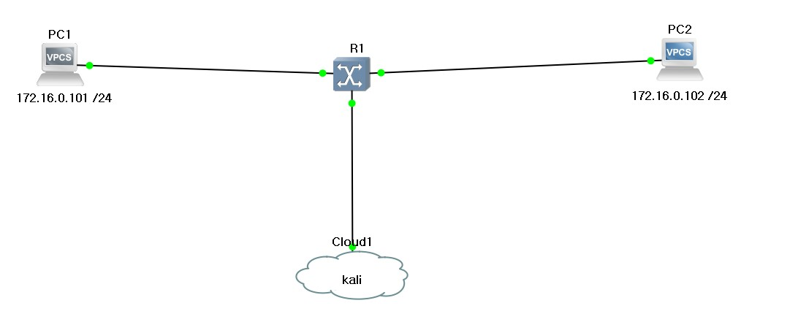

# Sniffing

 Sniffing 사전적 의미 → 코를 훌쩍이는, 킁킁거리며 냄새를 맡는. 

- 통신 경로상에서 정보를 엿듣거나 훔쳐보는 행위 = 도청(eavesdrop, wiretapping, tempest) 
- 도청(eavesdrop) → 타인의 통신 내용을 동의 없이 청취, 녹음하는 행위 
- 와이어태핑(wiretapping) → 기계적인 방법을 이용하여 데이터를 도청하는 행위 
- 탬페스트(tempest) → 하드웨어에서 발생하는 미세한 전자파을 이용하는 도청 행위 - 합법적인 Sniffing → Snooping

 

Sniffing 공격 조건

- Media 공유 
- 정보를 가지고 있는 신호가 공격자의 시스템에 도착해야 함 
- HUB 환경 → 피해자와 공격자가 같은 Collision Domain에 위치해야 함 
- SWITCH 환경 → 피해자의 전기적인 신호를 유도할 수 있는 추가공격이 필요함

 

공격자 시스템의 NIC가 **Promiscuous** 모드로 동작해야 함 Frame이 NIC에서 Filtering되는 것을 방지해야 함

- 목적지 MAC  주소가 해당 host  의 MAC  주소가 아니면 더이상 frame 을 처리하지 않는다
- 단 broadcast  MAC 주소는 무조건 수

 

Bypass mode 

- 일반적인 NIC의 기본 동작 모드 

- Filtering 동작하는 모드 → 목적지 주소가 자신 또는 Broadcast인 데이터만 받아들이는 모드

 

Promiscuous mode 

- Filtering 해제 모드 → 목적지 주소와 상관없이 NIC에 도달한 모든 데이터를 받아들이는 모드 

- Software를 이용하여 Promiscuous Mode를 활성화 함 

- promiscuous 모드 제어 프로그램 ＞ Windows : winpcap ＞ Linux : libpcap, ifconfig 

- promiscuous 모드를 사용하려면 root 권한이 필요함 

- 리눅스에서 promisc 모드 설정/해제하기 ＞ 설정 : ifconfig eth0 promisc ＞ 해제 : ifconfig eth0 -promisc
- promiscuous 모드를 사용하려면 root 권한이 필요함

 

sniffer

- 네트워크 트래픽을 감시하고 분석하는 프로그램

- Sniffing 공격 수행 Tools

  - sniffer 쪽으로 데이터가 전달되도록 하는 도구  

  - arpspoof, ettercap, Hunt, dsniff, Cain & Abel, ...

- Sniffing된 데이터 확인 Tools

  - Wireshark, tshark, tcpdump, Snoop, MS network monitor, ngrep, ...

 

##### Passive Sniffing

tcpdump

- CLI packet capture 도구
- libpcap(windows의 winpcap 과 역할이 같음)
- 사용시 동작 안하면 promiscious mode 로 확인 해 볼것

 

 

 

구상도

 

tcpdump 준비

 

PC1 -> PC2 ping

 

kali 확인

다른 컴퓨터의 ICMP가 출력된 상황 입니다.

 

기록 저장

 

PC1 -> PC2 ping

 

저장된 기록 확인

 

-r : 읽기 파일로 변환 

 

 

 

##### Active Sniffing

구상도

 

tcpdump 준비

 

PC1 -> PC2 ping

 

기록 확인

GNS3 프로그램 문제로 wireshark로 확인해 보겠습니다.

Passive Sniffing과 다르게 Active Sniffing은 기록이 나오지 않습니다.

switch 환경에서는 passive sniffing 이 되지않는데 이걸위한 조건이 있습니다.

- (공격자가) 능동적으로 공격
- 일반적인 상황에서는 전기적인 신호가 전달되지 않는 환경에서 추가 공격을 통해 데이터의 전달 흐름을 변경하여 공격자 시스템으로 전달되도록 유도하여 수행되는 Sniffing 공격
- SWITCH 환경에서 수행되는 Sniffing 공격 
- 2계층(MAC) → Switch Jamming(=MAC Flooding), ARP Spoofing(=ARP cache Poisoning) 
- 3계층(IP) → ICMP Redirect, DHCP Spoofing ...
- MITM(Man In The Middle)공격 형태가 될 수 있음

 

