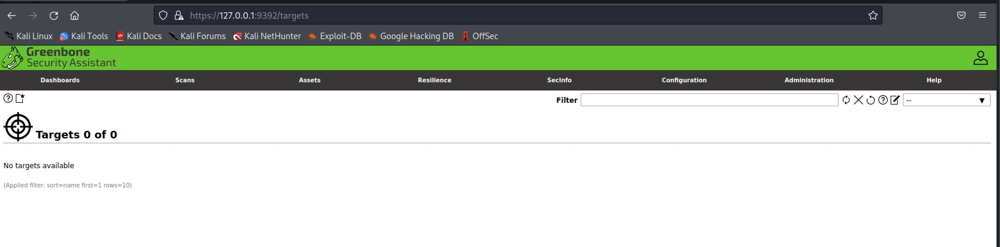

# openvas  & metasploit 

OpenVAS

- 오픈 소스 취약점 스캐너
- OpenVAS는 취약점 검색 및 취약점 관리를 제공하는 여러 서비스 및 도구의 프레임워크
- 취약점 스캐너란 컴퓨터, 컴퓨터 시스템, 네트워크 또는 애플리케이션의 취약점을 평가하는 용도로 만들어 진 컴퓨터 프로그램
- 단순 취약점 스캔 뿐만 아니라, 해당 취약점의 원인, 그래프 형태로 도식화 등을 지원
- 오픈 소스이기 때문에 상용 버전보다 수가 적은 취약점을 찾아내지만, 일반적으로 취약점 스캐너가 하는 모든 작업을 지원함

 

gvm-start

 

login

 

configuration -> targets

 

new target

 

target 만들어진거 확인

 

configuration -> scan configs

스캔 방향이나 방법을 정하는 곳 입니다.

 

scans -> tasks

 

new tasks

 

tasks 생성 확인

 

