# arp redirect

- arp spoofing 의 일종
- 라우터가 공격 대상이 포함 되면 redirect
  - 라우터 공격
    - ARP redirect : 라우터의 arp cache
    - ICMP Redirect :  host 의 라우팅 테이블 공격

 

구상도

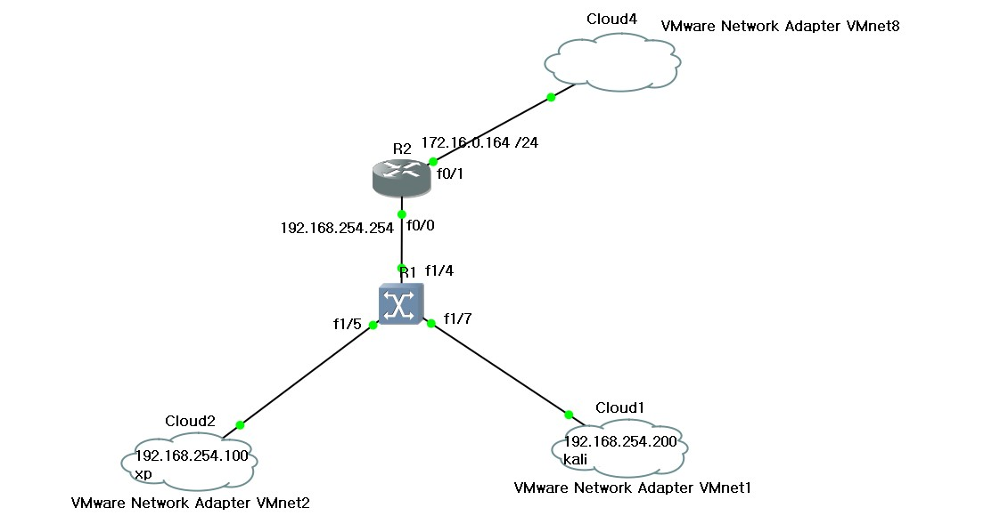

 

Router 설정

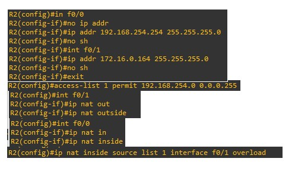

Router interface와 P.A.T static NAT를 설정해 줍니다.

 

 Router ARP

 

XP -> 외부 ping

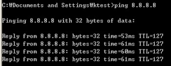

 

kali -> 외부 ping

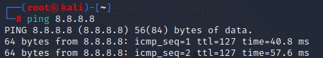

 

arp spoofing

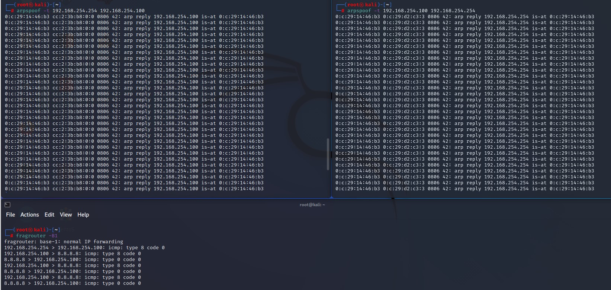

 

xp arp 확인

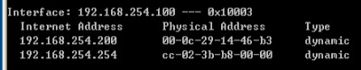

 

router arp 확인

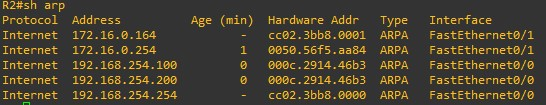

위의 사진과 비교해 보시면 192.168.254.100 , 200의 mac 주소가 같아진 부분을 볼 수 있습니다.

 

PC 1대 더 추가

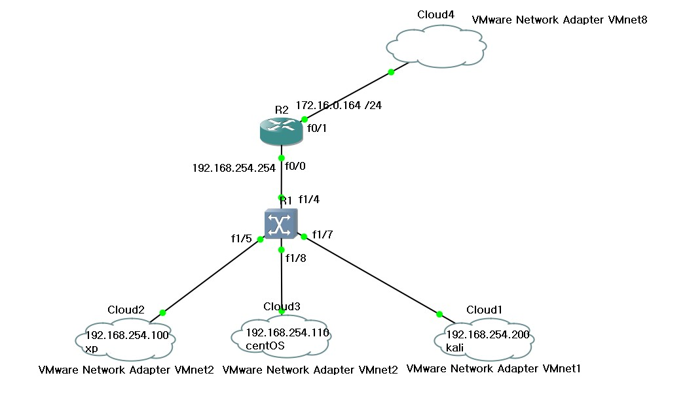

 

centOS -> 외부 ping

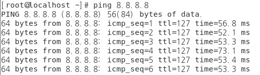

 

패키지 설치

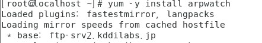

arpwatch라는 패키지로 arp 변경점을 잡아주는 패키지 입니다.

 

promisc 설정

 

ifconfig 확인

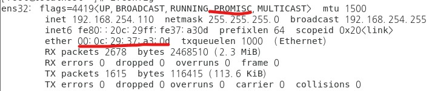

mac 주소도 기억해 두시기 바랍니다.

 

arp 변경을 볼 수 있도록 정보가 담긴 file을 tail

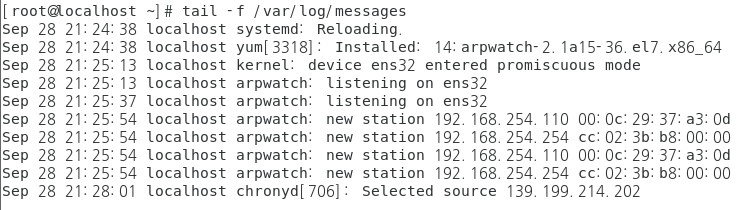

arp 변경점이 모니터링 되는 모습 입니다.

 

arp spoofing

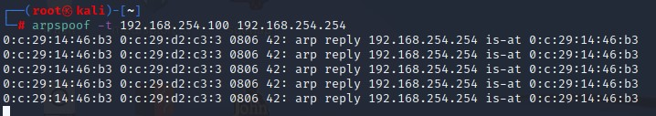

 

centOS에서 확인

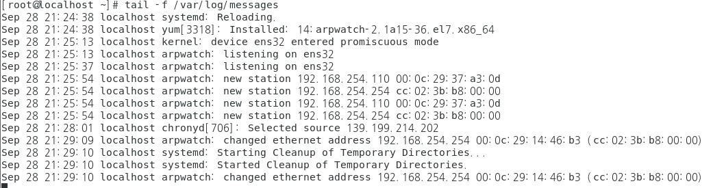

