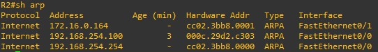

# arp redirect

- arp spoofing 의 일종
- 라우터가 공격 대상이 포함 되면 redirect
  - 라우터 공격
    - ARP redirect : 라우터의 arp cache
    - ICMP Redirect :  host 의 라우팅 테이블 공격

 

구상도

 

Router 설정

Router interface와 P.A.T static NAT를 설정해 줍니다.

 

 Router ARP

 

XP -> 외부 ping

 

kali -> 외부 ping

 

arp spoofing

 

xp arp 확인

 

router arp 확인

위의 사진과 비교해 보시면 192.168.254.100 , 200의 mac 주소가 같아진 부분을 볼 수 있습니다.

 