# ICMP redirect, DNS spoofing

 

구성도

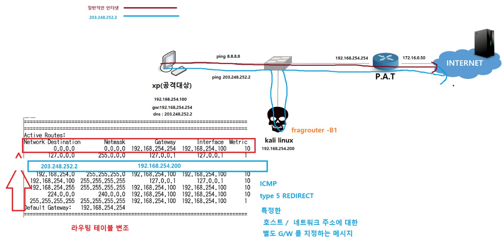

 

파일 준비

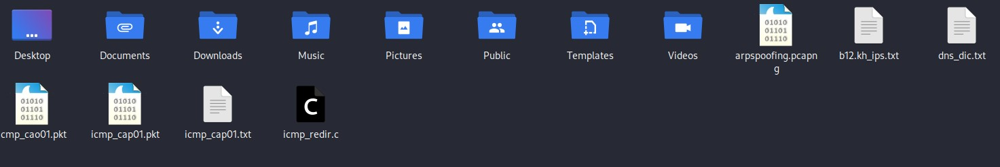

 

gcc 를 이용하여 icmp_redir.c 를 compile 하여 실행 가능한 파일로 생성

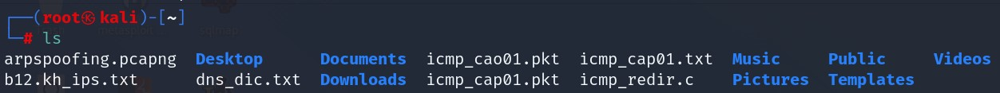

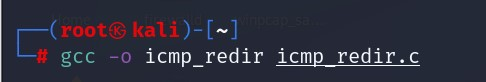

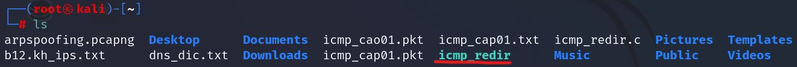

 

ip forwarding준비

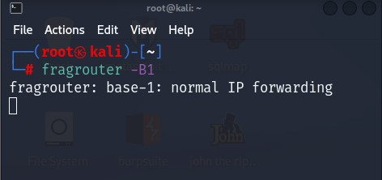

 

icmp redirect 공격하기 

1. WireShark

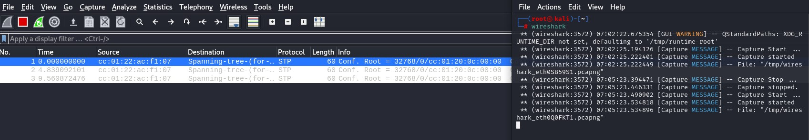

2. 공격도구 실행

./icmp_redir 192.168.254.254(원래gw) 192.168.254.100(공격대상) 203.248.252.2 (위조대상주소) 192.168.254.200(공격자주소) 

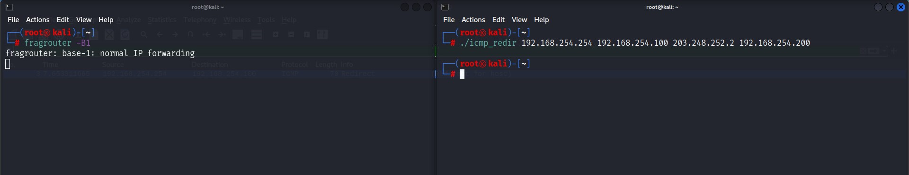

 

WireShark 확인

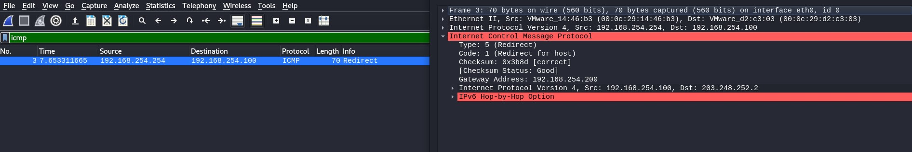

type:5 code:1이 보입니다.

 

xp확인

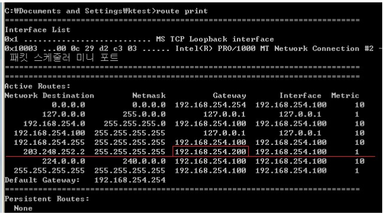

 

xp -> ping 203.248.252.2

 

ipforwarding 확인

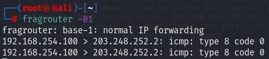

xp -> ping 203.248.252.2가 kali에 머무르는 모습이 보입니다.

 

WireShark

보시면 출발지는 xp인데 MAC주소는 kali로 되어있는 모습입니다.

 

##### DNS spoofig

파일생성

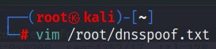

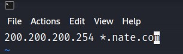

 

dns spoofing

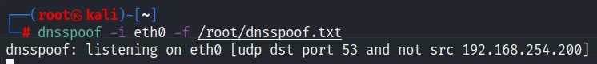

 

확인

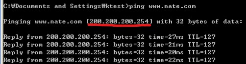

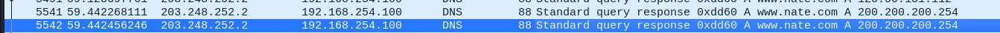

