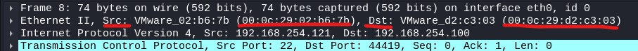

# IP spoofing

- Source IP를 속여서 접속하는 공격

- 신뢰받는 IP로 변경하여 접근제어를 우회하는 공격 기법

- 1985년 Robert Morris 논문에서 TCP Sequence Number 설계의 취약점이 소개되었고 1995년 Kevin Mitnick이 실제화하여

  미국 국회의사당을 공격 함

IP Spoofing 목적

- Dos 공격에서 공격자를 은닉하기 위해 Source IP를 변조 함
- 접근 제어 정책을 우회 하기위해 허용된 Source IP로 변조하여 통신 함  보안정책 우회, Trust Relationship 우회

 

##### Local IP Spoofing

- 공격자가 `내부 네트워크`에서 IP Spoofing을 통해 통신하는 공격
- 주로 시스템의 접근 제어를 우회하기 위해 사용 됨

 

구성도

 

kali -> mini SSH client확인

 

kail에 ip주소 추가

 

ssh 접근시 wireshark

현재 kali의 eth0 주소인 192.168.254.200으로 접근이 되는 모습입니다.

 

-b 옵션 이용

-b 옵션을 이용하면 추가했던 eth0:1을 출발지 주소로 접속 가능 합니다.

여기까지는 xp를 켜지 않은 상태입니다. xp를 키고 다시 해 보겠습니다.

 

xp active인 상태에서 -b 옵션 이용

 

MAC주소 확인

kali가 xp인척 하면서 mini로 접근하였으나 돌아올때 MAC주소가 kali가 아닌 xp로 가기때문에 접근이 안되고 있는 상황 입니다.

 

arpspoofing 이용해서 접근하기

 

MAC주소 확인

이번엔 성공 했습니다.

보시면 xp에서 돌아오는 MAC주소가 변경된 모습이 보입니다.

