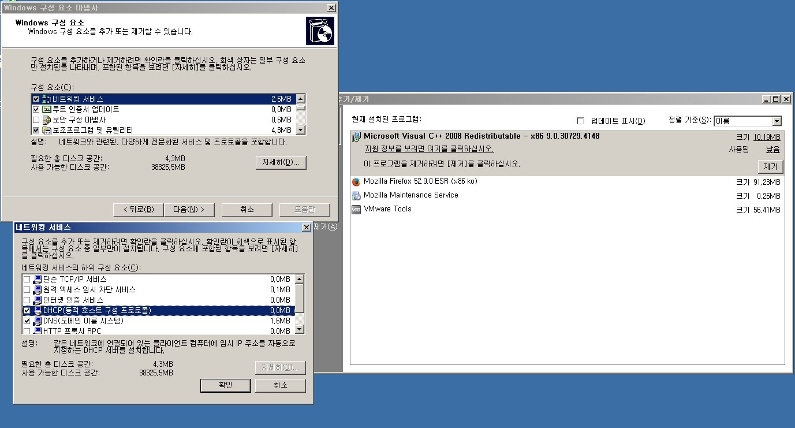
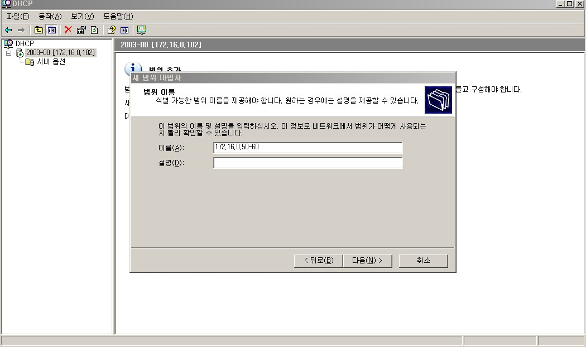
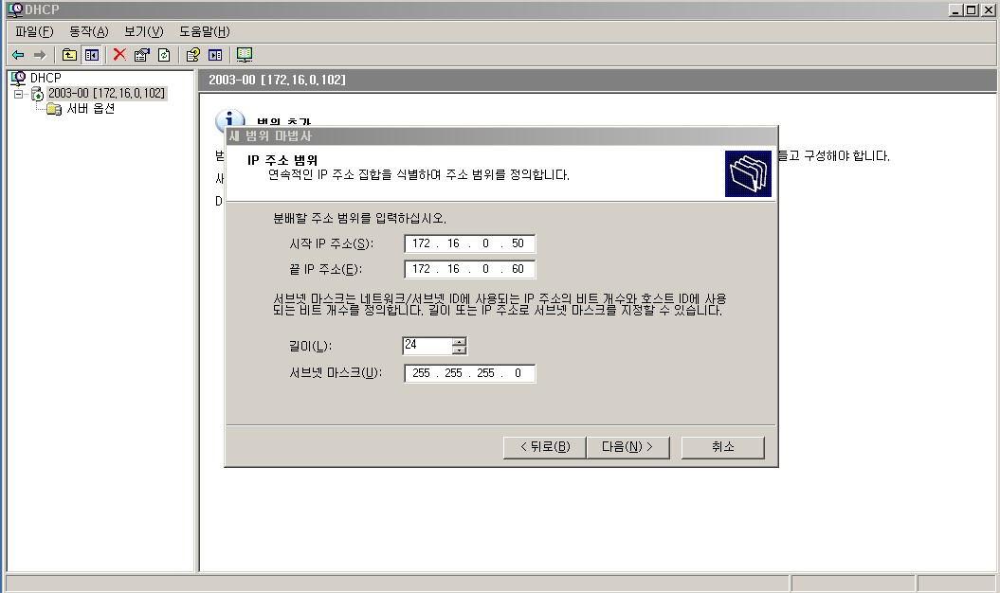
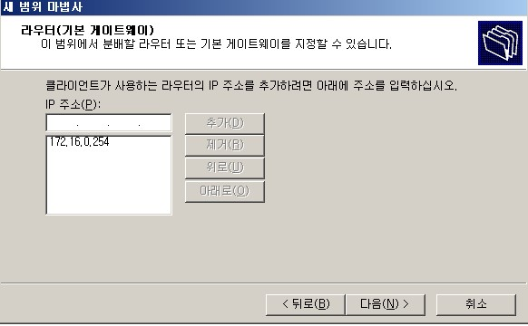
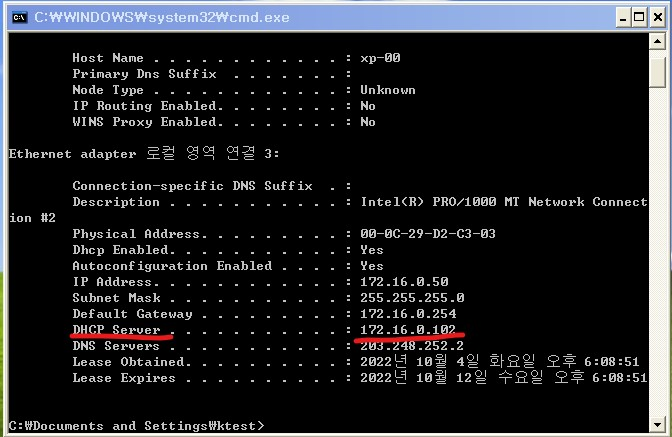
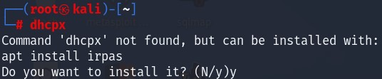

# DHCP attack

- 공격자가 DHCP 클라이언트 또는 서버로 위장하여 변조된 DHCP 메시지를 이용하여 수행하는 공격 

- 정상 DHCP서버를 마비(Dos) 시키거나 클라이언트에게 변조된 네트워크 정보를 전달하여 데이터의 전달 흐름을 공격자로 유도(Sniffing) 함

 

DHCP 취약점 

- UDP를 이용 함 → 비 신뢰성, 비 연결성 

- DHCP 자체의 인증 메커니즘이 없음 

  - 누구나 원할 때 클라이언트, 서버 역할을 할 수 있음 → 진위성을 확인할 수 없음 

  - Client → 요청으로 전달한 XID, port의 일치 여부만 확인 

  - Server → MAC주소로 Client 구분만 함

 

 DHCP Attack 분류 

- DHCP Starvation → DHCP Server의 Pool을 모두 소모시키는 공격 → Dos Attack (가용성 공격)
- DHCP Spoofing → DHCP Client에게 조작된 네트워크 정보를 전달하는 공격 (무결성 공격)

 

##### DHCP 설치

마지막에 XP에서 확인해 주시면 됩니다.

 

 

 

##### DHCP startvation

dhcpx 설치

 

