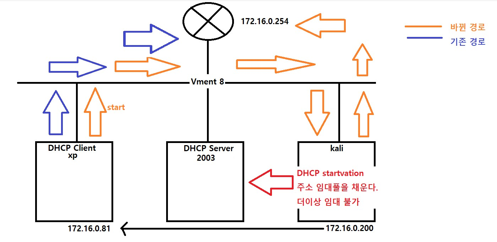
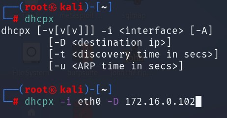
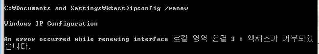
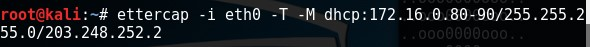
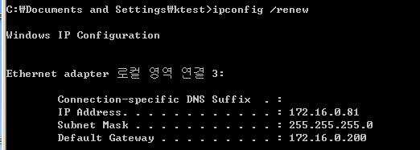
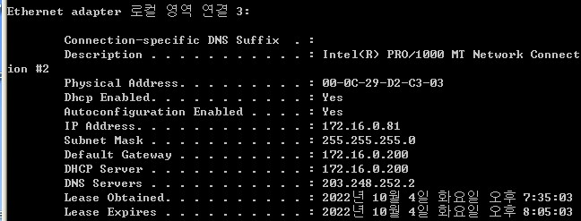
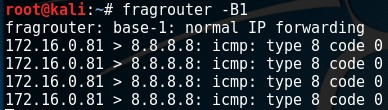
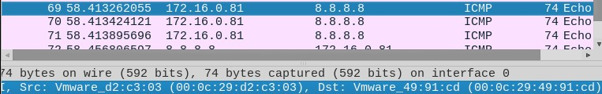

# DHCP attack

- 공격자가 DHCP 클라이언트 또는 서버로 위장하여 변조된 DHCP 메시지를 이용하여 수행하는 공격 

- 정상 DHCP서버를 마비(Dos) 시키거나 클라이언트에게 변조된 네트워크 정보를 전달하여 데이터의 전달 흐름을 공격자로 유도(Sniffing) 함

 

DHCP 취약점 

- UDP를 이용 함 → 비 신뢰성, 비 연결성 

- DHCP 자체의 인증 메커니즘이 없음 

  - 누구나 원할 때 클라이언트, 서버 역할을 할 수 있음 → 진위성을 확인할 수 없음 

  - Client → 요청으로 전달한 XID, port의 일치 여부만 확인 

  - Server → MAC주소로 Client 구분만 함

 

 DHCP Attack 분류 

- DHCP Starvation → DHCP Server의 Pool을 모두 소모시키는 공격 → Dos Attack (가용성 공격)
- DHCP Spoofing → DHCP Client에게 조작된 네트워크 정보를 전달하는 공격 (무결성 공격)

 

구성도

 

##### DHCP 설치

2003 -> dhcp 설치

마지막에 XP에서 확인해 주시면 됩니다.

 

 

 

##### DHCP startvation

kali2022 ver은 오류가 있어서 kali2016 ver으로 진행 하겠습니다.

kali -> dhcpx 설치

 

kali -> dhcpx 실행

 

xp -> 확인

주소를 재임대 했을때 실패하면 성공 입니다.

이미 재임대를 받을 주소를 kali에서 다 가져간 상태이기 때문에 주소 재임대에 실패하는 것 입니다.

 

 

 

##### DHCP Spoofing 

ettercap 을 이용한 dhcp spoofing

xp -> 확인

ipconfig /all로 확인해 보시면 DHCP Server와 Default Gateway가 kali의 주소로 들어가 있는 모습이 보입니다.

 

xp -> ping 8.8.8.8

kali -> fragrouter

WireShark로 보시면 도착지 주소의 MAC주소가 kali로 변경되어 있는 모습이 보입니다. 

8.8.8.8의 MAC주소가 아닌 kali의 MAC주소로 되어 있는 부분을 확인 하셔야 합니다.

 

