#  DoS (Denial of Service)

- 서비스 거부 공격 

- CIA Triad 에서 가용성(Availability)을 침해하는 공격 행위 

- 시스템 또는 네트워크의 구조적인 취약점을 이용하여 공격 대상이 정상적인 서비스를 수행하지 못하도록 마비 시키는 공격 

- 기본적으로 공격의 형태가 1 vs 1 → 공격자(1) vs 공격대상(1)

 

 공격 방식 

- 물리적인 파괴 
- 시스템 리소스(resource) 공격 → CPU, Memory, Disk, 특정 Application ...
-  네트워크 대역폭 (bandwidth) 공격 → 대역폭 고갈

 

##### Ping of Death (죽음의 핑) 

icmp flooding이라고 도 한다.

- 시스템 리소스 공격 → 운영체제의 오작동 유발, 메모리 부하, CPU 부하 
- 초기에 사용된 ICMP를 이용하는 DoS 공격

 

공격 원리 

- MTU를 초과하는 비 정상으로 큰 "ICMP Echo Request“를 전달(단편화)하여 재조합 과정에서 시스템 충돌 또는 Buffer Overflow를 유발 함 
-  현재는 단편화 된 많은 양의 Echo Request를 전달하여 재 조합 과정에 부하를 유발시키는 형식으로 공격 함 → ICMP Flooding

 

구상도

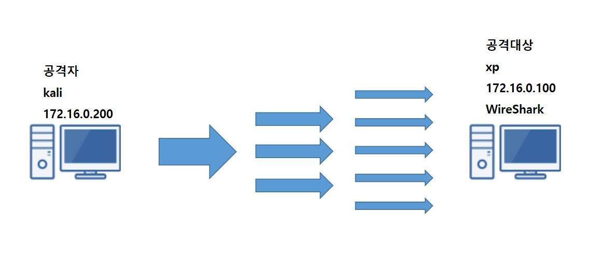

Vmnet8로 연결 해주시면 됩니다.

 

xp -> cpu 점유율 상태

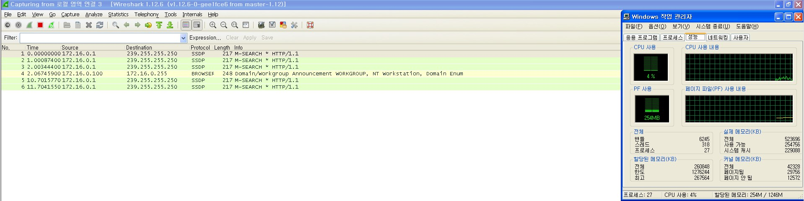

 

kali -> 공격

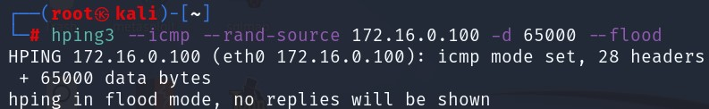

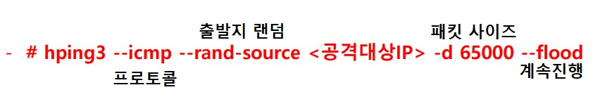

 

xp -> cpu 점유율 상태

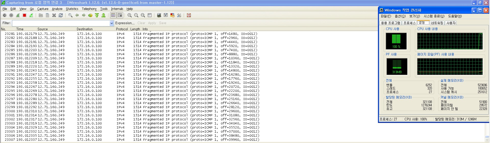

cpu 점유율이 갑자기 크게 올라 갔습니다.

 

보안

-  ICMP 패킷 필터링(차단) 

- 일정 시간 내 일정 개수 이상의 ICMP Packet이 들어올 경우 해당 출발지의 ICMP Message 차단 
  - MAC / IP 주소로 차단 - 재조합 패킷의 전체 크기를 검사 
- IP 패킷의 크기를 검사하여 65535이상의 패킷을 필터링 함

 

 

 

##### LAND Attack 

시스템 리소스 공격 → 메모리 부하, CPU 부하

이번 실습을 위해 redhat9 ver을 준비 했습니다.

 

공격 원리 

- 연결 요청 메시지의 Source를 공격대상의 주소로 변조하여 공격대상에 응답이 전달되게 함 
- 다량의 공격 패킷을 전달하여 부하를 유발시킴

 

구상도

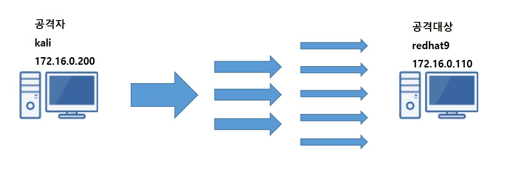

Vmnet8로 연결 해주시면 됩니다.

 

kali -> 공격

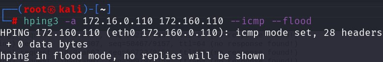

 

WireShark

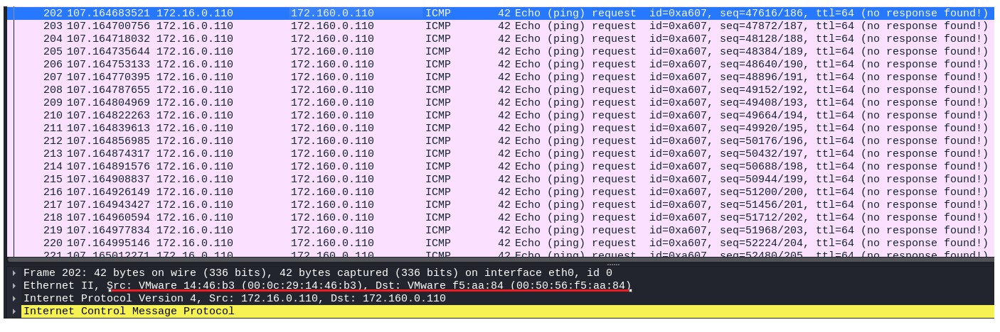

보시면 출발지와 도착지의 IP주소는 같지만 MAC주소는 다른점이 눈에 보입니다.

 

kali -> 공격

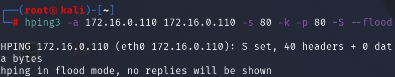

 

WireShark

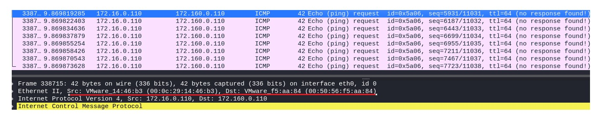

이번에도 IP주소는 같지만 MAC주소는 다른점이 보입니다.

 

redhat9 -> HTTP 확인

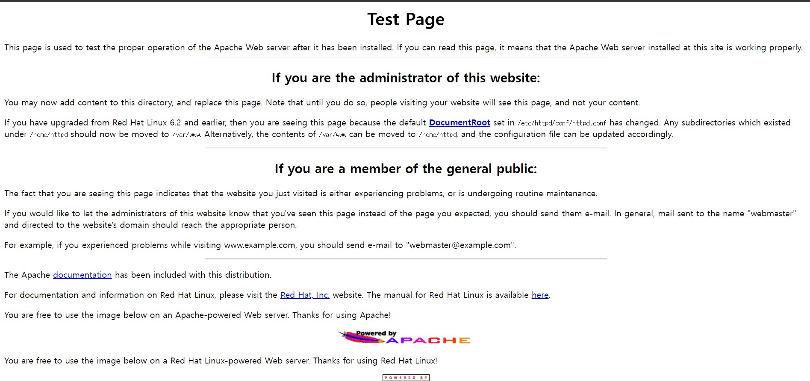

 

보안

패킷의 출발지와 목적지 주소가 같을 경우 필터링하여 차단 함

 

 

 

#####  Smurf Attack

- 시스템 리소스 공격 → 메모리 부하, CPU 부하 

- 취약한 네트워크의 호스트들을 이용하여 공격을 수행 함 
  - 공격자(1) → 경유지(N) → 공격대상(1) 

 

 공격 원리 

- 공격 패킷의 출발지 주소를 공격대상으로 목적지 주소를 취약한 네트워크의 Direct Broadcast주소로 변조 한 요청을 전달 함 
- 취약한 네트워크의 호스트들이 공격대상에 응답 합 
- 공격대상은 한꺼번에 전달되는 비정상 응답을 처리해야 하므로 부하가 발생 함

 

구성도

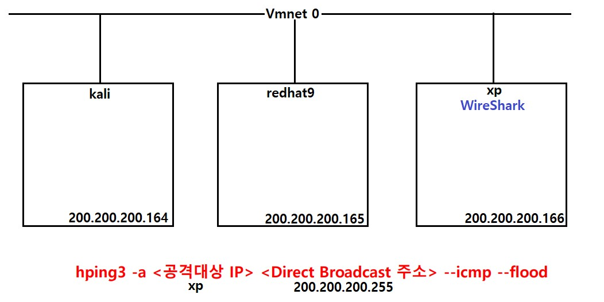

 

xp -> ping check

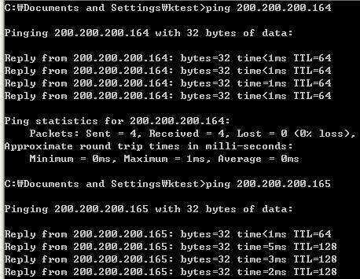

 

kali -> 공격

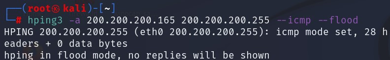

 

xp -> WireShark 확인

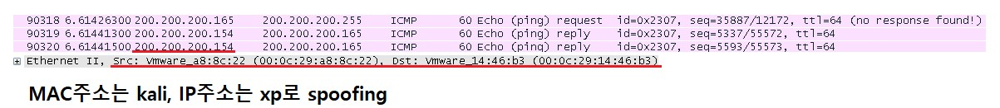

200.200.200.xxx의 Broadcast로 신호를 보내서 200.200.200.xxx 내의 취약점이 있는 모든 pc에 응답을 받게되는 모습 입니다.

 

보안 

- Router에서 Inbound되는 Direct Broadcast 차단 
  - no ip directed-broadcast 
-  Host에서 Direct Broadcast 패킷 수신 차단
-  목적지가 Broadcast IP로 전송된 ICMP 패킷에 대한 응답을 하지 않도록 설정

 

 

 

#####  TCP SYN Flooding

- TCP 가 데이터를 보내기 전에 연결을 먼저 맺어야 하는 연결지향성을 이용한 방법 

- Attacker 는 Victim 에 Source IP Address 를 Spoofing 하여 SYN 패킷을 특정 포트로 전송하여 해당 포트 의 대기 큐(Backlog Queue) 를 가득 차게 하여 해당 포트에 들어오는 정상적인 연결요청을 큐가 빌 때까지 무시하도록 함 

- UDP Flooding 이 주류를 이루기 이전에 많이 사용되던 방식 
- 시스템 부하 → 메모리 부하(프로그램의 Backlog Queue)

 

공격원리 

- 출발지 IP를 Random하게 변조하여 연결요청(SYN)을 전달 함 
- 공격 대상의 Backlog Queue가 가득 차서 정상 클라이언트의 연결 정보를 저장 하지 못하게 됨

 

구성도

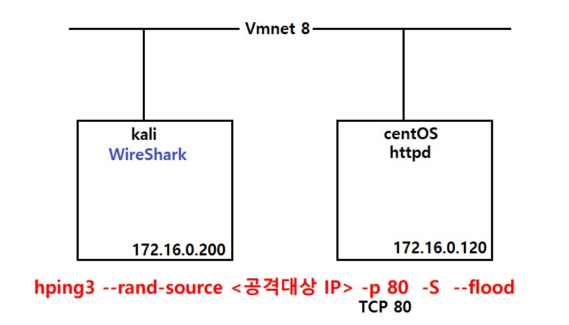

 

centOS 설정변경

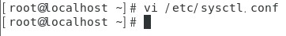

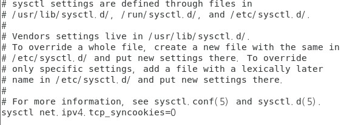

centOS는 기본적으로  TCP SYN Flooding이 막혀있기 때문에 막혀있는 부분을 풀고 공격이 가도록 하는 작업 입니다.

 

kali -> 공격

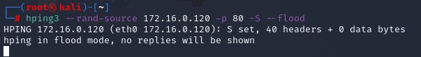

 

WireShark

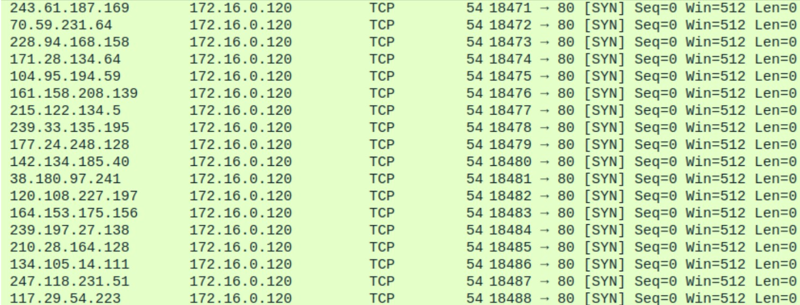

 

centOS

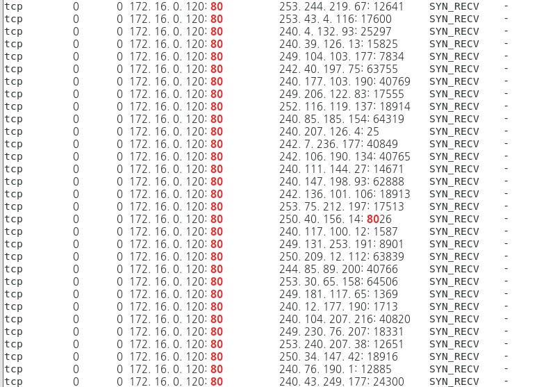

 

Host PC에서 확인

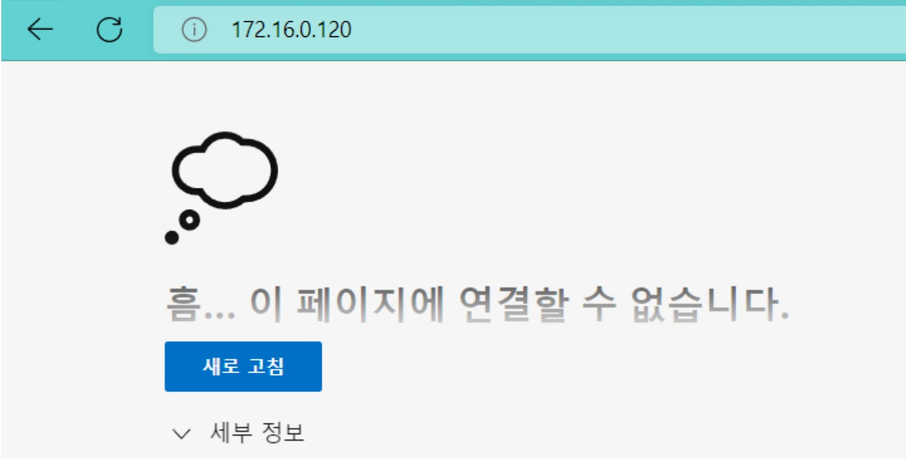

 

보안

- 시스템 최적화 
  - Backlog Queue 사이즈 증가, SYN_RCVD 대기시간 단축, Registry 설정 
- syncookie 기능 활성화 
- 보안 솔루션을 통한 방어

 

 

 

#####  TCP Connect Flood

- TCP 3-way Handshake 과정을 과도하게 유발시켜 서비스에 과부하를 발생시키는 공격 

- 공격 트래픽을 받는 서버는 정상적인 TCP 세션을 지속적으로 세션 연결을 하여 세션 처리 자원을 고갈시 켜 정상적인 세션 연결을 더 이상 수행할 수 없게 되어 이 후 정상적으로 접근하는 사용자가 더 이상 서비 스를 사용할 없게 됨 
- 형태: 연결 유지, 연결/해제 반복, 연결 이후 정상적인 통신처럼 트래픽을 발송 
- 정상적인 TCP 연결을 다수의 Zombie PC로 유지시켜 기존의 SYN Flooding 보안대책을 무력화 함

 

구상도

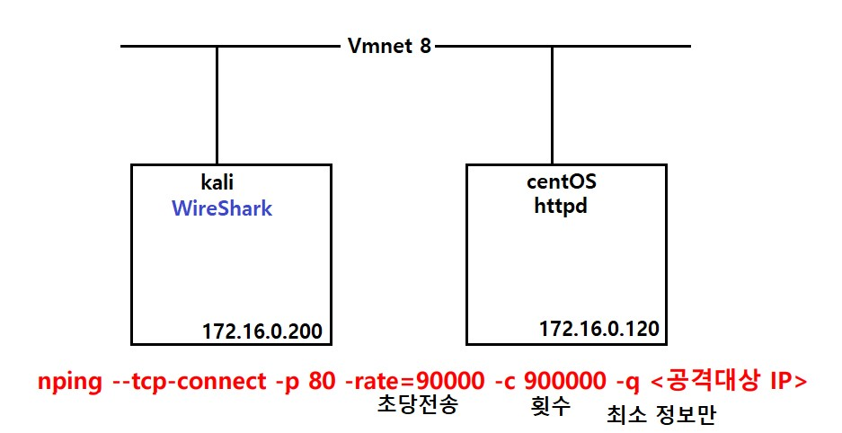

 

kali -> 공격

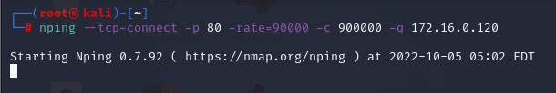

 

WireShark

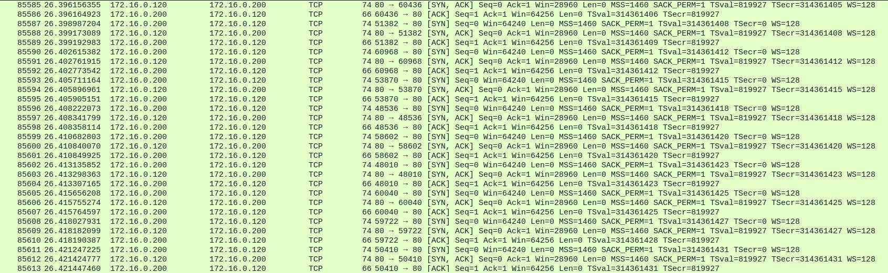

이렇게 TCP 3-way Handshake 과정을 과도하게 유발시켜 서비스에 과부하를 발생시키는 공격입니다.

 

보안

- 1 IP당 세션 수 제한 

- TCP 세션 연결 이 후 유휴 세션에 대한 타임아웃 설정 
- TCP 세션 연결 이 후 정상적인 트래픽이 이루어지는지 확인

 

 

 

#####  UDP Flooding

- UDP 의 비 연결성 및 비 신뢰성 때문에 발생 

- 단순한 공격으로 높은 수위의 공격효과를 볼 수 있기 때문에 DDOS 공격의 주류를 이룬다고 할 수 있음 
- 공격 유형
  - 최대 수십Gbps 범위의 공격을 직접 Victim 에 전송하여 네트워크 인프라를 마비 시키는 유형 
  - Source Address , Source Port 를 Spoofing 하여 과다한 트래픽을 Victim 들에 전송함으로써 Spoof  되는 Victim 간의 네트워크를 마비시키는 유형
-  주로 echo와 chargen 서비스를 이용함

 

