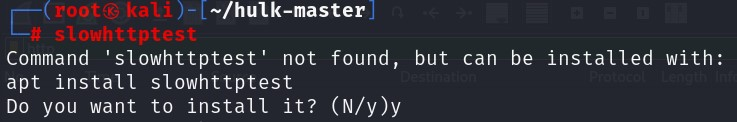

## DDoS(Distribution Denial of Service)

DDoS

- 분산 서비스 거부 공격
- DoS 공격의 발전 형태
- 공격 시스템을 여러 대로 분산 배치하여 대량의 트래픽으로 공격대상의 서비스를 마비시키는 공격  악성코드 등을 이용하여 Zombie PC를 획득하여 C&C서버를 통해 공격 명령을 내림
- 기본적으로 공격의 형태가 (1 → N) vs 1
  - (공격자(1) → 좀비PC(N)) vs 공격대상(1)

<br>

공격 유형

- 네트워크 대역폭 소모 
  - 다수의 Zombie PC를 이용하여 대량의 패킷의 전송하여 네트워크 대역폭의 처리 한계를 초과 
  - 종류 : 통신량의 한계 초과 → UDP Flooding, ICMP Flooding 


- 시스템 자원 고갈 

  - 시스템에서 서비스를 지원하는 리소스를 소모시켜 정상 서비스의 문제를 유발 시킴 

  - 종류 : SYN Flooding, TCP Connection Flooding(다수의 정상 연결) 


- 어플리케이션 취약점 공격 

  - 특정 서버 프로그램에서 나타나는 취약점을 이용하여 정상 서비스를 방해 함 

  - 종류 : HTTP GET Flooding, HTTP CC(Cache Control) Attack, Slowloris(HTTP GET based) Attack,  RUDY(HTTP POST based) Attack, Hulk Dos Attack ...

<br>

##### GET Flooding

- 공격자가 동일한 URL을 반복 요청하여 웹 서버의 부하를 유발하는 공격

<br>

구성도


<br>

kali -> 공격 준비

```
wget https://github.com/grafov/hulk/archive/master.zip
unzip /root/master.zip
cd hulk-master
ls
```

위의 명령어를 순서대로 하여 파일이 잘 있는지 확인해 주시면 됩니다.

<br>

kali -> 공격


<br>

WireShark


centOS의 웹 홈페이지에 들어가 보시면 조금 느려졌다는 느낌이 드실겁니다.

<br>

<br>

<br>

##### CC Attack

- HTTP Request의 Cache-Control 메시지 헤더를 조작하여 Cache 서비스가 가능한 자원도 웹 서버가 직접 처리하도록 유도 함 
  - Cache-Control: no-store; must-revalidate 
  - no-store → 클라이언트에게 요청 받은 데이터를 디스크, 메모리, 별도의 저장 장치(Cache Server)에 저장하는 것을 금지 
  - must-revalidate → 웹 서버가 Caching Server에게 저장된 Cache에 대한 검증을 요구하는 메시지(서 버가 전달하는 값) 

- Caching 기능을 무력화 시켜서 웹 서버의 부하를 유발하는 공격 
-  Caching Server를 운영하는 웹 사이트가 공격 대상이 될 수 있음

<br>

- Cache-Control: no-cache
  - 한꺼번에 여러 글자를 받아서 처리 하지 말고 사용자들이 보내는대로 처리
  - 공격자가 문자를 보내지 않으면 서버는 항상 문자열 대기 상태로 바뀜 > 이러한 연결을 반복적으로 진행
  - 공격대상 웹서버로 Cache-Size 를 0으로 설정해서 보내면 대상 웹서버는 인코딩된 문자열을 동시에 처리할수 없고

<br>

구성도


<br>

kali -> 공격 준비


py파일을 하나 만들어서 위의 내용을 넣어 주시면 됩니다.

<br>

kali -> 공격


<br>

WireShark


<br>

<br>

<br>

##### Slow HTTP POST Dos

- POST 요청으로 전달하는 많은 양의 데이터를 장시간에 걸쳐 분할 전송 함 

- 서버가 POST 요청을 모두 전달 받을 때까지 연결을 유지하면서 자원을 소모 함
- 

<br>

구성도


<br>

kali -> 패키지 설치



<br>

kali -> 공격


<br>

WireShark


<br>

kali -> etherape설치


<br>

kali -> etherape켜고 다시 공격


etherape는 네트워크 부하 확인하는 GUI  도구입니다.

<br>

<br>

<br>


