# Port Mirroring

- switch  는 관련없는  port 로 frame 을 forwarding 하지 않는다
- A , B 가 통신에 다른 포트에서는 통신내용을 확인 불가능

 

구성도

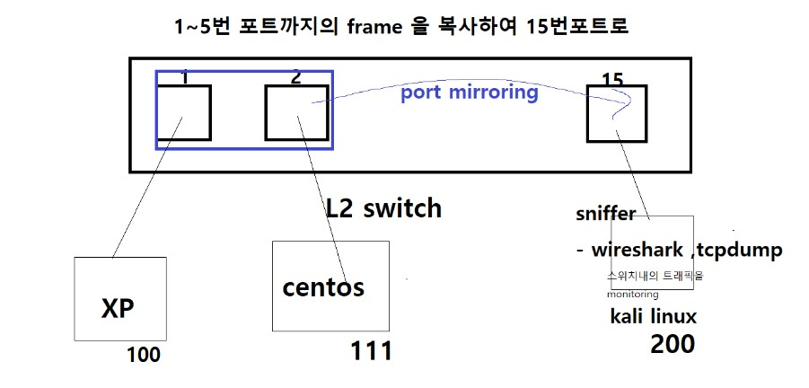

 

GNS 구성

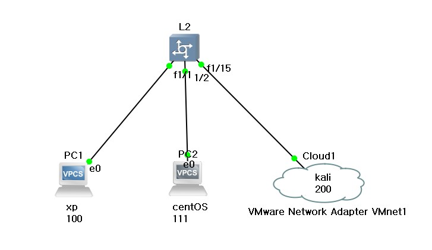

 

ping check

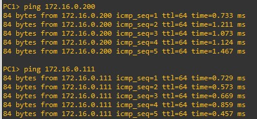

 

SPAN(Switch Port ANalyzer)

- Cisco Catalyst 스위치에서 사용되는 Port Mirroring 기술

- SPAN을 위한 소스 Port와 목적지 Port 쌍을 모니터 세션(monitor session)이라고 함 

  - 소스 Port 는 다중 설정 가능 

  - 목적지 Port 는 하나만 설정 가능 

  - 하나의 스위치에서 설정할 수 있는 모니터 세션은 2개까지 지원 됨

- 모니터링 방식  Port Monitoring, VLAN Monitoring, ...

- 미러링하고자 하는 트래픽의 방향 지정 가능 

  - RX : 수신 트래픽만 미러링 
  - TX : 송신 트래픽만 미러링 
  - Both : 송수신 트래픽 모두 미러링(기본 값)

 

SPAN 종류 

- Local SPAN : 소스 SPAN 포트와 목적지 SPAN 포트가 동일한 스위치에 있을 경우 

-  RSPAN(Remote SPAN) : 소스 SPAN 포트와 목적지 SPAN 포트가 서로 다른 스위치에 있을 경우

 

SPAN  구성

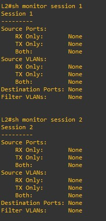

 

SPAN 설정

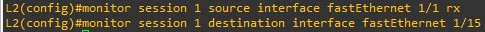

f1/1 로 receive 되는 패킷만 미러링

미러링된 프레임을 f1/15 으로 전달할것

 

SPAN 확인

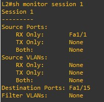

 

SPAN 설정 제거

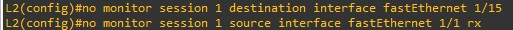

설정을 제거한 다음에 kali에 WireShark를 켜고 설정을 했을때와 안했을때의 차이를 한번 보겠습니다.

 

xp -> centOS로 ping

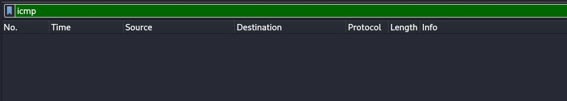

지금은 ping을 해도 WireShark에 아무것도 잡히지 않습니다.

이제 다시 SPAN을 설정하고 해 보겠습니다.

 

xp -> centOS로 ping

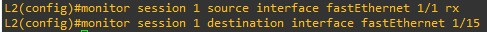

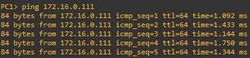

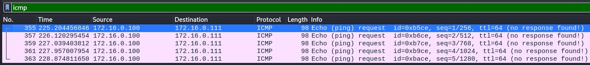

아까는 WireShark에 아무것도 잡히지 않았지만 이번에는 움직임이 잡혔습니다.

이 부분은 지금 rx옵션을 저희가 적용했기 때문에 xp -> centOS로 가는 부분만 잡혀서 보이는 부분입니다. switch 입장에서 xp에서 centOS로 가는 길이 rx이고 tx는 그 반대 입니다.

 
