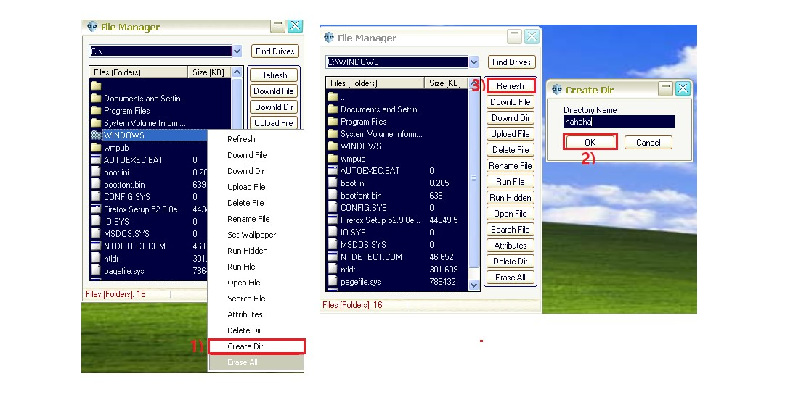

# Beast

Beast로 backdoor를 만들어서 해 보겠습니다.

구성도


beast 프로그램이 윈도우로 옮길때 악성 바이러스로 인식이 되서 리눅스에서 옮기도록 하겠습니다.

<br>

vsftpd 설정

```
vim /etc/vsftpd/ftpusers
# Users that are not allowed to login via ftp
#root
bin
daemon
adm
lp
sync
shutdown
halt
mail
news
uucp
operator
games
nobody
```

root만 주석처리 해주시면 됩니다.

<br>

xp -> backdoor 생성


Listen port 6666만 확인해 주시면 됩니다.

save Server를 누르면 경로에 server라는 파일이 생깁니다.

<br>

server파일 공유하기


공유 폴더를 하나 만들어서 2003과 공유 해주시면 됩니다.

<br>

server 파일 확인


작업 관리자에 들어가야 볼 수 있습니다.

<br>

xp -> backdoor 접근 


<br>

xp -> 상대 컴퓨터 드라이브 내용 보기



상대 드라이브를 보고 디렉터리를 하나 만들어 보겠습니다.

<br>

2003 -> 확인


hahaha 디렉터리가 만들어 졌습니다.

<br>

xp -> 상대 바탕화면 보기


하시고 난 뒤에 다시 start를 눌러 주시면 됩니다.


<br>

xp -> 상대 프로그램 실행 목록


<br>

