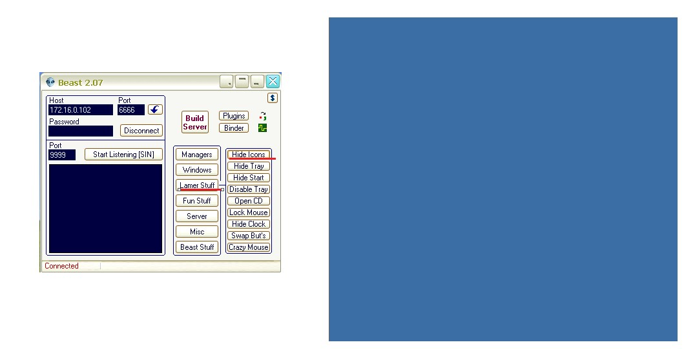
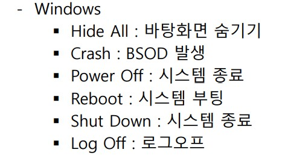

# Beast


Beast로 backdoor를 만들어서 해 보겠습니다.

<br>

구성도


beast 프로그램이 윈도우로 옮길때 악성 바이러스로 인식이 되서 리눅스에서 옮기도록 하겠습니다.

<br>

vsftpd 설정

```
vim /etc/vsftpd/ftpusers
# Users that are not allowed to login via ftp
#root
bin
daemon
adm
lp
sync
shutdown
halt
mail
news
uucp
operator
games
nobody
```

root만 주석처리 해주시면 됩니다.

<br>

xp -> backdoor 생성


Listen port 6666만 확인해 주시면 됩니다.

save Server를 누르면 경로에 server라는 파일이 생깁니다.

<br>

server파일 공유하기


공유 폴더를 하나 만들어서 2003과 공유 해주시면 됩니다.

<br>

server 파일 확인


작업 관리자에 들어가야 볼 수 있습니다.

<br>

##### backdoor - Direct

xp -> backdoor 접근 


<br>

xp -> 상대 컴퓨터 드라이브 내용 보기


상대 드라이브를 보고 디렉터리를 하나 만들어 보겠습니다.

<br>

2003 -> 확인


hahaha 디렉터리가 만들어 졌습니다.

<br>

xp -> 상대 바탕화면 보기


하시고 난 뒤에 다시 start를 눌러 주시면 됩니다.


<br>

xp -> 상대 프로그램 실행 목록


<br>

xp -> clip board


2003 메모장에 내용을 입력하고 ctrl + c(복사)를 하시면 그 내용이 출력이 됩니다.

<br>

xp -> 상대 컴퓨터 기능을 제한



Hide icons를 누르면 2003 바탕화면에 icon이 다 숨겨 집니다.

그 밑에 다른 기능들도 다 비슷한 기능 입니다.

<br>

xp -> 사용에 불편함을 주거나 장난 


Fun Stuff 입니다.

마우스를 숨기거나 채팅을 하는 등의 기능이 있습니다.

<br>

xp -> Misc


<br>

xp -> windows


<br>

2003 -> 재시작 후 확인


재시작 후 작업 관리자를 보면 그대로 실행되고 있습니다.

자동으로 재시작이 되도록 설정이 되어 있는 것입니다.

<br>

xp -> kill server


xp에서 kill server를 하시면 아예 종료 됩니다.

위와 같이 공격자 -> 공격 대상으로 가는 건 direct backdoor라고 하며 공격 대상 -> 공격자는 reverse backdoor라고 합니다.

<br>

backdoor 기능 모음





<br>

<br>

<br>

##### backdoor - Reverse

xp -> backdoor 생성


<br>

xp -> 2003 공유 폴더로 파일 이동


server_R 파일을 이동 시키고 실행 해주시면 됩니다.


연결이 되면 공격 대상의 IP주소와 아이콘이 생성 됩니다.

<br>

xp -> Test


잘 연결이 되었음을 확인 해봤습니다.

<br>

