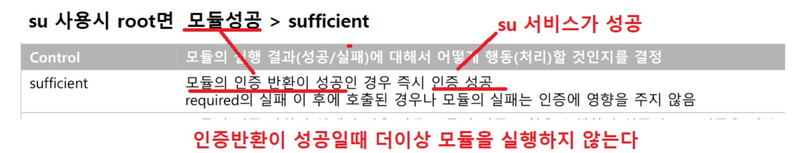

# Pam

• Linux 인증 모듈 PAM(Pluggable Authentication Modules) 

- 응용 프로그램에서 사용자 인증을 수행할 수 있게 공통적인 인증 방법을 제공하는 인증 모듈 
- 인증 모듈의 교체 및 추가/삭제가 용이 
- 개발자가 작성한 코드에 의한 인증이 아닌 시스템 관리자가 직접 응용프로그램의 인증 동작을 제어 
  - 응용 프로그램(서비스)에서 PAM을 호출하여 인증 처리 요청
  - 응용 프로그램 개발자가 사용자 인증에 신경 쓰지 않아도 되고, 시스템 관리자가 직접 응용 프로그램 의 인증 동작을 세밀하게 제어 가능 
- 다양한 인증 모듈을 호출하여 사용자 인증 과정을 수행 후 모듈 결과에 맞는 행동을 함 
- 모듈의 종류가 다양하며 인증 절차에 확실한 개념이 필요 
- 라이브러리 형태로 구동(windows 응용 프로그램의 DLL과 같은 라이브러리) 
- 악의적으로 이용할 경우 인증 설정 파일을 이용하여 인증을 수행하지 않고 계정에 접근이 가능

<br>

• PAM 동작 원리 

- 프로그램에서 사용자 인증 필요 시 PAM 라이브러리 함수 호출 
- PAM 호출 시 호출한 응용프로그램의 인증 설정 파일 검사 
  - 설정 파일이 존재하지 않을 경우 기본 설정 파일(other) 사용 
  - 설정 파일은 사용자 인증을 검사하기 위해 필요한 유형을 가지며 이를 기초로 적절한 모듈 호출 
  - 구문에 맞는 인증 모듈을 통해 여러 가지 검사 수행 
- 모듈의 인증 결과에 의해 결과 메시지가 결정되어 응용프로그램에 전달 

<br>

##### PAM 인증 절차 

1) 사용자가 서비스를 이용 받기 위해 접근 
   - Local Service : login, gdm, gdm-password, passwd, reboot, setup, su, su-l, sudo, sudo-i, ... 
   - Remote Service : remote, smtp.postfix, sshd, vsftpd, ... 
2) 프로세스(로컬, 데몬)은 PAM에 인증 요청 
3) PAM은 개별 서비스 인증을 수행하기 위해 요청한 /etc/pam.d 하위에서 요청한 프로세스 이름에 해당하 는 설정 파일 검사 
4) 설정 파일의 구문에 의해 PAM 라이브러리 호출 및 결과 메시지 생성 후 프로세스에 반환 
5) 프로세스는 반환된 결과에 의해 적절한 행동 수행

<br>

PAM 의 영향을 받는 서비스의 목록 : 해당 목록에 없으면 PAM 의 영향을 받지 않는다


<br>

2. 프로세스(로컬, 데몬)은 PAM에 인증 요청 

3. PAM은 개별 서비스 인증을 수행하기 위해 요청한 /etc/pam.d 하위에서 요청한 프로세스 이름에 해당하 는 설정 파일 검사 

```
su 를 사용할때 인증 요청 아래파일을 참조에하여 인증을 진행 
vim /etc/pam.d/su

#%PAM-1.0
auth            sufficient      pam_rootok.so
# Uncomment the following line to implicitly trust users in the "wheel" group.
#auth           sufficient      pam_wheel.so trust use_uid
# Uncomment the following line to require a user to be in the "wheel" group.
#auth           required        pam_wheel.so use_uid
auth            include         system-auth
account         sufficient      pam_succeed_if.so uid = 0 use_uid quiet
account         include         system-auth
password        include         system-auth
session         include         system-auth
session         optional        pam_xauth.so

비슷한 다른파일도 확인 : 비슷함 
vim /etc/pam.d/sshd

#%PAM-1.0
auth       required     pam_sepermit.so
auth       include      password-auth
account    required     pam_nologin.so
account    include      password-auth
password   include      password-auth
# pam_selinux.so close should be the first session rule
session    required     pam_selinux.so close
session    required     pam_loginuid.so
# pam_selinux.so open should only be followed by sessions to be executed in the user context
session    required     pam_selinux.so open env_params
session    required     pam_namespace.so
session    optional     pam_keyinit.so force revoke
session    include      password-auth

인증관련모듈 저장 
ls /lib64/security/

pam_access.so        pam_faildelay.so      pam_krb5.so       pam_nologin.so           pam_sepermit.so    pam_unix.so
pam_cap.so           pam_faillock.so       pam_krb5afs.so    pam_oddjob_mkhomedir.so  pam_shells.so      pam_unix_acct.so
pam_chroot.so        pam_filter            pam_lastlog.so    pam_passwdqc.so          pam_smbpass.so     pam_unix_auth.so
pam_ck_connector.so  pam_filter.so         pam_limits.so     pam_permit.so            pam_sss.so         pam_unix_passwd.so
pam_console.so       pam_fprintd.so        pam_listfile.so   pam_postgresok.so        pam_stress.so      pam_unix_session.so
pam_cracklib.so      pam_ftp.so            pam_localuser.so  pam_pwhistory.so         pam_succeed_if.so  pam_userdb.so
pam_debug.so         pam_gnome_keyring.so  pam_loginuid.so   pam_rhosts.so            pam_tally2.so      pam_warn.so
pam_deny.so          pam_group.so          pam_mail.so       pam_rootok.so            pam_time.so        pam_wheel.so
pam_echo.so          pam_issue.so          pam_mkhomedir.so  pam_securetty.so         pam_timestamp.so   pam_winbind.so
pam_env.so           pam_keyinit.so        pam_motd.so       pam_selinux.so           pam_tty_audit.so   pam_xauth.so
pam_exec.so          pam_krb5              pam_namespace.so  pam_selinux_permit.so    pam_umask.so
```

<br>

4. 설정 파일의 구문에 의해 PAM 라이브러리 호출 및 결과 메시지 생성 후 프로세스에 반환 

```
/etc/pam.d/~ 의 파일에 구성된 순서대로 인증을 진행하고 결과를 프로세스에 성공/실패로 반환한다 
```

<br>

5. 프로세스는 반환된 결과에 의해 적절한 행동 수행

```
[ktest@localhost ~]$ su - test01
암호:
su: incorrect password
```

<br>

<br>

<br>

#####  pam_permit.so

해당 모듈 설명


<br>

모듈 적용 방식 

```
/etc/pam.d/su

1 #%PAM-1.0
2 auth            sufficient      pam_permit.so (이부분 입니다.)
3 auth            sufficient      pam_rootok.so
4 # Uncomment the following line to implicitly trust users in the "wheel" group.
5 #auth           sufficient      pam_wheel.so trust use_uid
6 # Uncomment the following line to require a user to be in the "wheel" group.
7 #auth           required        pam_wheel.so use_uid
8 auth            include         system-auth
9 account         sufficient      pam_succeed_if.so uid = 0 use_uid quiet
10 account         include         system-auth
11 password        include         system-auth
12 session         include         system-auth
13 session         optional        pam_xauth.so
```

<br>

확인

```
root 제외하고 원래 일반사용자는 su 사용시 root(수퍼유저) 비번 입력 

모듈 적용 전
[ktest@localhost ~]$ su - 
암호:
[root@localhost ~]#

모듈 적용 후
[root@localhost ~]# su - ktest
[ktest@localhost ~]$ su -
[root@localhost ~]#
```

비밀번호 없이 로그인이 되는 모습 입니다.

<br>

<br>

<br>

#####  pam_deny.so 

해당 모듈 설명


<br>

모듈 적용 방식 (requiste)

```
vim /etc/pam.d/su

1 #%PAM-1.0
2 #auth           sufficient      pam_permit.so
3 auth            requisite      pam_deny.so (이부분 입니다.)
4 auth            sufficient      pam_rootok.so
5 # Uncomment the following line to implicitly trust users in the "wheel" group.
6 #auth           sufficient      pam_wheel.so trust use_uid
7 # Uncomment the following line to require a user to be in the "wheel" group.
8 #auth           required        pam_wheel.so use_uid
9 auth            include         system-auth
10 account         sufficient      pam_succeed_if.so uid = 0 use_uid quiet
11 account         include         system-auth
12 password        include         system-auth
13 session         include         system-auth
14 session         optional        pam_xauth.so
```

<br>

확인


<br>

모듈 적용 방식 (required)

```
vim /etc/pam.d/su

1 #%PAM-1.0
2 #auth           sufficient      pam_permit.so
3 auth            required      pam_deny.so (이부분 입니다.)
4 auth            sufficient      pam_rootok.so
5 # Uncomment the following line to implicitly trust users in the "wheel" group.
6 #auth           sufficient      pam_wheel.so trust use_uid
7 # Uncomment the following line to require a user to be in the "wheel" group.
8 #auth           required        pam_wheel.so use_uid
9 auth            include         system-auth
10 account         sufficient      pam_succeed_if.so uid = 0 use_uid quiet
11 account         include         system-auth
12 password        include         system-auth
13 session         include         system-auth
14 session         optional        pam_xauth.so
```

<br>

확인


정확한 비밀번호를 입력해도 사용자 변경 X 

<br>

##### pam_rootok.so

해당 모듈 설명


<br>

모듈 적용 방식 (sufficient)

```
/etc/pam.d/su

#%PAM-1.0
auth            sufficient      pam_rootok.so (이부분 입니다.)
# Uncomment the following line to implicitly trust users in the "wheel" group.
#auth           sufficient      pam_wheel.so trust use_uid
# Uncomment the following line to require a user to be in the "wheel" group.
#auth           required        pam_wheel.so use_uid
auth            include         system-auth
account         sufficient      pam_succeed_if.so uid = 0 use_uid quiet
account         include         system-auth
password        include         system-auth
session         include         system-auth
session         optional        pam_xauth.so
```



<br>

모듈 적용 방식 (required)

```
/etc/pam.d/su

#%PAM-1.0
auth            required        pam_rootok.so(이부분 입니다.)
# Uncomment the following line to implicitly trust users in the "wheel" group.
#auth           sufficient      pam_wheel.so trust use_uid
# Uncomment the following line to require a user to be in the "wheel" group.
#auth           required        pam_wheel.so use_uid
auth            include         system-auth
account         sufficient      pam_succeed_if.so uid = 0 use_uid quiet
account         include         system-auth
password        include         system-auth
session         include         system-auth
session         optional        pam_xauth.so
```


<br>

확인

```
[root@localhost 바탕화면]# su - ktest
암호:
[ktest@localhost ~]$

[ktest@localhost ~]$ su -
암호:
su: incorrect password
```

<br>

<br>

<br>

##### pam_wheel.so

해당 모듈 설명


<br>

모듈 적용 방식 (sufficient)

```
/etc/pam.d/su

#%PAM-1.0
auth            sufficient      pam_rootok.so
# Uncomment the following line to implicitly trust users in the "wheel" group.
auth            sufficient      pam_wheel.so trust use_uid(이부분 입니다.)
# Uncomment the following line to require a user to be in the "wheel" group.
#auth           required        pam_wheel.so use_uid
auth            include         system-auth
account         sufficient      pam_succeed_if.so uid = 0 use_uid quiet
account         include         system-auth
password        include         system-auth
session         include         system-auth
session         optional        pam_xauth.so
```

<br>

확인


```
사용자    소속그룹
ktest     ktest
test02    wheel

test02 사용자를 새로 생성하면서 소속그룹을 wheel 그룹으로 지정 
[root@localhost pam.d]# useradd test02 -g testgroup
useradd: 'testgroup' 그룹이 없습니다
[root@localhost pam.d]# grep wheel /etc/group
wheel:x:10:

[root@localhost pam.d]# useradd test02 -g wheel

[root@localhost pam.d]# grep test02 /etc/passwd
test02:x:502:10::/home/test02:/bin/bash

[root@localhost pam.d]# tail -1 /etc/passwd
test02:x:502:10::/home/test02:/bin/bash

[root@localhost pam.d]# grep ktest /etc/passwd
ktest:x:500:500::/home/ktest:/bin/bash

[root@localhost pam.d]# grep 500 /etc/group
ktest:x:500:


pam_rootok 의 영향 
[root@localhost pam.d]# su -
[root@localhost ~]# su - test01
[test01@localhost ~]$

pam_wheel.so 에 모듈실패(sufficient) , 비밀번호 맞으면 su 서비스 성공 
[ktest@localhost ~]$ su -
암호:
[root@localhost ~]#

pam_wheel.so 에 모듈성공 (sufficient)  비밀번호 입력없이 su 서비스 성공 
[test02@localhost ~]$ su -
[root@localhost ~]#
```

<br>

모듈 적용 방식 (required)

```
/etc/pam.d/su

#%PAM-1.0
auth            sufficient      pam_rootok.so
# Uncomment the following line to implicitly trust users in the "wheel" group.
# auth            sufficient      pam_wheel.so trust use_uid
# Uncomment the following line to require a user to be in the "wheel" group.
auth           required        pam_wheel.so use_uid (이부분 입니다.)
auth            include         system-auth
account         sufficient      pam_succeed_if.so uid = 0 use_uid quiet
account         include         system-auth
password        include         system-auth
session         include         system-auth
session         optional        pam_xauth.so
```

<br>

확인

```
pam_rootok 의 영향 
[root@localhost ~]# su - ktest
[ktest@localhost ~]$

pam_wheel.so 에 모듈실패(required) , 비밀번호 맞으면 su 서비스 실패
[ktest@localhost ~]$ su -
암호:
su: incorrect password

test02
[test02@localhost ~]$ su -
암호:
```

<br>

<br>

<br>

##### pam_succeed_if.so

해당 모듈 설명


<br>

모듈 적용 방식 (sufficient)

```
/etc/pam.d/su

#%PAM-1.0
auth            sufficient      pam_rootok.so
auth            sufficient      pam_succeed_if.so user = ktest
# Uncomment the following line to implicitly trust users in the "wheel" group.
#auth           sufficient      pam_wheel.so trust use_uid
# Uncomment the following line to require a user to be in the "wheel" group.
#auth           required        pam_wheel.so use_uid
auth            include         system-auth
account         sufficient      pam_succeed_if.so uid = 0 use_uid quiet
account         include         system-auth
password        include         system-auth
session         include         system-auth
session         optional        pam_xauth.so
```

<br>

확인

```
test01 기준 테스트 
test01 에서 su > test02
[test01@localhost ~]$ su - test02
암호:
[test02@localhost ~]$

test01 에서 su > ktest
[test01@localhost ~]$ su - ktest
[ktest@localhost ~]$

test01 에서 su > root
[test01@localhost ~]$ su -
암호:
[root@localhost ~]#

test02 기준 테스트 
[test02@localhost ~]$ su -
암호:
[root@localhost ~]# exit
logout
[test02@localhost ~]$ su - ktest
[ktest@localhost ~]$ exit
logout
[test02@localhost ~]$ su - test01
암호:
[test01@localhost ~]$
```

<br>

모듈 적용 방식 (required)

```
#%PAM-1
auth            sufficient      pam_rootok.so
#auth           sufficient      pam_succeed_if.so user = ktest 
auth            required        pam_succeed_if.so user = ktest use_uid  (이부분 입니다.)
# Uncomment the following line to implicitly trust users in the "wheel" group.
#auth           sufficient      pam_wheel.so trust use_uid
# Uncomment the following line to require a user to be in the "wheel" group.
#auth           required        pam_wheel.so use_uid
auth            include         system-auth
account         sufficient      pam_succeed_if.so uid = 0 use_uid quiet
account         include         system-auth
password        include         system-auth
session         include         system-auth
session         optional        pam_xauth.so
```

use_uid: (사용자의 ID) 로그인한 사용자 ktest  인경우만 적용  ,  quiet :  /var/log/secure에  log 남기지 말것

<br>

확인

```
su 대상 ktest
[test01@localhost ~]$ su -
암호:
su: incorrect password
[test01@localhost ~]$ su - ktest
암호:
su: incorrect password

su 를 시도 하는 사용자가 ktest 
[ktest@localhost ~]$ su -
암호:
[root@localhost ~]# exit
logout
[ktest@localhost ~]$ su - test02
암호:
[test02@localhost ~]$

로그확인
grep pam /var/log/secure
Oct 21 00:56:51 localhost su: pam_succeed_if(su-l:auth): requirement "user = ktest" was met by user "ktest"

다시 한번 테스트 하여 quiet  확인
ktest 로 su  시도 한다음 로그 남는지 확인
grep pam /var/log/secure
```

<br>

<br>

<br>

##### pam_access.so

구성도


<br>

해당 모듈 설명


<br>

모듈 적용 방식 (required)

```
vim /etc/pam.d/sshd

#%PAM-1.0
auth       required     pam_sepermit.so
auth       include      password-auth
account    required     pam_access.so
account    required     pam_nologin.so
account    include      password-auth
password   include      password-auth
# pam_selinux.so close should be the first session rule
session    required     pam_selinux.so close
session    required     pam_loginuid.so
# pam_selinux.so open should only be followed by sessions to be executed in the user context
session    required     pam_selinux.so open env_params
session    required     pam_namespace.so
session    optional     pam_keyinit.so force revoke
session    include      password-auth
```

<br>

추가 설정

```
vim /etc/security/access.conf

맨 마지막에
- ALL : ALL 추가
```

<br>

확인

xp -> putty


<br>

host -> mobaxterm


둘다 연결 실패

<br>

추가 설정

```
vim /etc/security/access.conf

# All other users should be denied to get access from all sources.
+ : ktest : ALL
- : ALL : ALL

+ : ktest : ALL 추가 해주시면 됩니다.
```

<br>

xp -> putty


<br>

host -> mobaxterm


둘다 연결 성공 입니다.

<br>

추가설정 :  ktest 는 XP에서만 접속 가능  

```
vim /etc/security/access.conf

# All other users should be denied to get access from all sources.
+ : ktest : 172.16.0.100
- : ALL : ALL
```

<br>

xp -> putty


<br>

host -> mobaxterm


xp에서는 성공 했으나 host에서는 실패한 모습 입니다.

<br>

<br>

<br>

##### pam_time.so

구성도, 설명


<br>

모듈 적용 방식 (required)

```
vim /etc/pam.d/sshd

#%PAM-1.0
auth       required     pam_sepermit.so
auth       include      password-auth
#account           required     pam_access.so
account    required     pam_time.so    (이부분 입니다.)
account    required     pam_nologin.so
account    include      password-auth
password   include      password-auth
# pam_selinux.so close should be the first session rule
session    required     pam_selinux.so close
session    required     pam_loginuid.so
# pam_selinux.so open should only be followed by sessions to be executed in the user context
session    required     pam_selinux.so open env_params
session    required     pam_namespace.so
session    optional     pam_keyinit.so force revoke
session    include      password-auth
```

<br>

추가 설정 : time.conf

```
vim /etc/security/time.conf

sshd;*;root;!We1500-1600

sshd로 들어오는 root 사용자를 수요일 15:00~16:00 시간에만 막아라.
```

<br>

날짜 변경 후 확인(수요일 15시로 변경)


<br>

날짜 변경 후 확인(현재로 변경)


수요일 특정 시간대만 막히고 다른 날에는 다 잘되는 모습 입니다.

<br>

<br>

<br>

##### pam_listfile.so

해당 모듈 설명


<br>

모듈 적용 (white list)

```
vim /etc/pam.d/sshd

사용자 허용 /etc/white_list /etc/white_list파일없으면실패 <- 추가 할 내용
#%PAM-1.0
auth       required     pam_listfile.so item=user sense=allow file=/etc/white_list onerr=fail  (이부분 입니다.)
auth       required     pam_sepermit.so
auth       include      password-auth
#account    required    pam_access.so
#account    required    pam_time.so
account    required     pam_nologin.so
account    include      password-auth
password   include      password-auth
# pam_selinux.so close should be the first session rule
session    required     pam_selinux.so close
session    required     pam_loginuid.so
# pam_selinux.so open should only be followed by sessions to be executed in the user context
session    required     pam_selinux.so open env_params
session    required     pam_namespace.so
session    optional     pam_keyinit.so force revoke
session    include      password-auth
```

<br>

추가 설정

```
vim /etc/white_list   파일을 만들고

ktest                 << 내용 추가
```

<br>

확인

host -> ssh ktest 접속, ssh root 접속, ssh test01 접속


ktest만 성공하고 나머지는 실패 했습니다.

<br>

white_list 파일이 없는 상황 확인해 보기


확인  file=/etc/white_list onerr=fail file=파일명 없다면 모듈 실패 > required 실패 > 아무리 비번 잘 입력해도 > sshd 서비스 실패 

<br>

모듈 적용 (black list)

```
vim /etc/pam.d/sshd

#%PAM-1.0
#auth      required     pam_listfile.so item=user sense=allow file=/etc/white_list onerr=fail
auth       required     pam_listfile.so item=user sense=deny file=/etc/black_list onerr=succeed   (이부분 입니다.)
auth       required     pam_sepermit.so
auth       include      password-auth
#account    required    pam_access.so
#account    required    pam_time.so
account    required     pam_nologin.so
account    include      password-auth
password   include      password-auth
# pam_selinux.so close should be the first session rule
session    required     pam_selinux.so close
session    required     pam_loginuid.so
# pam_selinux.so open should only be followed by sessions to be executed in the user context
session    required     pam_selinux.so open env_params
session    required     pam_namespace.so
session    optional     pam_keyinit.so force revoke
session    include      password-auth
```

<br>

추가 설정

```
vim /etc/black_list       파일 만들고
ktest                     << 내용 추가
```

<br>

확인


<br>

black_list 파일이 없는 상황 확인해 보기


<br>

<br>

<br>

##### pam_unix.so

해당 모듈 설명


<br>

모듈 적용

```
vim /etc/pam.d/passwd

passwd : 비밀번호 설정 명령어
# vim /etc/pam.d/passwd 
%PAM-1.0
auth       include      system-auth
account    include      system-auth
password   substack     system-auth
-password   optional    pam_gnome_keyring.so

include : 다른파일에 내용있음 

--------------------------------------------------

vim /etc/pam.d/system-auth

#%PAM-1.0
# This file is auto-generated.
# User changes will be destroyed the next time authconfig is run.
auth        required      pam_env.so
auth        sufficient    pam_fprintd.so
auth        sufficient    pam_unix.so nullok try_first_pass
auth        requisite     pam_succeed_if.so uid >= 500 quiet
auth        required      pam_deny.so

account     required      pam_unix.so
account     sufficient    pam_localuser.so
account     sufficient    pam_succeed_if.so uid < 500 quiet
account     required      pam_permit.so

password    requisite     pam_cracklib.so try_first_pass retry=3 type=
password    sufficient    pam_unix.so sha512 shadow nullok try_first_pass use_authtok remember=3(이전암호 기억)
password    required      pam_deny.so

session     optional      pam_keyinit.so revoke
session     required      pam_limits.so
session     [success=1 default=ignore] pam_succeed_if.so service in crond quiet use_uid
session     required      pam_unix.so

------------------------------------------
vim /etc/security/opasswd

현재는 내용이 없음

/etc/pam.d/passwd 
~
password    sufficient    pam_unix.so sha512 shadow nullok try_first_pass use_authtok remember=3(이전암호 기억) 을 추가후 ktest 로 로그인 하여 비밀번호를 변경후 파일에 기록되는지 확인 (3번정도는 변경해볼것)
```

<br>

확인


remember=3(이전암호 기억) 부분의 영향으로 해쉬값이 점점 증가하는 모습 입니다.


4번째 변경


3번째 까지만 저장이 되도록 설정을 해놧기 때문에 첫번째 해쉬값이 사라진 모습 입니다.

<br>

<br>

<br>

##### pam_cracklib.so

해당 모듈 설명


<br>

비밀번호 사전

```
[ktest@localhost ~]$ passwd
ktest 사용자의 비밀 번호 변경 중
ktest에 대한 암호 변경 중
(현재) UNIX 암호:
새  암호:test7575
잘못된 암호: 사전에 있는 단어를 기반으로 합니다

[ktest@localhost ~]$ passwd
ktest 사용자의 비밀 번호 변경 중
ktest에 대한 암호 변경 중
(현재) UNIX 암호:
새  암호:test7575
잘못된 암호: 사전에 있는 단어를 기반으로 합니다

사전에 있는 단어를 어디서 ? 
# find /  -name crack*
/usr/lib64/cracklib_dict.pwi
/usr/lib64/cracklib_dict.hwm
/usr/lib64/cracklib_dict.pwd
```

<br>

비밀번호 변경 횟수를 제한

```
vim /etc/pam.d/system-auth

password    requisite     pam_cracklib.so try_first_pass retry=3 (비밀번호 변경 재입력 횟수)type=

비밀번호 변경 재입력 허용 횟수 변경 
[ktest@localhost ~]$ passwd
ktest 사용자의 비밀 번호 변경 중
ktest에 대한 암호 변경 중
(현재) UNIX 암호:
새  암호:
잘못된 암호: 다른 문자가 충분히 포함되어 있지 않습니다
새  암호:
잘못된 암호: 다른 문자가 충분히 포함되어 있지 않습니다
새  암호:
잘못된 암호: 다른 문자가 충분히 포함되어 있지 않습니다
암호:
passwd: 서비스를 최대로 재시도함

비밀번호 변경 재입력 허용 횟수 변경 
# vim /etc/pam.d/system-auth
~
password    requisite     pam_cracklib.so try_first_pass retry=4 (비밀번호 변경 재입력 횟수)type=

ktest에 대한 암호 변경 중
(현재) UNIX 암호:
새  암호:
잘못된 암호: 다른 문자가 충분히 포함되어 있지 않습니다
새  암호:
잘못된 암호: 너무 짧습니다
새  암호:
잘못된 암호: 다른 문자가 충분히 포함되어 있지 않습니다
새  암호:
잘못된 암호: 다른 문자가 충분히 포함되어 있지 않습니다
암호:
```

<br>

비밀번호 길이 ,포함된 문자,숫자 … 

```
minlen : 암호 최소 길이
dcredit : 암호 숫자 필요 (-1 : 무조건 하나 포함 , 기타숫자는 필요한 갯수) 
ucredit : 암호 영문 대문자 필요 (-1 : 무조건 하나 포함 , 기타숫자는 필요한 갯수) 
lcredit : 암호 영문 소문자 필요 (-1 : 무조건 하나 포함 , 기타숫자는 필요한 갯수) 
ocredit : 암호 특수문자 필요    (-1 : 무조건 하나 포함 , 기타숫자는 필요한 갯수) 

-------------------------------------------------
passwd 명령어로 test 사용자가 암호 변경시 복잡도 설정

vim /etc/pam.d/system-auth

#%PAM-1.0
# This file is auto-generated.
# User changes will be destroyed the next time authconfig is run.
auth        required      pam_env.so
auth        sufficient    pam_fprintd.so
auth        sufficient    pam_unix.so nullok try_first_pass
auth        requisite     pam_succeed_if.so uid >= 500 quiet
auth        required      pam_deny.so

account     required      pam_unix.so
account     sufficient    pam_localuser.so
account     sufficient    pam_succeed_if.so uid < 500 quiet
account     required      pam_permit.so

password    requisite     pam_cracklib.so try_first_pass retry=3 type= minlen=10  (이부분 입니다.)
password    sufficient    pam_unix.so sha512 shadow nullok try_first_pass use_authtok remember=3
password    required      pam_deny.so

session     optional      pam_keyinit.so revoke
session     required      pam_limits.so
session     [success=1 default=ignore] pam_succeed_if.so service in crond quiet use_uid
session     required      pam_unix.so
```

<br>

확인

```
8글자 비번변경
호랑1234 비밀번호 변경 됨
호랑임   비밀번호 변경 안됨

9글자 비번변경
강당112  비밀번호 변경 됨
강당공   비밀번호 변경 안됨

minlen=10
credit : 암호 최소화 길이를 결정하는 요소
d,u,l,o 

소문자로만 이루어졌다 credit 1이 감소
minlen=10 - lcredit 1 = 9글자
rladudwo 	(X) 
rladudwos  	(O)

소문자,숫자 	      credit 2가 감소
minlen=10 - lcredit 1,dcredit1 = 8글자


소문자,숫자,대문자,특수문자  credit 4 감소
minlen=10 - lcredit 1,dcredit 1,ocredit 1, ucredit 1 = 6글자

ku@A2  (X)
equ@A2 (O)

credit -1 들어간다는 것은 의무적으로 포함 되어야 한다 
password    requisite     pam_cracklib.so try_first_pass retry=3 type= minlen=10 dcredit=-1

비밀번호를 숫자로만 입력 
903190339
test01에 대한 암호 변경 중
(현재) UNIX 암호:
새  암호:
잘못된 암호: 다른 문자가 충분히 포함되어 있지 않습니다
새  암호:

dcredit=-1 ucredit=-1 ocredit=-1 : 최소 7글자(3credit) 에  숫자,대문자,특수문자 필수 
password    requisite     pam_cracklib.so try_first_pass retry=3 type= minlen=10 dcredit=-1 ucredit=-1 ocredit=-1

guaoluytq 
다른 문자가 충분히 포함되어 있지 않습니다

guaolyt1
잘못된 암호: 너무 짧습니다

Guaolyt1
잘못된 암호: 너무 간단함

Gu@aolyt1
passwd: 모든 인증 토큰이 성공적으로 업데이트 되었습니다.

설명)
최소 10글자 대/소/숫/특 
6 
dcredit -1 이 붙으면 무조검 표기 해야하는 의무가 +1 -1 
ocredit -1 이 붙으면 무조검 표기 해야하는 의무가 +1 -1 
ucredit -1 이 붙으면 무조검 표기 해야하는 의무가 +1 -1 
```

<br>

<br>

<br>

##### pam_motd.so , pam_issue.so

모듈 설명


<br>

모듈 설정 - telnet server service 설정 

```
yum -y install telnet-server 설치

설정파일 수정
# vim /etc/xinetd.d/telnet

# default: on
# description: The telnet server serves telnet sessions; it uses \
#       unencrypted username/password pairs for authentication.
service telnet
{
        flags           = REUSE
        socket_type     = stream
        wait            = no
        user            = root
        server          = /usr/sbin/in.telnetd
        log_on_failure  += USERID
        disable         = no      (yes -> no로 수정)
}

telnet 서비스를 제어하는 수퍼데몬 재시작
service xinetd restart
```

<br>

서비스 확인

```
vim /etc/motd 

KH12 Server             << 추가
```


<br>

모듈 설정

```
설정에 필요한 motd file 생성

vim /etc/motd2

/etc/motd2 test file   << 내용 추가

----------------------------------------------
vim /etc/pam.d/login

  1 #%PAM-1.0
  2 auth [user_unknown=ignore success=ok ignore=ignore default=bad] pam_securetty.so
  3 auth       include      system-auth
  4 account    required     pam_nologin.so
  5 account    include      system-auth
  6 password   include      system-auth
  7 # pam_selinux.so close should be the first session rule
  8 session    required     pam_selinux.so close
  9 session    required     pam_loginuid.so
 10 session    optional     pam_console.so
 11 # pam_selinux.so open should only be followed by sessions to be executed in the user context
 12 session    required     pam_selinux.so open
 13 session    required     pam_namespace.so
 14 session    optional     pam_keyinit.so force revoke
 15 session    optional     pam_motd.so motd=/etc/motd2          << 추가
 16 session    include      system-auth
 17 -session   optional     pam_ck_connector.so
 
optional : 해당 모듈은 서비스 성공/실패 와 관련이 없을때 , 성공/실패 메시지 무시
```

<br>

tui 모드 console 로 테스트 


<br>

gui 모드 테스트

```
 vim /etc/pam.d/gdm-password
 
 1 auth     [success=done ignore=ignore default=bad] pam_selinux_permit.so
  2 auth        substack      password-auth
  3 auth        optional      pam_gnome_keyring.so
  4 
  5 account     required      pam_nologin.so
  6 account     include       password-auth
  7 
  8 password    substack      password-auth
  9 password    optional      pam_gnome_keyring.so
 10 
 11 session     required      pam_selinux.so close
 12 session     required      pam_loginuid.so
 13 session     required      pam_motd.so motd=/etc/motd2           << 추가
 14 session     optional      pam_console.so
 15 session     required      pam_selinux.so open
 16 session     optional      pam_keyinit.so force revoke
 17 session     required      pam_namespace.so
 18 session     optional      pam_gnome_keyring.so auto_start
 19 session     include       password-auth
 -------------------------------------------------
  vim /etc/pam.d/gdm
  
  1 #%PAM-1.0
  2 auth     [success=done ignore=ignore default=bad] pam_selinux_permit.so
  3 auth       required    pam_succeed_if.so user != root quiet
  4 auth       required    pam_env.so
  5 auth       substack    system-auth
  6 auth       optional    pam_gnome_keyring.so
  7 account    required    pam_nologin.so
  8 account    include     system-auth
  9 password   include     system-auth
 10 session    required    pam_selinux.so close
 11 session    required    pam_loginuid.so
 12 session    optional    pam_console.so
 13 session    optional    pam_motd.so motd=/etc/motd2            << 추가
 14 session    required    pam_selinux.so open
 15 session    optional    pam_keyinit.so force revoke
 16 session    required    pam_namespace.so
 17 session    optional    pam_gnome_keyring.so auto_start
 18 session    include     system-auth
```

gui 모드는 로그인 할때 순식간에 지나가기 때문에 잘 보셔야 합니다.


<br>

<br>

<br>

##### root 를 이용한 모든 접근을 차단

```
서비스 
/etc/pam.d/login         CLI(콘솔) 접근 (run-level : init 3)
/etc/pam.d/gdm-password  GUI 접근       (run-level : init 5)
/etc/pam.d/sshd          sshd  접근

root 가 아닌경우 모두 모듈 성공 
auth required pam_succeed_if.so user != root  << 이 내용을 다 추가해주시면 됩니다. 
```


<br>

<br>

<br>

##### PAM 을 이용한  google OTP

google OTP 휴대폰에 설치


OTP(OneTimePassword) 

- 1회용 비밀번호
- 하드웨어 / 소프트웨어
- 정해진 암호가 아닌 특정 알고리즘에 의해 수시로 생성되는 비밀번호
- 많이 사용하는 방식은  시간동기화
  - 임의 비밀번호를 생성하기위해선 랜덤하게 적용할 값
  - 주로 현재 시간이 주 요소 됨
  - 시간문제 때문에 인증이 안되는경우가 있어 OTP 생성시 간격을 1~2분 여유


2 Factor  인증

- google-autheticator + 일반 비밀번호

<br>

환경 설정

sestatus 확인


```
yum -y install google-authenticator  << 설치

centOS 패키지 저장소가 없어서 설치가 안되시는 분들은
yum -y install epel-release   << 먼저 설치 하신 후

ls /etc/yum.repos.d/
CentOS-Base.repo       CentOS-Media.repo    CentOS-fasttrack.repo      epel.repo
CentOS-CR.repo         CentOS-Sources.repo  CentOS-x86_64-kernel.repo
CentOS-Debuginfo.repo  CentOS-Vault.repo    epel-testing.repo
epel-repo 2개가 잘 설치 되었는지 확인 후

yum repolist << 설치 한 다음에

yum -y install google-authenticator << 설치 하시면 됩니다.

ls /lib64/security/
pam_access.so     pam_gdm.so                   pam_nologin.so           pam_systemd.so
pam_cap.so        pam_gnome_keyring.so         pam_oddjob_mkhomedir.so  pam_tally2.so
pam_chroot.so     pam_google_authenticator.la  pam_permit.so            pam_time.so
pam_console.so    pam_google_authenticator.so  pam_postgresok.so        pam_timesta

설치가 잘 되었는지 확인 해 주시면 됩니다.

--------------------------------------------
모듈 설정
vim /etc/pam.d/sshd

auth       required     pam_google_authenticator.so nullok   << auth 내용 맨 밑에 추가

---------------------------------------------
sshd 설정 파일 수정
vim /etc/ssh/sshd_config

64 #PermitEmptyPasswords no
65 PermitEmptyPasswords yes
66 #PasswordAuthentication yes
67 PasswordAuthentication no
68 
69 # Change to no to disable s/key passwords
70 #ChallengeResponseAuthentication yes
71 #ChallengeResponseAuthentication no
72 ChallengeResponseAuthentication yes

systemctl restart sshd 까지 해주시면 됩니다.
```

<br>

인증 설정


qr코드를 휴대폰에 설치했던 app을 통해 찍으시면 됩니다.

```
관련 정보 업데이트 
Do you want me to update your "/root/.google_authenticator" file? (y/n)y


중간자 공격 방지를 위해 30초에 한번 로그인 제한
Do you want to disallow multiple uses of the same authentication
token? This restricts you to one login about every 30s, but it increases
your chances to notice or even prevent man-in-the-middle attacks (y/n)

By default, a new token is generated every 30 seconds by the mobile app.
In order to compensate for possible time-skew between the client and the server,
we allow an extra token before and after the current time. This allows for a
time skew of up to 30 seconds between authentication server and client. If you
experience problems with poor time synchronization, you can increase the window
from its default size of 3 permitted codes (one previous code, the current
code, the next code) to 17 permitted codes (the 8 previous codes, the current
code, and the 8 next codes). This will permit for a time skew of up to 4 minutes
between client and server.
Do you want to do so? (y/n) y

매 30초 마다 3번 허용 
If the computer that you are logging into isn't hardened against brute-force
login attempts, you can enable rate-limiting for the authentication module.
By default, this limits attackers to no more than 3 login attempts every 30s.
Do you want to enable rate-limiting? (y/n) y

시간 동기화
# rdate -s time.bora.net

서비스 재시작
# systemctl restart sshd
```

<br>

테스트


Verification code: 에 app에서 보이는 6자리 숫자를 입력하시면 됩니다.

입력하시면 밑에와 같이 login이 성공 됩니다.


<br>

