# 접근 통제 모델

##### 접근 통제


<br>

##### 임의적 접근 통제


<br>

##### 소유권, 퍼미션 개념

centOS_6에 root사용자  mobaxterm에 test03을 띄워놓고 시작 하겠습니다.

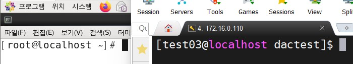

<br>

디렉터리 생성 후 소유권(소유자 : 소유그룹) test03 로 변경


<br>

test02 -> 파일 2개 만들기


<br>

test04 사용자에게 소유권을 넘겨주면서 퍼미션을 읽기만 가능 하게 할수 있는지 확인

root -> test04에 소유권 부여


<br>

test0x_file 소유권 확인

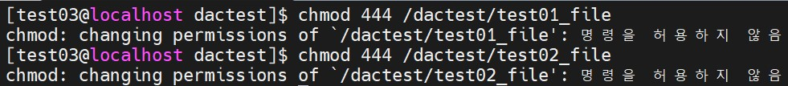

test03에서 파일을 만들었지만 root에서 파일에 대한 소유권을 test04로 변경했기 때문에 퍼미션 변경이 안되고 있습니다.

<br>

<br>

<br>

##### 공유폴더를 이용한 신분기반 접근 제어 정책 테스트

window 2003을 이용 해서 해보겠습니다.

공유폴더 2개 생성

 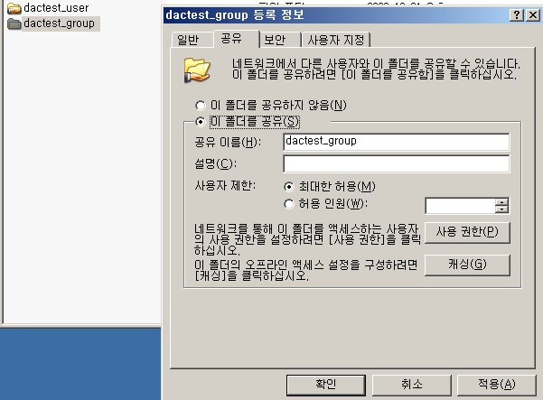

<br>

lusrmgr.msc

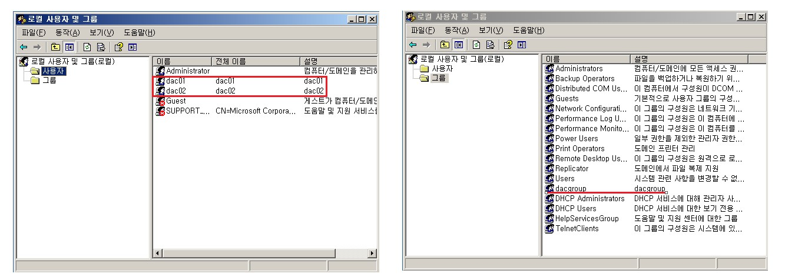

사용자 2개와 그룹 1개를 추가해 줍니다.

<br>

개인 기반 접근 정책(IBP, Individual-Based Policy) 변경

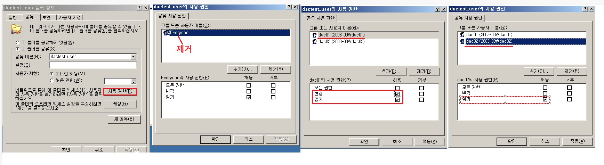

dactest_user 파일에 사용 권한을 사진처럼 변경해 주시면 됩니다.

<br>

xp로 접속해서 dac01 , dac02 차이 확인해 보기

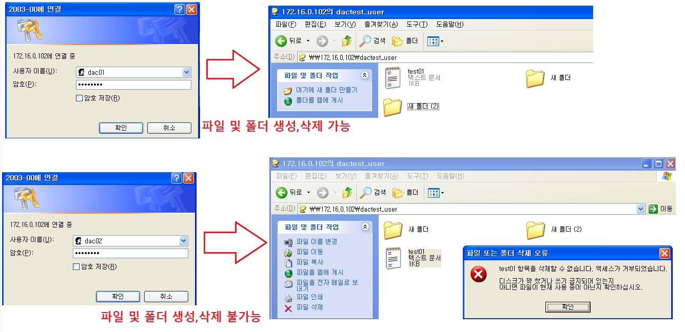

<br>

dacgroup에 dac01 추가

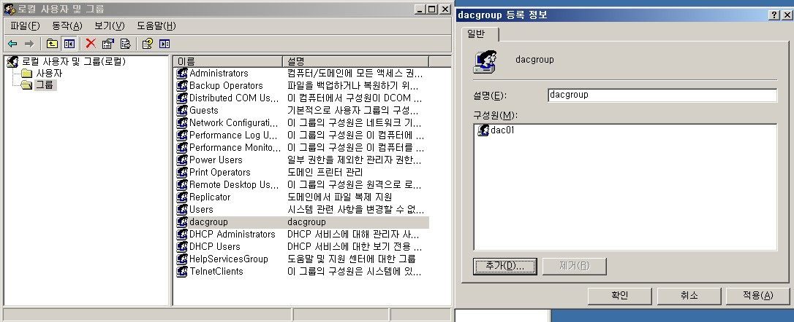

<br>

그룹 기반 접근 정책(GBP, Group-Based Policy)

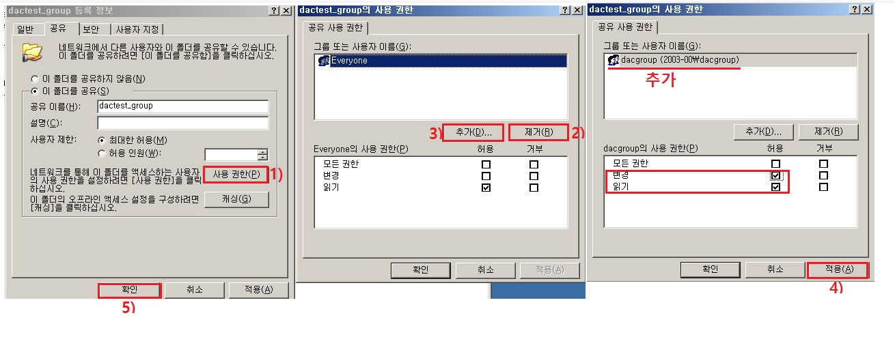

dactest_group 파일의 사용권한을 변경해 주시면 됩니다.

<br>

xp로 접속해서 dac01 , dac02 차이 확인해 보기

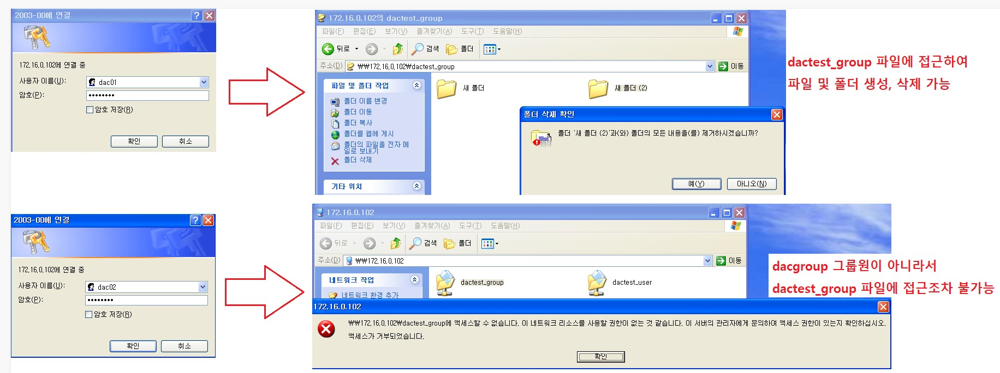

<br>

##### 강제적 접근 통제

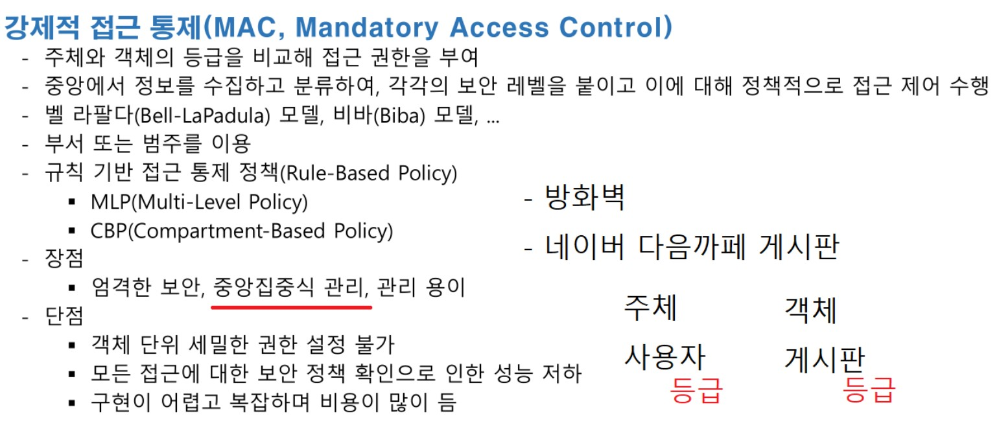

<br>

벨라파 듈라 모델

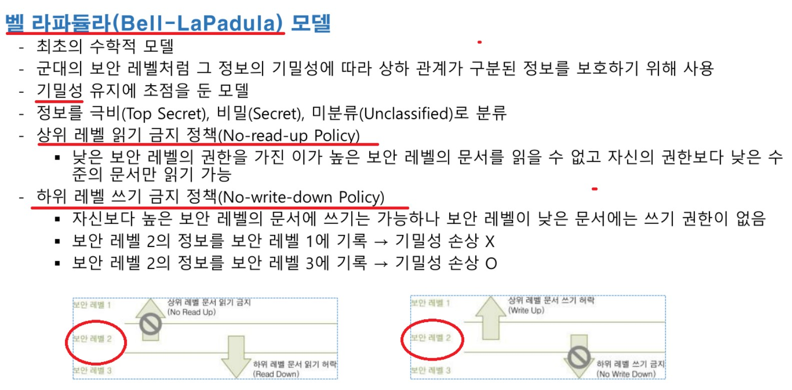

<br>

비바 모델

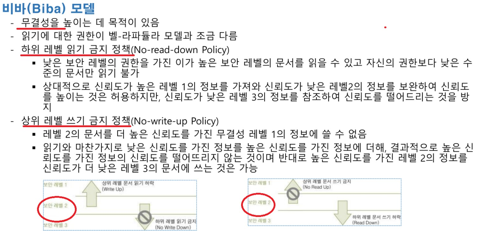

<br>

<br>

<br>

##### SELINUX

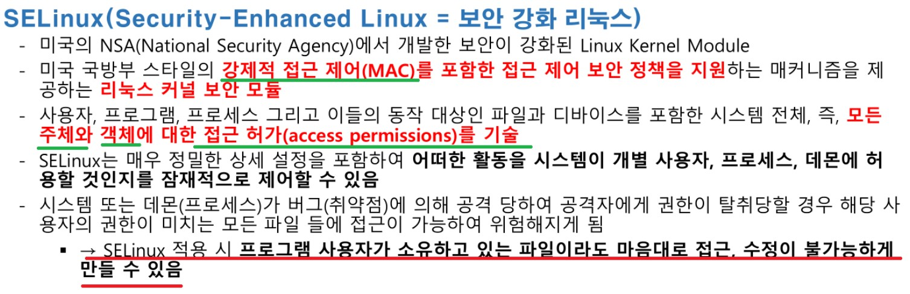

<br>

특징

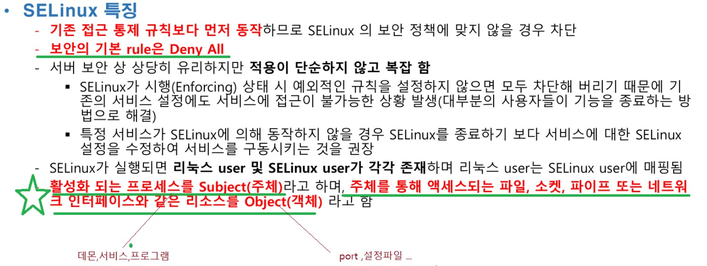

<br>

SELINUX

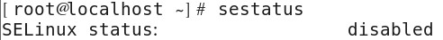

SELINUX를 활성해 해보겠습니다.

```
vim /etc/sysconfig/selinux

# This file controls the state of SELinux on the system.
# SELINUX= can take one of these three values:
#     enforcing - SELinux security policy is enforced.
#     permissive - SELinux prints warnings instead of enforcing.
#     disabled - No SELinux policy is loaded.
# SELINUX=disabled       << 주석 처리
SELINUX=enforcing        << 내용 추가
# SELINUXTYPE= can take one of these two values:
#     targeted - Targeted processes are protected,
#     mls - Multi Level Security protection.
SELINUXTYPE=targeted

내용 추가하고 나서 재부팅
```

<br>

SELINUX 활성화 확인

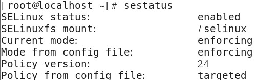

<br>

변경 시 꼭 재시작 안하더라도 임시로 변경은 가능

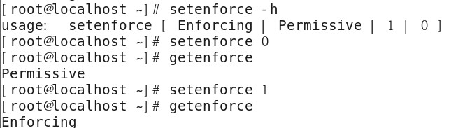

변경은 가능하나 재시작후 기본값으로 돌아옵니다.

<br>

SELINUX 관련 패키지 설치

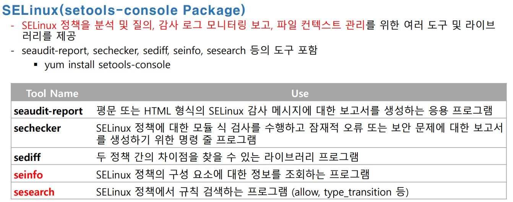

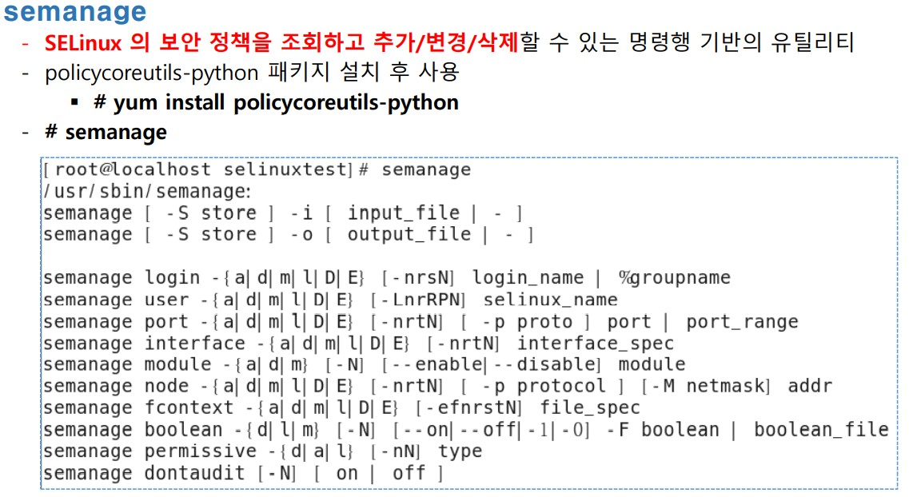

```
yum -y install policycoreutils-python 
yum -y install setools-console         패키지 2개 설치
```

<br>

디렉터리, 파일 생성

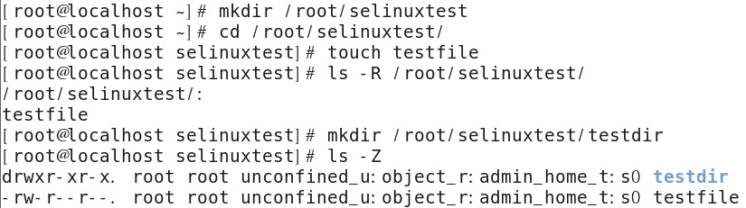

<br>

httpd 확인

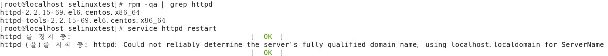

httpd가 설치되어 있는지 확인하고 설치가 되어있지 않으면 yum -y install httpd 하셔서 설치 해주시면 됩니다.

<br>

 Security Context 형식

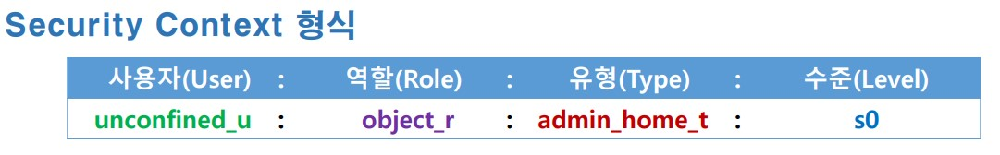

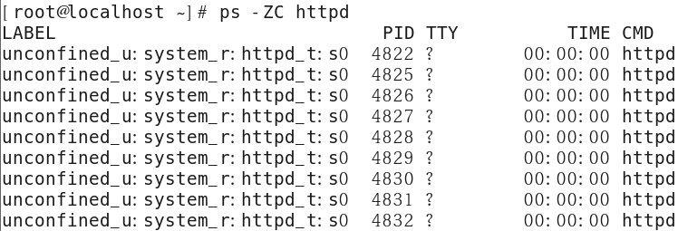

<br>

사용자(user)

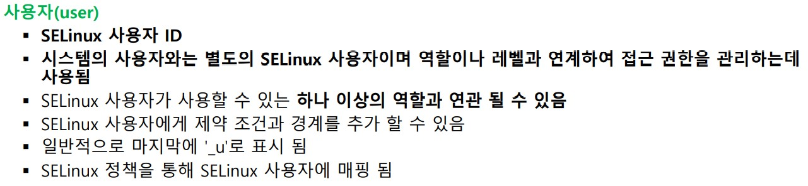

```
[root@localhost selinuxtest]# seinfo -u

Users: 9
   sysadm_u
   system_u
   xguest_u
   root
   guest_u
   staff_u
   user_u
   unconfined_u
   git_shell_u

시스템 계정과  SELinux 사용자가 어떻게 연결되어 있는지 조회 
[root@localhost selinuxtest]# semanage login -l

로그인 이름                    SELinux 사용자               MLS/MCS 범위

__default__               unconfined_u              s0-s0:c0.c1023
root                      unconfined_u              s0-s0:c0.c1023
system_u                  system_u                  s0-s0:c0.c1023
```

<br>

역할(Role)

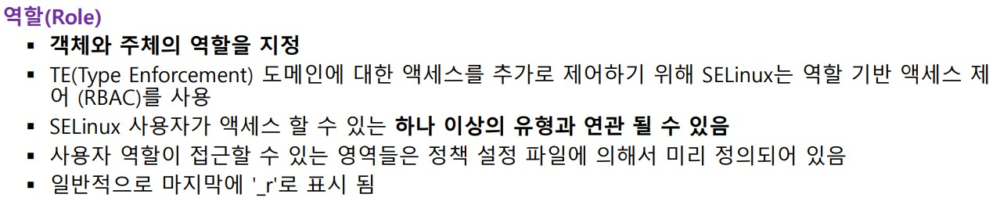

```
[root@localhost selinuxtest]# seinfo -r

Roles: 12
   guest_r
   staff_r
   user_r
   git_shell_r
   logadm_r
   object_r
   sysadm_r
   system_r
   webadm_r
   xguest_r
   nx_server_r
   unconfined_r
   
각 SELINUX user 에 연결된 role 조회
[root@localhost selinuxtest]# seinfo -uunconfined_u -x
   unconfined_u
      default level: s0
      range: s0 - s0:c0.c1023
      roles:
         object_r
         system_r
         unconfined_r
```

<br>

 유형(Type or Domain)

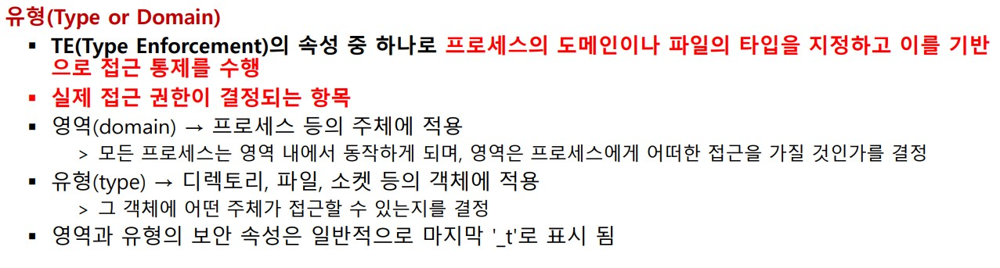


<br>