# 접근 통제 모델

##### 접근 통제


<br>

##### 임의적 접근 통제


<br>

##### 소유권, 퍼미션 개념

centOS_6에 root사용자  mobaxterm에 test03을 띄워놓고 시작 하겠습니다.


<br>

디렉터리 생성 후 소유권(소유자 : 소유그룹) test03 로 변경


<br>

test02 -> 파일 2개 만들기


<br>

test04 사용자에게 소유권을 넘겨주면서 퍼미션을 읽기만 가능 하게 할수 있는지 확인

root -> test04에 소유권 부여


<br>

test0x_file 소유권 확인


test03에서 파일을 만들었지만 root에서 파일에 대한 소유권을 test04로 변경했기 때문에 퍼미션 변경이 안되고 있습니다.

<br>

<br>

<br>

##### 공유폴더를 이용한 신분기반 접근 제어 정책 테스트

window 2003을 이용 해서 해보겠습니다.

공유폴더 2개 생성

 

<br>

lusrmgr.msc


사용자 2개와 그룹 1개를 추가해 줍니다.

<br>

개인 기반 접근 정책(IBP, Individual-Based Policy) 변경


dactest_user 파일에 사용 권한을 사진처럼 변경해 주시면 됩니다.

<br>

xp로 접속해서 dac01 , dac02 차이 확인해 보기


<br>

dacgroup에 dac01 추가


<br>

그룹 기반 접근 정책(GBP, Group-Based Policy)


dactest_group 파일의 사용권한을 변경해 주시면 됩니다.

<br>

xp로 접속해서 dac01 , dac02 차이 확인해 보기


<br>

##### 강제적 접근 통제


<br>

벨라파 듈라 모델


<br>

비바 모델


<br>

<br>

<br>

##### SELINUX


<br>

특징


<br>

SELINUX


SELINUX를 활성해 해보겠습니다.

```
vim /etc/sysconfig/selinux

# This file controls the state of SELinux on the system.
# SELINUX= can take one of these three values:
#     enforcing - SELinux security policy is enforced.
#     permissive - SELinux prints warnings instead of enforcing.
#     disabled - No SELinux policy is loaded.
# SELINUX=disabled       << 주석 처리
SELINUX=enforcing        << 내용 추가
# SELINUXTYPE= can take one of these two values:
#     targeted - Targeted processes are protected,
#     mls - Multi Level Security protection.
SELINUXTYPE=targeted

내용 추가하고 나서 재부팅
```

<br>

SELINUX 활성화 확인


<br>

변경 시 꼭 재시작 안하더라도 임시로 변경은 가능


변경은 가능하나 재시작후 기본값으로 돌아옵니다.

<br>

SELINUX 관련 패키지 설치


```
yum -y install policycoreutils-python 
yum -y install setools-console         패키지 2개 설치
```

<br>

디렉터리, 파일 생성


<br>

httpd 확인


httpd가 설치되어 있는지 확인하고 설치가 되어있지 않으면 yum -y install httpd 하셔서 설치 해주시면 됩니다.

<br>

 Security Context 형식


<br>

사용자(user)


```
[root@localhost selinuxtest]# seinfo -u

Users: 9
   sysadm_u
   system_u
   xguest_u
   root
   guest_u
   staff_u
   user_u
   unconfined_u
   git_shell_u

시스템 계정과  SELinux 사용자가 어떻게 연결되어 있는지 조회 
[root@localhost selinuxtest]# semanage login -l

로그인 이름                    SELinux 사용자               MLS/MCS 범위

__default__               unconfined_u              s0-s0:c0.c1023
root                      unconfined_u              s0-s0:c0.c1023
system_u                  system_u                  s0-s0:c0.c1023
```

<br>

역할(Role)


```
[root@localhost selinuxtest]# seinfo -r

Roles: 12
   guest_r
   staff_r
   user_r
   git_shell_r
   logadm_r
   object_r
   sysadm_r
   system_r
   webadm_r
   xguest_r
   nx_server_r
   unconfined_r
   
각 SELINUX user 에 연결된 role 조회
[root@localhost selinuxtest]# seinfo -uunconfined_u -x
   unconfined_u
      default level: s0
      range: s0 - s0:c0.c1023
      roles:
         object_r
         system_r
         unconfined_r
```

<br>

 유형(Type or Domain)


```
타입과 도메인의 목록 확인 
[root@localhost selinuxtest]# seinfo -t

Types: 3920
   bluetooth_conf_t
   cmirrord_exec_t
   foghorn_exec_t
   jacorb_port_t
   sosreport_t
   etc_runtime_t
   fenced_tmp_t
   florence_port_t
   git_session_t
   glance_port_t
~~~~~ 

SELinux Role 별 Type 조회
[root@localhost selinuxtest]# seinfo -r -x

Roles: 12
   guest_r
      Dominated Roles:
         guest_r
      Types:
         git_user_content_t
         virt_content_t
         httpd_user_htaccess_t
~~~~~ 
```

<br>

 수준(Level)

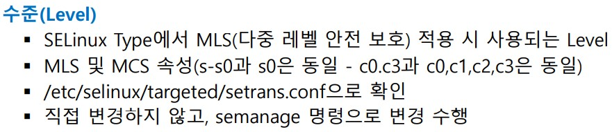

```

```

<br>

##### 파일제어

웹서버 동작 여부 확인

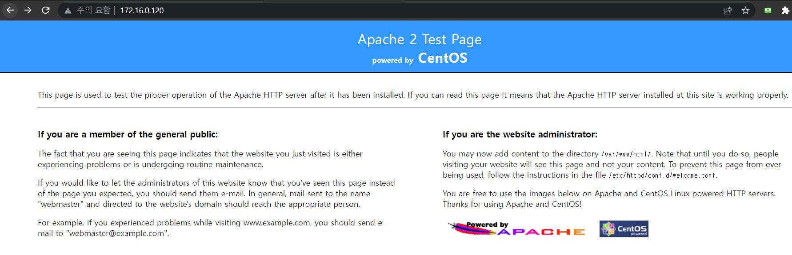

<br>

웹서버에 파일 추가후 다시 확인

```
[root@localhost selinuxtest]# echo SELinux Test > /var/www/html/selinux.html
```

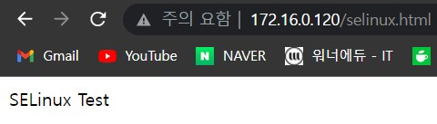

<br>

새로 추가된 파일에 대한 보안 컨텍스트를 확인

```
[root@localhost selinuxtest]# ls -Z /var/www/html/selinux.html 
-rw-r--r--. root root unconfined_u:object_r:httpd_sys_content_t:s0 /var/www/html/selinux.html

상위 디렉터리에서 상속
[root@localhost selinuxtest]# ls -Z /var/www/html
-rw-r--r--. root root unconfined_u:object_r:httpd_sys_content_t:s0 selinux.html
```

<br>

주체가 객체에 어떻게 접근하고 있는지 확인

```
프로세스의 정책 확인

[root@localhost selinuxtest]# ps -ZC httpd
LABEL                              PID TTY          TIME CMD
unconfined_u:system_r:httpd_t:s0  4822 ?        00:00:00 httpd
unconfined_u:system_r:httpd_t:s0  4825 ?        00:00:00 httpd
unconfined_u:system_r:httpd_t:s0  4826 ?        00:00:00 httpd
unconfined_u:system_r:httpd_t:s0  4827 ?        00:00:00 httpd
unconfined_u:system_r:httpd_t:s0  4828 ?        00:00:00 httpd
unconfined_u:system_r:httpd_t:s0  4829 ?        00:00:00 httpd
unconfined_u:system_r:httpd_t:s0  4830 ?        00:00:00 httpd
unconfined_u:system_r:httpd_t:s0  4831 ?        00:00:00 httpd
unconfined_u:system_r:httpd_t:s0  4832 ?        00:00:00 httpd

```bash
프로세스의 정책 확인 
root@localhost selinuxtest]# ps -ZC httpd
LABEL                              PID TTY          TIME CMD
unconfined_u:system_r:**httpd_t**:s0  3270 ?        00:00:00 httpd

프로세스가 파일에 어떤 허용정책 있는지 확인

[root@localhost selinuxtest]# sesearch -A -t httpd_sys_content_t -s httpd_t -d
Found 7 semantic av rules:
   allow httpd_t httpd_sys_content_t : file { ioctl read getattr lock open } ; 
   allow httpd_t httpd_sys_content_t : dir { ioctl read getattr lock search open } ; 
   allow httpd_t httpd_sys_content_t : lnk_file { read getattr } ; 
   allow httpd_t httpd_sys_content_t : file { ioctl read getattr lock open } ; 
   allow httpd_t httpd_sys_content_t : dir { ioctl read getattr lock search open } ; 
   allow httpd_t httpd_sys_content_t : dir { ioctl read write getattr lock add_name remove_name search open } ; 
   allow httpd_t httpd_sys_content_t : lnk_file { read getattr } ;
```

<br>

기존 정책 대신 비어있는 정책 포함 후 확인

```
/var/www/html/selinux.html 에 적용된  httpd_sys_content_t  를 삭제 -> 다른 비어있는 정책과 연결 

[root@localhost selinuxtest]# chcon -t admin_home_t /var/www/html/selinuxt.html
[root@localhost selinuxtest]# ls -Z /var/www/html/selinux.html
-rw-r--r--. root root unconfined_u:object_r:admin_home_t:s0 /var/www/html/selinux.html

연결된 정책에 항목이 없음 (비어있음) 
# sesearch -A -t admin_home_t -s httpd_t -d
```

다시 브라우저로 테스트 


<br>

원상 복구

```
복구시에 이렇게 복구된다 
[root@localhost selinuxtest]# matchpathcon /var/www/html/selinux.html
/var/www/html/selinux.html       system_u:object_r:httpd_sys_content_t:s0

실제 보안 컨텍스트 복구 시도 
[root@localhost selinuxtest]# restorecon /var/www/html/selinux.html
[root@localhost selinuxtest]# ls -Z /var/www/html/selinux.html 
-rw-r--r--. root root unconfined_u:object_r:httpd_sys_content_t:s0 /var/www/html/selinux.html
```

브라우저 확인

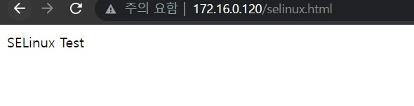

<br>

<br>

<br>

##### 포트 제어

httpd 기본포트

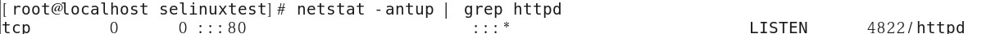

```
[root@localhost selinuxtest]#  grep Listen /etc/httpd/conf/httpd.conf
# Listen: Allows you to bind Apache to specific IP addresses and/or
# Change this to Listen on specific IP addresses as shown below to 
#Listen 12.34.56.78:80
Listen 80
이렇게도 확인 가능 합니다.
```

<br>

포트번호 TCP 8888 로 변경하여 서비스 테스트

```
vim /etc/httpd/conf/httpd.conf

135 #Listen 12.34.56.78:80
 136 #Listen 80                   주석 처리
 137 Listen 8888                  내용 추가
 
service httpd restart        httpd 재시작

SELINUX가 실행중 이면 데몬이 재시작 되지 않습니다.
SELINUX 임시 해제
[root@localhost selinuxtest]# setenforce 0
[root@localhost selinuxtest]# getenforce
Permissive

SELINUX 재시작
[root@localhost selinuxtest]# setenforce 1
[root@localhost selinuxtest]# getenforce
Enforcing
```

브라우저 확인

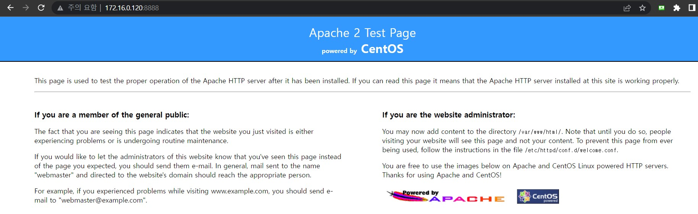

<br>

특정 포트에 대한 정책 확인

```
[root@localhost selinuxtest]# seinfo --portcon=80
	portcon tcp 80 system_u:object_r:http_port_t:s0
	portcon tcp 1-511 system_u:object_r:reserved_port_t:s0
	portcon udp 1-511 system_u:object_r:reserved_port_t:s0
```

<br>

특정 파일에서 사용 가능한 포트 번호 확인

```
[root@localhost selinuxtest]# semanage port -l | grep http_port_t
http_port_t                    tcp      80, 81, 443, 488, 8008, 8009, 8443, 9000
pegasus_http_port_t            tcp      5988
```

<br>

사용 가능한 다른 포트 확인

```
위에서 확인했던 사용 가능한 9000번으로 변경

vim /etc/httpd/conf/httpd.conf

Listen 12.34.56.78:80
#Listen 80
Listen 9000             << 9000으로 변경

service httpd restart
재시작하면 정상적으로 작동하는 것이 확인 가능 합니다.
```

브라우저 확인

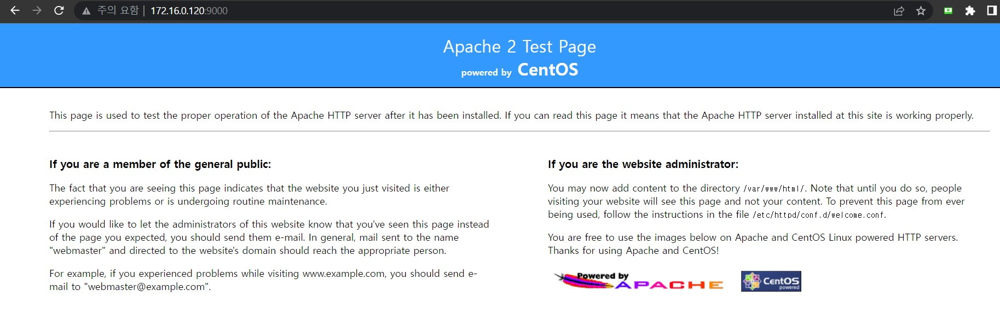

<br>

객체: 포트(=socket)   에 대한 주체(프로세스)의 접근 정책

```
[root@localhost selinuxtest]# sesearch -A -t http_port_t -s httpd_t -d
Found 3 semantic av rules:
   allow httpd_t http_port_t : tcp_socket { name_bind name_connect } ; 
   allow httpd_t http_port_t : udp_socket name_bind ; 
   allow httpd_t http_port_t : tcp_socket name_connect ;
   
[root@localhost selinuxtest]# sesearch -A -t http_cache_port_t -s httpd_t -d
Found 2 semantic av rules:
   allow httpd_t http_cache_port_t : tcp_socket name_bind ;
   allow httpd_t http_cache_port_t : tcp_socket name_connect ;

이름이 없음
[root@localhost selinuxtest]# sesearch -A -t pegasus_http__port_t -s httpd_t -d
ERROR: could not find datum for type pegasus_http__port_t

연결된 포트에 대한 정책 X 
[root@localhost selinuxtest]# sesearch -A -t pegasus_http_port_t -s httpd_t -d

[root@localhost selinuxtest]# sesearch -A -t pegasus_https_port_t -s httpd_t -d
```

<br>

```
TCP 8888 변경하여 서비스 재시작 오류 확인

http_port_t 에 허용 포트 추가 

[root@localhost selinuxtest]# semanage port -l | grep http_port_t
http_port_t                    tcp      80, 81, 443, 488, 8008, 8009, 8443, 9000
pegasus_http_port_t            tcp      5988

[root@localhost selinuxtest]# semanage port -a -t http_port_t -p tcp 8888


추가 확인 
[root@localhost selinuxtest]# semanage port -l | grep http_port_t
http_port_t                    tcp      8888, 80, 81, 443, 488, 8008, 8009, 8443, 9000
pegasus_http_port_t            tcp      5988

service httpd restart

이제 SELINUX를 임시 해제 하지 않아도 재시작이 원활하게 가능 합니다.
```

<br>

<br>

<br>

##### SELINUX LOGGING

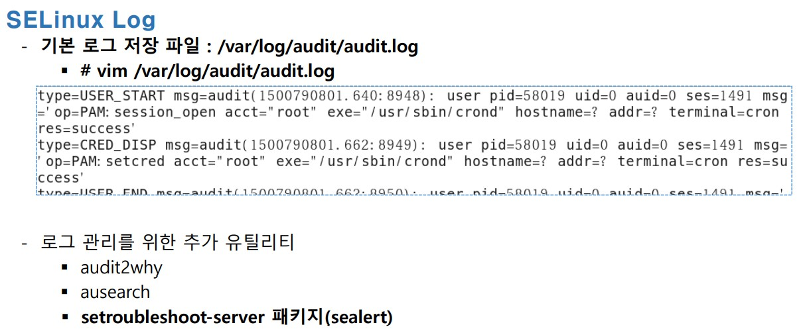

패키지 설치

```
yum -y install setroubleshoot-server
service messagebus restart   <<  관련 서비스 시작
```

<br>

로그 파일 위치

```
vim /var/log/audit/audit.log
```

<br>

테스트 를 위한 에러 발생을 유도

터미널 2개 준비

터미널 1 -> tail 

```
tail -f /var/log/audit/audit.log
```

<br>

터미널 2 - > var/www/html/setest.html 에 적용된  httpd_sys_content_t  를 삭제 -> 다른 비어있는 정책과 연결

```
[root@localhost 바탕화면]# chcon -t admin_home_t /var/www/html/selinux.html 

[root@localhost 바탕화면]# ls -Z /var/www/html/selinux.html
-rw-r--r--. root root unconfined_u:object_r:admin_home_t:s0 /var/www/html/selinux.html
```

<br>

host -> 브라우저 확인

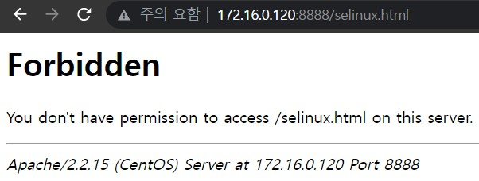

```
터미널1) SELINUX  관련 로그가 너무 복잡

[root@localhost ~]# tail -f /var/log/audit/audit.log
type=CRYPTO_KEY_USER msg=audit(1666606545.281:39): user pid=2711 uid=0 auid=0 ses=1 subj=system_u:system_r:sshd_t:s0-s0:c0.c1023 msg='op=destroy kind=server fp=e0:74:e7:55:1a:c2:c4:0f:9b:ab:58:12:df:76:74:17 direction=? spid=2711 suid=0  exe="/usr/sbin/sshd" hostname=? addr=200.200.200.240 terminal=pts/0 res=success'
type=CRED_REFR msg=audit(1666606545.281:40): user pid=2711 uid=0 auid=0 ses=1 subj=system_u:system_r:sshd_t:s0-s0:c0.c1023 msg='op=PAM:setcred acct="root" exe="/usr/sbin/sshd" hostname=200.200.200.240 addr=200.200.200.240 terminal=ssh res=success'
type=AVC msg=audit(1666606662.418:41): avc:  denied  { getattr } for  pid=2756 comm="httpd" path="/var/www/html/setest.html" dev=dm-0 ino=1049063 scontext=unconfined_u:system_r:httpd_t:s0 tcontext=unconfined_u:object_r:admin_home_t:s0 tclass=file
type=SYSCALL msg=audit(1666606662.418:41): arch=c000003e syscall=4 success=no exit=-13 a0=55b7c97d4f98 a1=7fff4ab342a0 a2=7fff4ab342a0 a3=2000 items=0 ppid=2748 pid=2756 auid=0 uid=48 gid=48 euid=48 suid=48 fsuid=48 egid=48 sgid=48 fsgid=48 tty=(none) ses=1 comm="httpd" exe="/usr/sbin/httpd" subj=unconfined_u:system_r:httpd_t:s0 key=(null)
type=AVC msg=audit(1666606662.418:42): avc:  denied  { getattr } for  pid=2756 comm="httpd" path="/var/www/html/selinux.html" dev=dm-0 ino=1049063 scontext=unconfined_u:system_r:httpd_t:s0 tcontext=unconfined_u:object_r:admin_home_t:s0 tclass=file
type=SYSCALL msg=audit(1666606662.418:42): arch=c000003e syscall=6 success=no exit=-13 a0=55b7c97d5068 a1=7fff4ab342a0 a2=7fff4ab342a0 a3=1 items=0 ppid=2748 pid=2756 auid=0 uid=48 gid=48 euid=48 suid=48 fsuid=48 egid=48 sgid=48 fsgid=48 tty=(none) ses=1 comm="httpd" exe="/usr/sbin/httpd" subj=unconfined_u:system_r:httpd_t:s0 key=(null)
type=AVC msg=audit(1666606696.353:43): avc:  denied  { getattr } for  pid=2757 comm="httpd" path="/var/www/html/selinux.html" dev=dm-0 ino=1049063 scontext=unconfined_u:system_r:httpd_t:s0 tcontext=unconfined_u:object_r:admin_home_t:s0 tclass=file
type=SYSCALL msg=audit(1666606696.353:43): arch=c000003e syscall=4 success=no exit=-13 a0=55b7c97d4f98 a1=7fff4ab342a0 a2=7fff4ab342a0 a3=2000 items=0 ppid=2748 pid=2757 auid=0 uid=48 gid=48 euid=48 suid=48 fsuid=48 egid=48 sgid=48 fsgid=48 tty=(none) ses=1 comm="httpd" exe="/usr/sbin/httpd" subj=unconfined_u:system_r:httpd_t:s0 key=(null)
type=AVC msg=audit(1666606696.353:44): avc:  denied  { getattr } for  pid=2757 comm="httpd" path="/var/www/html/selinux.html" dev=dm-0 ino=1049063 scontext=unconfined_u:system_r:httpd_t:s0 tcontext=unconfined_u:object_r:admin_home_t:s0 tclass=file
type=SYSCALL msg=audit(1666606696.353:44): arch=c000003e syscall=6 success=no exit=-13 a0=55b7c97d5068 a1=7fff4ab342a0 a2=7fff4ab342a0 a3=1 items=0 ppid=2748 pid=2757 auid=0 uid=48 gid=48 euid=48 suid=48 fsuid=48 egid=48 sgid=48 fsgid=48 tty=(none) ses=1 comm="httpd" exe="/usr/sbin/httpd" subj=unconfined_u:system_r:httpd_t:s0 key

터미널2)

sealert 찾기
# cat /var/log/messages
Oct 24 19:17:47 localhost setroubleshoot: SELinux is preventing /usr/sbin/httpd from getattr access on the 
file /var/www/html/selinux.html. For complete SELinux messages. run **sealert -l 125156fd-b8d1-4db2-8f76-649057bccba2**

Oct 24 19:17:47 localhost setroubleshoot: SELinux is preventing /usr/sbin/httpd from getattr access on the 
file /var/www/html/setest.html. For complete SELinux messages. run **sealert -l 125156fd-b8d1-4db2-8f76-649057bccba2**
html. For complete SELinux messages. run sealert -l 125156fd-b8d1-4db2-8f76-649057bccba2

[root@localhost ~]# sealert -l 125156fd-b8d1-4db2-8f76-649057bccba2
SELinux is preventing /usr/sbin/httpd from getattr access on the 파일 /var/www/html/setest.html.

*****  플러그인 restorecon (99.5 confidence) 제안  *********************************

If 레이블을 수정하고자 합니다.
**/var/www/html/selinux.html 디폴트 레이블은 httpd_sys_content_t이 되어야 합니다.**
Then restorecon을 실행할 수 있습니다.
Do
# /sbin/restorecon -v /var/www/html/selinux.html

*****  플러그인 catchall (1.49 confidence) 제안  ***********************************

If httpd는 디폴트로 selinux.html file에서 getattr 액세스를 허용해야 합니다.
Then 이 버그를 보고해야 합니다.
이러한 액세스를 허용하기 위해 로컬 정채 모듈을 생성할 수 있습니다.
Do
지금 이 액세스를 허용하려면 다음을 실행합니다:
# grep httpd /var/log/audit/audit.log | audit2allow -M mypol
# semodule -i mypol.pp

추가 정보:
소스 문맥                         unconfined_u:system_r:httpd_t:s0
대상 문맥                         unconfined_u:object_r:**admin_home_t**:s0
대상 객체                         /var/www/html/selinux.html [ file ]
소스                            httpd
소스 경로                         /usr/sbin/httpd
포트                            <알려지지 않음>
호스트                           localhost.localdomain
소스 RPM 패키지                    httpd-2.2.15-69.el6.centos.x86_64
대상 RPM 패키지                    file /var/www/html/selinux.html is not owned by any package
정책 RPM                        selinux-policy-3.7.19-312.el6.noarch
Selinux 활성화                   True
정책 유형                         targeted
강제 모드                         Enforcing
호스트명                          localhost.localdomain
플랫폼                           Linux localhost.localdomain
                              2.6.32-754.35.1.el6.x86_64 #1 SMP Sat Nov 7
                              12:42:14 UTC 2020 x86_64 x86_64
통지 카운트                        4
초기 화면                         Mon Oct 24 19:17:42 2022
마지막 화면                        Mon Oct 24 19:20:46 2022
로컬 ID                         125156fd-b8d1-4db2-8f76-649057bccba2

원 감사 메세지
type=AVC msg=audit(1666606846.406:52): avc:  denied  { getattr } 
for  pid=2754 comm="httpd" path="/var/www/html/selinux.html" dev=dm-0 ino=1049063 scontext=unconfined_u:system_r:httpd_t:s0 
tcontext=unconfined_u:object_r:admin_home_t:s0 tclass=file

type=SYSCALL msg=audit(1666606846.406:52): arch=x86_64 syscall=lstat success=no exit=EACCES a0=55b7c97d50d8 a1=7fff4ab342a0 a2=7fff4ab342a0 
a3=1 items=0 ppid=2748 pid=2754 auid=0 uid=48 gid=48 euid=48 suid=48 fsuid=48 egid=48 sgid=48 fsgid=48 tty=(none) ses=1 
comm=httpd exe=/usr/sbin/httpd subj=unconfined_u:system_r:httpd_t:s0 key=(null)

Hash: httpd,httpd_t,admin_home_t,file,getattr

audit2allow

#============= httpd_t ==============
allow httpd_t admin_home_t:file getattr;

audit2allow -R

#============= httpd_t ==============
allow httpd_t admin_home_t:file getattr;
```

<br>

<br>

<br>

##### SELNUX Boolean

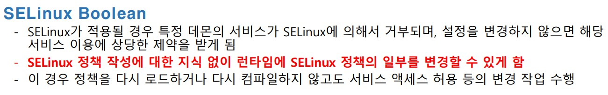

<br>


```
bool값 확인 
[root@localhost ~]# getsebool -a
abrt_anon_write --> off
abrt_handle_event --> off
allow_console_login --> on
allow_cvs_read_shadow --> off
allow_daemons_dump_core --> on
allow_daemons_use_tcp_wrapper --> off
allow_daemons_use_tty --> on
allow_domain_fd_use --> on
allow_execheap --> off
allow_execmem --> on
allow_execmod --> on
allow_execstack --> on
allow_ftpd_anon_write --> off
allow_ftpd_full_access --> off
allow_ftpd_use_cifs --> off
allow_ftpd_use_nfs --> off
allow_gssd_read_tmp --> on
~

기능 설명 
[root@localhost ~]# semanage boolean -l
SELinux
       bool                     상태     디폴트    설명

ftp_home_dir                   (비활성  , 비활성 )  Allow ftp to read and write files in the user home directories
smartmon_3ware                 (비활성  , 비활성 )  Enable additional permissions needed to support devices on 3ware controllers.
xdm_sysadm_login               (비활성  , 비활성 )  Allow xdm logins as sysadm
xen_use_nfs                    (비활성  , 비활성 )  Allow xen to manage nfs files
mozilla_read_content           (비활성  , 비활성 )  Control mozilla content access
ssh_chroot_rw_homedirs         (비활성  , 비활성 )  Allow ssh with chroot env to read and write files in the user home directories
postgresql_can_rsync           (비활성  , 비활성 )  Allow postgresql to use ssh and rsync for point-in-time recovery
allow_ypbind                   (비활성  , 비활성 )  Allow system to run with NIS

특정 정책 조회
[root@localhost ~]# getsebool httpd_can_sendmail
httpd_can_sendmail --> off

조회된 정책을 켜고 싶으면 on , 1 

[root@localhost ~]# setsebool httpd_can_sendmail true
[root@localhost ~]# getsebool httpd_can_sendmail
httpd_can_sendmail --> on

[root@localhost ~]# setsebool httpd_can_sendmail false
[root@localhost ~]# getsebool httpd_can_sendmail
httpd_can_sendmail --> off

[root@localhost ~]# setsebool httpd_can_sendmail on
[root@localhost ~]# getsebool httpd_can_sendmail
httpd_can_sendmail --> on


[root@localhost ~]# setsebool httpd_can_sendmail off
[root@localhost ~]# getsebool httpd_can_sendmail
httpd_can_sendmail --> off


[root@localhost ~]# setsebool httpd_can_sendmail 1
[root@localhost ~]# getsebool httpd_can_sendmail
httpd_can_sendmail --> on

[root@localhost ~]# setsebool httpd_can_sendmail 0
[root@localhost ~]# getsebool httpd_can_sendmail
httpd_can_sendmail --> off
```

<br>

httpd 프로세스가 php 페이지 이용 메일 보내기 

php 설치

```
yum -y install httpd php
```

<br>

리눅스내 다른 계정으로 매일 보내기 연습 

```
httpd , php 설치 여부를 확인
[root@localhost ~]# rpm -qa httpd
httpd-2.2.15-69.el6.centos.x86_64

[root@localhost ~]# rpm -qa php
php-5.3.3-50.el6_10.x86_64

httpd , php 설치 여부를 확인
[root@localhost ~]# rpm -qa httpd
httpd-2.2.15-69.el6.centos.x86_64
[root@localhost ~]# rpm -qa php
php-5.3.3-50.el6_10.x86_64

테스트 파일을 생성
vim /var/www/html/mail.php

<?php
        $result = mail('root','selinux test','hello');
        if($result)
        {
                echo "메일전송 완료";
        }
        else
        {
                echo "메일전송 실패";
        }

?>

정책확인 후 다시 적용
[root@localhost ~]# getsebool httpd_can_sendmail
httpd_can_sendmail --> off

[root@localhost ~]# setsebool httpd_can_sendmail 1
[root@localhost ~]# getsebool httpd_can_sendmail
httpd_can_sendmail --> on

다시 원상복구
[root@localhost ~]# setsebool httpd_can_sendmail 0
[root@localhost ~]# getsebool httpd_can_sendmail
httpd_can_sendmail --> off

해당 페이지를 열어서 관련 로그를 확인
```

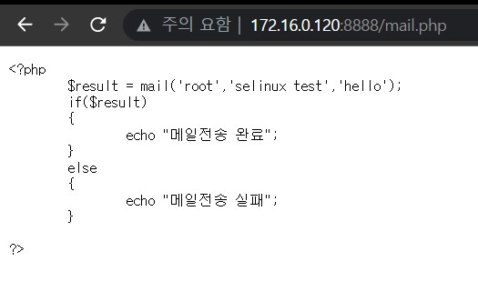

```
httpd 재시작
service httpd restart

다시 페이지 접속시도
```

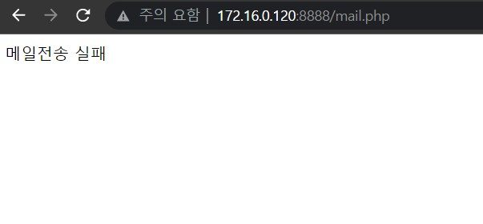

<br>

다시 로그 확인

```
[root@localhost ~]# tail /var/log/messages
Oct 24 19:49:27 localhost setroubleshoot: SELinux is preventing /usr/sbin/sendmail.postfix from using the setrlimit access on a process. For complete SELinux messages. run sealert -l 200d1795-10a3-4fb2-8b3f-c71b90109b46

자세한 SELINUX 정보 확인
[root@localhost 바탕화면]# sealert -l 200d1795-10a3-4fb2-8b3f-c71b90109b46
SELinux is preventing /usr/sbin/sendmail.postfix from using the setrlimit access on a process.

*****  플러그인 httpd_can_sendmail (53.1 confidence) 제안  *************************

If httpd가 메일을 전송하는 것을 허용하고자 합니다 
Then 이를 허용하려면 SELinux를 설정해야 합니다 
Do
setsebool -P httpd_can_sendmail=1

*****  플러그인 catchall_boolean (42.6 confidence) 제안  ***************************

If a을 하고자 합니다 llow httpd daemon to change system limits
Then httpd_setrlimit' 부울을 활성화하여 이에 대해 SELinux에 알립니다. 
Do
setsebool -P httpd_setrlimit 1

*****  플러그인 catchall (5.76 confidence) 제안  ***********************************
```

<br>

다시 SELNUX bool 수정 후 확인

```
[root@localhost ~]# setsebool httpd_can_sendmail=1
[root@localhost ~]# getsebool httpd_can_sendmail
httpd_can_sendmail --> on

해당 페이지 다시 실행
```

 

<br>

