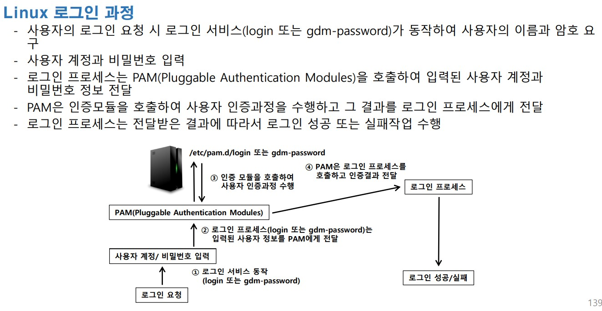
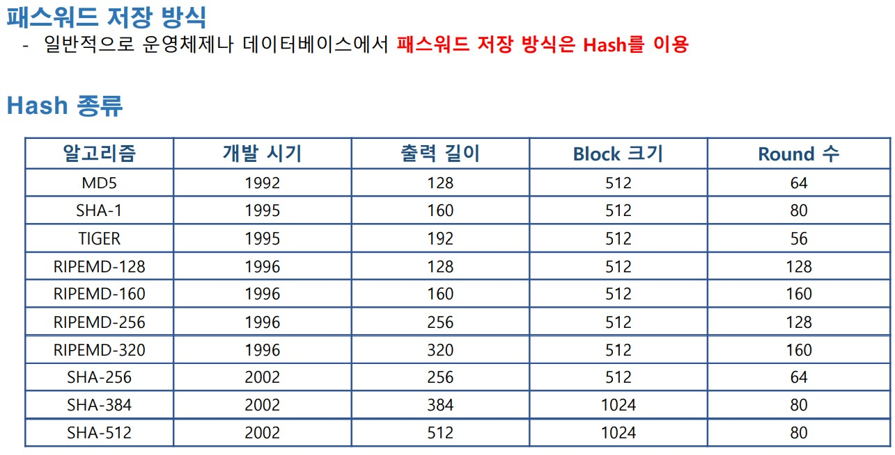
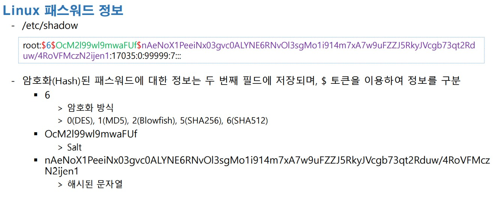
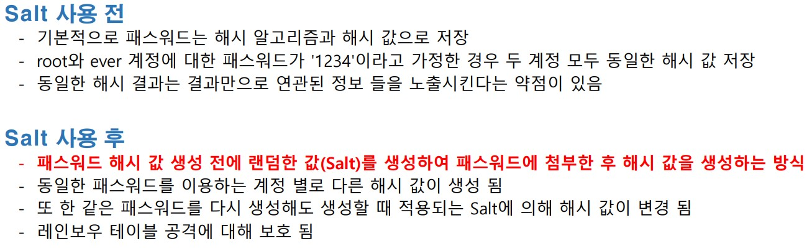

# 시스템 인증 방식









<br>

#####  패스워드 생성하는 프로그램을 실행

환경 설정

```
yum -y install gcc       << 설치
```

<br>

/etc/shadow 에서 다른 사용자의 정보를 가지고 온다 

```
vim /etc/shadow
ktest:
$6
$RUybtCsuJIbQA.Z/
$Ug/9eaaXInjJy7PRJf2KisilLWdT5s5s/Jrx35LVOQGH2coDfGOZNNRScwcGFjeo9Ssq5snWcsqgZFJUum1Ja0:19183:0:99999:7:::
```

<br>

소스 코드 준비

```
vim /root/pass.c

#include <stdio.h>
#include <crypt.h>
int main(){
        char pPass[] = "P@ssw0rd";
        char pHash[] = "$6$RUybtCsuJIbQA.Z/";
        char *pResult;
        pResult = crypt(pPass, pHash);
        printf("%s\n", pResult);
        return 0;
}

```

<br>

컴파일 후 실행 

```
[root@localhost ~]# gcc -o pass pass.c -lcrypt
[root@localhost ~]# ./pass
$6$RUybtCsuJIbQA.Z/$Ug/9eaaXInjJy7PRJf2KisilLWdT5s5s/Jrx35LVOQGH2coDfGOZNNRScwcGFjeo9Ssq5snWcsqgZFJUum1Ja0

/etc/shadow 파일에 있는 정보와 같은지 확인 해보기
```

<br>

