# Web hacking

##### Web service

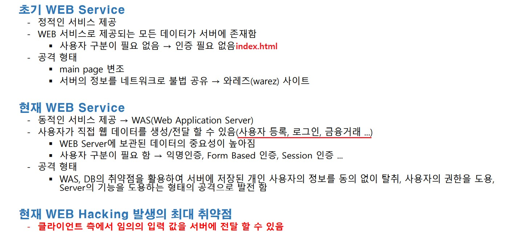

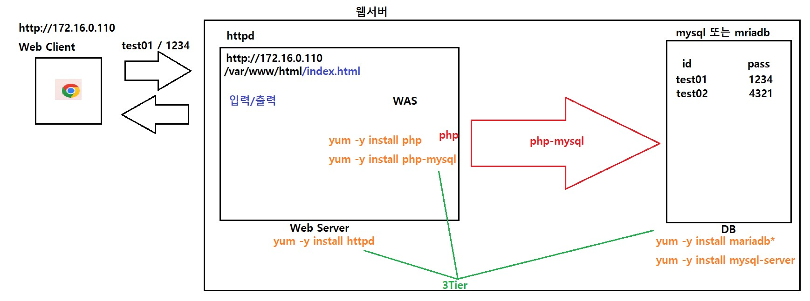

 

##### Web hacking

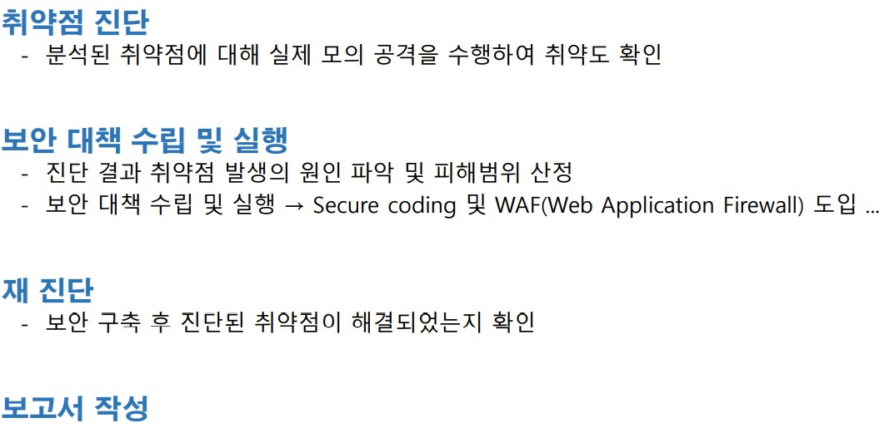

 

구성도

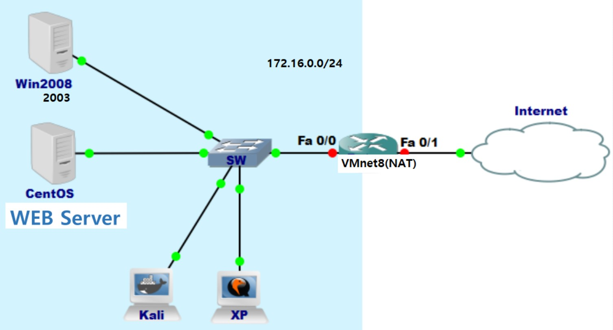

 

##### Web Proxy

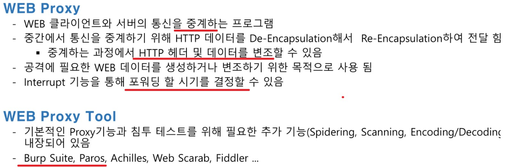

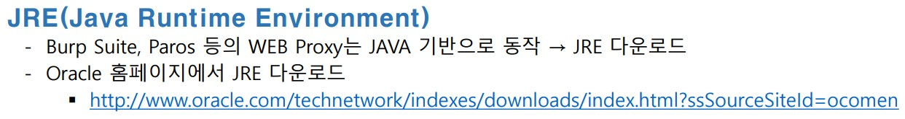

 

##### 인터넷익스플로러를 이용하여 WebProxyTool 테스트

익스플로러에 프록시 설정

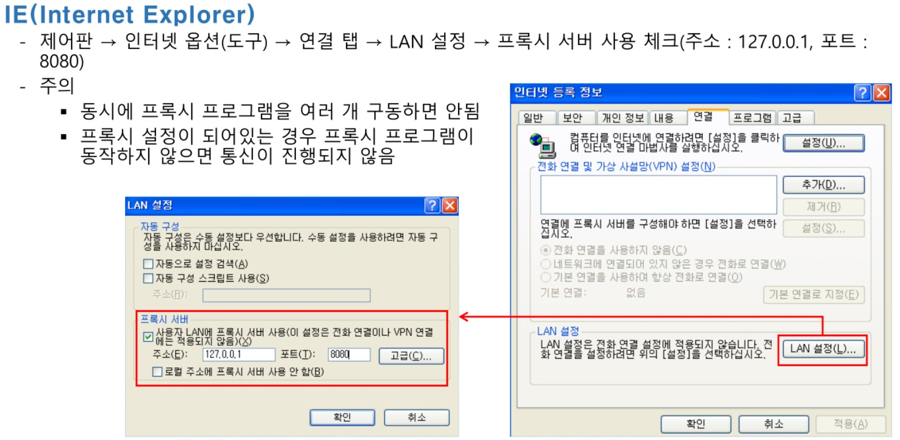

 

xp -> Web Server 접속 시도

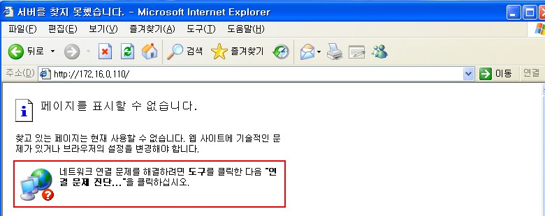

실패 입니다.

 

xp -> pros 실행 후 Web Server 접속 시도

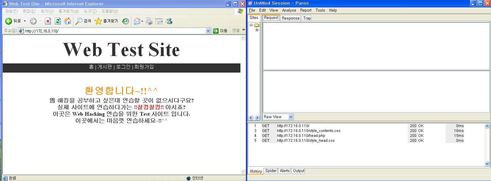

성공 입니다

 

######  파이어폭스 프록시 설정

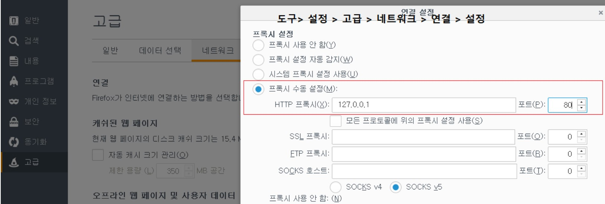

포트는 8080으로 해주시면 됩니다.

 

xp -> Web Server 접속 시도

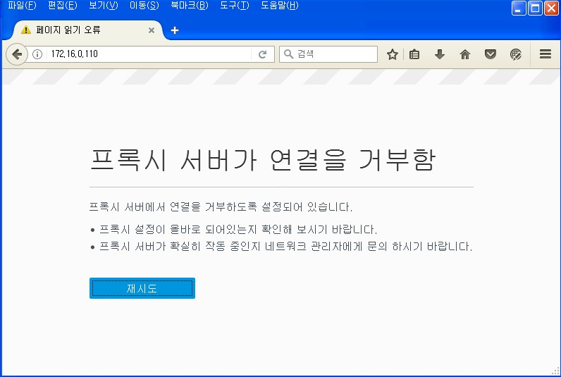

 

xp -> pros 실행 후 Web Server 접속 시도

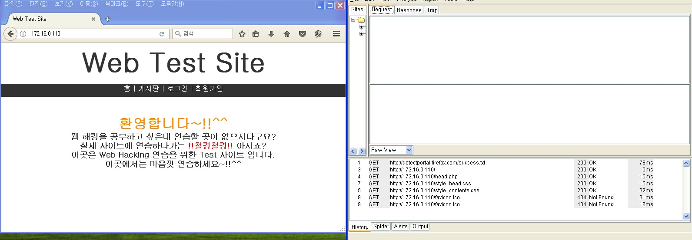

 

 

 

##### 정보 수집

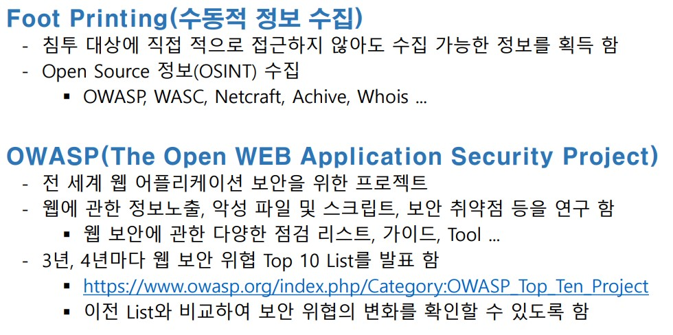

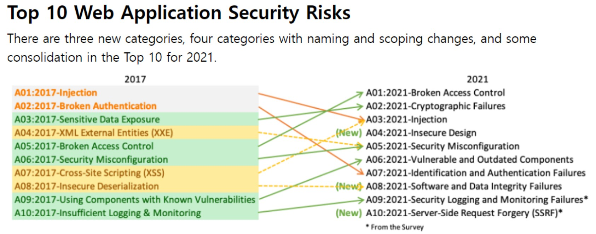

[https://owasp.org/Top10/](https://owasp.org/Top10/)

 

