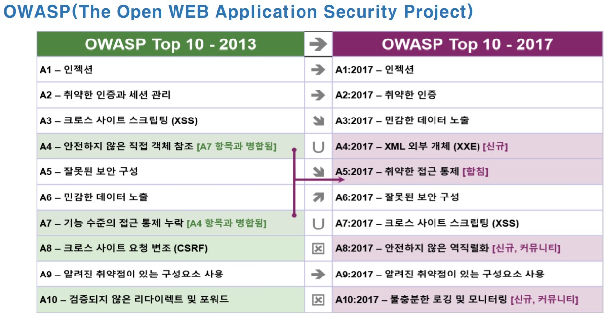

# Web hacking

##### Web service

 

##### Web hacking

 

구성도

 

##### Web Proxy

 

##### 인터넷익스플로러를 이용하여 WebProxyTool 테스트

익스플로러에 프록시 설정

 

xp -> Web Server 접속 시도

실패 입니다.

 

xp -> pros 실행 후 Web Server 접속 시도

성공 입니다

 

######  파이어폭스 프록시 설정

포트는 8080으로 해주시면 됩니다.

 

xp -> Web Server 접속 시도

 

xp -> pros 실행 후 Web Server 접속 시도

 

 

 

##### 정보 수집

[https://owasp.org/Top10/](https://owasp.org/Top10/)

 

