# 애플리케이션 공격 유형

데이터 검증


<br>

ByPassing Client Side Validation


<br>

##### SourceCode 직접 변조 

입력 값 제한 확인


<br>

회원가입페이지 > 페이지 소스 보기 또는 다른 이름으로 저장 


<br>

12글자 이상 넣어보고 회원가입


<br>

추가로 검증하는 부분 확인

```
<link rel="stylesheet" href="test_files/style_contents.css" type="text/css">
		<script>
			function ck(){				
				if(document.mform.user_id.value == "" || document.mform.user_id.value.length < 4 || document.mform.user_id.value.length > 12){
					alert("아이디를 다시 입력하세요.");
					mform.user_id.focus();
					return false;
				}

입력한 아이디가 없거나 또는 4글자 이하이거나 또는 12글자 이상인경우 아이디를 다시 입력하세요를 팝업 

if(document.mform.user_id.value == "" || document.mform.user_id.value.length < 4 || document.mform.user_id.value.length > 15){
```


<br>

다시 시도


```
멤버 가입 관련 페이지 경로 오류 발생

소스코드
<input value="등록" onclick="ck();" class="btn_default btn_gray" type="button">

~
입력값 검증 되면 지정된 페이지로 전송 
document.mform.submit();

form 안의 입력된 내용을 action에 지정된 페이지로 전송 그런데 상대경로!!! 
<form name="mform" method="post" action="member_register_ok.php">

실제로 네트워크에서 접속가능한 경로로 변경 
<form name="mform" method="post" action="http://172.16.0.111/member/member_register_ok.php">
```

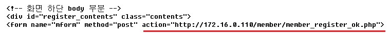

<br>

회원가입 시도

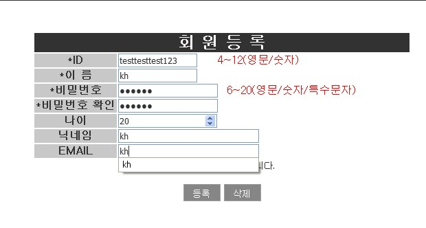

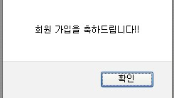

<br>

DB에 접속하여 회원가입 여부 확인

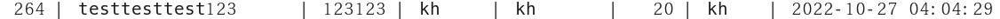

<br>

<br>

<br>

##### Proxy Tool을 이용한 우회

웹브라우저 프록시 사용 체크

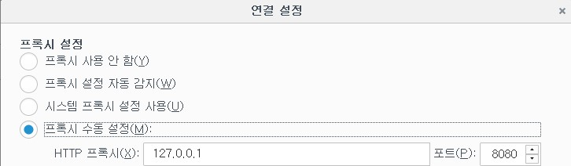

<br>

회원가입 창에서 회원가입 정보 입력

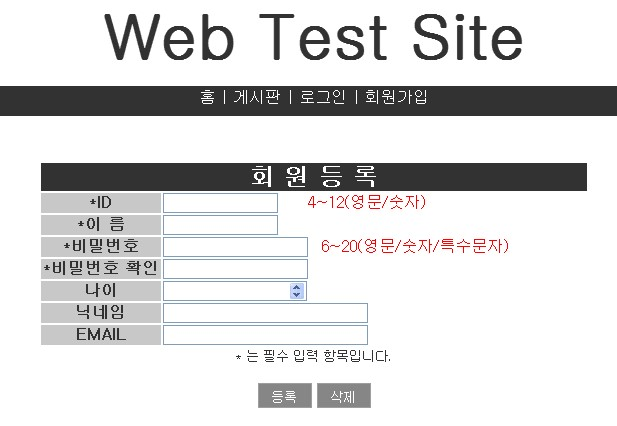

<br>

paros 에서 trap > trap request 체크


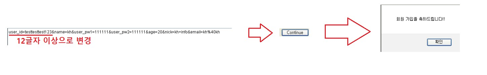

<br>

DB확인

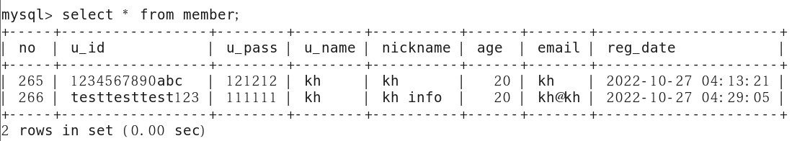


<br>

<br>

<br>

##### Web 인증 공격 

구성도

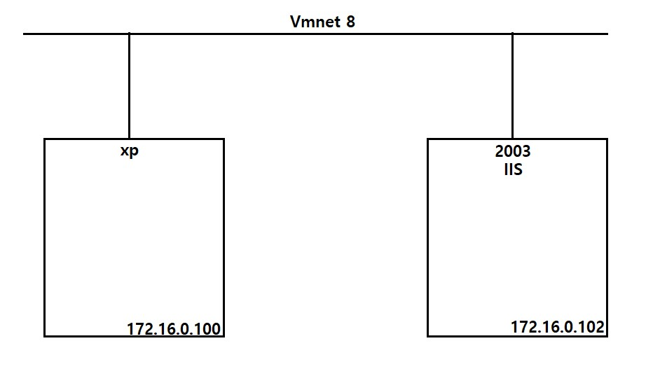

<br>

2003 서버 , 웹서버(IIS) 설치

<br>

Web Server 확인

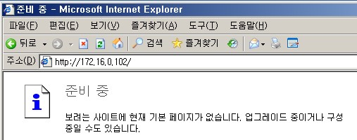

<br>

웹서버(IIS)  에 기본인증 구현

```
관리도구 > 인터넷 정보 서비스 관리 > 2003-00 > 웹사이트 > 기본 웹사이트 > 속성 > 
디렉터리 보안 > 인증 및 액세스 제어 
> 익명 액세스 가능 체크 해제 
> 인증된 액세스 > 기본 인증 체크 - 2003서버의 사용자 /
```

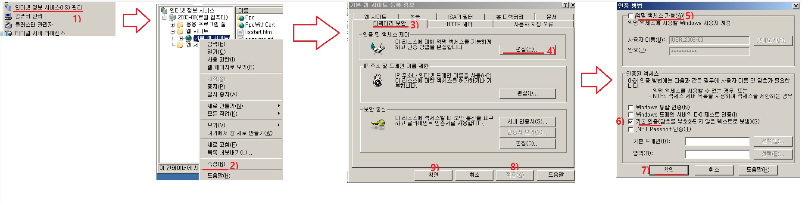

<br>

xp -> Web Server 접근

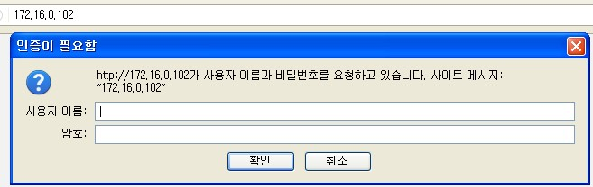

<br>

kali -> Wire Shark

접근하기 전에 kali에서 Wire Shark를 켜두고 접근 하겠습니다.

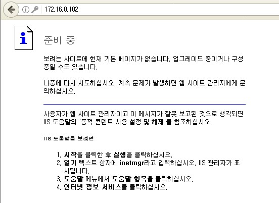

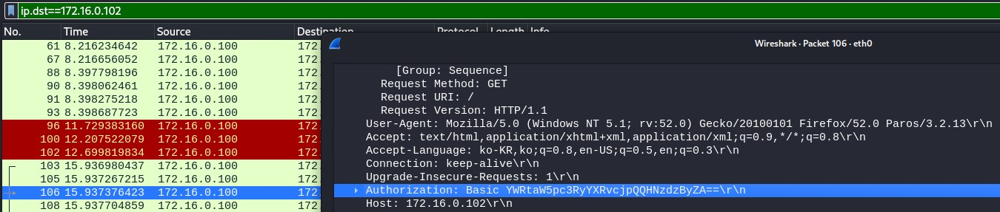

<br>

디코딩

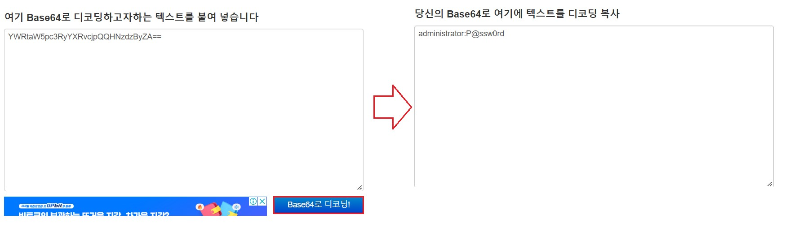

<br>

<br>

<br>

##### bruteforcing

무차별 대입 하면 시간이 오래 걸려서 dictionary attack 으로 대체 하겠습니다.

kali -> dictionary file 만들기

```
password 파일
vi /root/passlist.txt
P@ssw0rd
monkey
dragon
1234

user 파일
vi /root/userlist.txt
administrator
test
korea
dac01
```

<br>

kali -> hydra 이용해서 확인

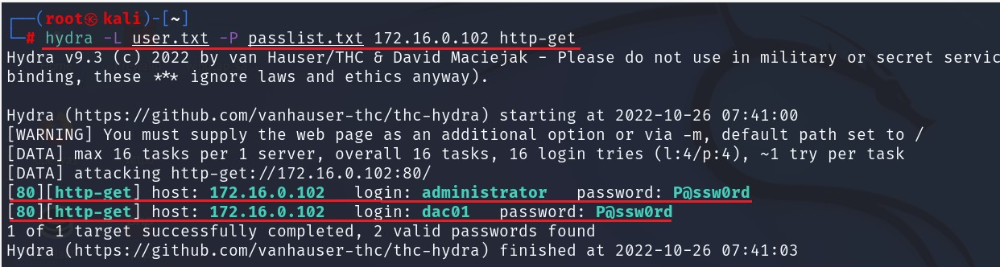

<br>

kali -> xhydra 이용해서 확인

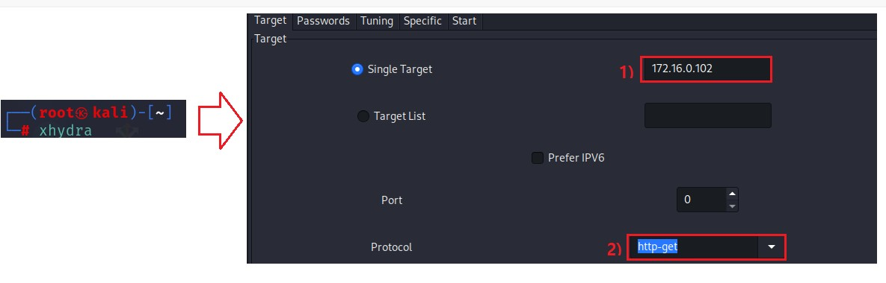

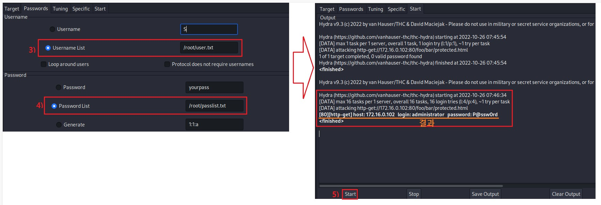

<br>

방어

```
2003]
gpedit.msc
컴퓨터 구성 > Windows 설정 > 보안 설정 > 계정 정책 > 계정 잠금 정책

비밀번호를 3회 틀리면 5분동안 계정 잠김
```

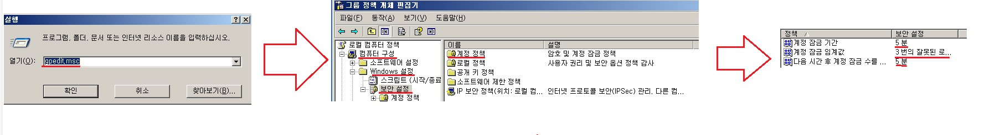


<br>

kali -> passlist.txt 수정

```
vim /root/passlist.txt

moneky
dragon
123
1234
123456

틀린 비밀번호만 입력
```

<br>

kali -> hydra 이용해서 확인

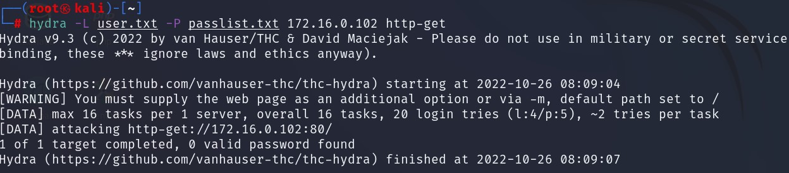

아무것도 나오지 않았습니다.

<br>

2003 -> 확인

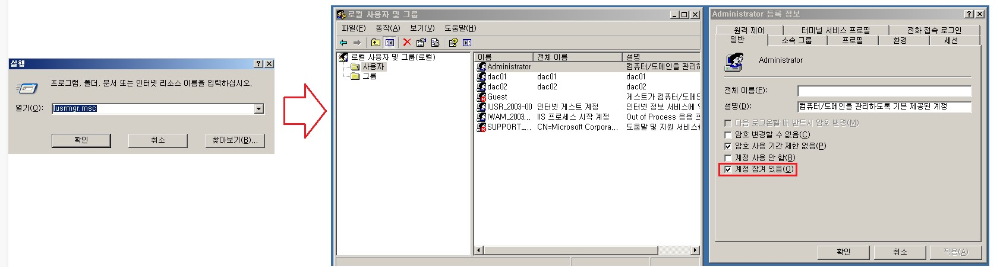

계정이 잠겨있는 모습을 볼 수 있습니다.

<br>

<br>

<br>

##### parameter bruteforcing

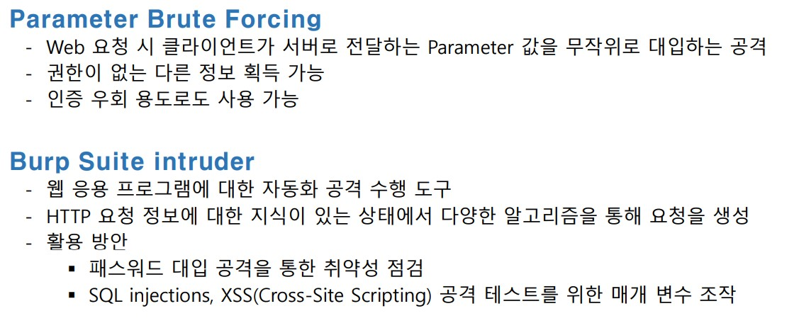

<br>

Web Server -> test01 user 만들기

member table에 아무 기록 없는 상태에서 시작 하겠습니다.

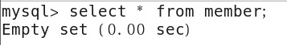

```
mysql> insert into member values(
    -> 1,
    -> 'test01',
    -> '4111',
    -> '테스터',
    -> 'tester',
    -> 28,
    -> 'test01@test01',
    -> now()
    -> );
```

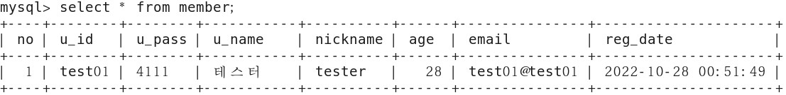

<br>

bruteforcing 설정

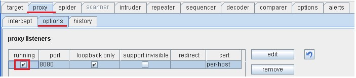

<br>

Web 접속

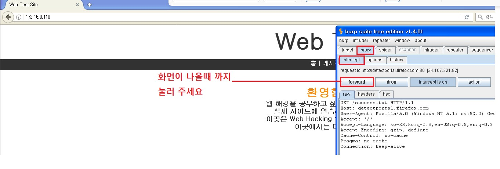

<br>

로그인 시도 (틀리게)

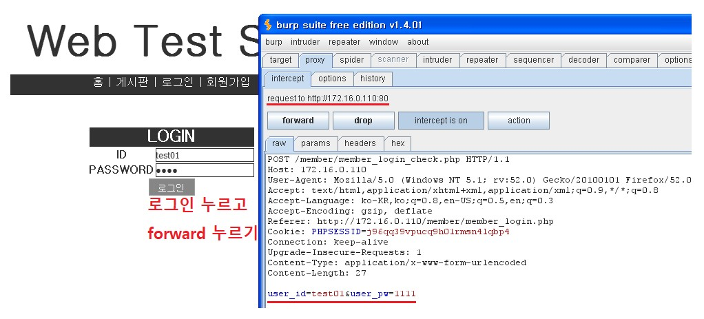

<br>

 bruteforcing 설정

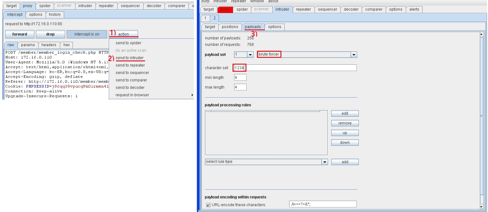

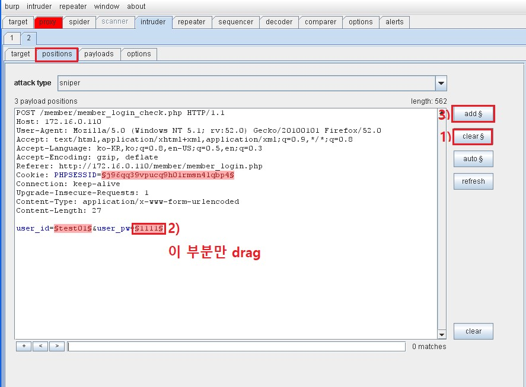

<br>

bruteforcing 시작

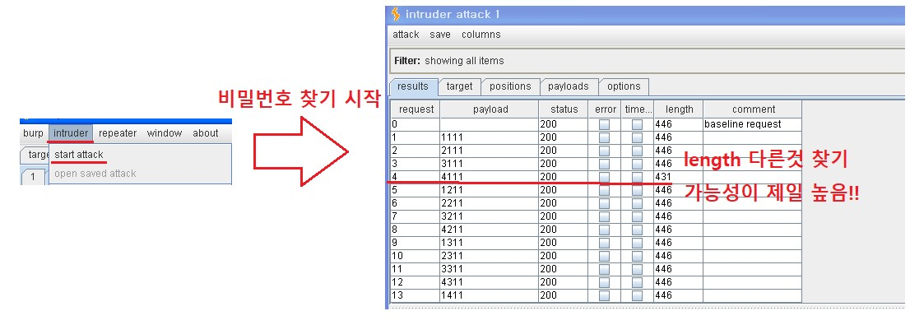

<br>

<br>

<br>

#####  WEB Session Attack

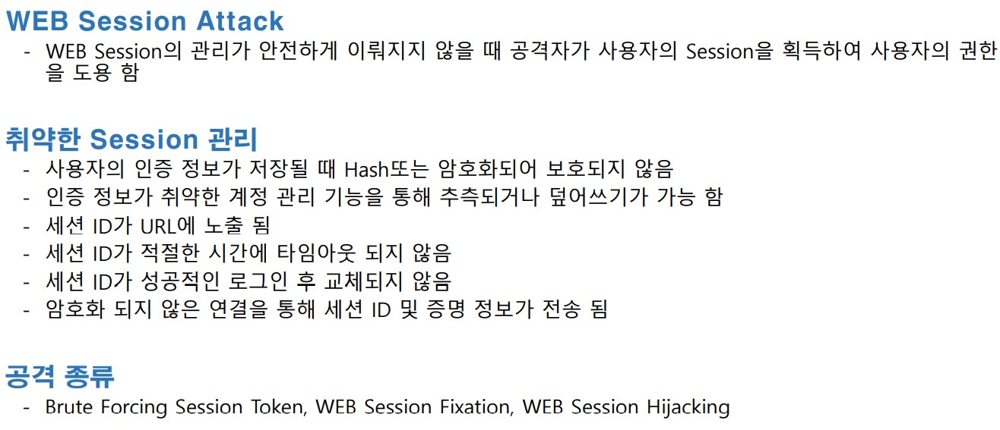

<br>

