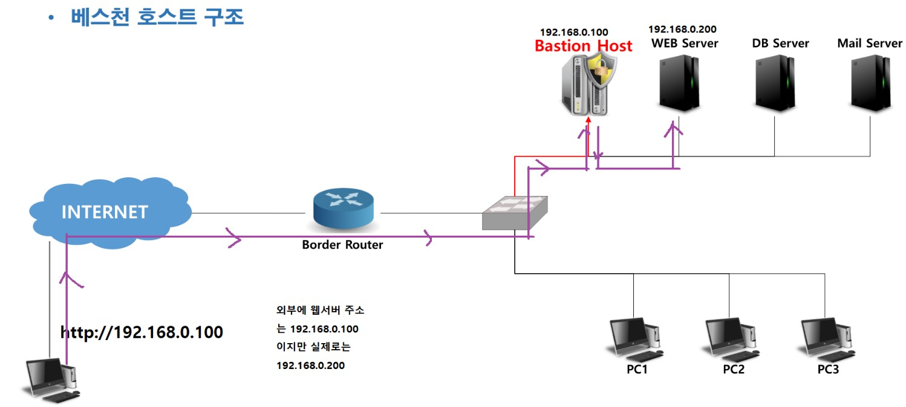
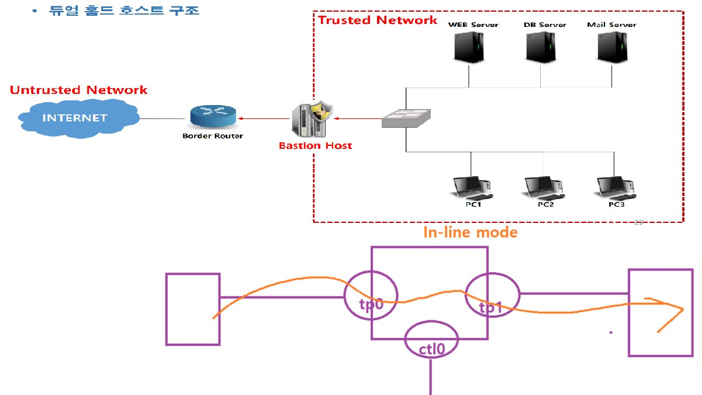
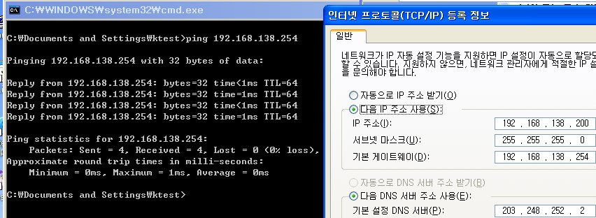
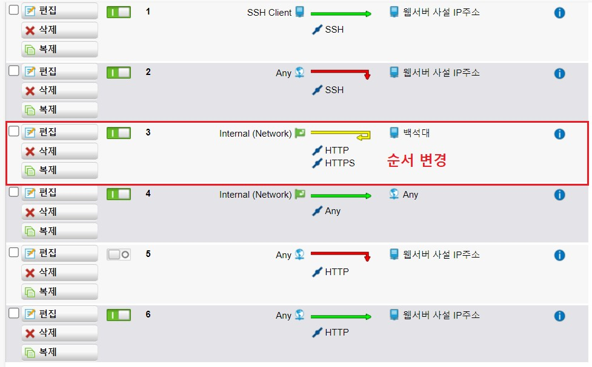
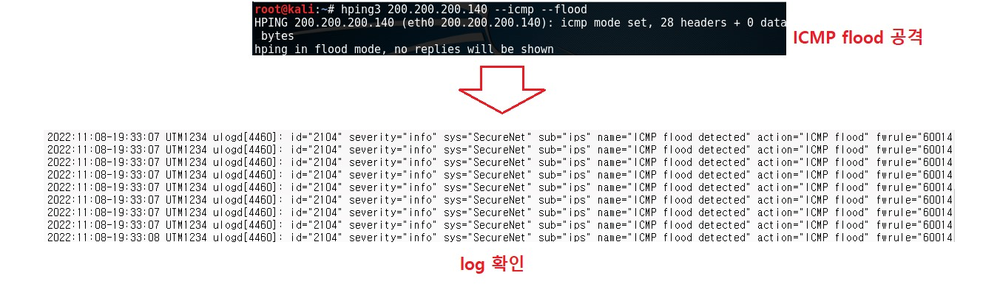

# 보안 장비 운용

##### 보안 시스템 이해

 

##### 보안 시스템 종류

- 방화벽(Firewall) 

  - 침입 차단 시스템 
  - 신뢰하지 않는 외부 네트워크와 신뢰하는 내부 네트워크 사이를 지나는 패킷을 미리 정한 정책(규칙) 에 따라 차단하거나 보내주는 기능을 하는 하드웨어 또는 소프트웨어 
  - 보안에서 가장 기본적인 솔루션

  ex) iptables  , windows 방화벽

   

- IDS(Intrusion Detection System) 

  - 침입 탐지 시스템 
  - 네트워크를 통한 공격을 탐지하기 위한 장비이며, 방화벽이 차단하지 못한 해킹이나 악성 코드의 활동을 탐지 
  - 설치 위치와 목적에 따라 호스트 기반이나 네트워크 기반으로 설치

  ex) snort

   

- IPS(Intrusion Prevention System) 

  - 침입 차단 시스템 

  - IDS + Firewall과 같은 네트워크 기반의 솔루션을 논리적으로 결합한 시스템 
  - 방화벽(Firewall)의 단순한 룰 셋 적용을 통한 차단으로 실질적인 공격의 차단율이 낮다는 점을 보완하기 위해 개발 
  - 비정상적인 트래픽(공격)에 대해 능동적인 분석과 차단을 수행

   

- Web Filter 

  - 웹 브라우저의 통신 내역을 감시하여 위험성 높은 내용을 차단 
  - 위험한 사이트 접속 차단 및 위험한 컨텐츠 차단

   

- WAF(Web Application Firewall) 

  - 웹 방화벽

  ex) WAPPLES

   

- VPN(Virtual Private Network) 

  - 가상 사설망 
  - 인터넷(공용망)을 전용선처럼 사용할 수 있도록 제공하는 서비스 
  - 본사와 지사 간에 전용망을 설치한 것과 같은 효과를 거둘 수 있으며, 기존 사설망의 고비용 부담을 해소하기 위해 사용(비용 절감) 
  - 터널링 + 암호화

   

- Anti DDoS Solution 

  - DDoS 공격 탐지/차단

   

- Anti SPAM Solution 

  - 스팸 탐지/차단 또는 스팸 필터 솔루션

 

- Anti Virus Wall 

  - 악성 코드 탐지/차단 솔루션

   

- Load Balancing 

  - 부하 분산 
  - SLB(Server Load Balancing) / NLB(Network Load Balancing) 
  - 동작 방식 : 라운드 로빈, 가중치 라운드 로빈, ...

 

- LVS(Linux Virtual Server) 
  - 리눅스를 이용해서 고 가용성 확보를 위해 로드 밸런싱을 운영하는 시스템

 

- UTM(Unified Threat Management) 

  - 통합 위협 관리 
  - **하나의 장비에서 여러 보안 기능을 통합적으로 제공**하여 다양하고 복잡해진 공격에 대응 
  - Firewall / WebFilter / WAF / VPN / IDS / IPS / Antivirus / AntiSpyware / AntiSPAM / Wireless Security / ...

   

- PMS(Patch Management System) 

  - 패치 관리 시스템 
  - 조직 내에서 최신의 패치를 적용 시키는 것이 중요 
  - 보안 솔루션 강제 설치 / 불법 소프트웨어 차단 / 하드웨어 자산 관리 등을 수행

 

- NAC(Network Access Control) 

  - IP 관리 시스템에서 발전한 솔루션  네트워크에 연결된 단말의 여러 가지 정보를 수집하고

  정책 : 지정된 네트워크의 사용자는 모두 방화벽을 사용해야 한다 .

  사용자가 임의로 방화벽을 내리면 강제로 자동으로 올라감

 

- ESM(Enterprise Security Management) 
  - GUI를 통해 각종 시스템 및 장비의 상태, 성능, 장애 여부 등을 모니터링 하고 관리하기 위한 시스템 
  - 회사의 비즈니스 안정성을 확보하고 가치를 높이고 자원의 최적화 등을 위해 구성

 

##### 보안 시스템 운용 기술

방화벽의 분류(기술적)

- Packet Filter Firewall

  - OSI 7 Layer의 Network, Transport에서 동작 함
  - 데이터의 출발지 및 목적지 IP/PORT 정보를 이용하여 정책을 구성 함

   

- Application Layer Gateway(=ALG)

  - 7계층

    ex) WAPPLES (WAF)… 

- Circuit Gateway

- Stateful Inspection

  - OSI 7 Layer의 Network, Transport에서 동작 함
  - 필터링 속도를 개선 함 
  - 방화벽에서 상태 추적 테이블을 생성하여 L3, L4정보를 기억하여 정책 검사를 한 번만 수행 함 
  - 동적으로 보안 정책을 수정하며 실제 접속 상태를 감시하여 통신 상태에 따라 허용/거부를 수행 함

  ex) iptables -t filter -A INPUT -m state --state NEW,ESTABLISHED -m tcp -p tcp --dport 80 -j ACCEPT

- Dynamic Packet Filtering

- Hybrid 방식
  - 대부분의 Firewall 채택 방식
  - **Packet Filtering + Application Gateway** 방식 등의 혼합
  - 사용자의 편의성과 기업 환경에 따라 유연성 있게 방화벽을 구성할 수 있지만, 관리사 복잡한 단점이 있다.

 

##### 보안 시스템 구축 형태

스크리닝 라우터(=Screening Router) 

기존의 Router에 패킷 필터링 기능을 이용하는 방화벽 구축 형태 

- 특징 
  - 정상적인 내부/외부 사용자는 패킷 필터링 라우터의 존재를 인식하지 않고 서비스를 이용 함 
  - 패킷 필터링 기반으로 동작 함 
  - 내부 네트워크와 외부 네트워크를 분리 함
-  단점 
  - 실패한 접속에 대한 로깅과 감사 추적이 어려움 
  - 패킷 필터링 규칙에 대한 검증이 어려움 
  - 외부 네트워크에서 공격자에 의해 공격 당하거나 고장 등의 문제가 발생할 경우 보안상 치명적 임

 

베스천 호스트(=Bastion Host Architecture = Single Homed Host 구조) 

내부 네트워크의 하나의 시스템을 proxy로 운영하며 특정 서비스에 대해서만 필터링 하는 방식 

- 특징 
  - 내부/외부 네트워크를 분리하지 않음 
  - 접근제어, 프록시, 인증, 로깅 등의 방화벽 기본 기능을 수행 
  - 윈도우 NT또는 유닉스 등의 운영체제에 설치하여 사용 
  - 설치되는 운영체제에는 일반 사용자 계정이 없어야 하며, 방화벽 기능 외의 유틸리티는 모두 삭제 
  - 대용량의 모니터링과 로깅이 가능해야 하며, IP 포워딩 및 소스 라우팅 기능이 없어야 함 
- 단점 
  - 운영체제에 운영되기 때문에 강력한 보안 정책이 가능하나 방화벽이 손상될 경우 네트워크에 대한 무조건 적인 전송이 가능 함 
  - 방화벽으로 원격 로그인 정보가 노출되어 공격자가 방화벽에 대한 제어권을 탈취한 경우 내부 네트워크가 위험해 짐 
  - 2계층 공격 등을 통한 방화벽 우회 공격에 취약

 

듀얼 홈드 호스트(=Dual Homed Host Architecture = Dual Home Gateway) 

Bastion Host 구조에서 네트워크 카드를 하나 더 장착하여 내부/외부 네트워크를 분리 시키는 형태 

- 특징 
  - 두 개의 인터페이스를 가지는 Beastion Host 
  - 응용 서비스 종류에 좀더 종속적이기 때문에 스크린 라우터보다 안전 - Application Layer 공격 방어 가능 
  - 로깅 및 감사 추적이 용이 함 - 설치 및 유지보수 쉬움 
- 단점 
  - 제공되는 서비스가 증가할수록 proxy 소프트웨어 가격 상승 
  - 게이트웨이가 손상되면 내부 네트워크 보호 불가 
  - 방화벽으로 원격 로그인 정보가 노출되어 공격자가 방화벽에 대한 제어권을 탈취한 경우 내부 네트워크가 위험해 짐

 

 스크린드 호스트(=Screened Host Architecture = Screen Host Gateway) 

Screening router + Bastion Host(또는 Dual Homed Host) 구조 

- 특징 
  - 2단계 방어 
  - Screen Router에 의해 L3 + L4 에 대한 Access Control 
  - Bastion Host에 의해 L7에 대한 Access Control 
  - 가장 많이 이용되는 구조 - 융통성이 좋음 

- 단점 
  - Screening Router가 Hacking될 경우 Bastion host를 거치지 않고 내부 Network로 침입이 가능 
  - 구축 비용이 높음

 

스크린드 서브넷(=Screened Subnet Architecture) 

Screen Subnet Gateway - Screening router + Bastion Host(또는 Dual Homed Host) + Screening router 구조 

- 특징 
  - 외부 네트워크와 내부 네트워크 사이에 완충지대를 두는 구조 
  - 완충지대의 서브넷에 DMZ가 위치 함 - 서브넷에 Bastion Host 또는 Dual Homed Hostd를 설치 함 
  - 공격자가 내부로 침입하려면 통과해야 할 보안 장비가 많아서 보안이 강화 됨 
- 단점 
  - 설치와 관리가 어려움 
  - 비용이 많이 소모 됨

 

##### 방화벽의 분류(장비)

Software 기반 Firewall 

- 일반적인 호스트 PC에 설치하는 소프트웨어형태의 프로그램 
- Open Source Software Firewall ＞ IPTABLES, IPFIRE, PFSENSE, ENDIAN, MONOWALL, SMOOTHWALL …

 

Hardware 기반 Firewall 

- 네트워크 장비 기반으로 자체적으로 보안 기능을 수행하도록 제작된 하드웨어

 

IDS(=Intrusion DetectionSystem)

- 침입 탐지 시스템
- 시스템에 대한 인가되지 않은 행위와 비 정상적인 행동을 탐지
- 탐지된 불법 행위를 구별하여 실시간으로 침입탐지
- 정상 트래픽의 흐름을 간섭하지 않고 단지 감시하는 기능을 제공 함 
- 원본 데이터를 복사하여 검사 ＞ 물리적 장비 → tap ＞ SW기능 → port mirroring

- IDS의 주요 기능 → 보안상의 위협 찾기

 

지식 기반 탐지(=Misuse Detection IDS)

- **부정 오류(False Negative) → 미탐 가능성이 높음**
- 오용 침입 탐지
- Signature 기반으로 비정상적인 트래픽을 탐지
- 오 탐 가능성이 낮으며 백신처럼 트로이목마, 백도어 등의 공격도 탐지 가능
- signature가 없는 공격에 대한 대응이 불가능

 

행위 기반 탐지(=Anomaly Detection IDS)

- **긍정 오류(False Positive) → 오탐 가능성이 높음**
- 비정상 행위 탐지
- 정상적인 상황의 트래픽에 위배되는 급격한 변화가 발견되면 위협으로 판단하는 탐지 기법
- 정량적 분석, 통계적 분석 기법을 사용
- 관리자가 상황에 따른 프로필을 제작할 수 있으며 IDS장비 자체가 인공지능(학습능력)을 지원 함
- zero-day Attack에 대해 탐지 가능

 

N-IDS(=Network IDS)

- 해당 네트워크를 모니터링
- NIC가 **Promiscuous** 모드로 동작해야 함

 

H-IDS(=Host IDS)

- N-IDS와 다른 점 → 자신이 실행되는 호스트 시스템만을 보호
- **non-Promiscuous** 모드로도 작동 함

 

 

 

##### UTM - sophos

구성도

 

UTM OS 설치

 

UTM - WEB Admin 초기 설정

 

Admin 로그인

 

콘솔 관리자 계정(root) 비밀번호 설정

 

 Web Admin 관리 언어 설정

 

인터페이스 추가

 

WEB Server 공인 IP 추가 Interface 생성

 

 필터링 설정 → 방화벽을 경유하는 Ping통신 허용

 

xp -> ping check

 

###### NAT - MASQUERADE

 

방화벽

 

CnetOS -> ping check

 

네트워크 추가

 

방화벽 추가

 

###### NAT - DNAT

 

http://200.200.200.139 접속해서 확인

 

###### Firewall 규칙 

sophos의 경우

- **거부 기본 , 필요한 부분만 허용  - whitelist**
- 우선순위 (위에서 아래로 적용)

기존 Web Sevrer DNAT 정책을 복제 > 동작 거부 설정 후 우선순위 확인 

 

정책 적용 후 Web Server 확인

 

정책 비활성화 후 다시 확인

 

######  internal 중 지정된 컴퓨터(XP) 외에 DMZ의 242.100 에 ssh 를 사용금지

2003 추가

 

xp, 2003 -> putty로 192.168.139.100 접속 시도

 

정책 설정

 

정책 위치 이동

 

2003, XP -> putty로 WEB Server 접속

 

###### internal 에서 백석 대학교 홈페이지 접근 불가능

정책 설정

 

확인

NAVER는 접속 가능하나 백석대 홈페이지는 접속이 되지 않습니다.

 

근무 집중 시간(17:00~18:00) internal에서 인터넷 접근 불가 

 

확인

 

기간 변경 후 다시 확인

 

 

 

###### WebFilter 

[www.bu.ac.kr](http://www.bu.ac.kr/) 차단 하기

 

###### captive portal  : 외부로 네트워크시 사용자 인증

사용자 추가

 

확인 (www.naver.com 접속)

 

###### Anti-Virus

eicar test

안티바이러스 장비 테스트 용으로 실제 바이러스가 아닌 바이러스 시그니처를 가상으로 미리 등록해 놓고

장비가 차단하는지 테스트 해보는것

 

웹 필터링 정책 설정

 

https://www.eicar.org/

홈페이지 우측 상단 Download 들어가서

복호화 문제 때문에  http:// 로 접근 

 

파일을 WEB Server에 member 파일로 옮긴 후 확인

 

 

 

###### IPS(=Intrusion Prevention System)

구성도

 

IPS 설정

 

TCP synflood

 

UDP flood

 

ICMP flood

 

