# VPN


<br>


<br>

#####  G to H , Remote Access VPN

구성도

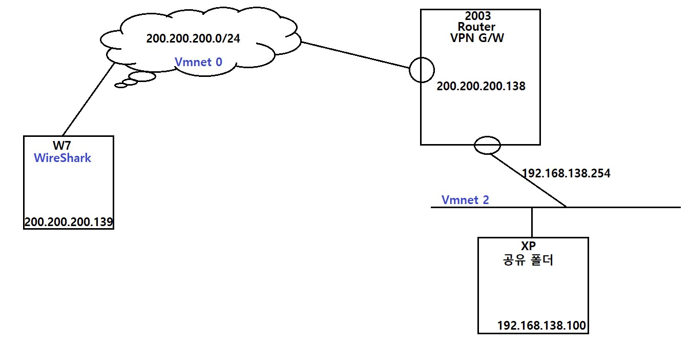

<br>

###### 2003 기본 설정

Router 기본 설정


```
기본 설정 
관리도구 > 라우팅 및 원격 액세스 
라우팅 및 원격 액세스 구성 및 사용 > 사용자 구성
사용자 지정 구성 : VPN 액세스,NAT 및 기본 방화벽,LAN 라우팅 
다음 > 마침 > 예
```

<br>

Remote Access user를 위한 IP주소 범위 생성


```
Remote Access user 를 위한 IP주소 범위 생성
관리도구 > 라우팅 및 원격 액세스 
컴퓨터 이름 > 속성 
IP > IP 주소 할당 > 
고정 주소 풀 
192.168.139.50-60
```

<br>

NAT 설정

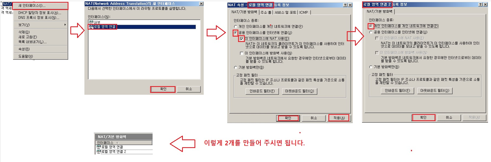

```
NAT 설정
관리도구 > 라우팅 및 원격 액세스  > IP 라우팅 > NAT/기본방화벽
새 인터페이스 > 로컬영역연결 > 공용인터페이스를 인터넷에 연결 , 이 인터페이스에 NAT 사용
새 인터페이스 > 로컬영역연결 2 > 개인 인터페이스를 개인 네트워크에 연결 
```

<br>

VPN 사용자 확인


```
lusrmgr.msc
로컬 사용자 및 그룹 > administrator > 전화접속 로그인 > 원격액세스권한 : 액세스 허용 체크
```

<br>

<br>

<br>

###### X7 기본 설정

VPN 연결

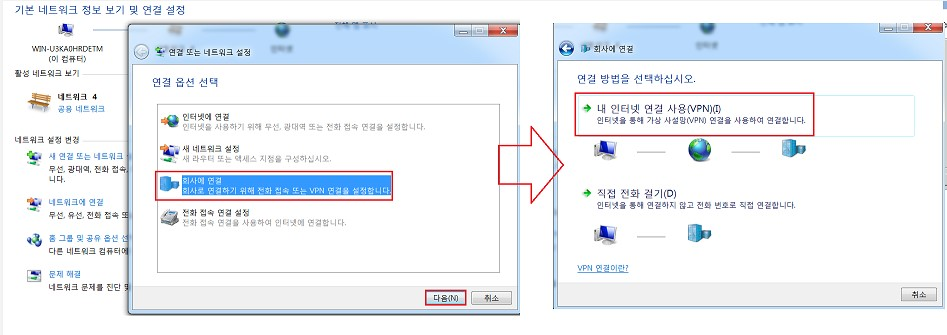

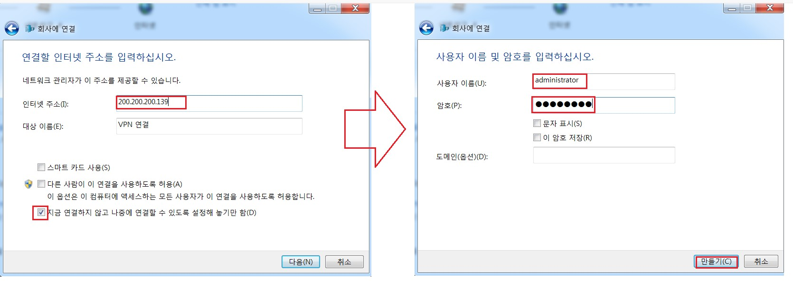

```
w7]
제어판 > 네트워크 공유 센터 > 
새 연결 또는 네트워크 설정
회사에 연결
내 인터넷 연결 사용(VPN)
나중에 인터넷 연결 설정
연결한 인터넷 주소를 입력하세요 > 인터넷주소 : 200.200.200.242 
사용자 이름 및 암호를 입력하십시오 > administrator/P@ssw0rd > 만들기 

ncpa.cpl > VPN 연결 확인
VPN 연결 > 속성 > 보안 : PPTP 지정
```

<br>

ncpa.cpl

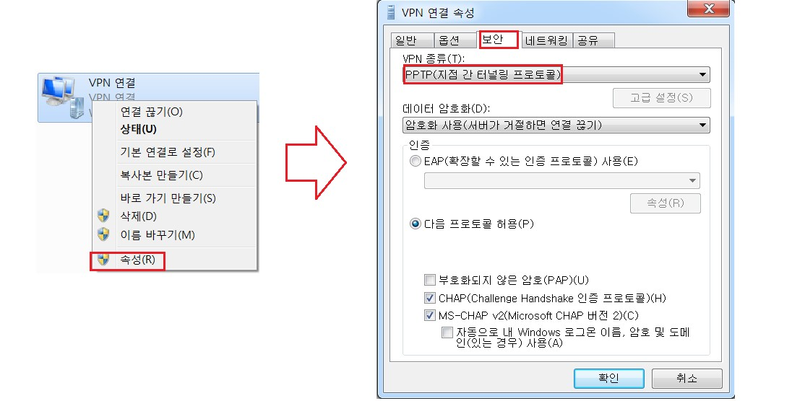

```
ncpa.cpl > VPN 연결 확인
VPN 연결 > 속성 > 보안 : PPTP 지정 
```

<br>

연결 확인

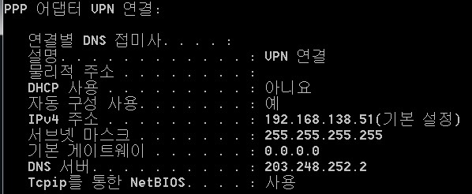

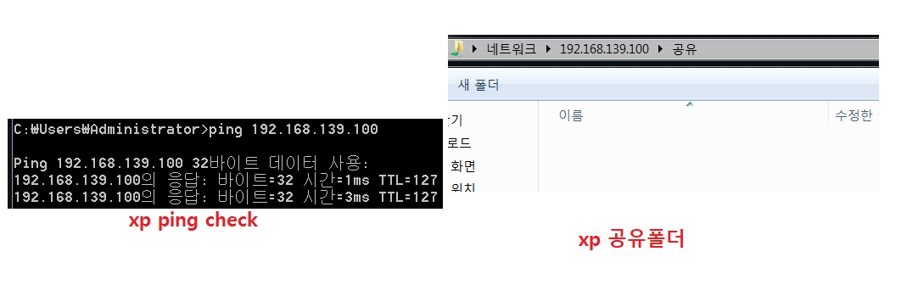

<br>

<br>

<br>

##### PPTP(Point-to-Point Tunneling Protocol)

```
공인 망을 통해 PPP(Point to Point)통신을 제공하기 위해 사용 - 사용자 인증 
Microsoft에서 만든 VPN 프로토콜
PAP, CHAP, MS-CHAP, EAP 등의 사용자 인증 방식 제공
동작 방식
1)기본적으로 데이터 암호화 기능이 없으므로 MPPE를 이용하여 암호화 수행
2)사용자 인증 시 초기 키가 생성되며 이후 주기적으로 갱신
3)데이터는 PPP 패킷으로 생성되며 PPTP로 encapsulation
4)통신은 두 단계 과정으로 진행되며 TCP 1723을 이용하여 제어용 세션을 생성한 후 GRE를 이용하여 데이터를 전송


MPPE     암호화 : 데이터의 보안성 
MS-CHAP  인 증  : 사용자
GRE      캡슐화 : 데이터 전달을 위한  

CHAP (Challenge Handshake Authentication Protocol)
- 암호를 전송시에 유추 불가능 !!!  

로그인시도
서버 -> 클라이언트 : Server Challenge String(챌린지 문자열)
클라이언트 -> 서버 : Client Challenge String +  [Server Challenge String + 비밀번호 + Client Challenge String]를 해싱한값 
```

<br>

구조

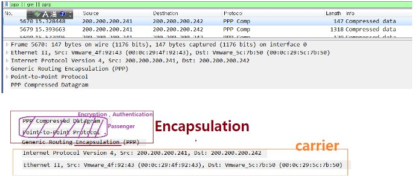

<br>

<br>

<br>

##### L2TP/ipsec

IPsec

```
Network Layer에서 동작하는 IP망에서 사용하는 표준 보안 방식 
not protocol , protocol suites

인증, 무결성, 기밀성, 재생방지 등의 보안성을 제공

• IPsec 구성 프로토콜
협상과 협상에서 만들어지는 암호화 키를 이용하여 암호화 
- ISAKMP : IKE(Internet Key Exchange), 암호화 알고리즘을 위한 키 결정, 인증키 협상
- ESP(Encapsulating Security Payload) : 데이터의 기밀성, 무결성 제공

AH(Authentication Header) → 데이터 인증과 재생 방지
ESP, AH, ESP+AH로 구성할 수 있음
• IPsec에서 사용되는 알고리즘
기밀성 :
대칭키 알고리즘 → DES, 3DES, AES
Key 교환 알고리즘 → DH1, DH2, DH5 …
-
무결성
HMAC-MD5, HMAC-SHA-1
-
인증
PSK, 인증서
```

<br>

###### 2003 설정

VPN Server(G/W) 설정

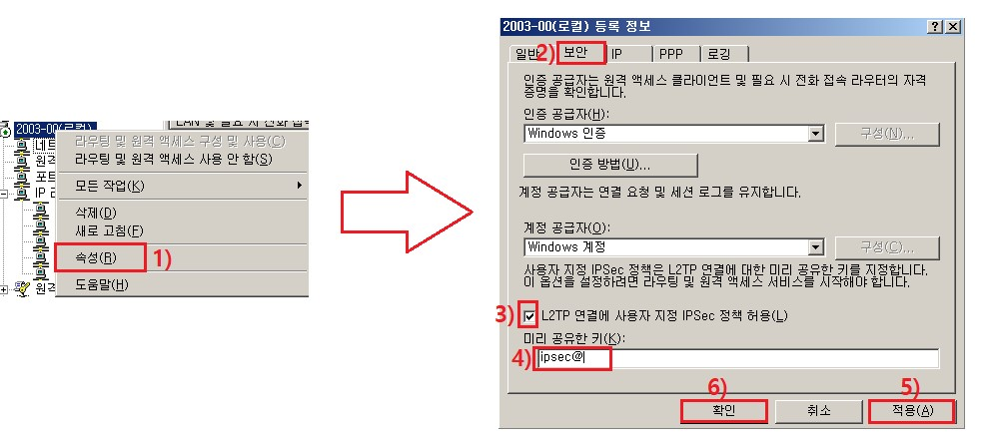

```
VPN G/W : 2003]
보안 > L2TP 연결에 사용자 지정 IPSec 정책 허용
미리 공유한 키(pre-shared key) : ipsec@ 
```

<br>

###### X7 설정

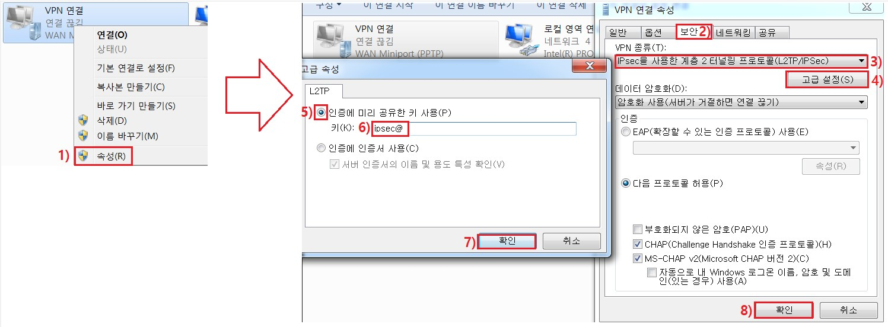

```
ncpa.cpl > VPN 연결 확인
VPN 연결 > 속성 > 보안 : 
VPN 종류 : IPsec 을 이용한 2 터널링 프로토콜(L2TP/IPsec)
고급속성 : 인증에 미리 공유한키 사용 : ipsec@
```

<br>

WireShark 캡쳐

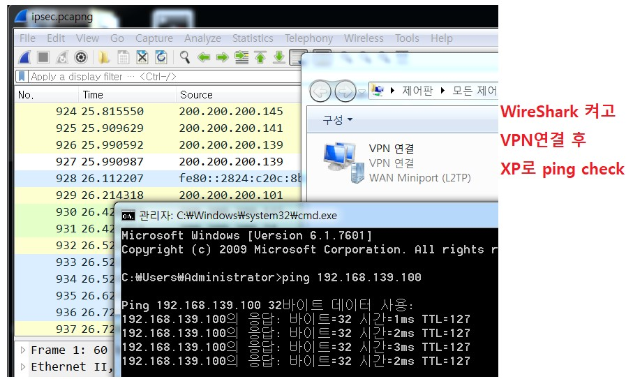

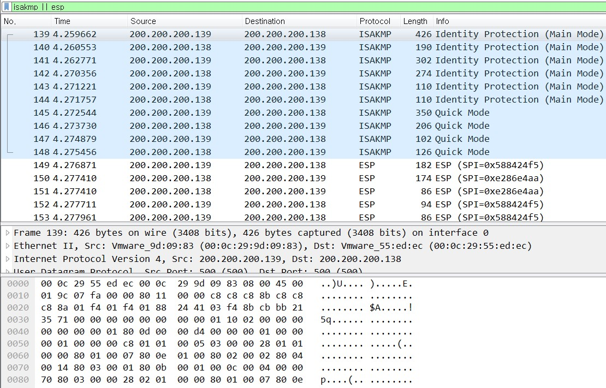

```
filter : isakmp || esp
```

<br>

구조

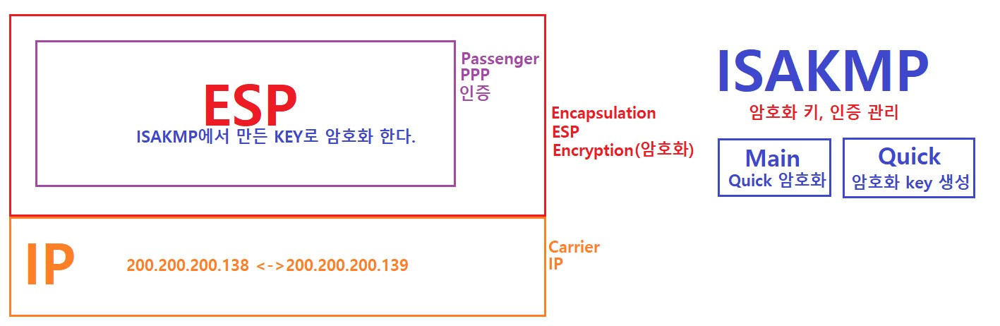

<br>

<br>

<br>

##### SSL VPN

구성도

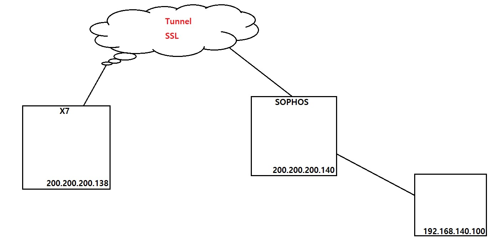

<br>

VPN Server (G/W) 설정

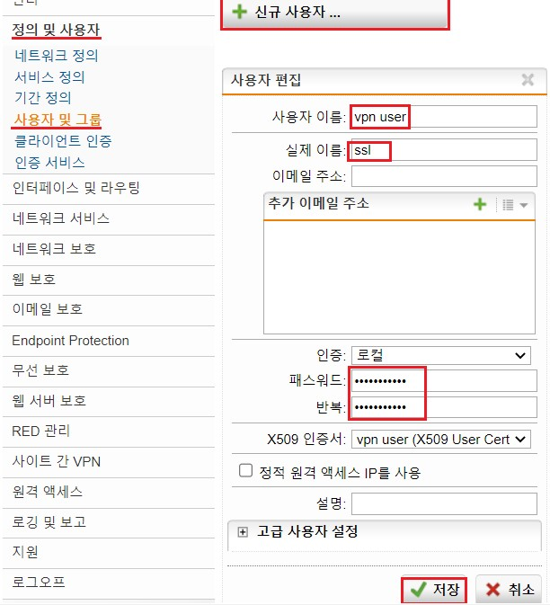

```
# 사용자 등록
정의 및 사용자 >
사용자 및 그룹 
사용자 이름 : vpn01 
패스워드 :  P@ssw0rd , 반복 : P@ssw0rd
```

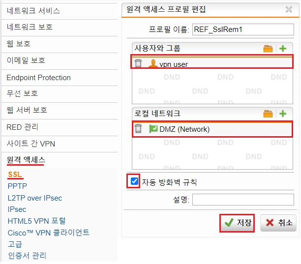

```
# SSL VPN 설정
원격 액세스 > SSL > 
프로필 탭 > 새 원격액세스 프로필
> 사용자와 그룹 : vpn01 선택 , 로컬네트워크 : DMZ(network)
> 자동방화벽 규칙 체크 : sophos 에서 알아서 허용
```

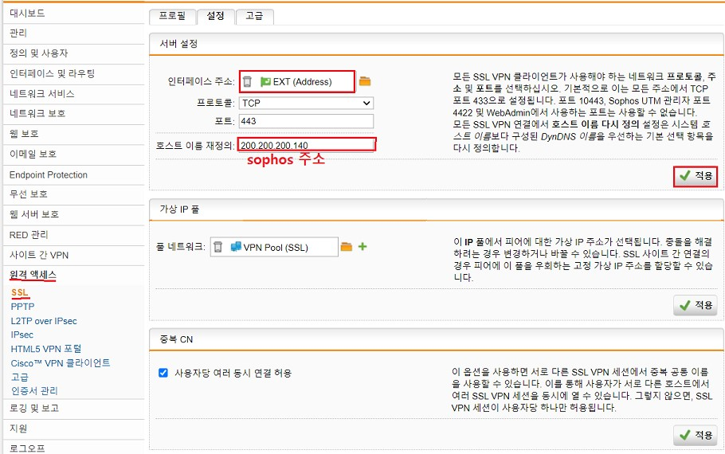

```
설정
서버설정 > 인터페이스 주소 > EXT(address) , 호스트이름 재정의 200.200.200.서버주소 > 적용 
가상 IP 풀 : VPN 가 부여받을 주소 
```

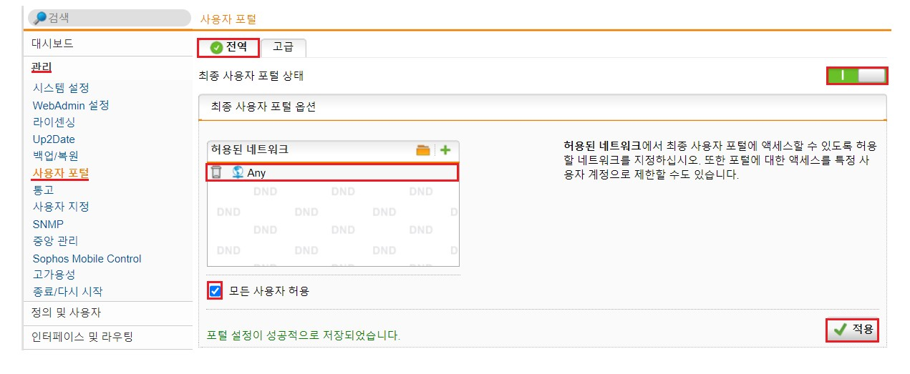

```
# VPN 클라이언트프로그램 다운로드 받을수 있도록 웹페이지 만들기
관리 > 사용자 포털 > 
전역 탭 > 최종 사용자 포털 : 활성화 
허용된 네트워크 >  any > 적용 , 모든 사용자 허용 체크 확인
```

<br>

VPN Client(Host)

https://200.200.200.140 접속

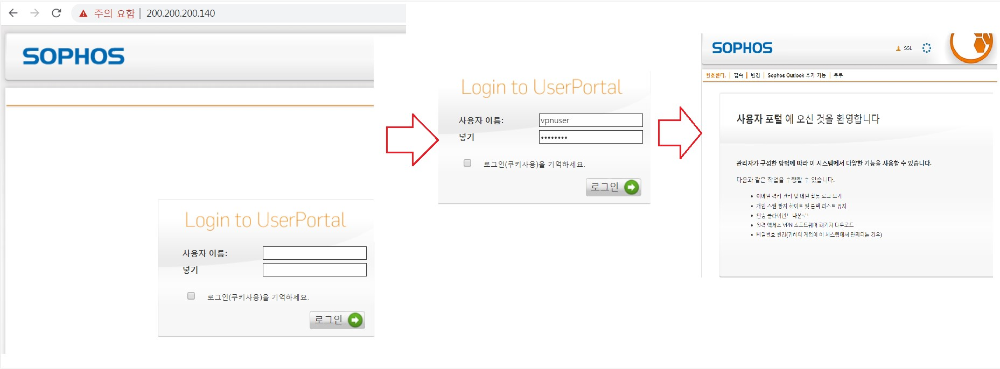


<br>

연결 확인

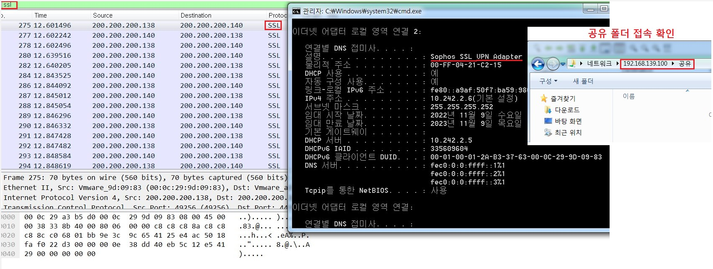

<br>

구조


<br>

<br>

<br>

##### G to G

구성도

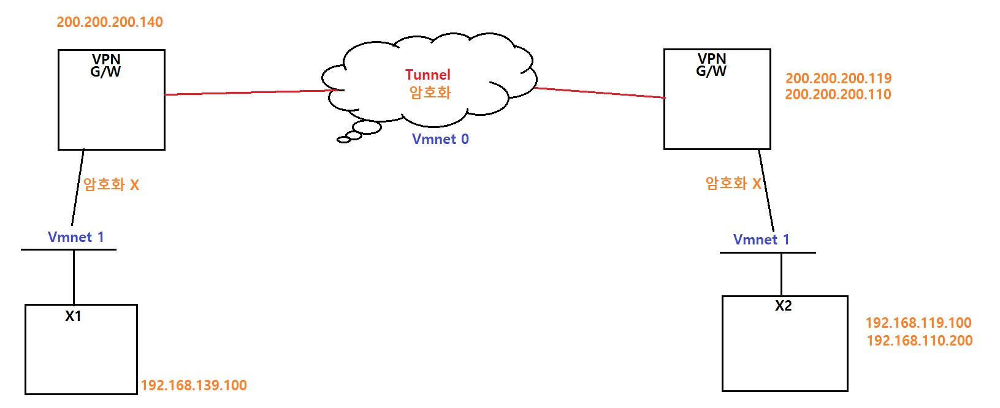

<br>

sophos 설정

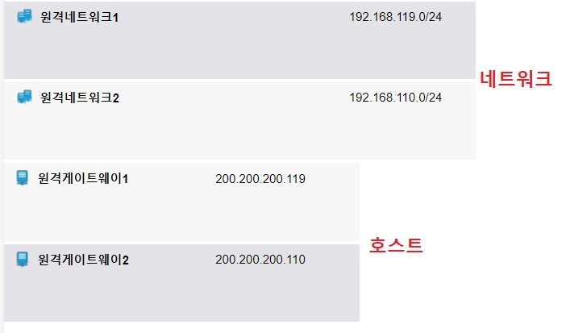

```
# 상대의 VPN 게이트웨이를 등록 : 양쪽 모두
정의 및 사용자 > 네트워크 정의 
새 네트워크 정의 >네트워크 정의 추가 
이름 : 원격게이트웨이111 , 유형 : 호스트
IPv4주소 :원격게이트웨이111] 의 eth0주소

# 상대 원격 네트워크 등록
정의 및 사용자 > 네트워크 정의 
새 네트워크 정의 >네트워크 정의 추가 
이름 : 원격네트워크111 , 유형:네트워크
IPv4주소 : 192.168.~~~.0 (상대의 internal NA)
```

<br>


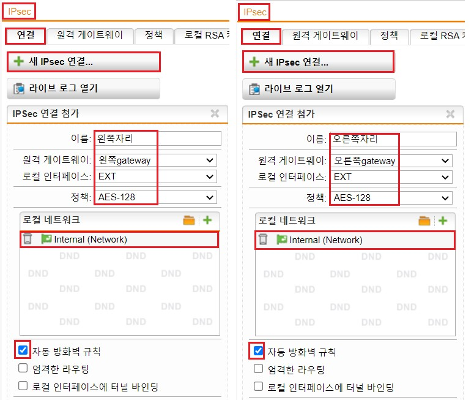

```
# 구간별 통신 확인 

# 상대의 VPN 게이트웨이를 등록 : 양쪽 모두
정의 및 사용자 > 네트워크 정의 
새 네트워크 정의 >네트워크 정의 추가 
이름 : 원격게이트웨이111 , 유형 : 호스트
IPv4주소 :원격게이트웨이111] 의 eth0주소

# 상대 원격 네트워크 등록
정의 및 사용자 > 네트워크 정의 
새 네트워크 정의 >네트워크 정의 추가 
이름 : 원격네트워크111 , 유형:네트워크
IPv4주소 : 192.168.~~~.0 (상대의 internal NA)

# site to site 연결 설정 
사이트간 VPN
IPSec > 

원격게이트웨이 탭 > 
새 원격 게이트웨이 >
이름:김준우GW 
게이트웨이:원격게이트웨이111, 
인증유형 : 사전 공유키 
키 : ipsec@
반복 : ipsec@
원격네트워크 : 원격네트워크111

연결 탭
새 IPsec 연결
이름 : 김준우
원격게이트웨이 :김준우 G/W
로컬 인터페이스 : EXT 
정책 : AES-128
로컬 네트워크 : internal(network)
자동방화벽 규칙 
저장 
```

<br>

확인

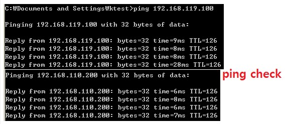

<br>

