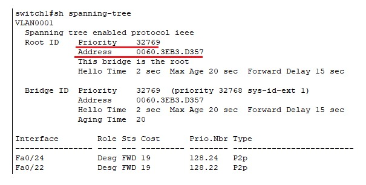

# Redundancy

##### 이중화


<br>

##### STP (Spanning Tree Protocol)


<br>

###### BPDU(Bridge PDU)


<br>

###### 경로 선출 단계

Root Bridge(=switch) 선출 

```
하나의 네트워크에서 기준이 되고, STP관리를 담당할 Root Switch선출
BPDU의 Bridge ID가 제일 낮은 Switch가 선택 됨
Bridge ID = 우선순위(priority) + MAC
1 순위 → 우선순위 낮은 장비
2 순위 → MAC 주소가 낮은 장비
```

<br>

전체 Switch 정보 확인


<br>

우선순위를 변경하여 root switch 를 변경

```
switch1(config)#spanning-tree vlan 1 priority 28672
```


<br>

원상복구

```
switch1(config)#spanning-tree vlan 1 priority 32768
```



<br>

Root Port 선출

```
Root Switch가 전송하는 BDPU를 전달받을 port
Root Switch에 가장 빨리 도달할 수 있는 port
비 Root Switch 당 하나의 Root port 선출

결정 순서
Cost Path가 적은 port → Root Switch까지 도달하기 위한 경로의 전체 비용
인접 Switch의 Bridge ID가 낮은 port
인접 Switch의 Port ID가 낮은 port
자신의 Port ID가 낮은 port
```


<br>

Desiganated Port 선출

```
Designated(Forwarding) port 선출
- Designated(Forwarding) port → Frame을 전달할 수 있는 port
- 각 세그먼트 마다 하나의 Designated port 선출
   세그먼트(Segment) → 장비와 장비가 연결된 구간
- 결정 순서
   Root Switch의 모든 port
   Cost Path가 적은 port → Root Switch까지 도달하기 위한 경로의 전체 비용
   인접 Switch의 Bridge ID가 낮은 port
   인접 Switch의 Port ID가 낮은 port
   자신의 Port ID가 낮은 port
```


<br>

non-designated Port 선출

```
Non Designated(Blocking) port 선출
- Non Designated(Blocking) port
   Loop를 방지하기 위해 임시로 비활성화 하는 port
   Frame은 차단하지만 BDPU는 정상 수신 함
- Root/Designated로 선출되지 못한 port
```

 port.jpg)

<br>

경로 선출


<br>

<br>

<br>

###### STP 상태 변화 


<br>

###### STP 문제점


<br>

<br>

<br>

##### PVST(Per VLAN Spanning Tree)


<br>

구성도


<br>

각 PC IP주소 설정


<br>

각 Switch 별 VLan 설정


이런식으로 5개의 Switch 설정을 해주시면 됩니다.

<br>

DSW1 - SVI 에 주소 입력


<br>

