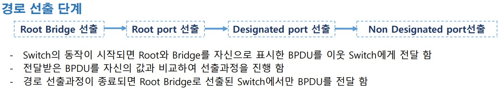
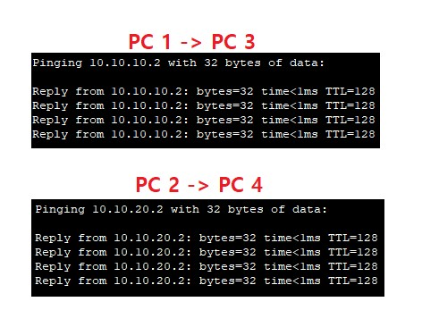

# Redundancy

##### 이중화


<br>

##### STP (Spanning Tree Protocol)


<br>

###### BPDU(Bridge PDU)




<br>

###### 경로 선출 단계

Root Bridge(=switch) 선출 

```
하나의 네트워크에서 기준이 되고, STP관리를 담당할 Root Switch선출
BPDU의 Bridge ID가 제일 낮은 Switch가 선택 됨
Bridge ID = 우선순위(priority) + MAC
1 순위 → 우선순위 낮은 장비
2 순위 → MAC 주소가 낮은 장비
```

<br>

전체 Switch 정보 확인


<br>

우선순위를 변경하여 root switch 를 변경

```
switch1(config)#spanning-tree vlan 1 priority 28672
```


<br>

원상복구

```
switch1(config)#spanning-tree vlan 1 priority 32768
```


<br>

Root Port 선출

```
Root Switch가 전송하는 BDPU를 전달받을 port
Root Switch에 가장 빨리 도달할 수 있는 port
비 Root Switch 당 하나의 Root port 선출

결정 순서
Cost Path가 적은 port → Root Switch까지 도달하기 위한 경로의 전체 비용
인접 Switch의 Bridge ID가 낮은 port
인접 Switch의 Port ID가 낮은 port
자신의 Port ID가 낮은 port
```


<br>

Desiganated Port 선출

```
Designated(Forwarding) port 선출
- Designated(Forwarding) port → Frame을 전달할 수 있는 port
- 각 세그먼트 마다 하나의 Designated port 선출
   세그먼트(Segment) → 장비와 장비가 연결된 구간
- 결정 순서
   Root Switch의 모든 port
   Cost Path가 적은 port → Root Switch까지 도달하기 위한 경로의 전체 비용
   인접 Switch의 Bridge ID가 낮은 port
   인접 Switch의 Port ID가 낮은 port
   자신의 Port ID가 낮은 port
```


<br>

non-designated Port 선출

```
Non Designated(Blocking) port 선출
- Non Designated(Blocking) port
   Loop를 방지하기 위해 임시로 비활성화 하는 port
   Frame은 차단하지만 BDPU는 정상 수신 함
- Root/Designated로 선출되지 못한 port
```

 port.jpg)

<br>

경로 선출


<br>

<br>

<br>

###### STP 상태 변화 


<br>

###### STP 문제점


<br>

<br>

<br>

##### PVST(Per VLAN Spanning Tree)


<br>

구성도


<br>

각 PC IP주소 설정


<br>

각 Switch 별 VLan 설정


이런식으로 5개의 Switch 설정을 해주시면 됩니다.

<br>

DSW1 - SVI 에 주소 입력


<br>

 ASW3,4 에  PC1~4 까지 연결된 인터페이스에 ACCESS port 설정


<br>

각 ASW , DSW 에  Trunk  설정 

```
ASW1(config)#int f0/2
ASW1(config-if)#switchport mode trunk 
ASW1(config-if)#
%LINEPROTO-5-UPDOWN: Line protocol on Interface FastEthernet0/2, changed state to down
%LINEPROTO-5-UPDOWN: Line protocol on Interface FastEthernet0/2, changed state to up
ASW1(config-if)#switchport trunk allowed vlan 10,20

ASW1(config)#int f0/3
ASW1(config-if)#switchport mode trunk 
ASW1(config-if)#
%LINEPROTO-5-UPDOWN: Line protocol on Interface FastEthernet0/3, changed state to down
%LINEPROTO-5-UPDOWN: Line protocol on Interface FastEthernet0/3, changed state to up
ASW1(config-if)#switchport trunk allowed vlan 10,20

ASW1(config)#int f0/1
ASW1(config-if)#switchport mode trunk 
ASW1(config-if)#
%LINEPROTO-5-UPDOWN: Line protocol on Interface FastEthernet0/1, changed state to down
%LINEPROTO-5-UPDOWN: Line protocol on Interface FastEthernet0/1, changed state to up
ASW1(config-if)#switchport trunk allowed vlan 10,20

ASW1(config)#int g0/1
ASW1(config-if)#switchport mode trunk 
ASW1(config-if)#
%LINEPROTO-5-UPDOWN: Line protocol on Interface GigabitEthernet0/1, changed state to down
%LINEPROTO-5-UPDOWN: Line protocol on Interface GigabitEthernet0/1, changed state to up
ASW1(config-if)#switchport trunk allowed vlan 10,20

이런식으로 Switch에 연결되어 있는 모든 port를 해주시면 됩니다.
```

<br>

VLAN 간 통신 확인



<br>

왜 L3(DSW) 에는 설정을 안했는 Trunk  가 되는가? 


<br>

InterVLAN  설정 후 점검 


각 G/W 까지는 통신이 되나 다른 VLAN의 PC까지는 아직 통신이 되지 않습니다.

이유는 아직 L3 Swtich를 router로 사용 하도록 설정을 하지 않았기 때문 입니다.

<br>

L3 switch 가 라우터가 되도록 설정 


<br>

InterVlan 확인


<br>

root switch(bridge) 를 확인


<br>

PVST 적용


<br>

root switch  이중화


<br>

<br>

<br>

##### Link 이중화


<br>


###### L2 etherchannel

구성도


<br>

각 컴퓨터 주소 입력


<br>

각 스위치별로 사용될 인터페이스 범위 입력 


```
-- 양쪽 스위치 동일 
Switch(config-if-range)#interface range f0/1-4
```

<br>

etherchannel 협상시 사용할 프로토콜 지정 > 활성화


```
LAcP:Link Aggregation , 국제표준
PAgP:Port Aggregation , cisco 전용 

-- 양쪽 스위치 모두 
Switch(config-if-range)#channel-protocol lacp 
Switch(config-if-range)#channel-group 1 mode active
Switch(config-if-range)#

-- 논리적인 포트 생성 메시지를 확인 
Creating a port-channel interface Port-channel 1

-- 새로운 인터페이스 진입
Switch(config)#interface port-channel 1

-- etherchannel 정보 확인
Switch#sh etherchannel summary
```

<br>

양쪽 통신 테스트


이 port 4개 중에서 한개의 선을 끊더라도 통신이 잘 되는것을 확인 할 수 있습니다.

<br>

<br>

<br>

###### L3 etherchaanel

