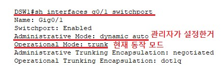

# Redundancy

##### 이중화


<br>

##### STP (Spanning Tree Protocol)


<br>

###### BPDU(Bridge PDU)


<br>

###### 경로 선출 단계

Root Bridge(=switch) 선출 

```
하나의 네트워크에서 기준이 되고, STP관리를 담당할 Root Switch선출
BPDU의 Bridge ID가 제일 낮은 Switch가 선택 됨
Bridge ID = 우선순위(priority) + MAC
1 순위 → 우선순위 낮은 장비
2 순위 → MAC 주소가 낮은 장비
```

<br>

전체 Switch 정보 확인


<br>

우선순위를 변경하여 root switch 를 변경

```
switch1(config)#spanning-tree vlan 1 priority 28672
```


<br>

원상복구

```
switch1(config)#spanning-tree vlan 1 priority 32768
```


<br>

Root Port 선출

```
Root Switch가 전송하는 BDPU를 전달받을 port
Root Switch에 가장 빨리 도달할 수 있는 port
비 Root Switch 당 하나의 Root port 선출

결정 순서
Cost Path가 적은 port → Root Switch까지 도달하기 위한 경로의 전체 비용
인접 Switch의 Bridge ID가 낮은 port
인접 Switch의 Port ID가 낮은 port
자신의 Port ID가 낮은 port
```


<br>

Desiganated Port 선출

```
Designated(Forwarding) port 선출
- Designated(Forwarding) port → Frame을 전달할 수 있는 port
- 각 세그먼트 마다 하나의 Designated port 선출
   세그먼트(Segment) → 장비와 장비가 연결된 구간
- 결정 순서
   Root Switch의 모든 port
   Cost Path가 적은 port → Root Switch까지 도달하기 위한 경로의 전체 비용
   인접 Switch의 Bridge ID가 낮은 port
   인접 Switch의 Port ID가 낮은 port
   자신의 Port ID가 낮은 port
```


<br>

non-designated Port 선출

```
Non Designated(Blocking) port 선출
- Non Designated(Blocking) port
   Loop를 방지하기 위해 임시로 비활성화 하는 port
   Frame은 차단하지만 BDPU는 정상 수신 함
- Root/Designated로 선출되지 못한 port
```

 port.jpg)

<br>

경로 선출


<br>

<br>

<br>

###### STP 상태 변화 


<br>

###### STP 문제점


<br>

<br>

<br>

##### PVST(Per VLAN Spanning Tree)


<br>

구성도


<br>

각 PC IP주소 설정


<br>

각 Switch 별 VLan 설정


이런식으로 5개의 Switch 설정을 해주시면 됩니다.

<br>

DSW1 - SVI 에 주소 입력


<br>

 ASW3,4 에  PC1~4 까지 연결된 인터페이스에 ACCESS port 설정


<br>

각 ASW , DSW 에  Trunk  설정 

```
ASW1(config)#int f0/2
ASW1(config-if)#switchport mode trunk 
ASW1(config-if)#
%LINEPROTO-5-UPDOWN: Line protocol on Interface FastEthernet0/2, changed state to down
%LINEPROTO-5-UPDOWN: Line protocol on Interface FastEthernet0/2, changed state to up
ASW1(config-if)#switchport trunk allowed vlan 10,20

ASW1(config)#int f0/3
ASW1(config-if)#switchport mode trunk 
ASW1(config-if)#
%LINEPROTO-5-UPDOWN: Line protocol on Interface FastEthernet0/3, changed state to down
%LINEPROTO-5-UPDOWN: Line protocol on Interface FastEthernet0/3, changed state to up
ASW1(config-if)#switchport trunk allowed vlan 10,20

ASW1(config)#int f0/1
ASW1(config-if)#switchport mode trunk 
ASW1(config-if)#
%LINEPROTO-5-UPDOWN: Line protocol on Interface FastEthernet0/1, changed state to down
%LINEPROTO-5-UPDOWN: Line protocol on Interface FastEthernet0/1, changed state to up
ASW1(config-if)#switchport trunk allowed vlan 10,20

ASW1(config)#int g0/1
ASW1(config-if)#switchport mode trunk 
ASW1(config-if)#
%LINEPROTO-5-UPDOWN: Line protocol on Interface GigabitEthernet0/1, changed state to down
%LINEPROTO-5-UPDOWN: Line protocol on Interface GigabitEthernet0/1, changed state to up
ASW1(config-if)#switchport trunk allowed vlan 10,20

이런식으로 Switch에 연결되어 있는 모든 port를 해주시면 됩니다.
```

<br>

VLAN 간 통신 확인


<br>

왜 L3(DSW) 에는 설정을 안했는 Trunk  가 되는가? 



<br>

InterVLAN  설정 후 점검 


각 G/W 까지는 통신이 되나 다른 VLAN의 PC까지는 아직 통신이 되지 않습니다.

이유는 아직 L3 Swtich를 router로 사용 하도록 설정을 하지 않았기 때문 입니다.

<br>

L3 switch 가 라우터가 되도록 설정 


<br>

InterVlan 확인


<br>

root switch(bridge) 를 확인


<br>

PVST 적용


<br>

root switch  이중화


<br>

<br>

<br>

##### Link 이중화


<br>


###### L2 etherchannel

구성도


<br>

각 PC 주소 입력


<br>

각 스위치별로 사용될 인터페이스 범위 입력 


```
-- 양쪽 스위치 동일 
Switch(config-if-range)#interface range f0/1-4
```

<br>

etherchannel 협상시 사용할 프로토콜 지정 > 활성화


```
LAcP:Link Aggregation , 국제표준
PAgP:Port Aggregation , cisco 전용 

-- 양쪽 스위치 모두 
Switch(config-if-range)#channel-protocol lacp 
Switch(config-if-range)#channel-group 1 mode active
Switch(config-if-range)#

-- 논리적인 포트 생성 메시지를 확인 
Creating a port-channel interface Port-channel 1

-- 새로운 인터페이스 진입
Switch(config)#interface port-channel 1

-- etherchannel 정보 확인
Switch#sh etherchannel summary
```

<br>

양쪽 통신 테스트


이 port 4개 중에서 한개의 선을 끊더라도 통신이 잘 되는것을 확인 할 수 있습니다.

<br>

<br>

<br>

###### L3 etherchaanel

구성도


<br>

각 PC 주소 입력


<br>

각 Switch별 SVI 를 설정


```
L3_01(config)#interface vlan 1
L3_01(config-if)#ip address 192.168.1.254 255.255.255.0
L3_01(config-if)#no sh

L3_02(config)#interface vlan 1
L3_02(config-if)#ip address 192.168.2.254 255.255.255.0
L3_02(config-if)#no sh
```

<br>

Port-channel 인터페이스 설정


```
-- 사용될 물리적 인터페이스의 범위 설정
L3_01(config)#interface range f0/1-4

-- etherchannel 협상시 사용할 프로토콜 설정 
L3_01(config-if-range)#channel-protocol lacp

-- 활성화
L3_01(config-if-range)#channel-group 1 mode active

-- 논리적 인터페이스 생성 메시지 확인
Creating a port-channel interface Port-channel 1

-- 논리적 인터페이스 진입
L3_01(config)#int port-channel 1
L3_01(config-if)#

-- 논리 채널 인터페이스 확인
L3_01(config-if)#do sh etherchannel summary

-- 스위치 포트 해제 
L3_01(config-if)#no switchport 

-- 주소 입력
L3_01(config-if)#ip addr 1.1.1.1 255.0.0.0
```

<br>

라우터 선언 및 라우팅 테이블 설정 


```
-- 라우터 선언
L3_01(config)#ip routing
L3_01(config)#do sh ip routing

-- 라우팅 테이블 설정 
L3_01(config)#ip route 192.168.2.0 255.255.255.0 1.1.1.2
L3_02(config)#ip route 192.168.1.0 255.255.255.0 1.1.1.1
```

<br>

<br>

<br>

###### Teaming

구성도


<br>

인터페이스 설정

```
-- slave 인터페이스 설정 
[root@localhost network-scripts]# vim ./ifcfg-ens33
PROXY_METHOD=none
BROWSER_ONLY=no
BOOTPROTO=dhcp
DEFROUTE=yes
IPV4_FAILURE_FATAL=no
IPV6INIT=yes
IPV6_AUTOCONF=yes
IPV6_DEFROUTE=yes
IPV6_FAILURE_FATAL=no
IPV6_ADDR_GEN_MODE=stable-privacy
NAME=ens33
UUID=cad76a87-2f29-35f4-891b-73b7c4daa879
DEVICE=ens33
ONBOOT=no

[root@localhost network-scripts]# vim ./ifcfg-ens32
TYPE=Ethernet
PROXY_METHOD=none
BROWSER_ONLY=no
BOOTPROTO=dhcp
DEFROUTE=yes
IPV4_FAILURE_FATAL=no
IPV6INIT=yes
IPV6_AUTOCONF=yes
IPV6_DEFROUTE=yes
IPV6_FAILURE_FATAL=no
IPV6_ADDR_GEN_MODE=stable-privacy
NAME=ens32
UUID=c79b0dea-fa9e-4e93-b540-5e621db444fe
DEVICE=ens32
ONBOOT=no
~

-- NetworkManager 다시 시작후 적용된 내용 확인 
[root@localhost ~]# systemctl restart NetworkManager
[root@localhost ~]# nmcli con
NAME    UUID                                  TYPE      DEVICE 
ens32   c79b0dea-fa9e-4e93-b540-5e621db444fe  ethernet  ens32  
ens33   cad76a87-2f29-35f4-891b-73b7c4daa879  ethernet  ens33  
virbr0  26447ce4-3f70-42d3-8da3-9d4d301910b8  bridge    virbr0
```

<br>

NetworkManager 상태 확인

```
[root@localhost ~]# systemctl status NetworkManager
● NetworkManager.service - Network Manager
   Loaded: loaded (/usr/lib/systemd/system/NetworkManager.service; enabled; vendor preset: enabled)
   Active: active (running) since 월 2022-11-14 20:47:39 KST; 6min ago
     Docs: man:NetworkManager(8)
 Main PID: 3005 (NetworkManager)
    Tasks: 5
   CGroup: /system.slice/NetworkManager.service
           ├─3005 /usr/sbin/NetworkManager --no-daemon
           ├─3023 /sbin/dhclient -d -q -sf /usr/libexec/nm-dhcp-helper -pf /v...
           └─3026 /sbin/dhclient -d -q -sf /usr/libexec/nm-dhcp-helper -pf /v...
```

<br>

어댑터 및 인터페이스 확인

```
[root@localhost ~]# ip link
1: lo: <LOOPBACK,UP,LOWER_UP> mtu 65536 qdisc noqueue state UNKNOWN mode DEFAULT group default qlen 1000
    link/loopback 00:00:00:00:00:00 brd 00:00:00:00:00:00
2: ens32: <BROADCAST,MULTICAST,UP,LOWER_UP> mtu 1500 qdisc pfifo_fast state UP mode DEFAULT group default qlen 1000
    link/ether 00:0c:29:f9:e3:9a brd ff:ff:ff:ff:ff:ff
3: ens33: <BROADCAST,MULTICAST,UP,LOWER_UP> mtu 1500 qdisc pfifo_fast state UP mode DEFAULT group default qlen 1000
    link/ether 00:0c:29:f9:e3:a4 brd ff:ff:ff:ff:ff:ff
4: virbr0: <NO-CARRIER,BROADCAST,MULTICAST,UP> mtu 1500 qdisc noqueue state DOWN mode DEFAULT group default qlen 1000
    link/ether 52:54:00:5e:76:2a brd ff:ff:ff:ff:ff:ff
5: virbr0-nic: <BROADCAST,MULTICAST> mtu 1500 qdisc pfifo_fast master virbr0 state DOWN mode DEFAULT group default qlen 1000
    link/ether 52:54:00:5e:76:2a brd ff:ff:ff:ff:ff:ff


[root@localhost ~]# nmcli device status 
DEVICE      TYPE      STATE          CONNECTION 
ens32       ethernet  연결됨         ens32      
virbr0      bridge    연결됨         virbr0     
ens33       ethernet  연결됨         ens33      
lo          loopback  관리되지 않음  --         
virbr0-nic  tun       관리되지 않음  --
```

<br>

teaming 0 이라는 이름으로 master 인터페이스를 생성 

```
# nmcli con add con-name teaming0 type team ifname teaming0 config  '{ "runner":{"name":"activebackup","hwaddr_policy":"by_active"}, "link_wath":{"name":"ethtool","delay_up":2500,"delay_down":1000}, "ports":{"ens32":{"prio":-10,"sticky":true},"ens33":{"prio":100}}}'

[root@localhost ~]# nmcli connection show 
NAME      UUID                                  TYPE      DEVICE   
teaming0  5bfd0455-58bf-4167-9b11-29776876a8ae  team      teaming0 
ens32     c79b0dea-fa9e-4e93-b540-5e621db444fe  ethernet  ens32    
ens33     cad76a87-2f29-35f4-891b-73b7c4daa879  ethernet  ens33    
virbr0    26447ce4-3f70-42d3-8da3-9d4d301910b8  bridge    virbr0
```

<br>

ens32 , ens33 이름으로 slave 로 지정

```
[root@localhost ~]# nmcli connection  add con-name teaming0-port1 type team-slave ifname ens32 master teaming0
Warning: There are 2 other connections with the name 'teaming0-port1'. Reference the connection by its uuid 'c60e0524-efa3-4c74-8027-3a40b11fae0b'
연결 'teaming0-port1' (c60e0524-efa3-4c74-8027-3a40b11fae0b)이 성공적으로 추가되었습니다.
[root@localhost ~]# nmcli connection  add con-name teaming0-port2 type team-slave ifname ens33 master teaming0
연결 'teaming0-port2' (a38fff1f-608c-4977-a02a-599926f9dfd5)이 성공적으로 추가되었습니다.


[root@localhost ~]# nmcli connection show 
NAME            UUID                                  TYPE      DEVICE   
teaming0        5bfd0455-58bf-4167-9b11-29776876a8ae  team      teaming0 
ens32           c79b0dea-fa9e-4e93-b540-5e621db444fe  ethernet  ens32    
ens33           cad76a87-2f29-35f4-891b-73b7c4daa879  ethernet  ens33    
virbr0          26447ce4-3f70-42d3-8da3-9d4d301910b8  bridge    virbr0   
teaming0-port1  ef4a7136-64e7-47b7-85f7-468ff604075d  ethernet  --       
teaming0-port2  62c0c18a-a0da-4bea-b7a7-d95236a1dff5  ethernet  --
```

<br>

teaming0 인터페이스에 주소 입력 

```
-- teaming0 인터페이스에 주소 입력
# nmcli connection modify teaming0 ipv4.address 172.16.0.190/24 ipv4.gateway 172.16.0.254 ipv4.dns 203.248.252.2 ipv4.method manual connection.autoconnect yes
```

<br>

slave > master 순으로 활성화

```
[root@localhost ~]# nmcli connection up teaming0-port1
연결이 성공적으로 활성화되었습니다 (D-Bus 활성 경로: /org/freedesktop/NetworkManager/ActiveConnection/5)
[root@localhost ~]# nmcli connection up teaming0-port2
연결이 성공적으로 활성화되었습니다 (D-Bus 활성 경로: /org/freedesktop/NetworkManager/ActiveConnection/6)
[root@localhost ~]# nmcli connection up teaming0
Connection successfully activated (master waiting for slaves) (D-Bus active path: /org/freedesktop/NetworkManager/ActiveConnection/7)

[root@localhost ~]# nmcli connection reload
[root@localhost ~]# nmcli connection show 
NAME            UUID                                  TYPE      DEVICE   
teaming0        5bfd0455-58bf-4167-9b11-29776876a8ae  team      teaming0 
virbr0          26447ce4-3f70-42d3-8da3-9d4d301910b8  bridge    virbr0   
teaming0-port1  ef4a7136-64e7-47b7-85f7-468ff604075d  ethernet  ens32    
teaming0-port2  62c0c18a-a0da-4bea-b7a7-d95236a1dff5  ethernet  ens33    
ens32           c79b0dea-fa9e-4e93-b540-5e621db444fe  ethernet  --       
ens33           cad76a87-2f29-35f4-891b-73b7c4daa879  ethernet  --
```

<br>

teaming 확인

```
[root@localhost ~]# teamnl teaming0 ports
 3: ens33: up 1000Mbit FD 
 2: ens32: up 1000Mbit FD 

[root@localhost ~]# teamdctl teaming0 state
setup:
  runner: activebackup
ports:
  ens32
    link watches:
      link summary: up
      instance[link_watch_0]:
        name: ethtool
        link: up
        down count: 0
  ens33
    link watches:
      link summary: up
      instance[link_watch_0]:
        name: ethtool
        link: up
        down count: 0
runner:
  active port: ens32


[root@localhost ~]# ifconfig teaming0
teaming0: flags=4163<UP,BROADCAST,RUNNING,MULTICAST>  mtu 1500
        inet 172.16.0.190  netmask 255.255.255.0  broadcast 172.16.0.255
        inet6 fe80::1c7c:a226:b06a:ff  prefixlen 64  scopeid 0x20<link>
        ether 00:0c:29:f9:e3:9a  txqueuelen 1000  (Ethernet)
        RX packets 5  bytes 638 (638.0 B)
        RX errors 0  dropped 0  overruns 0  frame 0
        TX packets 41  bytes 5557 (5.4 KiB)
        TX errors 0  dropped 0 overruns 0  carrier 0  collisions 0

[root@localhost ~]# ping www.google.com
PING www.google.com (172.217.25.4) 56(84) bytes of data.
64 bytes from hkg07s24-in-f4.1e100.net (172.217.25.4): icmp_seq=1 ttl=128 time=45.9 ms
64 bytes from hkg07s24-in-f4.1e100.net (172.217.25.4): icmp_seq=2 ttl=128 time=44.9 ms
```

<br>

active-backup test

```
중간에 ens32 를 링크 끊는다

다시 확인 
[root@localhost network-scripts]# teamdctl teaming0 state
setup:
  runner: activebackup
ports:
  ens32
    link watches:
      link summary: down
      instance[link_watch_0]:
        name: ethtool
        link: down
        down count: 1
  ens33
    link watches:
      link summary: up
      instance[link_watch_0]:
        name: ethtool
        link: up
        down count: 0
runner:
  active port: ens33
```

<br>

<br>

<br>

##### Gateway 이중화


<br>

###### VRRP


<br>

구성도


<br>

PC 에 주소 입력


<br>

각 라우터에 인터페이스를 설정


<br>

구간별 통신 체크


<br>

VRRP

```
Master:R1]

R1(config)#int f0/1
R1(config-if)#vrrp 1 ip 10.10.10.254    -- Virtual IP Adddress
R1(config-if)#vrrp 1 priority 120       -- 우선순위 설정
R1(config-if)#vrrp 1 timers advertise 5 -- 5초 마다 체크
R1(config-if)#exit
R1(config)#track 1 interface fastEthernet 0/0 line-protocol    -- Tracking 정책 : Uplink 모니터링 

R1(config)#int f0/1
R1(config)#vrrp 1 track 1 decrement 30        -- Tracking 중 문제발생시 우선순위 를 감소 
R1(config-if)#vrrp 1 preempt delay minimum 5  -- 최소 5초후에 변경과정 활성화 
R1(config-if)#vrrp 1 authentication md5 key-string 0 aaa  -- master-backup 간 인증키 

Backup:R2]
R2(config)#int f0/1
R2(config-if)#vrrp 1 ip 10.10.10.254
R2(config-if)#vrrp 1 priority 100          --  우선순위를 Master 보다 낮게 설정 
R2(config-if)#vrrp 1 timers learn          -- Master의 타이머값 그대로 사용
R2(config-if)#vrrp 1 authentication md5 key-string 0 aaa 
```

<br>

구간별 통신 체크


<br>VRRP 정보 확인


<br>

inside link 변화 확인

링크가 끊어지는 경우 G/W 의 변화

Master 로 가는 링크를 임시 삭제


<br>

uplink 의 변화(outside 쪽 link)

NAT-PAT 설정

```
Master:R1]
R1(config)#access-list 1 permit 10.10.10.0 0.0.0.255
R1(config)#int f0/0
R1(config-if)#ip nat outside
R1(config-if)#int f0/1
R1(config-if)#ip nat inside
R1(config)#ip nat inside source list 1 interface f0/1 overload

Backup:R2]
R2(config)#access-list 1 permit 10.10.10.0 0.0.0.255
R2(config)#int f0/0
R2(config-if)#ip nat outside
R2(config-if)#int f0/1
R2(config-if)#ip nat inside
R2(config-if)#exit
R2(config)#ip nat inside source list 1 interface f0/1 overload
```

<br>

Master 의 interface 를 shutdown

```
R1(config)#int f0/0
R1(config-if)#sh
R1(config-if)#
*Mar  1 01:43:57.651: %TRACKING-5-STATE: 1 interface Fa0/1 line-protocol Up->Down
R1(config-if)#
*Mar  1 01:43:59.651: %LINK-5-CHANGED: Interface FastEthernet0/0, changed state to administratively down
*Mar  1 01:44:00.651: %LINEPROTO-5-UPDOWN: Line protocol on Interface FastEthernet0/0, changed state to down  -- Tra

R2(config)#
*Mar  1 01:41:42.775: %VRRP-6-STATECHANGE: Fa0/1 Grp 1 state Backup -> Master


PC1> ping 8.8.8.8
84 bytes from 8.8.8.8 icmp_seq=1 ttl=127 time=76.187 ms
*10.10.10.201 icmp_seq=2 ttl=255 time=15.824 ms (ICMP type:3, code:1, Destination host unreachable)
84 bytes from 8.8.8.8 icmp_seq=3 ttl=127 time=61.015 ms
84 bytes from 8.8.8.8 icmp_seq=4 ttl=127 time=61.774 ms
84 bytes from 8.8.8.8 icmp_seq=5 ttl=127 time=60.591 ms
```

<br>

Master 의 interface 를 no shutdown

```
R1(config-if)#no sh
R1(config-if)#
*Mar  1 01:45:42.607: %TRACKING-5-STATE: 1 interface Fa0/0 line-protocol Down->Up
R1(config-if)#
*Mar  1 01:45:44.599: %LINK-3-UPDOWN: Interface FastEthernet0/0, changed state to up
*Mar  1 01:45:45.599: %LINEPROTO-5-UPDOWN: Line protocol on Interface FastEthernet0/0, changed state to up

R2(config)#
*Mar  1 01:43:20.155: %VRRP-6-STATECHANGE: Fa0/1 Grp 1 state Master -> Backup
```

<br>
