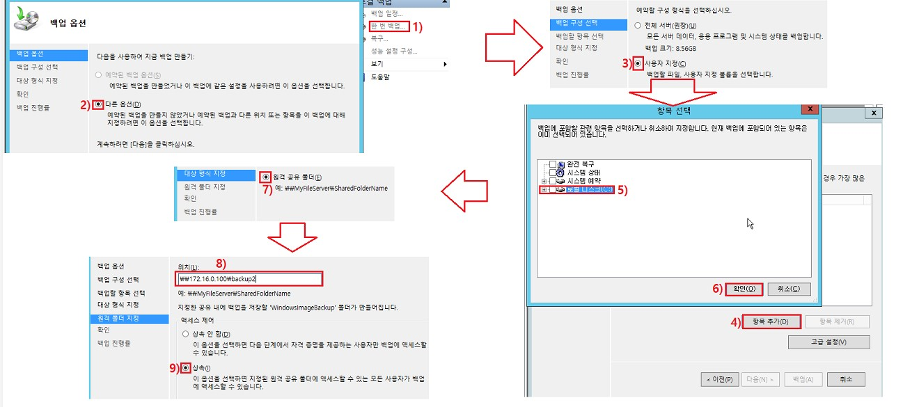

# Backup


<br>

구성도


<br>

2003 -> 디스크 추가


<br>

2003 -> 공유폴더 생성 후 확인


<br>

##### Full Backup

backup service 설치


```
관리도구 > 서버 관리자 > 역할 및 기능 추가 
설치 유형 > 역할 및 기능 기반 설치
서버선택 : 현재 서버
서버역할 > 선택 X 
기능 > Windows Server 백업 > 필요한 경우 대상 서버 다시 시작 체크 > 설치
```

<br>

backup 


```
관리도구 > Windows Server 백업
작업 > 로컬 백업 > 한번 백업 > 다음 
백업 구성 선택 : 전체 서버
대상 형식 지정 : 원격 공유 폴더 
원격 폴더 지정 : 위치 - \\172.16.0.101\backup_1 , 액세스 제어 - 상속
다음 > 백업
```

<br>

backup 확인


<br>

##### Restore

디스크에서 내용을 삭제


```
2012:backup]
c:\program files\internet Explorer  삭제
```

<br>

백업본에서 그대로 복원 


```
관리도구 > Windows Server 백업 
> 로컬 백업 > 복구 >  
시작 : 다른 위치에 저장된 백업 체크
위치유형 지정 :  원격 공유 폴더 체크
원격폴더지정 :  사용할 ~~~ - \\172.16.0.101\backup_1
백업날짜선택 : 해당 날짜 선택
복구유형선택 : 파일 및 폴더 선택
복구할 항목 선택 : 사용가능한 항목 - c:~~ google 찾아서 선택 
복구옵션 지정 : 다른위치 선택 , 복사본을 만들어 두버전 모두 유지 
확인 : 복구항목 내용 확인
```

<br>

복원 확인


<br>

<br>

<br>

##### Incremental Backup

- 첫번째 전체 백업 , 두번째 부터 증분백업

백업 옵션 수정


```
작업 > 로컬 백업 > 성능 설정 및 구성 
백업 성능 최적화 
> 사용자 지정 > 로컬디스크 백업 옵션 : 증분 백업
```

<br>

Backup



```
한번 백업 >
백업 옵션 : 다른 옵션
백업 구성 선택 : 사용자 지정 
백업할 항목 선택 : 항목 추가 > 로컬 디스크 C: 선택
대상형식 지정 : 원격공유폴더 > \\172.16.0.101\backup_2 , 액세스제어:상속
다음 > 백업
```

<br>

바탕화면에 폴더 3개 정도 생성 후 다시 백업


<br>

<br>

<br>

#### Linux Backup

##### tar 를 이용한 백업

구성도


<br>

###### 환경 설정

구간 통신


<br>

Backup -> 실습용 디렉터리 생성


<br>

Backup -> 백업할 대상 파일을 생성


<br>

###### Full backup : 현재 시점의 /data 를 전체 백업하고 확인


<br>

###### Incremental backup

증분백업의 첫번째 백업 : Full backup


<br>

파일 추가


<br>

증분 백업의 두번째 백업 : Incremental backup


<br>

파일 추가


<br>

증분 백업의 세번째 백업 : Incremental backup


<br>증분백업기록확인


사용자가 확인하기 어려움

<br>

<br>

<br>

