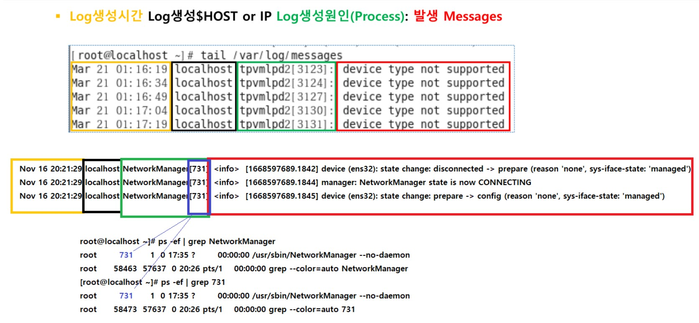

# 보안 로그 분석

<br>

#### 보안 사고

##### 보안 사고 정의

###### 사이버 공격 

- 인터넷을 통해 이루어지는 외부의 인가되지 않은 공격
-  인가되지 않은 공격에 의해, 내부의 중요 정보가 변조되거나 삭제되거나 유출되는 현상 

<br>

###### 사이버 공격 유형 

- 홈페이지 악성코드 유포  많은 홈페이지 서버에 악성코드 혹은 악성 스크립트를 은닉하여 홈페이지 접속자에게 악성코드를 유 포하는 유형 
- 홈페이지 변조 
  -  홈페이지 서버를 공격하여 홈페이지에서 보여지는 화면을 공격 자의 이미지로 변조하는 유형 
- DDOS(Distribution Denial of Service) 
  - 공격자가 감염시킨 수많은 좀비PC를 이용해, 다량의 패킷을 서 버 등의 특정 시스템으로 송신하여 서 비스를 마비시키는 공격 
- 피싱(Pishing) 
  - 지인 또는 유명 기업 등을 사칭한 메시지를 E-mail, 메신저, 문 자 등의 다양한 서비스를 통하여 공격 대상자에게 전송 
  - 메시지를 받은 사용자는 신뢰된 송신자로 오인하여 가짜 사이트 에 접속하여 정보 유출 및 금전적 피 해를 야기하는 공격 기법

<br>

- 파밍(Parming) 
  - 특정 Web Site에 악성코드를 삽입 후 해당 Site에 사용자의 접 속을 유도하는 공격기법 
  - 사용자는 해당 Site에 접속 시, 악성코드가 실행/설치되는 방식

<br>

- 스미싱(Smishing) 
  - 피싱과 유사한 방식으로, 문자메시지를 이용해 특정 Site에 접 속을 유도하는 공격 기법

<br>

##### LOG

- 감사 서비스를 통해 남겨지는 시스템의 동작 흔적
- 시스템의 오류 및 동작 상태에 대한 정보를 남김
- 차후 침투가 발생했을 때 공격자의 흔적을 추적하기 위한 필수 정보

<br>

로그파일 중 text 로 되어 있어서 읽히는 로그도 있고 명령어를 통해서만 확인 가능한 로그

```
- /var/log/wtmp
 계정의 로그인 및 로그아웃 정보를 저장
 로그인, 로그아웃, shutdown, booting 정보 등
 바이너리 파일

[root@localhost ~]# cat /var/log/wtmp 
~~~reboot3.10.0-1160.el7.x86_64.��bj�
                                      5~~~runlevel3.10.0-1160.el7.x86_64L��b���:0root:0e��b�
                                                                                              �
                                                                                               pts/0/0root:0���bpts/0/0root�šbBpts/0/0root:0�šb|�
5~~~runlevel3.10.0-1160.66.1.el7.x86_64HL�b�l7.x86_64Oʡb�:~~~reboot3.10.0-1160.66.1.el7.x86_64<L�bU�

�:0root:0�͡b�
K	pts/0/0root:0�͡bM*      pts/0/0root�͡b��	pts/0/0root:0�͡b�      pts/0/0root�͡b��

pts/0/0root:0�͡b$pts/0/0root�͡b&�V
pts/0/0root:02Ρbw<pts/0/0root�ϡb�]
                                  ~~~reboot3.10.0-1160.66.1.el7.x86_64��tc�
                                                                             5~~~runlevel3.10.0-1160.66.1.el7.x86_64��tc{

 확인 : last 명령으로 확인
[root@localhost ~]# last
root     pts/0        :0               Wed Nov 16 17:35   still logged in   
root     :0           :0               Wed Nov 16 17:35   still logged in   
reboot   system boot  3.10.0-1160.66.1 Wed Nov 16 17:34 - 19:22  (01:47)    
root     pts/0        :0               Thu Jun  9 19:40 - 19:46  (00:05)    
root     pts/0        :0               Thu Jun  9 19:39 - 19:39  (00:00)    
root     pts/0        :0               Thu Jun  9 19:39 - 19:39  (00:00)    
root     pts/0        :0               Thu Jun  9 19:39 - 19:39  (00:00)    
root     :0           :0               Thu Jun  9 19:39 - crash (159+21:55) 
reboot   system boot  3.10.0-1160.66.1 Fri Jun 10 04:38 - 19:22 (159+14:43) 
root     pts/0        :0               Thu Jun  9 19:14 - 19:24  (00:09)    
root     :0           :0               Thu Jun  9 19:14 - down   (00:09)    
reboot   system boot  3.10.0-1160.el7. Thu Jun  9 19:14 - 19:24  (00:10)    
root     pts/0        :0               Thu Jun  9 19:05 - 19:08  (00:03)    
root     pts/0        :0               Thu Jun  9 18:17 - 19:04  (00:47)    
root     :0           :0               Thu Jun  9 18:12 - crash  (01:01)    
reboot   system boot  3.10.0-1160.el7. Thu Jun  9 18:11 - 19:24  (01:13)
```

<br>

/var/run/utmp

```
 현재 로그인한 계정의 상태 정보를 저장
 로그인 계정 이름, 터미널, 원격 로그인 주소, 로그인 시간 등
 바이너리(binary) 파일 : text 명령어로는 읽히지 않음 
 확인 : w, who, who am i, ... 등의 명령으로 확

[root@localhost ~]# w
 19:23:03 up  1:47,  2 users,  load average: 0.02, 0.02, 0.05
USER     TTY      FROM             LOGIN@   IDLE   JCPU   PCPU WHAT
root     :0       :0               17:35   ?xdm?  55.37s  0.15s /usr/libexec/gnome-session-binary --session gnome-classic
root     pts/0    :0               17:35     ?     0.22s  0.00s w
[root@localhost ~]# who
root     :0           2022-11-16 17:35 (:0)
root     pts/0        2022-11-16 17:35 (:0)
[root@localhost ~]# who am i
root     pts/0        2022-11-16 17:35 (:0)
```

<br>

/var/log/lastlog

```
/var/log/lastlog
 계정의 최근 로그인 정보를 저장
 계정 이름, 터미널, 마지막 로그인 시간
 바이너리 파일
 확인 : lastlog 명령으로 확인

[root@localhost ~]# lastlog
사용자이름       포트     어디서           최근정보
root             :0                        수 11월 16 17:35:07 +0900 2022
bin                                        **한번도 로그인한 적이 없습니다**
~
systemd-network                            **한번도 로그인한 적이 없습니다**
dbus                                       **한번도 로그인한 적이 없습니다**
polkitd                                    **한번도 로그인한 적이 없습니다**
libstoragemgmt                             **한번도 로그인한 적이 없습니다**
colord                                     **한번도 로그인한 적이 없습니다**
rpc                                        **한번도 로그인한 적이 없습니다**
saned                                      **한번도 로그인한 적이 없습니다**
~
tcpdump                                    **한번도 로그인한 적이 없습니다**
ktest                                      **한번도 로그인한 적이 없습니다**
```

<br>

/var/log/btmp

```
 실패한 로그인 시도를 저장
 바이너리(실행) 파일
 확인 : lastb 명령으로 확인

-- ktest 로 로그인 실패를 해보고 root 로 로그인하여
[root@localhost ~]# lastb
btmp begins Thu Jun  9 19:18:33 2022

-- ktest 로그인 실패후 확인 
[root@localhost ~]# lastb
ktest    :0           :0               Wed Nov 16 19:25 - 19:25  (00:00)    
ktest    :0           :0               Wed Nov 16 19:25 - 19:25  (00:00)    
ktest    :0           :0               Wed Nov 16 19:25 - 19:25  (00:00)    

btmp begins Wed Nov 16 19:25:28 2022
```

<br>

/var/log/secure

```
- /var/log/secure
 Telnet, SSH, FTP 등 원격 로그인의 인증 정보를 저장
 텍스트 파일
 확인 : vim, tail/head, cat 등으로 확인

[root@localhost ~]# cat /var/log/secure | grep ssh

Nov 16 18:11:45 localhost sshd[54084]: Accepted password for root from 172.16.0.121 port 47910 ssh2
Nov 16 18:11:45 localhost sshd[54084]: pam_unix(sshd:session): session opened for user root by (uid=0)
Nov 16 18:11:46 localhost sshd[54084]: Received disconnect from 172.16.0.121 port 47910:11: disconnected by user
Nov 16 18:11:46 localhost sshd[54084]: Disconnected from 172.16.0.121 port 47910
Nov 16 18:11:46 localhost sshd[54084]: pam_unix(sshd:session): session closed for user root
Nov 16 18:13:02 localhost sshd[54117]: Accepted password for root from 172.16.0.121 port 47912 ssh2
Nov 16 18:13:02 localhost sshd[54117]: pam_unix(sshd:session): session opened for user root by (uid=0)
Nov 16 18:13:02 localhost sshd[54117]: Received disconnect from 172.16.0.121 port 47912:11: disconnected by user
Nov 16 18:13:02 localhost sshd[54117]: Disconnected from 172.16.0.121 port 47912
Nov 16 18:13:02 localhost sshd[54117]: pam_unix(sshd:session): session closed for user root
Nov 16 18:13:22 localhost sshd[54139]: Accepted password for root from 172.16.0.121 port 47914 ssh2
Nov 16 18:13:22 localhost sshd[54139]: pam_unix(sshd:session): session opened for user root by (uid=0)
Nov 16 18:13:22 localhost sshd[54139]: Received disconnect from 172.16.0.121 port 47914:11: disconnected by user
Nov 16 18:13:22 localhost sshd[54139]: Disconnected from 172.16.0.121 port 47914
Nov 16 18:13:22 localhost sshd[54139]: pam_unix(sshd:session): session closed for user root
Nov 16 19:27:54 localhost sshd[56228]: Accepted password for root from 172.16.0.1 port 64455 ssh2
Nov 16 19:27:54 localhost sshd[56228]: pam_unix(sshd:session): session opened for user root by (uid=0)
Nov 16 19:27:54 localhost sshd[56238]: Accepted password for root from 172.16.0.1 port 64456 ssh2
Nov 16 19:27:54 localhost sshd[56238]: pam_unix(sshd:session): session opened for user root by (uid=0)
```

<br>

/var/log/boot.log

```
/var/log/boot.log
 부팅 동작에서 서비스 데몬들의 실행 상태정보 저장
```

<br>

/var/log/cron

```
- /var/log/cron
 crond 서비스 동작에서 예약 작업의 동작 상태 정보 확인
 텍스트 파일
 확인 : vim, tail/head, cat 등으로 확인

# crontab -e 
* * * * * touch /root/1.txt

# tail /var/log/cron
[root@localhost ~]# tail /var/log/cron 
~
Nov 16 19:37:01 localhost CROND[56578]: (root) CMD (touch /root/1.txt)
```

<br>

~/.bash_history

```
~/.bash_history
/root/.bash_history
/home/ktest/.bash_history

 각 사용자 별로 수행한 명령을 기록하는 파일
 사용자가 사용하는 쉘에 따라 .sh_history, .history, .bash_history 등의 파일로 기록
 해킹 피해 시스템 분석 시 불법 사용자 계정이나 root 계정의 history 파일을 분석하면, 
공격자가 시스템에 접근한 후 수행한 명령어들을 확인할 수 있다는 점에서 매우 중요한 파일
 텍스트 파일
 확인 : vim, tail/head, cat 등으로 확인

[root@localhost ~]# cat /root/.bash_history 
ping www.google.com
ping www.google.com -c 4
exit
systemctl stop firewalld
systemctl mask firewalld
yum -y install iptables-services
systemctl disable iptables.service
systemctl status iptables.service
gedit
sestaus
sestatus
yum update
ping www.google.com -c 4
ping 172.16.0.101 -c 4
ping 172.16.0.100 -c 4
vim /root/backup.sh
ls /backup-home
date
date -s "2022-11-17 00:00:00"
mkdir /hometest
touch /hometest/file1
touch /hometest/file2
sh /root/backup.sh 
ls -al /backup-home/
date -s "2022-11-18 00:00:00"
touch /hometest/file1118
sh /root/backup.sh 
ls -al /backup-home/
date -s "2022-11-19 00:00:00"
touch /hometest/file1119
sh /root/backup.sh 
ls -al /backup-home/
date -s "2022-11-20 00:00:00"
touch /hometest/file1120
sh /root/backup.sh 
ls -al /backup-home/
tar tvf /backup-home/full-backup-2022-11-20.tar.gz 
crontab -e
crontab -u root


# history
# history -c 
```

<br>

 /var/log/yum.log 

```
 /var/log/yum.log 
[root@localhost ~]# cat /var/log/yum.log 
Jun 09 19:06:02 Installed: iptables-services-1.4.21-35.el7.x86_64
Jun 09 19:17:58 Updated: 1:grub2-common-2.02-0.87.0.1.el7.centos.9.noarch
Jun 09 19:17:58 Updated: centos-release-7-9.2009.1.el7.centos.x86_64
Jun 09 19:17:58 Updated: 1:control-center-filesystem-3.28.1-8.el7_9.x86_64
Jun 09 19:17:58 Updated: 32:bind-license-9.11.4-26.P2.el7_9.9.noarch
Jun 09 19:17:58 Updated: 1:grub2-pc-modules-2.02-0.87.0.1.el7.centos.9.noarch
Jun 09 19:17:58 Updated: kbd-misc-1.15.5-16.el7_9.noarch
Jun 09 19:17:58 Updated: mesa-filesystem-18.3.4-12.el7_9.x86_64
```

<br>

/var/log/sulog

```
su : 사용자 전환
 su 명령의 사용 내역 저장
 공격자가 일반 계정으로 접근한 후 su명령으로 관리자의 권한을 악용할 수 있으므로 불법적인 su명령 사용을 주기적으로 점검해야 함
 환경설정을 미리 해야 로그가 저장 됨
 텍스트 파일
 확인 : “su:session”으로 필터링해서 확인 - > 원래 /var/log/secure 에 존재함 
[root@localhost ~]# grep su-l /var/log/secure 
Nov 16 20:04:46 localhost su: pam_unix(su-l:session): session opened for user ktest by root(uid=0)
Nov 16 20:04:49 localhost su: pam_unix(su-l:session): session closed for user ktest
Nov 16 20:16:14 localhost su: pam_unix(su-l:session): session opened for user ktest by root(uid=0)
Nov 16 20:16:17 localhost su: pam_unix(su-l:session): session closed for user ktest


[root@localhost ~]# su - ktest
마지막 로그인 실패: 수 11월 16 19:25:36 KST 2022 :0에서 시작 일시 :0 
마지막 로그인 후 3 번의 로그인 시도가 실패하였습니다.  
[ktest@localhost ~]$ exit
logout
[root@localhost ~]# cat /var/log/sulog
cat: /var/log/sulog: 그런 파일이나 디렉터리가 없습니다

실습) sulog 만들기
/etc/login.defs           SULOG_FILE /var/log/sulog
/etc/rsyslog.conf         authpriv.info /var/log/sulog
/etc/logrotate.d/syslog   /var/log/sulog

# /etc/login.defs      
~
72 
73 SULOG_FILE      /var/log/sulog

# vim /etc/rsyslog.conf    : 실제 로그를 기록하는 데몬의 설정파일 
~
56 # The authpriv file has restricted access.
57 authpriv.*                                              /var/log/secure
58 authpriv.info                                           /var/log/sulog

# vim /etc/logrotate.d/syslog   
1 /var/log/sulog
2 /var/log/cron
3 /var/log/maillog
4 /var/log/messages
5 /var/log/secure
6 /var/log/spooler
7 {
8     missingok
9     sharedscripts
10     postrotate
11         /bin/kill -HUP `cat /var/run/syslogd.pid 2> /dev/null` 2> /dev/null || true
12     endscript
13 }

-- 관련 데몬 재시작
[root@localhost ~]# systemctl restart rsyslog
[root@localhost ~]# systemctl status rsyslog
● rsyslog.service - System Logging Service
   Loaded: loaded (/usr/lib/systemd/system/rsyslog.service; enabled; vendor preset: enabled)
   Active: active (running) since 수 2022-11-16 20:15:34 KST; 4s ago

-- su test
[root@localhost ~]# su - ktest
마지막 로그인: 수 11월 16 20:04:46 KST 2022 일시 pts/0
[ktest@localhost ~]$ exit
logout

-- sulog 확인
[root@localhost ~]# cat /var/log/sulog 
Nov 16 20:15:34 localhost polkitd[733]: Unregistered Authentication Agent for unix-process:57796:959230 (system bus name :1.355, object path /org/freedesktop/PolicyKit1/AuthenticationAgent, locale ko_KR.UTF-8) (disconnected from bus)
Nov 16 20:16:14 localhost su: pam_unix(su-l:session): session opened for user ktest by root(uid=0)
Nov 16 20:16:17 localhost su: pam_unix(su-l:session): session closed for user ktest
```

<br>

/var/log/messages

```
 시스템 동작에 대한 전반적인 모든 이벤트가 저장 됨
 로그인, 장치 동작, 시스템 설정 오류, 파일 시스템, 네트워크 연결 정보 등이 저장 됨
 텍스트 파일
 확인 : 필터링을 하거나 실시간 로그 확인 방법을 많이 사용 함
＞ [root@KH-Linux~]# cat /var/log/messages | grep [패턴]
＞ [root@KH-Linux~]# tail -f /var/log/messages

#systemctl restart network 
~

# tail -f /var/log/messages
Nov 16 20:21:28 localhost chronyd[714]: Can't synchronise: no selectable sources
Nov 16 20:21:28 localhost network: loopback 인터페이스 종료 중:   [  OK  ]
Nov 16 20:21:28 localhost systemd: Stopped LSB: Bring up/down networking.
Nov 16 20:21:28 localhost systemd: Starting LSB: Bring up/down networking...
Nov 16 20:21:29 localhost NetworkManager[731]: <info>  [1668597689.0456] device (lo): carrier: link connected
Nov 16 20:21:29 localhost network: loopback 인터페이스 활성화중 입니다:  [  OK  ]
Nov 16 20:21:29 localhost NetworkManager[731]: <info>  [1668597689.1830] agent-manager: req[0x55dc289e4de0, :1.395/nmcli-connect/0]: agent registered
```

<br>



```
[root@localhost ~]# pstree -np
systemd(1)─┬─systemd-journal(488)
           ├─lvmetad(515)
           ├─systemd-udevd(516)
           ├─auditd(646)─┬─{auditd}(647)
           │             └─audispd(648)─┬─sedispatch(650)
           │                            └─{audispd}(651)
           ├─avahi-daemon(675)───avahi-daemon(691)
           ├─VGAuthService(677)

[root@localhost ~]# ps -ef | grep 488
           PID     PPID
root        488      1  0 17:35 ?        00:00:00 /usr/lib/systemd/systemd-journald
root      58669  58568  0 20:30 pts/0    00:00:00 grep --color=auto 488
```

<br>

/var/log/httpd/access_log, /var/log/httpd/error_log

```
 웹 서버의 접속, 오류에 대한 기록 확인
 웹 서버에서 취약한 CGI 프로그램에 공격 수행 시 그에 대한 공격 로그도 이들 로그파일에 기록 됨
 텍스트 파일
 확인 : vim, tail/head, cat 등으로 확인
```

<br>

access_log

```
# tail -f /var/log/httpd/access_log
200.200.200.240 - - [17/Nov/2022:05:40:49 +0900] "GET / HTTP/1.1" 200 866 "-" "Mozilla/5.0 (Windows NT 10.0; Win64; x64) AppleWebKit/537.36 (KHTML, like Gecko) Chrome/107.0.0.0 Safari/537.36 Edg/107.0.1418.42"
200.200.200.240 - - [17/Nov/2022:05:40:49 +0900] "GET /head.php HTTP/1.1" 200 797 "http://200.200.200.205/" "Mozilla/5.0 (Windows NT 10.0; Win64; x64) AppleWebKit/537.36 (KHTML, like Gecko) Chrome/107.0.0.0 Safari/537.36 Edg/107.0.1418.42"

host:200.200.200.240]
http://200.200.200.205
```

<br>

error_log

```
1) 없는 페이지를 요청 할때 
# tail -f /var/log/httpd/error_log
u Nov 17 05:44:41 2022] [error] [client 200.200.200.240] script '/var/www/html/1.php' not found or unable to stat

host:200.200.200.240]
http://200.200.200.205/1.php


2) php 같은 WAS 의 문법문제가 생길때
# vim /var/www/html/t.php
<?php
phpinfo();
?>
```

<br>


