# rsyslog

- 시스템에 로그 메시지를 남기고 처리하는 프로그램과 설정파일을 모두 합쳐서 부르는 말로 logging Message Program 의 표준 
- Kernel 이나 System Util 에서 발생한 메시지를 rsyslogd Daemon이 전송 
  - /etc/rsyslog.conf 파일에 정의된 정보에 의해 Message를 기록 
  - /etc/rsyslog.conf 을 수정하여 로그의 저장 위치 및 파일 이름을 수정할 수 있음 - UDP 514 Port 사용

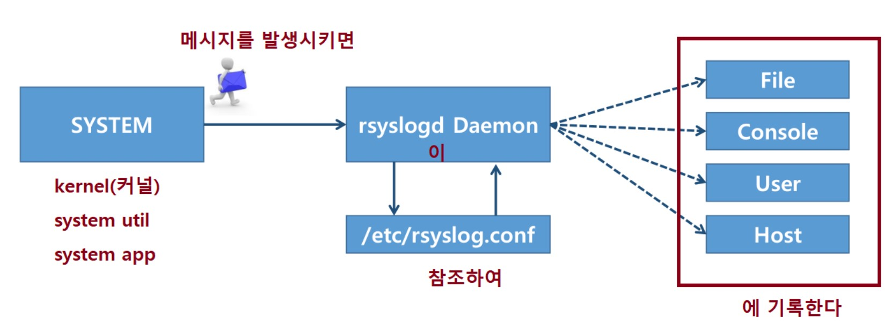

<br>

설치 확인

```
[root@localhost ~]# systemctl status rsyslog
```

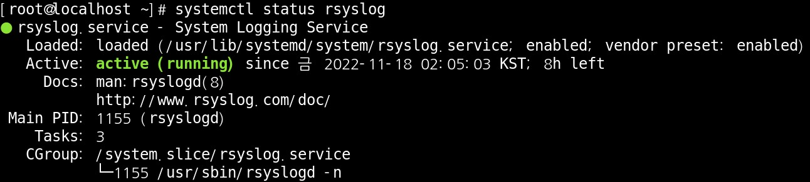

<br>

##### 기존 secure 로그파일의 이름을 다른파일이름으로 생성되도록 추가 

vim /etc/rsyslog.conf

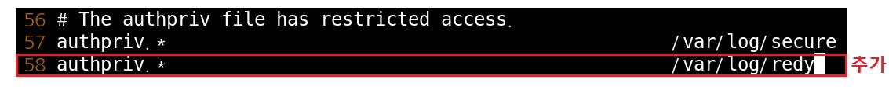

<br>

로그 파일 확인

```
[root@localhost ~]# ls -al /var/log/redy
```


<br>

rsyslog 데몬을 재시작후 로그파일 생성 된것을 확인 

```
[root@localhost ~]# systemctl restart rsyslog
[root@localhost ~]# ls -al /var/log/redy
```

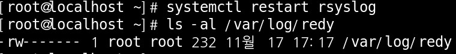

<br>

SSH  로그인 실패 를 몇번후 > 파일 확인

```
[root@localhost ~]# tail -20 /var/log/redy
```

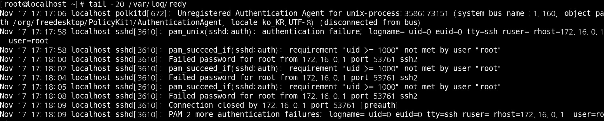

<br>

rsyslog 구조

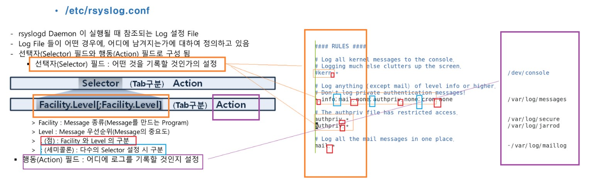

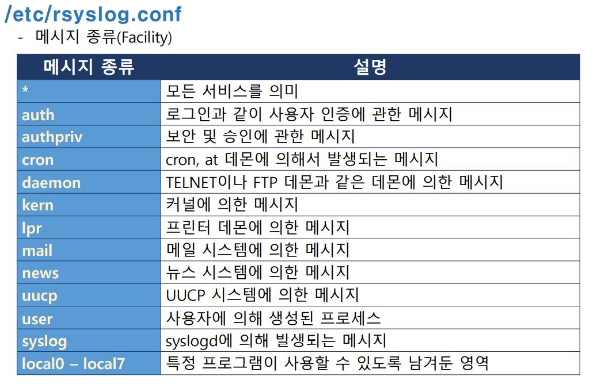

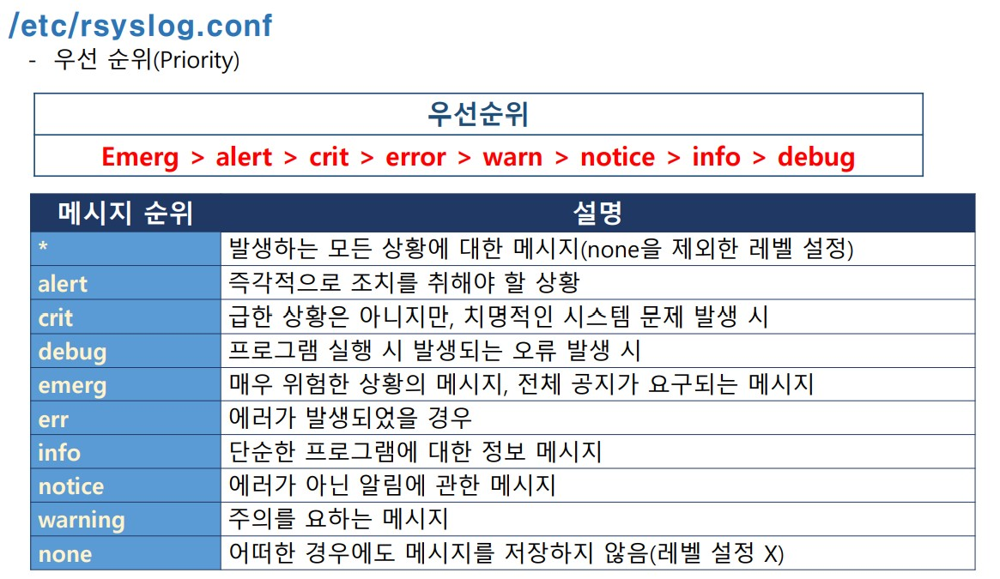

<br>

<br>

<br>

####  rsyslog action 

##### Device에 출력 : [device 명]

- action  : 어디에 로그를 기록한것인가

sulog 출력 관련 부분 을 다시 설정

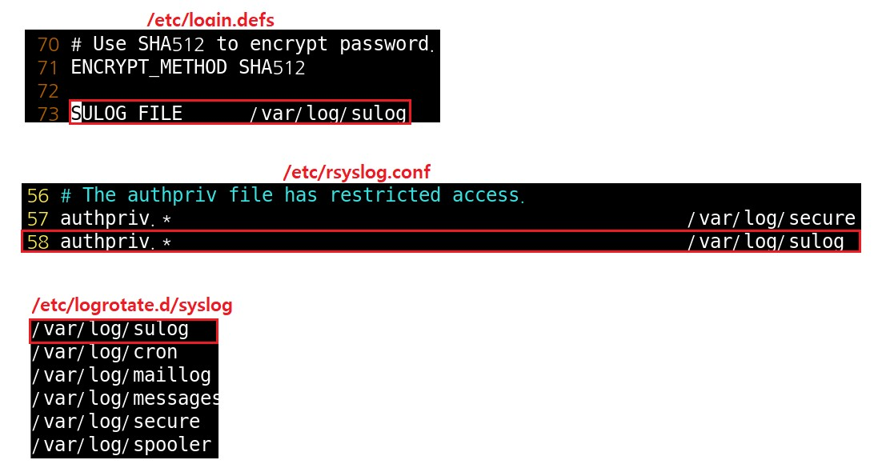

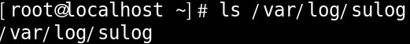

<br>

터미널 실행

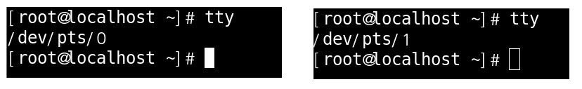

<br>

파일 편집

```
[root@localhost ~]# vim /etc/rsyslog.conf
```

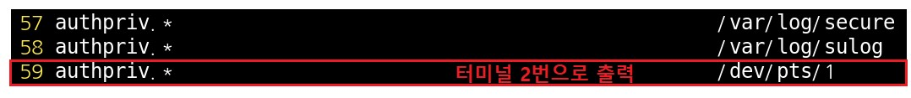

<br>

데몬 재시작 후 다른 터미널에서 su 테스트

```
[root@localhost ~]# systemctl restart rsyslog
```

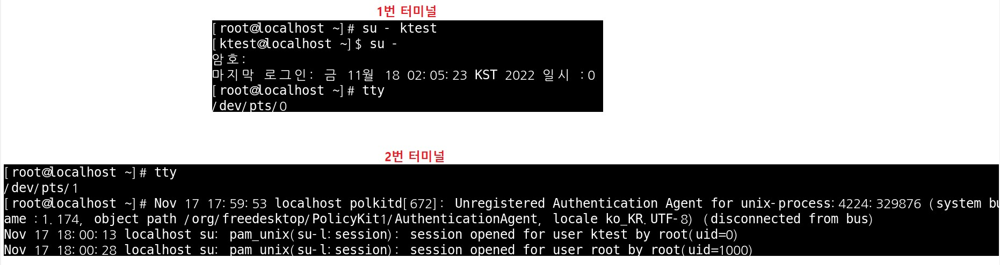

2번 터미널에 log 출력된거 확인

<br>

<br>

<br>

##### 계정에 전송 : [계정 명]

계정 관련 파일 편집

```
[root@localhost ~]# vim /etc/rsyslog.conf
```

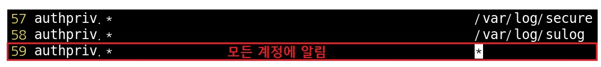

<br>

데몬 재시작 후 다른 터미널에서 su 테스트

```
[root@localhost ~]# systemctl restart rsyslog
```

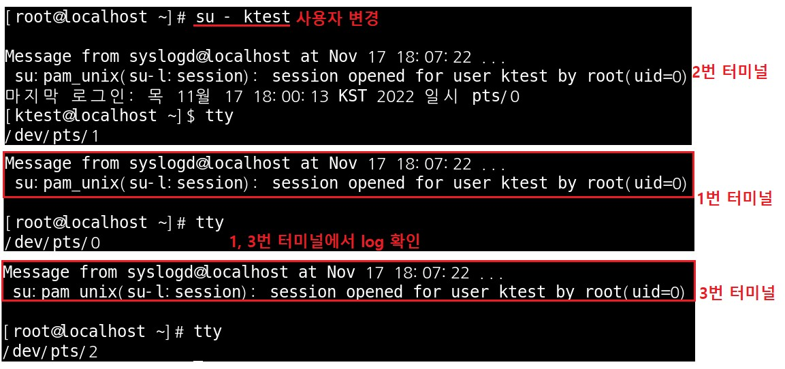

<br>

<br>

<br>