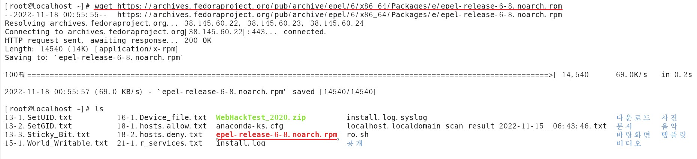
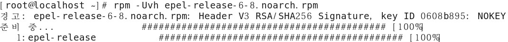
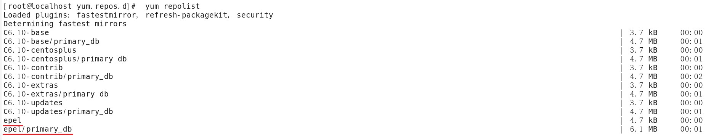
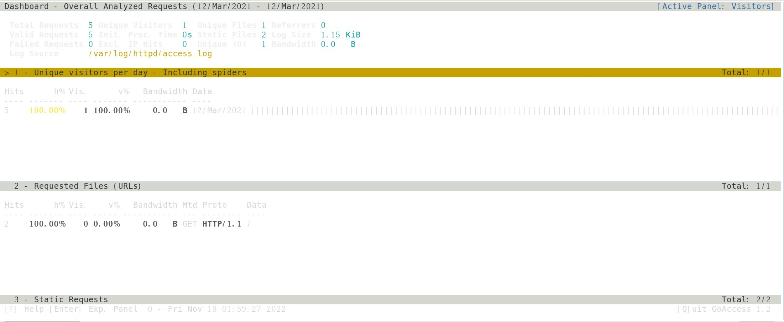
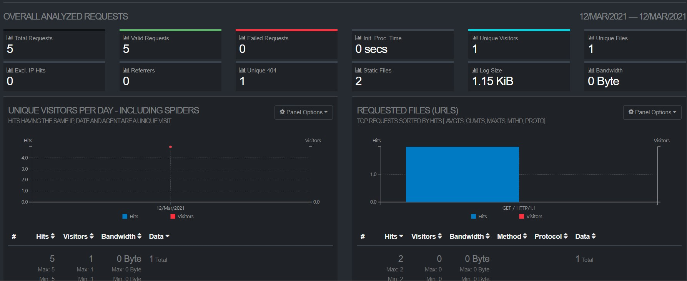
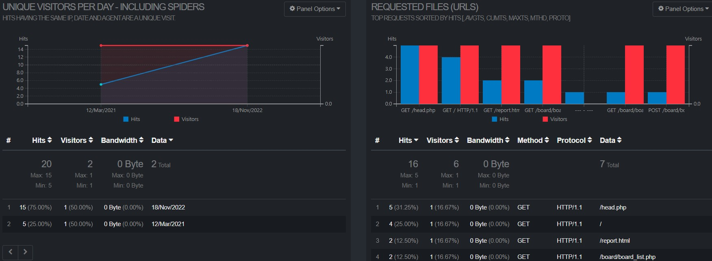

# 웹 로그 분석

GoAccess

- 오픈 소스 기반의 웹 서버 로그 분석 도구
- 공식 홈페이지 : https://goaccess.io/

<br>

주요 특징

- 다양한 웹 서버의 로그 포맷 지원
- 웹 브라우저를 사용한 분석 화면 제공
- 완벽한 실시간 분석

<br>

epel repository 파일 다운로드



```
wget https://archives.fedoraproject.org/pub/archive/epel/6/x86_64/Packages/e/epel-release-6-8.noarch.rpm
```

<br>

repository 파일 설치



```
rpm -Uvh epel-release-6-8.noarch.rpm 
```

<br>

repository 점검



```
[root@localhost ~]# yum clean all
[root@localhost ~]# yum repolist
```

<br>

goaccess package 설치


```
yum -y install goaccess
```

<br>

vim /etc/goaccess.conf

```
12 #
13 time-format %H:%M:%S
14 #

35 #
36 date-format %d/%b/%Y
37 #

69 # Common Log Format (CLF)
70 log-format %h %^[%d:%t %^] "%r" %s %b
71
```

<br>

httpd 재시작

```
service httpd restart
```

<br>

다양한 실행 방법

- 터미널 출력  로그 포맷 설정 후 터미널을 사용하여 실시간 통계 표시 ＞ 로그 포맷은 환경 설정 파일에 설정 또는 명령어 실행 시 옵션으로 설정 가능

```
-- httpd 접속로그를 활용 
[root@localhost ~]# goaccess /var/log/httpd/access_log
```



- 정적 HTML 출력  로그 파일의 내용을 구문 분석(파싱)하여 HTML 형식으로 저장, 웹 브라우저를 사용하여 통계 표시

```
[root@localhost ~]# service httpd restart
[root@localhost ~]# goaccess /var/log/httpd/access_log -o /var/www/html/report.html

web 접속 http://172.16.0.100/report.html
```



- 실시간 HTML 출력 
  - 로그 파일을 구문 분석(파싱)하여 실시간 HTML 보고서에 통계 표

```
[root@localhost ~]# goaccess /var/log/httpd/access_log -o /var/www/html/report.html --real-time-html
```



<br>

