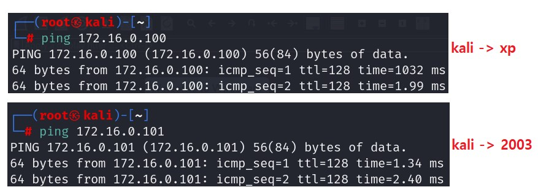
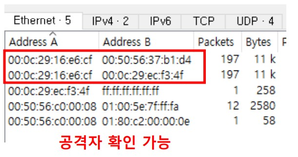

# 네트워크 공격 패킷 로그 분석

#### arp spoofing

```
중간자 공격의 시작 
대상 IP 주소에 대한 MAC 주소를 사칭
ARP(대상 IP 주소에 대한 맥주소를 확인)
- ARP Request : 대상 IP 주소에 대한 맥주소를 확인 요청 
- ARP Reply : 대상 IP 주소에 대한 맥주소를 확인 요청에 대한 응답

ARP Reply 를 반복하여 공격대상의 ARP Cache 를 변조 -> ARP Cache Poisoning
```

<br>

통신 확인



<br>

arpsoofing

```
Kali : 0.200
xp : 0.100
2003: 0.101

-- XP 에게 kali : 2003 의 MAC 주소를 가지고 있다고 spoofing 
# arpspoof -t 172.16.0.100(xp) 172.16.0.101(2003)

-- 2003 에게 kali : XP 의 MAC 주소를 가지고 있다고 spoofing 
# arpspoof -t 172.16.0.101(2003) 172.16.0.100(xp)
```

<br>



<br>

