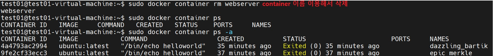

# docker

- APPLICATION 실행에 필요한 환경을 하나의 image 로 생성
  - 이미지를 이용하여 다양한 환경에서 실행
  - Docker 만 설치할수 있으면 어떤 OS 환경에서도 동일한 환경의 어플리케이션을 실행 가능

<br>

docker 실행 환경 확인


<br>

docker의 저장소 사용 확인


<br>

<br>

<br>

##### docker : container

docker 실행 해보기


<br>

docker  image pull(가져오기)


<br>

image pull(가져오기) 후 목록 확인


<br>

pull 한 docker image 을 기반으로 container 를 run(실행)


<br>

웹브라우저에서 컨테이너의 run(실행) 여부 확인 (ubuntu 20.04)


<br>

남아있는 container 목록 확인


<br>

container 중지


<br>

container 재시작


<br>

container ID 사용해서 정지


<br>

container 삭제



<br>

image 검색


<br>

centos7 image 설치


<br>

nginx 다시 설치


<br>

image run


<br>

확인


<br>

하나의 image로 2개의 container 생성


<br>

image 삭제


<br>

image 모두 삭제


<br>

container rename


<br>

사용하지 않는 container 를 prune(제거)


stop되어 있는 모든 container 삭제

<br>

가동중인 container 에 attach(접근)하여 파일을 cp(복사)


<br>

 docker 를 이용한 mariadb 설치


<br>

<br>

<br>

##### docker : image build

 nginx 의 container 의 html 파일을 추가하여 새로운 image 로 저장 


<br>


<br>


<br>


<br>


<br>

새로 생성된 image 를 reference 하여 새로운 컨테이너를 생성


**기존 컨테이너 종료후 새롭게 만들어진 이미지로 컨테이너를 생성하셔야 합니다.**

<br>

새로 생성된 이미지로 컨테이너 생성시 포트번호 다르게 


<br>

image backup


<br>

<br>

<br>

##### docker : image upload

[hub.docker.com](http://hub.docker.com/) 로그인 -> Repositories -> Create


<br>


<br>


<br>


<br>


<br>

<br>

<br>

##### docker : build with Dockerfile

###### Dockerfile 편집 I

디렉터리, 파일 만들기


<br>

image build 를 위한 Dockerfile 편집

```
$ sudo vim /home/test01/sample/Dockerfile

FROM centos:latest
```

<br>

작성된 Dockerfile 을 기반으로 image 를 build


<br>

원본이미지와 사본이미지를 비교


이름만 다르고 모든게 똑같다.

<br>

이름이 다른 도커파일 생성


<br>

별도 파일명으로 build


<br>

###### Dockerfile 편집 II

```
vi, ./Dockerfile 

FROM ubuntu:latest
RUN apt-get update && apt-get install -y -q nginx
CMD ["nginx","-g","daemon off;"]
```

<br>

작성된 Dockerfile 을 기반으로 image 를 build


<br>

Dockerfile backup v1


<br>

###### Dockerfile 편집 III

```
vim Dockerfile

FROM centos:latest
RUN echo hi it is shell style
RUN ["echo","hi it is isa exec style"]
RUN ["/bin/bash","-c","echo 'hi it is bash on exec style'"]
```

<br>

image build : run  할때 마다 이미지 생성


<br>

image 확인


<br>

Dockerfile backup v2


<br>

###### Dockerfile 편집 IV

```
vim Dockerfile

FROM ubuntu:latest
RUN apt-get -y update && apt-get -y upgrade
RUN apt-get -y install nginx
EXPOSE 80                                          << port 번호 지정
CMD ["nginx","-g","daemon off;"]

옵션 안주면 컨테이너를 foreground 에서 실행 할수가 없습니다.
```

<br>

작성된 Dockerfile 을 기반으로 image 를 build


<br>

image ref 하여 run


<br>

<br>

<br>

##### docker : network 

docker network  구조


<br>

 네트워크 드라이버 종류 확인 

```
test01@test01-virtual-machine:~/sample$ sudo docker network inspect bridge

[
    {
        "Name": "bridge",
        "Id": "1bc9a73d2134a70c077c9127de24e950d85070a1e6f8031549ddc01829657293",
        "Created": "2022-11-28T15:34:26.022779349+09:00",
        "Scope": "local",
        "Driver": "bridge",
        "EnableIPv6": false,
        "IPAM": {
            "Driver": "default",
            "Options": null,
            "Config": [
                {
                    "Subnet": "172.17.0.0/16",
                    "Gateway": "172.17.0.1"
                }
            ]
        },
        "Internal": false,
        "Attachable": false,
        "Ingress": false,
        "ConfigFrom": {
            "Network": ""
        },
        "ConfigOnly": false,
        "Containers": {},
        "Options": {
            "com.docker.network.bridge.default_bridge": "true",
            "com.docker.network.bridge.enable_icc": "true",
            "com.docker.network.bridge.enable_ip_masquerade": "true",
            "com.docker.network.bridge.host_binding_ipv4": "0.0.0.0",
            "com.docker.network.bridge.name": "docker0",
            "com.docker.network.driver.mtu": "1500"
        },
        "Labels": {}
    }
]
```

<br>

image 확인


<br>

nginx:latest image 를  reference  하여 container 를 run web_01,web_02


<br>

