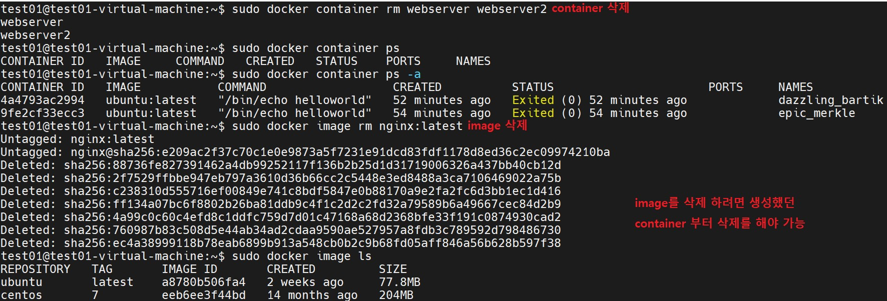
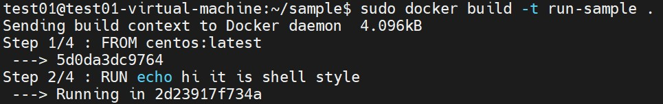
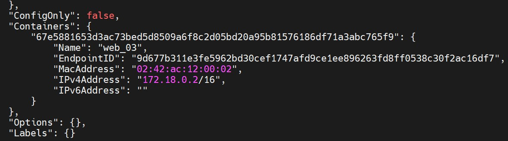
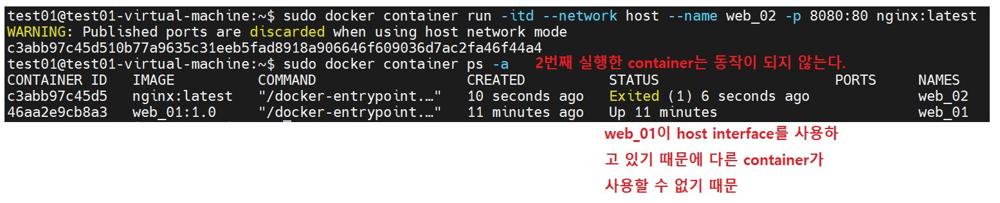
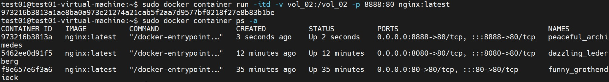
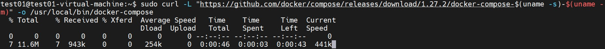

# docker

- APPLICATION 실행에 필요한 환경을 하나의 image 로 생성
  - 이미지를 이용하여 다양한 환경에서 실행
  - Docker 만 설치할수 있으면 어떤 OS 환경에서도 동일한 환경의 어플리케이션을 실행 가능

<br>

docker 실행 환경 확인


```
sudo docker system info
```

<br>

docker의 저장소 사용 확인


```
sudo docker system df
```

<br>

<br>

<br>

##### docker : container

docker 실행 해보기


```
sudo docker container run ubuntu:latest /bin/echo "helloworld"
```

<br>

docker  image pull(가져오기)


```
sudo docker image pull nginx
```

<br>

image pull(가져오기) 후 목록 확인


```
sudo docker image ls
```

<br>

pull 한 docker image 을 기반으로 container 를 run(실행)


```
sudo docker container run --name webserver -d -p 80:80 nginx:latest
```

<br>

웹브라우저에서 컨테이너의 run(실행) 여부 확인 (ubuntu 20.04)


<br>

남아있는 container 목록 확인


```
sudo docker containrt ps -a
```

<br>

container 중지


```
sudo docker container stop (NAME)
```

<br>

container 재시작


```
sudo docker container start (NAME)
```

<br>

container ID 사용해서 정지


```
sudo docker container stop (ID)
```

<br>

container 삭제


```
sudo docker container rm (ID)
```

<br>

image 검색


```
sudo docker search nginx
```

<br>

centos7 image 설치


```
sudo docker image pull centos:7
```

<br>

nginx 다시 설치


```
sudo docker image pull nginx
```

<br>

image run


```
sudo docker container run --name webserver -d -p 8080:80 nginx:latest
```

<br>

확인


<br>

하나의 image로 2개의 container 생성


```
sudo docker container run --name webserver2 -d -p 80:80 nginx:latest
```

<br>

image 삭제



```
sudo docker container rm webserver webserver2
```

<br>

image 모두 삭제


```
sudo docker image prune
sudo docker image rm $(sudo docker images -q)
sudo docker image rm -f $(sudo docker images -q)
```

<br>

container rename


```
sudo docker container rename test02 test22
```

<br>

사용하지 않는 container 를 prune(제거)


```
sudo docker container prune
```

stop되어 있는 모든 container 삭제

<br>

가동중인 container 에 attach(접근)하여 파일을 cp(복사)


```
sudo docker container run -it --name test01 centos:latest /bin/bash
sudo docker container cp test01:/100.sh /home/test01/100.sh
```

<br>

 docker 를 이용한 mariadb 설치


```
sudo docker search mariadb
sudo docker image pull mariadb
sudo docker image ls
sudo docker run --name mariadb_test -d -p 3306:3306 --restart=always -e MYSQL_ROOT_PASSWARD=P@ssw0rd mariadb:latest
```

<br>

<br>

<br>

##### docker : image build

 nginx 의 container 의 html 파일을 추가하여 새로운 image 로 저장 


```
sudo docker image pull nginx:latest
sudo docker container run --name web_01 -d -p 80:80 nginx:latest
```

<br>


<br>


```
sudo docker container exec -it web01 /bin/bash
cd /usr/share/nginx/html
mv index.html index.html.bak
echo web_01 > ./index.html
```

<br>


```
sudo docker container commit -a "Redy" web_01 web_01:1.0
```

<br>


```
sudo docker imaage inspect web_01:1.0
```

<br>

새로 생성된 image 를 reference 하여 새로운 컨테이너를 생성


```
sudo docker container run --name web_02 -d -p 80:80 web_01:1.0
```

**기존 컨테이너 종료후 새롭게 만들어진 이미지로 컨테이너를 생성하셔야 합니다.**

<br>

새로 생성된 이미지로 컨테이너 생성시 포트번호 다르게 


```
sudo docker container run --name web_02_clone -d -p 80:80 web_01:1.0
sudo docker container rm web_02_clone
sudo docker container run --name web_02_clone -d -p 8080:80 web_01:1.0
```

<br>

image backup


```
sudo docker image save -o export.tar web_01:1.0
sudo docker image rm web_01:1.0
sudo docker image load -i export.tar
```

<br>

<br>

<br>

##### docker : image upload

[hub.docker.com](http://hub.docker.com/) 로그인 -> Repositories -> Create


<br>


<br>


```
sudo docker image ls
```

<br>


```
sudo docker image push ddoyredy/webserver:tagname
```

<br>


```
sudo docker search ddoyredy
```

<br>

<br>

<br>

##### docker : build with Dockerfile

###### Dockerfile 편집 I

디렉터리, 파일 만들기


cd /home/test01

mkdir ./sample

sudo touch ./sample/Dockerfile

<br>

image build 를 위한 Dockerfile 편집

```
$ sudo vim /home/test01/sample/Dockerfile

FROM centos:latest
```

<br>

작성된 Dockerfile 을 기반으로 image 를 build


```
sudo docker build -t sample:1.0 /home/test01/sample
```

<br>

원본이미지와 사본이미지를 비교


```
sudo docker image ls | grep 231
```

이름만 다르고 모든게 똑같다.

<br>

이름이 다른 도커파일 생성


```
mv ./Dockerfile ./docker.conf
```

<br>

별도 파일명으로 build


```
sudo docker build -t sample:2.0./ -f docker.conf
```

<br>

###### Dockerfile 편집 II

```
vi, ./Dockerfile 

FROM ubuntu:latest
RUN apt-get update && apt-get install -y -q nginx
CMD ["nginx","-g","daemon off;"]
```

<br>

작성된 Dockerfile 을 기반으로 image 를 build


```
sudo docker build -t webapp:1.0 .
```

<br>

Dockerfile backup v1


<br>

###### Dockerfile 편집 III

```
vim Dockerfile

FROM centos:latest
RUN echo hi it is shell style
RUN ["echo","hi it is isa exec style"]
RUN ["/bin/bash","-c","echo 'hi it is bash on exec style'"]
```

<br>

image build : run  할때 마다 이미지 생성



```
sudo docker build -t run-sample .
```

<br>

image 확인


```
sudo docker image ls
```

<br>

Dockerfile backup v2


<br>

###### Dockerfile 편집 IV

```
vim Dockerfile

FROM ubuntu:latest
RUN apt-get -y update && apt-get -y upgrade
RUN apt-get -y install nginx
EXPOSE 80                                          << port 번호 지정
CMD ["nginx","-g","daemon off;"]

옵션 안주면 컨테이너를 foreground 에서 실행 할수가 없습니다.
```

<br>

작성된 Dockerfile 을 기반으로 image 를 build


```
sudo docker build -t cmd-sample . -f ./Dockerfile
```

<br>

image ref 하여 run


```
sudo docker container run -p 8080:80 --name web.02 -d cmd-sample
```


<br>

<br>

<br>

##### docker : network 

###### bridge

docker network  구조


```
sudo docker network ls
```

<br>

 네트워크 드라이버 종류 확인 

```
test01@test01-virtual-machine:~/sample$ sudo docker network inspect bridge

[
    {
        "Name": "bridge",
        "Id": "1bc9a73d2134a70c077c9127de24e950d85070a1e6f8031549ddc01829657293",
        "Created": "2022-11-28T15:34:26.022779349+09:00",
        "Scope": "local",
        "Driver": "bridge",
        "EnableIPv6": false,
        "IPAM": {
            "Driver": "default",
            "Options": null,
            "Config": [
                {
                    "Subnet": "172.17.0.0/16",
                    "Gateway": "172.17.0.1"
                }
            ]
        },
        "Internal": false,
        "Attachable": false,
        "Ingress": false,
        "ConfigFrom": {
            "Network": ""
        },
        "ConfigOnly": false,
        "Containers": {},
        "Options": {
            "com.docker.network.bridge.default_bridge": "true",
            "com.docker.network.bridge.enable_icc": "true",
            "com.docker.network.bridge.enable_ip_masquerade": "true",
            "com.docker.network.bridge.host_binding_ipv4": "0.0.0.0",
            "com.docker.network.bridge.name": "docker0",
            "com.docker.network.driver.mtu": "1500"
        },
        "Labels": {}
    }
]
```

<br>

image 확인


```
sudo docker image ls | grep nginx
```

<br>

nginx:latest image 를  reference  하여 container 를 run web_01,web_02


```
sudo docker run -it --name web_01 -d nginx /bin/bash
sudo docker run -it --name web_02 -d nginx /bin/bash
```

<br>

네트워크 변경 사항 확인

```
sudo docker network inspect bridge
```


<br>

container 삭제


```
sudo docker container stop web_01
sudo docker container stop web_02
sudo docker container ps -a
sudo docker container rm web_01
sudo docker container rm web_02
sudo docker container ps -a
```

<br>

container 실행 하면서 외부 노출시 NAME:bridge , Driver:bridge 에 자동 연결


```
sudo docker container run -itd --name web_01 80:80 nginx:latest
sudo docker container run -itd --name web_02 8080:80 nginx:latest
sudo docker exec -it web_01 bash
apt -y update
apt -y install net-tools 
ifconfig
route
```

<br>

새로운 네트워크 생성 : web-network,BRIDGE


```
sudo docker network create --driver bridge web-network
```


```
test01@test01-virtual-machine:~/sample$ sudo docker network inspect web-network
[
    {
        "Name": "web-network",
        "Id": "713417e1535a733c94353eb368a62851770bdc71322c2a658955dad9c0fc519b",
        "Created": "2022-11-28T17:42:39.447432531+09:00",
        "Scope": "local",
        "Driver": "bridge",
        "EnableIPv6": false,
        "IPAM": {
            "Driver": "default",
            "Options": {},
            "Config": [
                {
                    "Subnet": "172.18.0.0/16",
                    "Gateway": "172.18.0.1"
                }
            ]
        },
        "Internal": false,
        "Attachable": false,
        "Ingress": false,
        "ConfigFrom": {
            "Network": ""
        },
        "ConfigOnly": false,
        "Containers": {},
        "Options": {},
        "Labels": {}
    }
]
```

<br>

컨테이너를 실행 BRIDGE 8888:80 으로 연결되는 web_03 container를 생성


```
sudo docker container run -itd --network web-network --name web_03 -p 8888:80 nginx:latest
```

<br>

```
test01@test01-virtual-machine:~/sample$ sudo docker network inspect web-network
```



<br>

해당 컨테이너에 쉘을 연결하여 확인


<br>

web_03 container 의  네트워크 연결을 disconnect 


```
sudo docker network disconnect web-network web_03
```

<br>

NAMES:bridge 에 연결


```
sudo docker network connect bridge web_03
```

<br>

web_03 container에 shell 연결

```
sudo docker exec -it web_03 bash
apt -y install iputils-ping            << ping 확인을 위해 설치
```

<br>

같은 bridge 내의 컨테이너와 통신


<br>

다른 bridge network로 바꾸고 다시 통신 해보기


```
sudo docker network disconnect bridge web_03
sudo docker network connect web-network web_03
sudo docker exec -it web_03 bash
ping
```

<br>

<br>

<br>

###### host

그전에 있던 container 모두 삭제


```
sudo docker container rm -f web_01 web_02 web_03
sudo docker container ps -a
```

<br>

container 생성


```
sudo docker container run -itd --network host --name web_01 -p 80:80 web_01:1.0
sudo doker container ps -a
```


<br>

네트워크 상태 확인 


```
root@test01-virtual-machine:/# ifconfig
host는 network를 따로 만들어서 사용하지 않고 ens32를 그대로 사용하기 때문에 veth가 없습니다.

br-713417e1535a: flags=4099<UP,BROADCAST,MULTICAST>  mtu 1500
        inet 172.18.0.1  netmask 255.255.0.0  broadcast 172.18.255.255
        ether 02:42:0d:f8:85:08  txqueuelen 0  (Ethernet)
        RX packets 0  bytes 0 (0.0 B)
        RX errors 0  dropped 0  overruns 0  frame 0
        TX packets 0  bytes 0 (0.0 B)
        TX errors 0  dropped 0 overruns 0  carrier 0  collisions 0

docker0: flags=4099<UP,BROADCAST,MULTICAST>  mtu 1500
        inet 172.17.0.1  netmask 255.255.0.0  broadcast 172.17.255.255
        ether 02:42:1d:3b:fc:f7  txqueuelen 0  (Ethernet)
        RX packets 0  bytes 0 (0.0 B)
        RX errors 0  dropped 0  overruns 0  frame 0
        TX packets 0  bytes 0 (0.0 B)
        TX errors 0  dropped 0 overruns 0  carrier 0  collisions 0

ens32: flags=4163<UP,BROADCAST,RUNNING,MULTICAST>  mtu 1500
        inet 172.16.0.120  netmask 255.255.255.0  broadcast 172.16.0.255
        inet6 fe80::250:56ff:fe34:8b3  prefixlen 64  scopeid 0x20<link>
        ether 00:50:56:34:08:b3  txqueuelen 1000  (Ethernet)
        RX packets 34362  bytes 48613442 (46.3 MiB)
        RX errors 0  dropped 0  overruns 0  frame 0
        TX packets 4020  bytes 393613 (384.3 KiB)
        TX errors 0  dropped 0 overruns 0  carrier 0  collisions 0

lo: flags=73<UP,LOOPBACK,RUNNING>  mtu 65536
        inet 127.0.0.1  netmask 255.0.0.0
        inet6 ::1  prefixlen 128  scopeid 0x10<host>
        loop  txqueuelen 1000  (Local Loopback)
        RX packets 566  bytes 61241 (59.8 KiB)
        RX errors 0  dropped 0  overruns 0  frame 0
        TX packets 566  bytes 61241 (59.8 KiB)
        TX errors 0  dropped 0 overruns 0  carrier 0  collisions 0
```

<br>

web_02 container 생성 후 확인 해보기



```
sudo docker container run -itd --network host --name web_02 -p 8080:80 nginx:latest
sudo docker container ps -a
```


<br>

<br>

<br>

###### none(null)


```
sudo docker network ls
```

<br>

container 모두 삭제


```
sudo docker container rm -f $(sudo docker container ps -a -q)
```

<br>

network none을 사용하는 container 생성


```
sudo docker container run -itd --network none --name web_01 -p 80:80 nginx:latest
```

<br>

network 정보 확인

```
test01@test01-virtual-machine:~/바탕화면$ sudo docker network inspect none

        },
        "Internal": false,
        "Attachable": false,
        "Ingress": false,
        "ConfigFrom": {
            "Network": ""
        },
        "ConfigOnly": false,
        "Containers": {
            "c87eb05fce60b1a2a86e66f7e117e7922b182dc3d7508d336dbe37be74a2b13b": {
                "Name": "web_01",
                "EndpointID": "6c3cde6167e42354aeaff040d2796f05f8108131d68146f6d92cdd898519d7ec",
                "MacAddress": "",
                "IPv4Address": "",
                "IPv6Address": ""
            }
    
    IP주소 정보가 보이지 않음
```

<br>

다른 네트워크드라이버로 disconnect 하고 다시 connect 하면 IP주소 부여 받음

```
$ sudo docker network disconnect none web_01
$ sudo docker network inspect none
~
"Containers": {},
~

$ sudo docker network connect bridge web_01
$ sudo docker network inspect bridge
"Containers": {
            "e35b7c57dedf71a957e84b6d01e63435aac8a51c2f530ba2906993a782bf50e3": {
                "Name": "web_01",
                "EndpointID": "1084e20baa731ea0c64b4ab8f11e9b5088f488dcee4bdd25ef8f5e7643285553",
                "MacAddress": "02:42:ac:11:00:02",
                "IPv4Address": "172.17.0.2/16",
                "IPv6Address": ""
```

<br>

<br>

<br>

##### docker : volume

```
- container 가 실행된다는 것은 영구적인 개념 X , 임시
- container 가 종료되면 데이터는 사라진다 > 영구저장을 위해서!!!
- volume 이라는 개념을 도입하는 방법
    - host 의 디렉터리를 docker 에서 관리하여 마운트 하도록 별도의 이름을 생성하여 지정
```

<br>

###### docker volume 지정 

 -v 옵션을 이용하여 볼륨 추가 하면서 컨테이너를 실행


```
sudo docker container run -tid -v vol_01:/vol_01 -p 80:80 nginx:latest
```

<br>

볼륩에 접근 하여 파일 남기기


```
sudo docker exec -it (NAME)
```

<br>

volume 정보 확인 


<br>

다른 컨테이너 실행시 docker volume 공유가 가능한지 확인


```
sudo docker container run -itd -v vol_01:vol_01 -p 8080:80 nginx:latest
sudo docker contianer ps -a
sudo docker exec -it (NAME)
cd /vol_01
cat ./1.txt
```

볼륨 공유가 가능하다!!

<br>

###### docker Volume 을 직접 생성 


```
sudo docker volume create vol_02
```

<br>

해당 볼륨에 host 에서 접근하여 파일을 미리 생성 


```
cd /var/lib/docker/volumes/vol_02/data
echo hihi > ./2.txt
ls
```

<br>

8888:80 으로 생성하여 docker volume test




```
sudo docker container run -itd -v vol_02:/vol_02 -p 8888:80 nginx:latest
sudo docker container ps -a
sudo docker exec -it (NAME)
cd /vol_02
cat ./2.txt
```

<br>

###### bind mount 와 docker volume 의 차이

bind mount

- 호스트 디렉터리의 절대경로 마운트 경로 사용
- docker  볼륨과의 차이점은 docker 의 관리를 받는가 ?

디렉터리 생성


```
sudo mkdir /bind_mount
ls -ld /bind_mount
```

<br>

container 실행시 9999:80


```
sudo docker container run -itd -v /docker_bind_mount:/bind_mount -p 9999:80 nginx:latest
```

<br>

bash로 접근하여 파일 생성


```
sudo docker exec -it (NAME)
ls
echo hihi > 3.txt
cat 3.txt
```

<br>

확인


```
sudo cat /docker_bind_mount/3.txt
```

<br>

###### image build 할 Dockerfile 에 volume 부분을 추가 

container 삭제


```
sudo docker container rm -f $(sudo docker container ps -a -q)
```

<br>

Dockerfile 생성

```
test01@test01-virtual-machine:~$ vim Dockerfile

FROM centos:7
LABEL title="centos7 with httpd"
RUN yum -y update && yum -y install httpd
EXPOSE 80
VOLUME ["/vol_04"]
CMD ["/usr/sbin/httpd","-D","FOREGROUND"]
```

<br>

image build 


```
sudo docker build -t httpd-test /home/test01
```

<br>

container 생성


```
sudo docker container run -tid --name web_01 -p 80:80 httpd-test:latest
```

<br>

 volume 생성 확인하고 파일 만들기


```
sudo docker exec -it web_01 bash
echo hihi > /vol_04/4.txt
```

<br>

파일 확인


<br>

<br>

<br>

##### docker : compose

```
정의
- 여러개의 컨테이너를 모아서 관리하기 위한 툴
- 여러개의 어플리케이션이 연결되면 그 관계 형성
- 컨테이너 구성 정보를 `yaml` 파일로 설정
    - 서비스 , 네트워크 , 볼륨  부분을 하나의 파일로 설정
⇒ `orchestration` (오케스트레이션)

용도
- 관련 어플리케이션들을 동시 / 지속적인 배포가 가능하도록
```

<br>

container 삭제


```
sudo docker container rm -f $(sudo docker container ps -a -q)
```

<br>

docker-compose 설치



```
sudo curl -L "https://github.com/docker/compose/releases/download/1.27.2/docker-compose-$(uname -s)-$(uname -m)" -o /usr/local/bin/docker-compose
```

<br>

docker-compose 실행 테스트


```
sudo docker-compose --version
```

<br>

docker-compose 실행파일을 찾기


```
sudo find / -name docker-compose
ls /usr/local/bin/docker-compose
```

<br>

docker-compose 파일이 실행되도록 퍼미션 부여


```
sudo chmod a+x /usr/local/bin/docker-compose
```

<br>

docker-compose  실행 버전 확인


```
which docker-compose
sudo docker-compose --version
```

<br>

Dockerfile 작성

```
sudo vim ./dfile_01
FROM centos:7
LABEL title="centos with httpd"
RUN yum -y update && yum -y install httpd
```

<br>

Docker image build 


```
sudo docker image build -t httpd:s01 /home/test01 -f dfile_01
```

<br>

image 확인 


```
sudo docker image ls
```

<br>

docker-compose 가 참조할 Dockerfile 

```
vim Dockerfile

FROM httpd:s01
EXPOSE 80
VOLUME ["/var/www/html/images"]
CMD ["/usr/sbin/httpd","-D","FOREGROUND"]
```

<br>

docker-compose 를 위한 yml 파일 

```
vim docker-compose.yml

version: '2.0'
services:
        webserver_80:
                build: .
                ports:
                        - "80:80"
                volumes:  
                        - "/htmldata:/var/www/html"      --> docker host 의 /htmldata 디렉터리를 컨테이너의 /var/www/html 로 마운트 

        webserver_8080:
                build: .
                ports:
                        - "8080:80"
                volumes:
                        - "/htmldata:/var/www/html"     --> docker host 의 /htmldata 디렉터리를 컨테이너의 /var/www/html 로 마운트 
```

<br>

웹서버에서 보여질 html 파일 만들기

```
sudo mkdir /htmldata

sudo ls -ld /htmldata/
drwxr-xr-x 2 root root 4096  4월  8 10:34 /htmldata/

test01-virtual-machine:/htmldata$ pwd
/htmldata
test01@test01-virtual-machine:/htmldata$ sudo vim ./index.html
test01@test01-virtual-machine:/htmldata$ cat /htmldata/index.html 
webtest
test01@test01-virtual-machine:/htmldata$ ls -al ./index.html 
-rw-r--r-- 1 root root 8  4월  8 10:38 ./index.html
```

<br>

docker-compose 실행


```
sudo docker-compose up
```

<br>

확인


<br>

