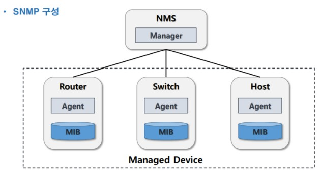

# SNMP

SNMP(Simple/small  Network Management Protocol)

- 간단한 네트워크 관리용 프로토콜

- `UDP 161 , 162` 포트 사용

  - 관리 시스템(Manager)
    - Agent에 필요한 정보를 요청하는 역할
    - 162/udp
  - 에이전트(Agent)
    - Agent가 설치된 시스템의 정보나 네트워크 정보 등을 수집하여 MIB 형태로 보관, Manager에 전달해주는 역할 수행
    - 161/udp

- 네트워크 구성 관리

  ▪ 네트워크 상의 호스트 구조 파악

- 성능 관리

  ▪ 네트워크 사용량, 처리속도, 응답시간 등 성능 분석에 필요한 통계정보 확인

- 장비 관리 ▪ 시스템정보(CPU, MEMORY, DISK 사용량) 확인

- 보안 관리 ▪ 정보의 제어 및 보호 기능

- Network Management System(NMS) ▪ 관리하기 위한 시스템 ▪ Manager : 관리시스템 안에 탑재하여 관리용 메시지를 Agent에 요청

- Managed Device ▪ 관리되는 장비들 ▪ Hub, Router, Switch, Bridge, Host 등 ▪ Agent : Managed Device 안에 탑재되는 관리 모듈

- Management Information Base(MIB) ▪ 관리 대상을 규격화한 정보 ▪ SNMP를 지원하는 모든 네트워크 장치는 MIB를 가짐 ▪ 관리장치(네트워크 장치)의 특정 정보와 자원을 객체(Object)의 형태로 모아놓은 집합체 ▪ 시스템정보, 네트워크사용량, 네트워크 인터페이스정보 등 ▪ 관리하기 쉽도록 Tree 구조를 가짐

- SNMP 버전

  - Manager와 Agent간 SNMP 버전이 일치해야 한다.
  - 1 / 2c /

- Community String

  - 상호간에 설정한 Community String이 일치해야 한다.

- PDU(Protocol Data Unit)

  - 통신하기 위한 메시지 유형

<br>

SNMP 구성

<br>

구성도


<br>

##### NMS 설정

처음 구성


<br>

###### Scanning


<br>

##### agent 

###### 2008_R2 -> snmp 설치


<br>

2008_R2 -> snmp 설정


<br>

###### centOS_7 -> snmp 설치

패키지 설치


```
yum -y install net-snmp net-snmp-utils       << 패키지 설치
rpm -qa | grep net-snmp                      << 설치 확인
```

<br>

설정 파일 백업


```
mv /etc/snmp/snmpd.conf /etc/snmp/snmpd.conf.bak               << 설정 파일 백업
```

<br>

설정 파일 설정


```
vim /etc/snmp/snmpd.conf

rocommunity     public  10.10.10.115
trap2sink       10.10.10.115 public 162
```

<br>

snmp 서비스 동작 확인


```
systecmctl restart snmpd
systemctl status snmpd
```

<br>

w_7 -> scanning 후 확인


<br>

###### cisco router/switch -> snmp

snmp 사용만 설정 (특정 주소 상관없이 snmp 정보)

```
R1(config)#snmp-server community public ro
```

<br>

snmp 설정 확인


```
Community name: ILMI
Community Index: cisco0
Community SecurityName: ILMI
storage-type: read-only  active


Community name: public
Community Index: cisco1
Community SecurityName: public
storage-type: nonvolatile        active
```

<br>

w_7 -> sccaning 후 확인


<br>

nmap 을 이용한 포트 점검


<br>

kali2016 -> 공격 준비 후 공격

```
vim /root/dict.txt

public
private
test
```


```
onesixtyone -c /root/dict.txt 10.10.10.254
```

<br>

snmpwalk 를 이용한 정보 획득


```
snmpwalk -v 2c -c public 10.10.10.254
```

<br>

차단하는 방법

ACL, 방화벽 , TCP Wrapper  에서 차단, v3 로 버전을 upgrade  등의 방법이 있습니다.

<br>